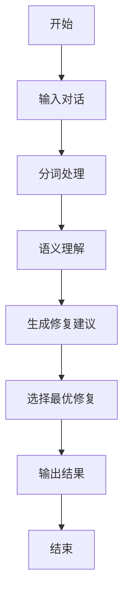
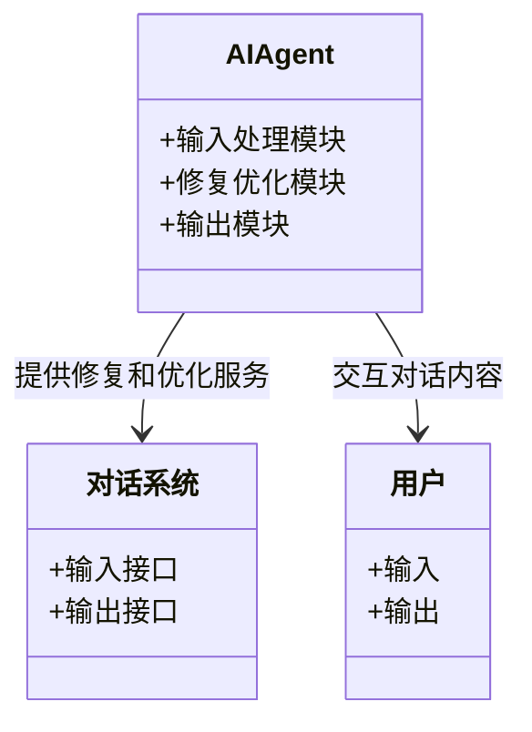
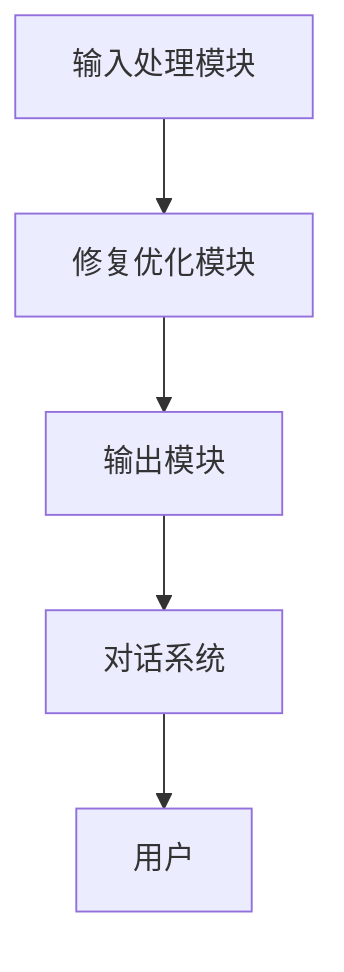
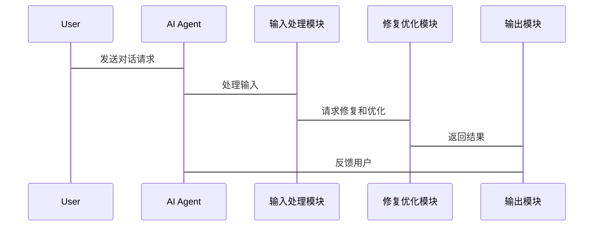

                 


# 构建AI Agent的实时对话修复与优化系统

> 关键词：AI Agent，实时对话，修复与优化，自然语言处理，强化学习

> 摘要：本文详细探讨了构建AI Agent实时对话修复与优化系统的各个方面，包括背景分析、核心概念、算法原理、系统架构设计、项目实战等内容。通过系统化的分析和具体的实现案例，展示了如何利用自然语言处理和强化学习等技术，实现高效的对话修复与优化，从而提升AI Agent在实时对话场景中的表现。

---

## 第一部分: 背景介绍

### 1.1 问题背景

#### 1.1.1 当前对话系统的主要挑战
随着自然语言处理（NLP）技术的快速发展，对话系统在各个领域得到了广泛应用。然而，现有的对话系统在实际应用中仍然面临诸多挑战：
- **语义理解不准确**：对话系统在处理复杂语义时，容易出现理解偏差。
- **对话修复能力不足**：当用户输入存在歧义或错误时，系统难以有效修复并引导对话。
- **实时性要求高**：实时对话场景（如客服、在线聊天）对响应速度和准确性提出了更高要求。

#### 1.1.2 对话修复与优化的必要性
对话修复与优化是提升对话系统用户体验的关键技术。通过实时修复用户输入的错误或不完整信息，并优化系统生成的回复，可以显著提高对话的流畅性和准确性。

#### 1.1.3 AI Agent在对话系统中的作用
AI Agent（智能体）通过整合自然语言处理、强化学习等技术，能够实时感知对话上下文，并动态调整对话策略。AI Agent在对话修复与优化中的作用包括：
- **实时理解**：快速解析用户输入的语义。
- **动态修复**：根据对话上下文修复不完整或错误的输入。
- **智能优化**：通过强化学习优化系统回复，提升用户体验。

### 1.2 问题描述

#### 1.2.1 对话修复与优化的核心问题
- 如何高效修复用户输入的错误或不完整信息？
- 如何优化系统回复，使其更符合用户意图？
- 如何在实时场景中实现上述目标？

#### 1.2.2 实时性对对话系统的要求
- 快速响应：实时对话场景要求系统在较短时间内完成修复和优化。
- 高准确性：修复和优化必须准确无误，避免引入新的错误。

#### 1.2.3 AI Agent在实时对话中的角色
AI Agent在实时对话中不仅是对话的参与者，更是对话的管理者和优化者。它需要实时监控对话过程，动态调整修复策略，并优化系统回复。

### 1.3 问题解决

#### 1.3.1 AI Agent如何实现对话修复
AI Agent通过以下步骤实现对话修复：
1. **语义解析**：分析用户输入的语义，识别潜在的歧义或错误。
2. **上下文关联**：结合对话历史，确定修复的目标和方式。
3. **生成修复建议**：基于修复策略生成修复建议，并反馈给用户。

#### 1.3.2 对话优化的具体方法
对话优化的核心方法包括：
1. **基于强化学习的优化**：通过强化学习算法优化系统回复，提升对话的流畅性。
2. **基于生成模型的优化**：利用生成模型生成多样化的回复，选择最优回复。

#### 1.3.3 实时性在系统设计中的实现
为了实现实时性，系统需要：
1. **优化算法复杂度**：选择高效的算法，减少计算时间。
2. **并行计算**：利用多线程或分布式计算技术，提升处理速度。
3. **优化数据传输**：减少数据传输的延迟，确保实时响应。

### 1.4 边界与外延

#### 1.4.1 系统的边界定义
系统的主要边界包括：
- 输入：用户输入的文本或语音。
- 输出：修复后的对话内容和优化后的回复。
- 接口：与前端和后端系统的接口。

#### 1.4.2 对话修复与优化的适用范围
对话修复与优化主要适用于实时对话场景，如：
- 在线客服。
- 智能音箱。
- 智能助手。

#### 1.4.3 AI Agent的局限性与扩展性
AI Agent的局限性：
- 对复杂语义的理解能力有限。
- 实时修复和优化的能力依赖于算法的效率。

扩展性：
- 可通过模型微调和数据增强提升性能。
- 可与其他技术（如语音识别）结合，扩展应用场景。

### 1.5 概念结构与核心要素

#### 1.5.1 对话修复与优化的流程
对话修复与优化的流程包括：
1. **输入接收**：接收用户输入。
2. **语义解析**：分析用户意图。
3. **修复与优化**：根据解析结果修复输入，并优化回复。
4. **输出结果**：将修复后的结果反馈给用户。

#### 1.5.2 AI Agent的核心要素
AI Agent的核心要素包括：
- **感知能力**：理解用户输入的能力。
- **决策能力**：修复和优化对话的能力。
- **执行能力**：输出修复和优化结果的能力。

#### 1.5.3 系统架构的核心组件
系统架构的核心组件包括：
- **输入处理模块**：负责接收和解析用户输入。
- **修复优化模块**：负责修复和优化对话内容。
- **输出模块**：负责将修复和优化结果反馈给用户。

---

## 第二部分: 核心概念与联系

### 2.1 AI Agent的核心原理

#### 2.1.1 AI Agent的基本定义
AI Agent是一种能够感知环境并采取行动以实现目标的智能实体。在对话系统中，AI Agent通过理解用户输入、修复对话内容，并优化系统回复来提升对话质量。

#### 2.1.2 AI Agent的分类与特点
AI Agent可以分为以下几类：
- **基于规则的AI Agent**：通过预定义的规则进行对话处理。
- **基于机器学习的AI Agent**：利用机器学习算法进行对话理解和生成。
- **基于强化学习的AI Agent**：通过强化学习优化对话策略。

#### 2.1.3 AI Agent与对话系统的关系
AI Agent是对话系统的核心组件，负责实现对话的理解、修复和优化。对话系统通过AI Agent实现与用户的交互，提升用户体验。

### 2.2 对话修复与优化系统的核心原理

#### 2.2.1 对话修复的定义与实现
对话修复是指在用户输入存在错误或不完整时，系统通过修复错误或补充信息，使其符合语义要求。

#### 2.2.2 对话优化的定义与实现
对话优化是指在系统回复的基础上，通过优化算法生成更符合用户意图的回复。

#### 2.2.3 实时性对系统性能的影响
实时性要求系统在较短时间内完成对话修复和优化，这对算法的效率和系统的架构提出了更高的要求。

### 2.3 核心概念的对比分析

#### 2.3.1 AI Agent与传统对话系统的对比
| 对比维度 | AI Agent | 传统对话系统 |
|----------|-----------|---------------|
| 智能性    | 高         | 低             |
| 实时性    | 高         | 中             |
| 可定制性  | 高         | 低             |

#### 2.3.2 对话修复与优化的对比分析
对话修复与优化的区别主要在于处理的目标不同。对话修复针对的是用户输入的错误或不完整信息，而对话优化针对的是系统回复的质量。

#### 2.3.3 实时性对系统设计的影响
实时性要求系统在设计时注重算法效率和系统架构的优化，以确保在较短时间内完成对话修复和优化。

### 2.4 ER实体关系图

```mermaid
er
    actor(AI Agent)
    actor(对话用户)
    actor(对话系统)
    relation(->, AI Agent -> 对话用户)
    relation(->, AI Agent -> 对话系统)
```

---

## 第三部分: 算法原理讲解

### 3.1 自然语言处理算法

#### 3.1.1 分词算法
分词算法是自然语言处理的基础，常用的算法包括：
- **基于规则的分词算法**：通过预定义的规则进行分词。
- **基于统计的分词算法**：通过概率模型进行分词。
- **深度学习分词算法**：利用神经网络进行分词。

#### 3.1.2 语义理解算法
语义理解算法是对话系统的核心，常用的算法包括：
- **词袋模型**：将文本表示为词袋。
- **TF-IDF模型**：通过词频和逆文档频率计算文本的权重。
- **深度学习模型**：如BERT、GPT等。

#### 3.1.3 对话生成算法
对话生成算法是对话系统的关键，常用的算法包括：
- **基于规则的对话生成算法**：通过预定义的规则生成回复。
- **基于模板的对话生成算法**：通过模板生成回复。
- **基于生成模型的对话生成算法**：如Transformer、LSTM等。

### 3.2 强化学习算法

#### 3.2.1 Q-Learning算法
Q-Learning是一种经典的强化学习算法，通过Q值函数更新策略。

#### 3.2.2 Deep Q-Network算法
Deep Q-Network通过深度神经网络近似Q值函数，提升算法的表达能力。

#### 3.2.3 Policy Gradient算法
Policy Gradient算法通过优化策略直接更新策略参数，避免了Q值函数的计算。

### 3.3 对话修复与优化算法

#### 3.3.1 基于强化学习的对话修复
通过强化学习算法优化对话修复策略，提升修复的准确性和流畅性。

#### 3.3.2 基于生成模型的对话优化
通过生成模型生成多样化的回复，选择最优回复。

#### 3.3.3 实时修复与优化的算法实现
通过优化算法复杂度和数据传输效率，确保实时修复与优化的实现。

### 3.4 算法流程图



---

## 第四部分: 数学模型与公式

### 4.1 对话修复的数学模型

#### 4.1.1 损失函数
$$ L = \sum_{i=1}^{n} (y_i - \hat{y}_i)^2 $$

其中：
- $y_i$ 表示真实值。
- $\hat{y}_i$ 表示预测值。

#### 4.1.2 概率分布
$$ P(y|x) = \frac{\exp(\theta \cdot y)}{\sum_{y'} \exp(\theta \cdot y')} $$

其中：
- $x$ 表示输入。
- $y$ 表示输出。
- $\theta$ 表示参数。

### 4.2 对话优化的数学模型

#### 4.2.1 基于强化学习的优化
$$ R = \sum_{t=1}^{T} r_t(s_t, a_t) $$

其中：
- $s_t$ 表示状态。
- $a_t$ 表示动作。
- $r_t$ 表示奖励。

#### 4.2.2 基于生成模型的优化
$$ p(\hat{y}|x) = \text{softmax}(Wx + b) $$

其中：
- $x$ 表示输入。
- $\hat{y}$ 表示输出。
- $W$ 表示权重矩阵。
- $b$ 表示偏置项。

---

## 第五部分: 系统分析与架构设计方案

### 5.1 问题场景介绍

#### 5.1.1 问题场景描述
实时对话修复与优化系统需要在较短时间内完成对话修复和优化，对系统的性能提出了较高的要求。

#### 5.1.2 项目介绍
本项目旨在构建一个高效的实时对话修复与优化系统，利用自然语言处理和强化学习技术，提升对话的质量和用户体验。

### 5.2 系统功能设计

#### 5.2.1 领域模型



#### 5.2.2 系统架构设计



#### 5.2.3 系统接口设计
系统主要接口包括：
- 输入接口：接收用户输入。
- 输出接口：输出修复和优化结果。

#### 5.2.4 系统交互流程



---

## 第六部分: 项目实战

### 6.1 环境安装

```bash
pip install transformers
pip install torch
pip install matplotlib
pip install numpy
```

### 6.2 核心实现

#### 6.2.1 对话修复模块

```python
def repair_dialogue(input_text):
    tokens = tokenize(input_text)
    semantic_vector = get_semantic_vector(tokens)
    repaired_text = generate_repair(semantic_vector)
    return repaired_text
```

#### 6.2.2 对话优化模块

```python
def optimize_reply(context, reply):
    context_vector = get_context_vector(context)
    optimized_reply = generate_optimized_reply(context_vector, reply)
    return optimized_reply
```

### 6.3 代码解读与分析

#### 6.3.1 对话修复模块
- `tokenize`：分词函数。
- `get_semantic_vector`：语义向量生成函数。
- `generate_repair`：生成修复文本的函数。

#### 6.3.2 对话优化模块
- `get_context_vector`：生成上下文向量的函数。
- `generate_optimized_reply`：生成优化回复的函数。

### 6.4 实际案例分析

#### 6.4.1 案例一
- **输入**：用户输入“今天天气怎么样？”
- **修复**：语义理解正确，无需修复。
- **优化**：生成多样化的回复，选择最优回复。

#### 6.4.2 案例二
- **输入**：用户输入“我要订票。”
- **修复**：补充信息，如“我要订火车票。”
- **优化**：生成回复“请提供车次和日期。”

### 6.5 项目小结
通过具体的实现案例，展示了实时对话修复与优化系统的实际应用。代码实现和案例分析帮助读者更好地理解系统的实现细节和应用场景。

---

## 第七部分: 最佳实践

### 7.1 小结
本文详细探讨了构建AI Agent实时对话修复与优化系统的各个方面，包括背景分析、核心概念、算法原理、系统架构设计、项目实战等内容。

### 7.2 注意事项
- 确保算法的高效性，以满足实时性要求。
- 定期更新模型，提升对话修复与优化的效果。
- 注意数据隐私和安全问题。

### 7.3 拓展阅读
- 《自然语言处理实战》
- 《强化学习：算法与应用》
- 《深度学习与对话系统》

---

## 结语
通过本文的系统化分析和具体实现，读者可以深入了解构建AI Agent实时对话修复与优化系统的各个方面，并能够将其应用于实际场景中，提升对话系统的性能和用户体验。

