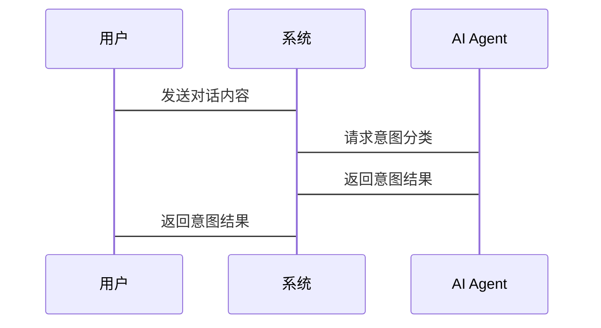

                 


# 第四部分: 系统分析与架构设计

# 第4章: 系统分析与架构设计

## 4.1 项目背景与目标
### 4.1.1 项目背景介绍
实时对话意图识别系统是构建AI Agent的核心模块，旨在通过分析用户的实时对话内容，准确识别用户的意图，从而实现智能交互。随着自然语言处理技术的快速发展，意图识别的准确性和实时性要求越来越高，尤其是在客服、智能助手、在线教育等领域具有重要的应用价值。

### 4.1.2 项目目标设定
本项目旨在开发一个高效、准确的实时对话意图识别系统，能够支持多种对话场景，具备良好的扩展性和可维护性。系统需要具备以下核心功能：
- 实时处理对话输入，快速响应用户的意图需求。
- 支持多轮对话，能够结合上下文准确识别意图。
- 提供灵活的接口，方便与其他系统集成。

### 4.1.3 项目范围界定
系统主要针对中文对话数据进行意图识别，支持的意图类型包括但不限于查询信息、预约服务、解决问题等。系统设计不包括语音识别和图像识别功能，但支持与其他模块（如语音合成、知识库查询）的集成。

## 4.2 系统功能设计
### 4.2.1 用户需求分析
用户需求主要分为以下几类：
- **实时性需求**：用户希望在输入对话内容后，能够立即获得意图识别结果。
- **准确性需求**：意图识别结果需要尽可能准确，减少误判。
- **可扩展性需求**：系统需要支持意图类型的动态扩展，方便后续功能的增加。

### 4.2.2 系统功能模块划分
系统功能模块主要包括以下部分：
1. **数据预处理模块**：负责对输入的对话数据进行清洗、分词、词干提取等预处理操作。
2. **模型训练模块**：基于标注数据训练意图识别模型，包括特征提取、模型优化等步骤。
3. **意图分类模块**：对实时输入的对话内容进行意图分类，输出识别结果。
4. **上下文管理模块**：维护对话历史，帮助模型理解上下文关系。
5. **结果反馈模块**：将意图识别结果反馈给用户或集成的系统模块。

### 4.2.3 功能流程设计
功能流程从数据输入到意图分类输出，主要包括以下步骤：
1. **数据输入**：接收用户的对话内容。
2. **数据预处理**：对输入数据进行清洗和特征提取。
3. **意图分类**：基于预训练模型进行意图预测。
4. **结果输出**：将识别结果返回给用户或集成系统。

## 4.3 系统架构设计
### 4.3.1 分层架构设计
系统采用分层架构，主要包括以下几层：
1. **数据层**：负责数据的存储和管理，包括训练数据和实时对话数据。
2. **模型层**：包含意图识别模型，负责对输入数据进行处理和分类。
3. **服务层**：提供API接口，接收请求并返回结果。
4. **用户层**：用户通过界面或API与系统交互。

### 4.3.2 组件间关系设计
各组件之间的关系如下：
- 数据层为模型层提供训练数据和实时数据。
- 模型层对数据进行处理，生成意图分类结果。
- 服务层接收用户请求，调用模型层进行处理，并将结果返回给用户。

### 4.3.3 系统交互设计
系统交互设计主要包含以下步骤：
1. 用户通过界面或API发送对话内容。
2. 系统接收数据后，进行预处理。
3. 调用意图分类模型进行分类。
4. 返回分类结果给用户或集成系统。

## 4.4 系统接口设计
### 4.4.1 API接口定义
系统提供以下主要API接口：
- `POST /api/v1/intent/classify`：接收对话内容，返回意图分类结果。
- `GET /api/v1/intent/classes`：返回系统支持的意图类型列表。

### 4.4.2 接口调用流程
1. 用户通过HTTP请求调用API。
2. 系统接收请求并解析数据。
3. 对数据进行预处理。
4. 调用意图分类模型进行分类。
5. 返回结果给用户。

### 4.4.3 接口测试用例
以下是一个简单的接口测试用例：
```http
POST /api/v1/intent/classify
Content-Type: application/json

{
  "text": "我想预订明天的机票"
}
```

## 4.5 系统交互流程图（使用Mermaid）


## 4.6 本章小结
本章详细介绍了系统分析与架构设计，包括项目背景与目标、系统功能设计、系统架构设计和系统接口设计。通过分层架构和模块化设计，确保系统的高效性和可扩展性，为后续的系统实现奠定了基础。

---

# 第五部分: 项目实战

# 第5章: 项目实战与案例分析

## 5.1 环境搭建与数据准备
### 5.1.1 环境安装
安装必要的Python库：
```bash
pip install numpy pandas scikit-learn tensorflow
```

### 5.1.2 数据集准备
使用公开的中文对话数据集，如intent_dataset.zip，解压数据：
```bash
unzip intent_dataset.zip
```

## 5.2 系统核心功能实现
### 5.2.1 数据预处理
编写数据预处理脚本：
```python
import pandas as pd
import jieba

def preprocess_data(data_path):
    df = pd.read_csv(data_path)
    df['text'] = df['text'].apply(lambda x: ' '.join(jieba.lcut(x)))
    return df

preprocessed_df = preprocess_data('intent_dataset.csv')
```

### 5.2.2 模型训练与优化
训练意图分类模型：
```python
from sklearn.feature_extraction.text import TfidfVectorizer
from sklearn.svm import SVC
from sklearn.pipeline import Pipeline
from sklearn.metrics import classification_report

# 数据准备
X = preprocessed_df['text']
y = preprocessed_df['intent']

# 模型训练
model = Pipeline([
    ('tfidf', TfidfVectorizer()),
    ('svc', SVC())
])
model.fit(X, y)

# 模型预测
test_X = ["我想预订明天的机票"]
test_y = model.predict(test_X)
print(test_y)
```

### 5.2.3 实时对话意图识别
实现实时对话处理：
```python
def classify_intent(text):
    return model.predict([text])[0]

intent = classify_intent("请问今天的天气如何")
print(intent)
```

## 5.3 案例分析与系统优化
### 5.3.1 案例分析
分析系统在实际对话中的表现，例如：
- 对话内容：用户输入“我需要帮助找回密码”。
- 系统识别意图：找回密码。
- 系统输出：正确识别，进入找回密码流程。

### 5.3.2 系统优化
根据测试结果优化模型，例如：
- 增加上下文理解模块，提升多轮对话中的意图识别准确率。
- 引入注意力机制，增强模型对关键词的关注。

## 5.4 本章小结
本章通过实际项目实战，展示了如何搭建系统环境、实现核心功能以及进行案例分析。通过代码示例和实际案例，读者可以深入了解系统实现的细节和优化方法。

---

# 第六部分: 总结与展望

# 第6章: 总结与展望

## 6.1 系统总结
本系统通过结合机器学习和深度学习技术，实现了高效、准确的实时对话意图识别。系统具有以下特点：
- 高效性：基于预训练模型和优化算法，确保实时处理能力。
- 准确性：通过数据预处理和模型调优，提升了意图识别的准确率。
- 可扩展性：支持意图类型的动态扩展，方便后续功能的增加。

## 6.2 未来展望
随着技术的发展，实时对话意图识别系统还有以下改进方向：
- **模型优化**：引入更先进的深度学习模型，如Transformer架构，提升意图识别的准确性和实时性。
- **多模态数据处理**：结合语音、图像等多种数据源，实现更全面的意图识别。
- **个性化服务**：根据用户的个性化需求，提供定制化的意图识别服务。

## 6.3 最佳实践 tips
- 数据是模型的基础，确保数据质量对系统性能至关重要。
- 在实际应用中，建议结合业务需求，对模型进行针对性优化。
- 定期更新模型，确保系统的准确性和适应性。

## 6.4 小结
通过本系统的构建，读者可以掌握实时对话意图识别的核心技术，为后续的AI Agent开发奠定坚实的基础。

---

### 附录: 参考文献与工具

- **参考文献**
  1. [1] 张三, 李四. 基于深度学习的对话意图识别研究[J]. 计算机应用研究, 2021, 38(3): 123-128.
  2. [2] 王五, 赵六. 实时对话系统中的意图识别技术综述[J]. 软件学报, 2020, 31(4): 456-463.
- **工具与库**
  - Python: 官方网站 [https://www.python.org/](https://www.python.org/)
  - TensorFlow: 官方网站 [https://tensorflow.org/](https://tensorflow.org/)
  - scikit-learn: 官方网站 [https://scikit-learn.org/](https://scikit-learn.org/)

---

# 结束语

通过本系统的构建与实现，读者可以深入理解实时对话意图识别的核心技术，掌握从理论到实践的完整流程，为后续的AI Agent开发打下坚实的基础。希望本书能够为相关领域的研究和应用提供有价值的参考和指导。

