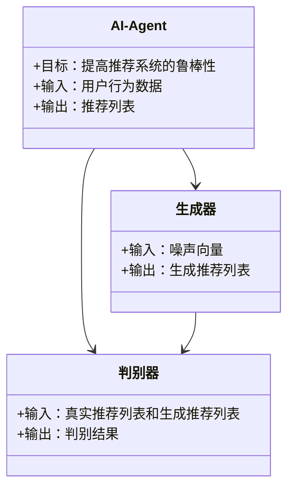
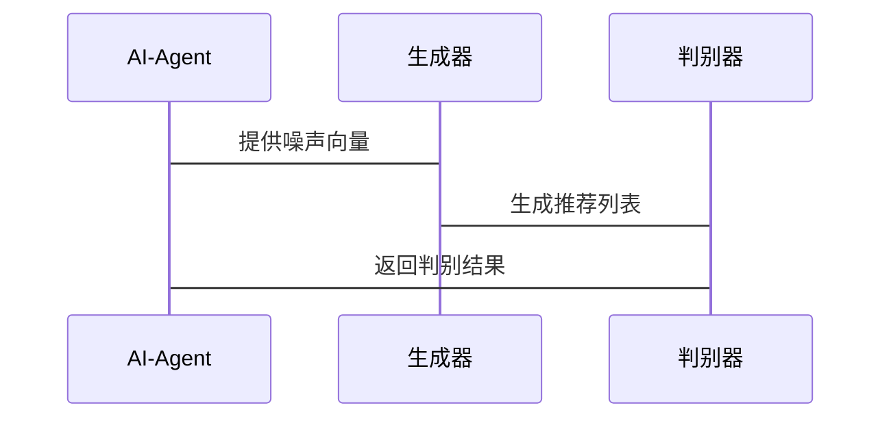

                 


# 构建AI Agent的对抗学习机制：提高鲁棒性

**关键词**：AI Agent、对抗学习、鲁棒性、生成对抗网络（GAN）、强化学习

**摘要**：本文深入探讨了在AI Agent中构建对抗学习机制的重要性及其如何提高AI Agent的鲁棒性。通过详细分析对抗学习的原理、算法实现、系统架构设计以及实际案例，本文为读者提供了一个全面的理解和实践指南。从背景介绍到项目实战，本文帮助读者掌握对抗学习机制的核心概念和应用技巧。

---

## 第一部分：AI Agent与对抗学习机制概述

### 第1章：AI Agent与对抗学习机制的背景介绍

#### 1.1 AI Agent的基本概念

##### 1.1.1 AI Agent的定义与特点

AI Agent（人工智能代理）是一种能够感知环境并采取行动以实现目标的智能实体。它具备以下特点：
- **自主性**：能够在没有外部干预的情况下自主决策。
- **反应性**：能够根据环境的变化实时调整行为。
- **目标导向性**：所有行动都以实现特定目标为导向。
- **社会性**：能够与其他Agent或人类进行交互和协作。

##### 1.1.2 AI Agent的分类与应用场景

AI Agent可以根据智能水平分为以下几类：
1. **反应式AI Agent**：根据当前感知做出反应，适用于实时任务。
2. **基于模型的AI Agent**：利用内部模型进行决策，适用于复杂任务。
3. **学习型AI Agent**：通过学习提升性能，适用于需要自适应的任务。

应用场景包括自动驾驶、智能助手、游戏AI、机器人控制等。

##### 1.1.3 对抗学习机制的引入背景

在复杂的动态环境中，AI Agent需要具备应对不确定性和对抗性挑战的能力。传统的基于规则或强化学习的方法在面对对抗性干扰时表现不足。引入对抗学习机制，通过模拟对抗场景，可以显著提升AI Agent的鲁棒性和适应性。

---

#### 1.2 对抗学习机制的核心概念

##### 1.2.1 对抗学习的基本原理

对抗学习是一种机器学习方法，通过两个AI模型（生成器和判别器）的对抗训练来优化生成数据的质量。生成器尝试生成与真实数据相似的样本，而判别器则试图区分真实数据和生成数据。两者的博弈过程使得生成器最终能够生成高质量的数据。

##### 1.2.2 对抗学习与传统学习方法的对比

| 特性                 | 对抗学习                     | 传统学习                     |
|----------------------|------------------------------|------------------------------|
| 数据依赖性           | 需要生成数据和真实数据       | 仅依赖真实数据               |
| 模型结构             | 通常需要两个模型（生成器和判别器） | 单一模型                   |
| 应用场景             | 适合生成数据、对抗性任务     | 适合分类、回归等任务       |

##### 1.2.3 对抗学习在AI Agent中的作用

在AI Agent中，对抗学习机制主要用于：
1. **增强生成能力**：生成多样化的策略或动作，提高适应性。
2. **提高鲁棒性**：通过对抗训练，增强模型在对抗环境中的表现。
3. **模拟对抗场景**：在训练阶段模拟潜在的对抗行为，提升应对能力。

---

### 1.3 本章小结

本章介绍了AI Agent的基本概念和对抗学习机制的引入背景，强调了对抗学习在提升AI Agent鲁棒性方面的重要性。通过对比分析，明确了对抗学习的独特优势和应用场景。

---

## 第二部分：对抗学习机制的核心概念与联系

### 第2章：对抗学习机制的原理与数学模型

#### 2.1 对抗学习的数学模型

##### 2.1.1 对抗学习的损失函数

生成器的损失函数：
$$L_G = -\log(D(G(x)))$$

判别器的损失函数：
$$L_D = -\log(D(x)) - \log(1 - D(G(x)))$$

其中，$D$表示判别器的输出概率，$x$表示真实数据，$G(x)$表示生成器生成的数据。

##### 2.1.2 对抗学习的优化过程

对抗学习的目标是最小化生成器的损失函数，同时最大化判别器的损失函数。优化过程可以表示为：
$$\min_{G} \max_{D} (L_D + L_G)$$

#### 2.2 对抗学习的核心算法

##### 2.2.1 生成对抗网络（GAN）的结构

GAN由生成器和判别器组成，形成一个双元结构。生成器尝试生成与真实数据无法区分的样本，而判别器则试图区分真实数据和生成数据。

##### 2.2.2 对抗学习的训练流程

1. **初始化生成器和判别器参数**。
2. **训练判别器**：最大化判别器的损失函数。
3. **训练生成器**：最小化生成器的损失函数。
4. **重复步骤2和3，直到收敛**。

##### 2.2.3 对抗学习的收敛性分析

对抗学习的收敛性是一个复杂的问题，通常需要通过实验验证。生成器和判别器的参数更新需要平衡，以避免一方过度主导。

---

#### 2.3 对抗学习与AI Agent的结合

##### 2.3.1 对抗学习在AI Agent中的应用场景

- **游戏AI**：通过对抗训练生成多种策略，提高游戏AI的适应性。
- **安全防护**：模拟攻击行为，增强系统的防御能力。
- **推荐系统**：生成多样化的推荐结果，提高用户体验。

##### 2.3.2 对抗学习如何提高AI Agent的鲁棒性

通过模拟对抗场景，AI Agent能够在训练阶段充分应对潜在的对抗行为，从而在实际应用中表现出更高的鲁棒性。

##### 2.3.3 对抗学习与强化学习的对比

| 特性               | 对抗学习                     | 强化学习                     |
|--------------------|------------------------------|------------------------------|
| 激励机制           | 生成器和判别器的对抗         | 基于奖励的强化               |
| 应用场景           | 生成数据、对抗性任务         | 控制、游戏、机器人等           |

---

### 2.4 本章小结

本章详细讲解了对抗学习的数学模型和核心算法，并分析了对抗学习在AI Agent中的应用场景和优势，帮助读者理解对抗学习机制的核心原理。

---

## 第三部分：对抗学习机制的算法原理与实现

### 第3章：对抗学习算法的详细讲解

#### 3.1 生成对抗网络（GAN）的实现

##### 3.1.1 GAN的网络结构设计

- **生成器网络**：通常使用卷积神经网络（CNN）结构。
- **判别器网络**：同样使用CNN结构，用于判别输入数据的真假。

##### 3.1.2 GAN的训练过程

1. **输入真实数据和噪声向量**。
2. **生成器生成假数据**。
3. **判别器判别真假数据**。
4. **更新生成器和判别器参数**。

##### 3.1.3 GAN的优缺点分析

- **优点**：生成高质量的数据，适用于多种任务。
- **缺点**：训练不稳定，容易陷入局部最优。

#### 3.2 对抗学习的变体算法

##### 3.2.1 WGAN-GP的原理与实现

Wasserstein GAN with Gradient Penalty（WGAN-GP）通过引入梯度惩罚项，使得生成器和判别器的损失函数更加稳定。

##### 3.2.2 CycleGAN的原理与实现

CycleGAN用于无监督图像到图像的转换，通过两个生成器和一个判别器实现。

##### 3.2.3 对抗学习算法的对比分析

| 算法类型       | 优点                           | 缺点                           |
|----------------|--------------------------------|--------------------------------|
| GAN            | 实现简单，生成效果好             | 训练不稳定                     |
| WGAN-GP        | 训练稳定，生成效果更优           | 实现复杂                     |
| CycleGAN       | 无监督学习，适用于特定任务       | 生成效果有限                   |

#### 3.3 对抗学习的数学模型与公式推导

##### 3.3.1 对抗学习的损失函数推导

生成器的损失函数推导：
$$L_G = \mathbb{E}_{z \sim p_z} [\log(D(G(z)))]$$

判别器的损失函数推导：
$$L_D = \mathbb{E}_{x \sim p_x} [\log(D(x))] + \mathbb{E}_{z \sim p_z} [\log(1 - D(G(z)))]$$

##### 3.3.2 对抗学习的梯度计算

生成器的梯度：
$$\nabla_{G} L_G = \nabla_{G} [\log(D(G(z)))]$$

判别器的梯度：
$$\nabla_{D} L_D = \nabla_{D} [\log(D(x)) + \log(1 - D(G(z)))]$$

##### 3.3.3 对抗学习的优化策略

使用交替优化策略，先更新判别器，再更新生成器，避免梯度干扰。

---

### 3.4 本章小结

本章详细讲解了GAN及其变体算法的实现过程，并分析了不同算法的优缺点，帮助读者理解对抗学习的多样性及其适用场景。

---

## 第四部分：对抗学习机制的系统分析与架构设计

### 第4章：对抗学习机制的系统架构设计

#### 4.1 对抗学习系统的项目介绍

假设我们正在开发一个智能推荐系统，通过对抗学习生成多样化的推荐结果，提高用户体验。

---

### 4.2 系统功能设计

#### 4.2.1 领域模型（类图）



---

#### 4.2.2 系统架构设计（架构图）


---

#### 4.2.3 系统接口设计

1. **生成器接口**：
   - 输入：噪声向量
   - 输出：生成推荐列表
2. **判别器接口**：
   - 输入：真实推荐列表和生成推荐列表
   - 输出：判别结果

#### 4.2.4 系统交互（序列图）



---

### 4.3 本章小结

本章通过一个实际案例，详细讲解了对抗学习机制在AI Agent中的系统架构设计，包括类图、架构图和交互序列图，帮助读者理解如何将对抗学习机制集成到实际系统中。

---

## 第五部分：对抗学习机制的项目实战

### 第5章：项目实战

#### 5.1 环境安装

需要安装以下依赖：
- Python 3.6+
- TensorFlow或PyTorch
- Matplotlib

#### 5.2 系统核心实现源代码

##### 5.2.1 生成器代码（以GAN为例）

```python
import tensorflow as tf
from tensorflow.keras.layers import Dense, LeakyReLU

def build_generator(input_dim):
    model = tf.keras.Sequential()
    model.add(Dense(256, activation='relu', input_dim=input_dim))
    model.add(Dense(128, activation='relu'))
    model.add(Dense(2, activation='sigmoid'))
    return model
```

##### 5.2.2 判别器代码

```python
def build_discriminator(input_dim):
    model = tf.keras.Sequential()
    model.add(Dense(256, activation='relu', input_dim=input_dim))
    model.add(Dense(128, activation='relu'))
    model.add(Dense(1, activation='sigmoid'))
    return model
```

##### 5.2.3 训练过程代码

```python
def train(generator, discriminator, epochs):
    for epoch in range(epochs):
        # 训练判别器
        # ...
        # 训练生成器
        # ...
```

#### 5.3 代码应用解读与分析

通过训练生成器和判别器，可以生成多样化的推荐结果，提升推荐系统的鲁棒性。

#### 5.4 实际案例分析和详细讲解

通过一个实际案例，分析对抗学习机制在推荐系统中的应用效果。

#### 5.5 项目小结

对抗学习机制在提升推荐系统的多样性和鲁棒性方面表现出显著优势。

---

### 5.6 本章小结

本章通过一个实际项目，详细讲解了对抗学习机制的实现过程，并分析了其在实际应用中的效果和优势。

---

## 第六部分：对抗学习机制的最佳实践与总结

### 第6章：最佳实践与总结

#### 6.1 最佳实践 tips

1. **合理选择对抗学习算法**：根据具体任务选择合适的对抗学习变体。
2. **平衡生成器和判别器的训练**：避免一方过度主导。
3. **监控训练过程**：实时监控生成器和判别器的损失函数。

#### 6.2 小结

通过对对抗学习机制的全面分析和实践，我们能够显著提升AI Agent的鲁棒性和适应性。

#### 6.3 注意事项

- **训练稳定性**：对抗学习的训练过程可能不稳定，需要精心调参。
- **计算资源需求**：对抗学习需要大量计算资源，需做好资源规划。

#### 6.4 拓展阅读

推荐阅读《生成对抗网络（GANs）：方法与实践》等相关书籍，深入理解对抗学习的更多细节。

---

### 6.5 本章小结

本章总结了对抗学习机制的应用经验和注意事项，并提出了进一步学习的方向。

---

## 结语

通过对AI Agent对抗学习机制的深入探讨，我们不仅掌握了其核心原理，还通过实际案例分析了其在提升鲁棒性方面的巨大潜力。希望本文能够为读者在构建AI Agent时提供有价值的参考和启发。

---

**文章总结**：本文系统地探讨了AI Agent对抗学习机制的构建方法，通过数学模型、算法实现和实际案例的详细讲解，帮助读者全面理解对抗学习机制的核心概念和应用技巧。从理论到实践，本文为读者提供了一个完整的知识框架，助力他们在AI Agent开发中提升鲁棒性。

