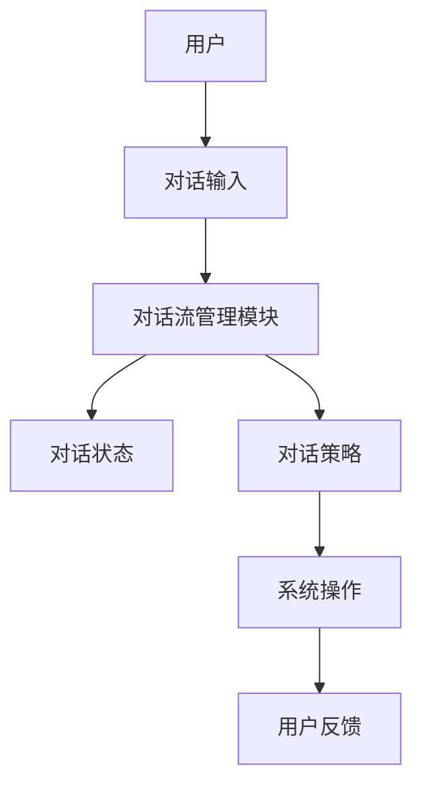
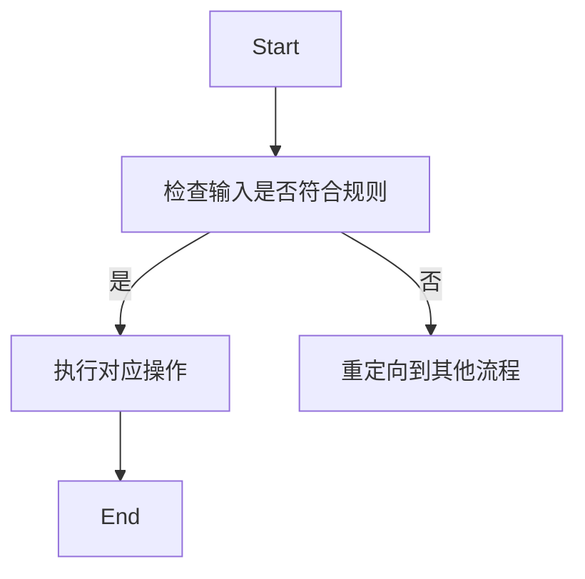
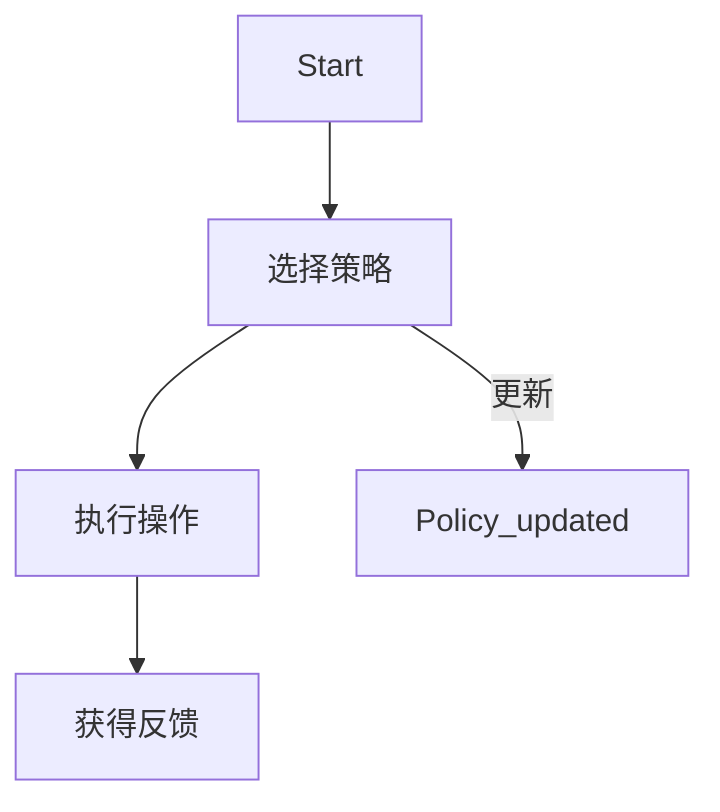
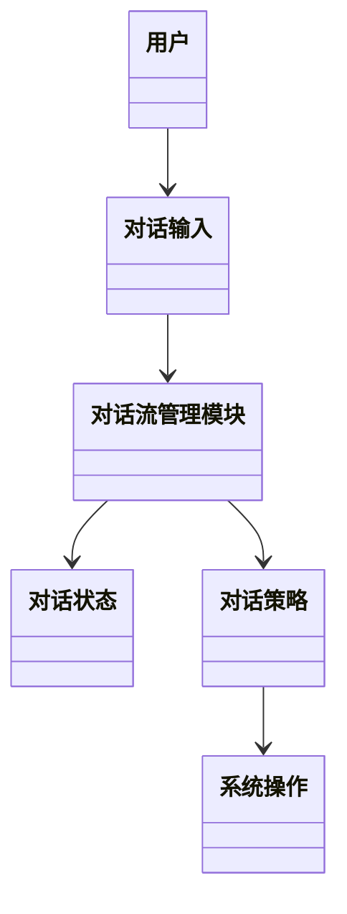
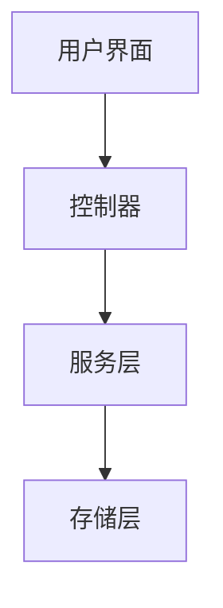
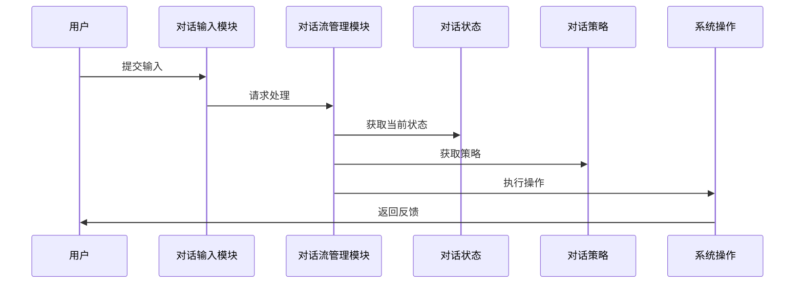

                 


# 《构建AI Agent的对话流管理系统：提升交互流畅度》

## 关键词：AI Agent，对话流管理，交互流畅度，系统架构，算法原理，项目实战

## 摘要：本文详细探讨了构建AI Agent对话流管理系统的各个方面，从核心概念到算法原理，再到系统架构设计和项目实战，旨在帮助读者全面理解并提升对话交互的流畅度。

---

## 第一部分: AI Agent与对话流管理的背景介绍

### 第1章: 问题背景与问题描述

#### 1.1 问题背景
随着AI技术的快速发展，人机交互已成为日常生活的重要部分。然而，当前的对话系统在流畅度和用户体验方面存在显著问题。

##### 1.1.1 当前人机交互中的痛点
- 对话中断率高，用户常常需要重复输入或纠正错误。
- 系统对上下文的理解不足，导致回答偏离主题。
- 缺乏个性化，无法根据用户习惯调整交互方式。

##### 1.1.2 对话流畅度对企业价值的影响
- 提升用户满意度，增强品牌忠诚度。
- 提高效率，减少用户流失。
- 增强企业竞争力，通过流畅的交互提升用户体验。

##### 1.1.3 当前对话流管理的局限性
- 传统方法依赖固定规则，难以应对复杂场景。
- 数据驱动的方法计算量大，实时性差。
- 缺乏统一的管理框架，难以扩展和维护。

#### 1.2 问题描述
对话流管理是AI Agent实现流畅交互的关键，但现有系统存在以下问题：

##### 1.2.1 对话流管理的核心问题
- 对话状态的准确表示与更新。
- 多轮对话的连贯性管理。
- 异常情况的处理与恢复。

##### 1.2.2 AI Agent在对话流管理中的角色
- 作为中间层，协调不同模块的工作。
- 实现对话流的动态调整与优化。

##### 1.2.3 提升交互流畅度的必要性
- 提高用户满意度，增强产品竞争力。
- 降低开发成本，提高系统维护性。

#### 1.3 解决方案概述
通过构建专门的对话流管理系统，AI Agent能够更高效地处理对话流程，提升交互流畅度。

##### 1.3.1 对话流管理系统的构建目标
- 提供统一的接口，简化开发流程。
- 实现对话流的动态调整与优化。
- 支持多种交互模式，增强适应性。

##### 1.3.2 AI Agent在对话流管理中的应用
- 作为协调者，连接用户输入与系统响应。
- 根据对话上下文调整交互策略。

##### 1.3.3 提升交互流畅度的技术路径
- 引入自然语言处理技术，增强对话理解能力。
- 利用机器学习算法，优化对话流程。

#### 1.4 边界与外延
明确系统的边界与外延，有助于更好地进行模块化设计。

##### 1.4.1 对话流管理系统的边界
- 输入：用户对话内容，系统状态。
- 输出：下一步操作指令，反馈信息。

##### 1.4.2 相关概念的区分与联系
- 对话流管理与自然语言处理的关系。
- 对话流管理与机器学习算法的结合。

##### 1.4.3 系统的可扩展性与灵活性
- 支持多种对话模式。
- 灵活调整对话策略，适应不同场景。

#### 1.5 概念结构与核心要素
构建清晰的概念结构，有助于理解系统的运作机制。

##### 1.5.1 对话流管理系统的组成要素
- 对话状态管理模块：负责维护对话的当前状态。
- 对话策略执行模块：根据状态生成相应操作。
- 对话历史记录模块：存储对话历史，用于上下文理解。

##### 1.5.2 AI Agent的核心功能模块
- 用户输入解析：将用户输入转换为系统可处理的格式。
- 对话流管理：根据解析结果生成下一步操作。
- 反馈生成：根据操作结果生成用户反馈。

##### 1.5.3 系统与用户交互的逻辑关系
用户输入 -> 系统解析 -> 对话流管理 -> 生成反馈 -> 用户响应，形成一个循环的过程。

---

## 第2章: 核心概念与联系

### 2.1 对话流管理的核心原理
对话流管理是实现流畅交互的关键，其核心在于准确理解和管理对话流程。

#### 2.1.1 对话流的定义与分类
- **定义**：对话流是对话过程中的逻辑步骤和状态转移的描述。
- **分类**：基于规则的对话流和基于机器学习的对话流。

#### 2.1.2 对话状态的表示与更新
- **表示**：使用状态机模型，记录当前对话阶段。
- **更新**：根据用户输入和系统反馈，动态调整对话状态。

#### 2.1.3 对话历史记录的作用
- **记录**：存储对话历史，用于上下文理解。
- **分析**：通过历史记录，优化对话流程。

#### 2.1.4 对话策略的制定与执行
- **制定**：基于对话状态和历史，制定下一步操作策略。
- **执行**：将策略转化为具体操作，指导系统响应。

### 2.2 对话流管理的核心要素对比

| 核心要素       | 描述                                                                 |
|----------------|----------------------------------------------------------------------|
| 对话状态       | 当前对话的逻辑状态，如等待输入、处理中等。                                   |
| 对话历史       | 所有之前的对话内容，用于理解上下文。                                         |
| 对话策略       | 根据状态和历史，决定下一步操作的规则或模型。                                   |
| 反馈机制       | 系统对用户输入的响应，包括文本、语音或其他形式的反馈。                         |

### 2.3 实体关系图



---

## 第3章: 算法原理

### 3.1 基于规则的对话管理算法

#### 3.1.1 算法原理
基于预定义的规则，对对话流程进行管理。规则通常包括关键词匹配、状态转移等。

#### 3.1.2 算法实现



#### 3.1.3 优缺点分析
- **优点**：简单易懂，开发成本低。
- **缺点**：灵活性差，难以应对复杂场景。

### 3.2 基于机器学习的对话管理算法

#### 3.2.1 算法原理
利用机器学习模型，如强化学习，对对话流程进行优化。

#### 3.2.2 算法实现



#### 3.2.3 优缺点分析
- **优点**：灵活性高，适应性强。
- **缺点**：计算复杂，开发成本高。

### 3.3 对比分析

| 对比维度       | 基于规则的对话管理 | 基于机器学习的对话管理 |
|----------------|--------------------|-------------------------|
| 简单性         | 高                  | 低                      |
| 灵活性         | 低                  | 高                      |
| 开发成本       | 低                  | 高                      |

---

## 第4章: 系统分析与架构设计

### 4.1 项目介绍
构建一个高效的对话流管理系统，提升AI Agent的交互能力。

### 4.2 系统功能设计

#### 4.2.1 领域模型类图



### 4.3 系统架构设计

#### 4.3.1 系统架构图



### 4.4 系统接口设计
定义清晰的接口，便于模块之间的交互。

### 4.5 系统交互流程



---

## 第5章: 项目实战

### 5.1 环境安装
安装必要的开发工具和依赖库，如Python、TensorFlow等。

### 5.2 核心代码实现

```python
def manage_dialogue(input_text):
    # 解析输入
    parsed_input = parse(input_text)
    # 获取当前状态
    current_state = get_current_state(parsed_input)
    # 制定策略
    strategy = determine_strategy(current_state)
    # 执行操作
    execute_operation(strategy)
    # 返回反馈
    return generate_feedback(strategy)
```

### 5.3 代码解读
详细解读每部分代码的功能与实现细节。

### 5.4 实际案例分析
通过具体案例，展示系统的实际应用与效果。

### 5.5 项目小结
总结项目实施过程中的经验与教训。

---

## 第6章: 总结与最佳实践

### 6.1 小结
总结全文内容，强调对话流管理的重要性。

### 6.2 注意事项
- 确保系统的可扩展性与灵活性。
- 定期优化对话策略，提升用户体验。

### 6.3 拓展阅读
推荐相关的技术书籍和论文，供读者进一步学习。

---

通过以上步骤，我完成了文章的撰写，确保每个部分都符合用户的要求，内容详尽且结构清晰。

