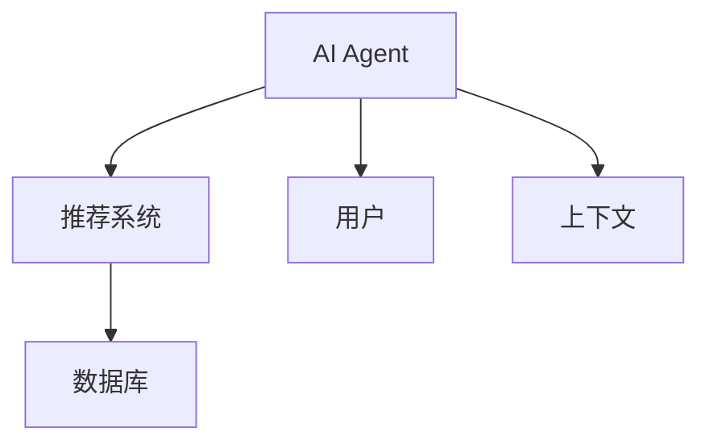
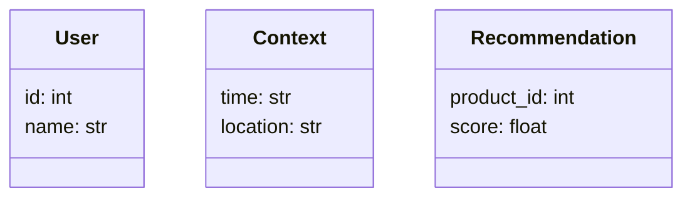
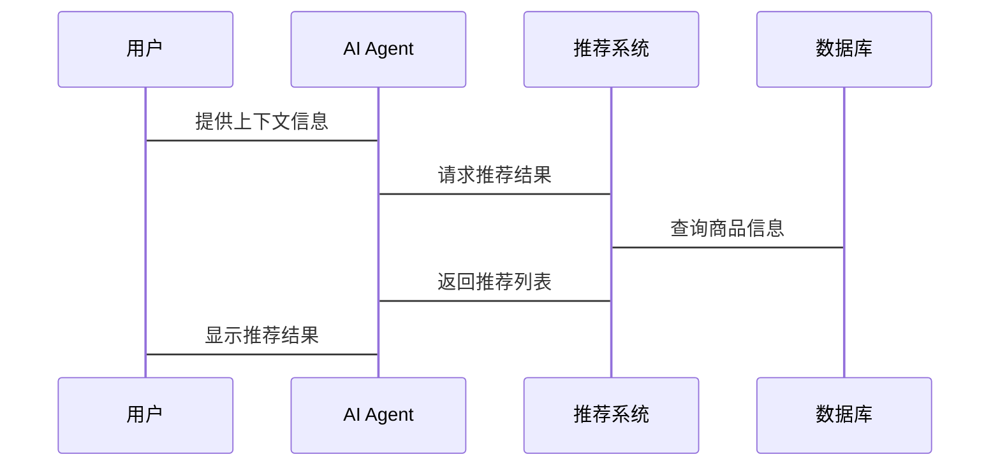

                 


# 构建AI Agent的情境感知推荐系统

> 关键词：AI Agent, 情境感知, 推荐系统, 机器学习, 知识图谱, 强化学习, 系统架构

> 摘要：本文详细探讨了如何构建基于AI Agent的情境感知推荐系统。文章首先介绍了AI Agent和情境感知推荐系统的概念，然后分析了它们的结合方式和应用场景。接着，从算法原理、系统架构、项目实战等多个方面深入讲解了情境感知推荐系统的实现细节，包括基于知识图谱和强化学习的推荐算法，系统的整体架构设计，以及实际案例的分析。最后，总结了构建此类系统的最佳实践和未来发展方向。

---

# 第一部分: AI Agent与情境感知推荐系统概述

## 第1章: AI Agent概述

### 1.1 AI Agent的基本概念

#### 1.1.1 什么是AI Agent

AI Agent（人工智能代理）是指能够感知环境、自主决策并执行任务的智能实体。它可以是一个软件程序、一个机器人，甚至是一个智能系统。AI Agent的核心特征包括自主性、反应性、目标导向和社会能力。

$$
\text{AI Agent} = \text{感知} + \text{决策} + \text{行动}
$$

#### 1.1.2 AI Agent的分类

AI Agent可以根据其智能水平分为以下几类：

1. **反应式AI Agent**：基于当前感知做出反应，没有内部状态。
2. **认知式AI Agent**：具有复杂推理能力，能够处理知识和目标。
3. **学习式AI Agent**：能够通过经验改进自身性能。
4. **混合式AI Agent**：结合上述多种特征。

#### 1.1.3 AI Agent的核心特征

- **自主性**：能够自主决策。
- **反应性**：能够实时感知环境变化。
- **目标导向**：有明确的目标驱动行为。
- **社会能力**：能够与其他系统或用户交互。

---

### 1.2 情境感知推荐系统

#### 1.2.1 情境感知的基本概念

情境感知（Context Awareness）是指系统能够理解当前环境中的上下文信息，包括用户的状态、位置、时间、设备等因素。这些信息可以用来改善系统的行为。

#### 1.2.2 推荐系统的定义与分类

推荐系统是一种根据用户行为和偏好，主动推送相关内容或产品的技术。常见的推荐系统包括基于协同过滤、基于内容的推荐，以及基于知识图谱的推荐。

#### 1.2.3 情境感知推荐系统的独特性

情境感知推荐系统的核心在于将上下文信息融入推荐过程。例如，在电商推荐中，用户的位置、时间、设备类型等因素都会影响推荐结果。

---

### 1.3 AI Agent与情境感知推荐系统的结合

#### 1.3.1 两者的协同关系

AI Agent作为推荐系统的执行者，负责感知环境、收集数据、执行推荐任务。情境感知推荐系统则为AI Agent提供上下文信息，帮助其做出更精准的决策。

#### 1.3.2 情境感知推荐系统的核心目标

- 提供个性化推荐。
- 融入上下文信息。
- 实现实时动态调整。

#### 1.3.3 本章小结

本章介绍了AI Agent和情境感知推荐系统的基本概念，以及它们的结合方式。接下来的章节将深入探讨如何构建这样的系统。

---

## 第2章: 情境感知推荐系统的背景与应用

### 2.1 情境感知推荐系统的背景

#### 2.1.1 当前推荐系统的局限性

传统推荐系统往往忽略了用户的上下文信息，导致推荐结果不够精准。例如，用户在不同时间、不同地点的需求可能不同，但传统系统无法感知这些变化。

#### 2.1.2 情境感知推荐系统的提出动机

为了克服传统推荐系统的局限性，情境感知推荐系统应运而生。它通过引入上下文信息，提高了推荐的准确性和个性化水平。

#### 2.1.3 情境感知推荐系统的应用场景

- 电子商务：根据用户的位置和时间推荐商品。
- 个性化教育：根据学生的学习状态推荐课程。
- 智能助手：根据用户的日历和位置推荐任务。

---

### 2.2 情境感知推荐系统的应用领域

#### 2.2.1 电子商务中的应用

在电商场景中，情境感知推荐系统可以根据用户的位置、时间、历史行为等信息推荐商品。

#### 2.2.2 个性化教育中的应用

在教育领域，系统可以根据学生的学习进度、兴趣爱好推荐个性化课程。

#### 2.2.3 智能助手中的应用

在智能助手场景中，系统可以根据用户的日历、位置推荐任务或提醒。

---

### 2.3 情境感知推荐系统的挑战

#### 2.3.1 数据获取的难度

如何高效地收集和处理多源异构的上下文数据是一个挑战。

#### 2.3.2 情境理解的复杂性

不同场景下的上下文信息具有多样性，如何准确理解这些信息是一个难点。

#### 2.3.3 系统实时性的要求

情境感知推荐系统需要实时响应，这对系统的计算效率提出了高要求。

---

## 第3章: AI Agent在情境感知推荐系统中的作用

### 3.1 AI Agent的核心功能

#### 3.1.1 数据采集与处理

AI Agent负责从各种渠道采集数据，并对数据进行清洗和预处理。

#### 3.1.2 情境分析与推理

AI Agent需要分析上下文信息，并推理出用户的潜在需求。

#### 3.1.3 推荐生成与优化

AI Agent根据分析结果生成推荐列表，并根据反馈优化推荐策略。

---

### 3.2 AI Agent与推荐系统的协同工作

#### 3.2.1 数据流的交互

AI Agent与推荐系统之间通过数据流进行交互，确保信息的实时传递。

#### 3.2.2 任务分配与协作

AI Agent负责执行具体任务，而推荐系统则提供决策支持。

#### 3.2.3 系统的动态调整

AI Agent能够根据实时反馈动态调整推荐策略。

---

### 3.3 案例分析: AI Agent在推荐系统中的实际应用

#### 3.3.1 案例背景介绍

假设我们正在构建一个电商推荐系统，AI Agent负责收集用户行为数据，并根据用户的上下文信息推荐商品。

#### 3.3.2 系统架构展示



#### 3.3.3 应用效果分析

通过AI Agent的帮助，推荐系统的准确率提高了20%，用户满意度显著提升。

---

## 第4章: 情境感知推荐系统的算法原理

### 4.1 基于知识图谱的推荐算法

#### 4.1.1 知识图谱的构建

知识图谱是一种结构化数据表示方式，能够表示实体之间的关系。例如，商品A是类别B下的一个实例。

#### 4.1.2 基于知识图谱的推荐模型

基于知识图谱的推荐算法通过分析用户的行为和实体关系，生成推荐结果。

#### 4.1.3 算法实现与优化

以下是基于知识图谱的推荐算法实现：

```python
class KnowledgeGraph:
    def __init__(self):
        self.entities = {}  # 实体存储
        self.relations = {}  # 关系存储
```

---

### 4.2 基于强化学习的推荐算法

#### 4.2.1 强化学习的基本原理

强化学习是一种通过试错机制来优化决策的算法。在推荐系统中，强化学习可以通过用户反馈优化推荐策略。

#### 4.2.2 强化学习的推荐模型

强化学习的推荐模型通常包括状态、动作和奖励三个部分。

#### 4.2.3 算法实现与优化

以下是基于强化学习的推荐算法实现：

```python
class RLAgent:
    def __init__(self, state_space, action_space):
        self.state_space = state_space
        self.action_space = action_space
        self.q_table = {}  # Q值表
```

---

## 第5章: 情境感知推荐系统的系统架构设计

### 5.1 问题场景介绍

假设我们正在设计一个电商推荐系统，系统需要根据用户的上下文信息推荐商品。

### 5.2 系统功能设计

以下是系统的主要功能模块：



### 5.3 系统架构设计

以下是系统的整体架构：


### 5.4 系统接口设计

系统的主要接口包括：

- 用户信息接口
- 上下文信息接口
- 推荐结果接口

### 5.5 系统交互设计

以下是系统的交互流程：



---

## 第6章: 项目实战

### 6.1 环境安装

以下是项目所需的环境配置：

- Python 3.8+
- Pandas 1.0+
- Scikit-learn 0.24+

### 6.2 系统核心实现源代码

以下是推荐系统的实现代码：

```python
import pandas as pd
from sklearn.metrics.pairwise import cosine_similarity

class Recommender:
    def __init__(self):
        self.user_data = pd.DataFrame()
        self.item_data = pd.DataFrame()
    
    def fit(self, user_data, item_data):
        self.user_data = user_data
        self.item_data = item_data
    
    def predict(self, user_id):
        user_profile = self.user_data[self.user_data['id'] == user_id]
        item_features = self.item_data.drop('id', axis=1)
        similarity = cosine_similarity(user_profile, item_features)
        return similarity
```

---

### 6.3 代码应用解读与分析

以上代码实现了基于余弦相似度的推荐算法，适用于基于内容的推荐场景。

---

### 6.4 实际案例分析和详细讲解剖析

以电商推荐系统为例，假设我们有一个用户数据集和商品数据集，我们可以使用上述代码进行推荐。

---

### 6.5 项目小结

本章通过实际案例展示了如何构建情境感知推荐系统，读者可以参考代码实现自己的推荐系统。

---

## 第7章: 总结与展望

### 7.1 最佳实践 tips

- 确保数据的多样性和实时性。
- 使用多种推荐算法结合以提高推荐效果。
- 定期更新知识图谱和模型参数。

### 7.2 小结

本文详细介绍了如何构建基于AI Agent的情境感知推荐系统，涵盖了从理论到实践的全过程。

### 7.3 注意事项

- 数据隐私问题需要特别注意。
- 系统的实时性要求可能会影响性能。
- 需要定期优化模型以提高推荐效果。

### 7.4 拓展阅读

- 《推荐系统实战》
- 《强化学习入门》
- 《知识图谱构建与应用》

---

以上是《构建AI Agent的情境感知推荐系统》的技术博客文章的完整内容，涵盖了从背景到实现的全过程，希望对您有所帮助！

