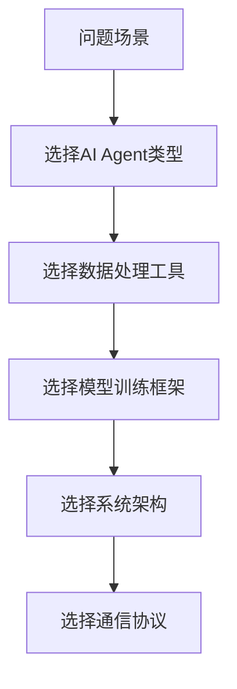
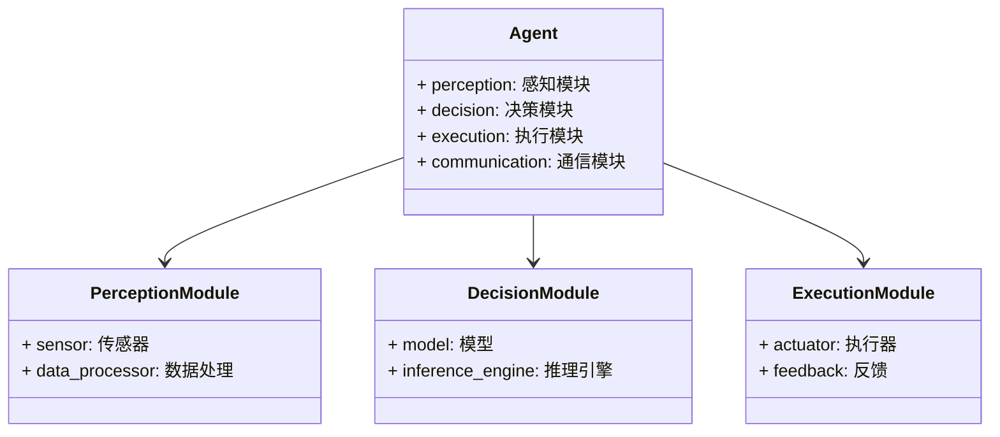
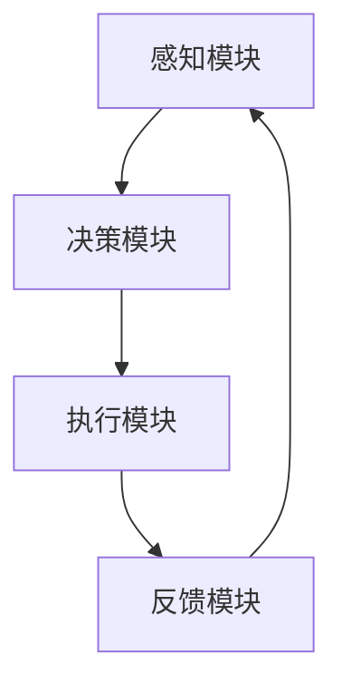
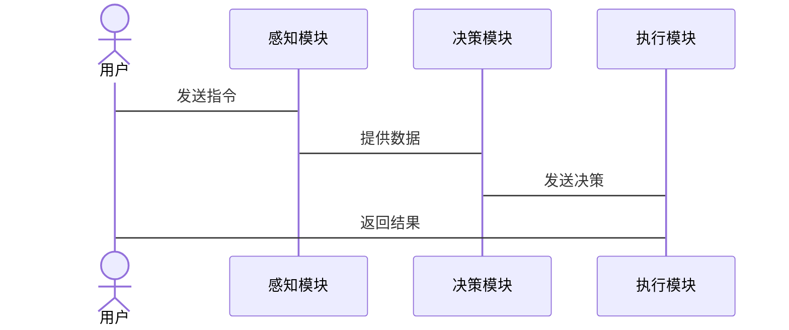

                 


# 构建AI Agent的技术栈选择指南

## 关键词：AI Agent，技术栈选择，算法原理，系统架构，项目实战

## 摘要：  
本文旨在为构建AI Agent提供系统的技术栈选择指南。从背景介绍、核心概念、算法原理到系统架构和项目实战，逐步分析并详细讲解，帮助读者选择合适的技术栈，构建高效可靠的AI Agent系统。

---

## 第一部分：AI Agent技术栈选择的背景与基础

### 第1章：AI Agent的背景与问题背景

#### 1.1 问题背景  
随着人工智能技术的快速发展，AI Agent（智能体）作为一种能够自主感知环境、执行任务的实体，逐渐在各个领域得到广泛应用。然而，AI Agent的构建涉及多个技术栈的选择，这对技术团队提出了更高的要求。  

**关键问题**：  
- 如何选择适合AI Agent的技术栈？  
- 各技术栈之间如何协同工作？  
- 如何在性能、可扩展性和开发效率之间找到平衡？  

#### 1.2 问题描述  
AI Agent的核心目标是实现智能决策和自主执行任务。然而，技术栈的选择直接影响系统的性能、可维护性和扩展性。  

**常见挑战**：  
- 数据处理的复杂性：AI Agent需要处理结构化、半结构化和非结构化数据。  
- 模型训练与推理的效率：如何在有限资源下优化模型性能？  
- 系统架构的可扩展性：如何应对高并发和复杂场景？  

#### 1.3 问题解决  
通过分析AI Agent的核心功能模块，结合实际应用场景，选择合适的技术栈。  

**解决方案**：  
- 确定AI Agent的类型（基于规则、基于模型、基于强化学习等）。  
- 根据功能需求选择数据处理、模型训练和推理的技术。  
- 设计高效的系统架构，确保可扩展性和可维护性。  

#### 1.4 边界与外延  
AI Agent的应用场景多样，但其核心功能是感知、决策和执行。技术栈的选择需要考虑以下边界条件：  
- 数据来源：内部数据、外部API、传感器等。  
- 任务类型：监督学习、无监督学习、强化学习等。  
- 环境约束：计算资源、网络带宽、延迟要求等。  

#### 1.5 概念结构与核心要素  
AI Agent的构建涉及多个核心要素：  
1. **感知模块**：数据采集与处理。  
2. **决策模块**：模型训练与推理。  
3. **执行模块**：任务执行与反馈。  
4. **通信模块**：与其他系统或用户的交互。  

---

### 第2章：AI Agent的核心概念与联系

#### 2.1 核心概念原理  
AI Agent的核心概念包括：  
- **智能体**：能够感知环境并采取行动以实现目标的实体。  
- **任务驱动**：AI Agent的目标是通过执行任务来满足特定需求。  
- **环境交互**：AI Agent通过与环境交互来获取信息并做出决策。  

**技术栈选择的关键因素**：  
- 数据处理：选择适合数据类型和格式的工具。  
- 模型训练：选择适合任务的算法框架。  
- 系统架构：设计高效的模块化架构。  

#### 2.2 核心概念属性特征对比  

| **AI Agent类型** | **技术栈选择** | **核心功能** |  
|-------------------|-----------------|--------------|  
| 基于规则的Agent | 规则引擎（如Drools） | 简单决策逻辑 |  
| 基于模型的Agent | 深度学习框架（如TensorFlow） | 复杂模式识别 |  
| 基于强化学习的Agent | 强化学习框架（如OpenAI Gym） | 智能决策与优化 |  

**图1：AI Agent核心概念的ER实体关系图**  
```mermaid
erd
actor: 用户
agent: AI Agent
environment: 环境
rule_engine: 规则引擎
model_training: 模型训练
decision_making: 决策模块
feedback: 反馈模块
```

**图2：AI Agent技术栈选择的Mermaid流程图**  


---

## 第二部分：AI Agent的算法原理与数学模型

### 第3章：AI Agent的算法原理与数学模型

#### 3.1 算法原理  
AI Agent的算法选择直接影响其性能。以下是几种常见的算法及其原理：  

**1. 基于规则的算法**  
- **原理**：通过预定义的规则进行决策。  
- **流程**：感知环境 → 匹配规则 → 执行动作。  
- **Mermaid流程图**  
  ```mermaid
  graph TD
  A(感知环境) --> B(匹配规则) --> C(执行动作)
  ```

**2. 基于模型的算法**  
- **原理**：利用机器学习模型进行预测和决策。  
- **流程**：数据采集 → 模型训练 → 推理与执行。  
- **Python代码示例**  
  ```python
  import numpy as np
  from sklearn.linear_model import LinearRegression

  # 示例：基于模型的AI Agent
  def model_training(data):
      X = data[['feature1', 'feature2']]
      y = data['target']
      model = LinearRegression()
      model.fit(X, y)
      return model

  def predict(model, input_data):
      prediction = model.predict(input_data)
      return prediction
  ```

**3. 基于强化学习的算法**  
- **原理**：通过奖励机制优化决策策略。  
- **流程**：状态感知 → 动作选择 → 奖励反馈 → 策略优化。  
- **数学模型**  
  $$ R = r_1 + r_2 + \dots + r_n $$  
  其中，\( R \) 是总奖励，\( r_i \) 是每个动作的奖励值。  

#### 3.2 算法的数学模型与公式  
**1. 线性回归模型**  
$$ y = mx + b $$  
其中，\( m \) 是斜率，\( b \) 是截距。  

**2. 逻辑回归模型**  
$$ P(y=1|x) = \frac{e^{(\beta_0 + \beta_1 x)}}{1 + e^{(\beta_0 + \beta_1 x)}} $$  
其中，\( \beta_0 \) 和 \( \beta_1 \) 是模型参数。  

**3. 强化学习中的Q-learning算法**  
$$ Q(s, a) = Q(s, a) + \alpha (r + \gamma \max Q(s', a') - Q(s, a)) $$  
其中，\( \alpha \) 是学习率，\( \gamma \) 是折扣因子。  

---

## 第三部分：AI Agent的系统分析与架构设计方案

### 第4章：AI Agent的系统分析与架构设计方案

#### 4.1 问题场景介绍  
AI Agent需要在复杂环境中完成任务，例如智能家居中的智能音箱、自动驾驶中的决策系统等。  

#### 4.2 系统功能设计  

**领域模型（Mermaid类图）**  


#### 4.3 系统架构设计  

**系统架构图（Mermaid架构图）**  


#### 4.4 系统接口设计  
- **感知模块接口**：提供数据采集和处理的API。  
- **决策模块接口**：提供模型训练和推理的API。  
- **执行模块接口**：提供任务执行和反馈的API。  

#### 4.5 系统交互流程  

**序列图（Mermaid序列图）**  


---

## 第四部分：AI Agent的项目实战

### 第5章：AI Agent的项目实战

#### 5.1 环境安装  
**安装Python环境**  
```bash
python -m pip install --user pipenv
pipenv install
pipenv shell
```

**安装依赖库**  
```bash
pip install numpy pandas scikit-learn tensorflow
```

#### 5.2 系统核心实现源代码  

**AI Agent核心代码示例**  
```python
import numpy as np
from sklearn.model_selection import train_test_split
from tensorflow.keras.models import Sequential
from tensorflow.keras.layers import Dense

# 示例：AI Agent的简单分类任务
class AIAssistant:
    def __init__(self):
        self.model = self.build_model()
    
    def build_model(self):
        model = Sequential()
        model.add(Dense(64, activation='relu', input_dim=2))
        model.add(Dense(1, activation='sigmoid'))
        model.compile(optimizer='adam', loss='binary_crossentropy', metrics=['accuracy'])
        return model
    
    def train(self, X, y):
        X_train, X_test, y_train, y_test = train_test_split(X, y, test_size=0.2)
        self.model.fit(X_train, y_train, epochs=10, batch_size=32, validation_data=(X_test, y_test))
    
    def predict(self, input_data):
        return self.model.predict(input_data)
```

**代码解读与分析**  
- **模型构建**：使用Keras构建一个简单的神经网络模型。  
- **训练过程**：利用训练数据进行模型训练。  
- **预测过程**：基于训练好的模型进行预测。  

#### 5.3 案例分析与实际应用  
**案例分析**：  
假设我们正在构建一个智能家居AI Agent，用于控制家电。  
- **感知模块**：通过物联网传感器获取环境数据。  
- **决策模块**：根据环境数据和用户指令进行决策。  
- **执行模块**：控制家电执行相应操作。  

**实际应用**：  
通过训练好的AI Agent，用户可以通过语音指令控制家电，实现智能化家居管理。  

#### 5.4 项目小结  
- AI Agent的实现需要多模块协同工作。  
- 技术栈的选择直接影响系统的性能和可维护性。  
- 通过实际项目案例，验证技术栈选择的合理性。  

---

## 第五部分：AI Agent的最佳实践

### 第6章：AI Agent的最佳实践

#### 6.1 最佳实践Tips  
1. **模块化设计**：将系统划分为独立的模块，便于维护和扩展。  
2. **数据预处理**：确保数据的高质量，避免无效数据对模型的影响。  
3. **模型优化**：通过调参和模型优化提升性能。  
4. **系统监控**：实时监控系统运行状态，及时发现和解决问题。  

#### 6.2 小结  
通过本文的系统讲解和实际案例分析，读者可以掌握AI Agent的技术栈选择方法，并能够根据实际需求构建高效的AI Agent系统。  

#### 6.3 注意事项  
- 确保数据安全和隐私保护。  
- 定期更新模型，以适应环境变化。  
- 选择适合团队的技术栈，避免过度追求最新技术。  

#### 6.4 拓展阅读  
1.《Hands-On Machine Learning with Scikit-Learn, Keras, and TensorFlow》  
2.《Deep Learning》  
3.《Reinforcement Learning: Theory and Algorithms》  

---

通过本文的系统讲解，读者可以全面了解AI Agent的技术栈选择方法，并能够根据实际需求构建高效可靠的AI Agent系统。希望本文对您的项目有所帮助！

