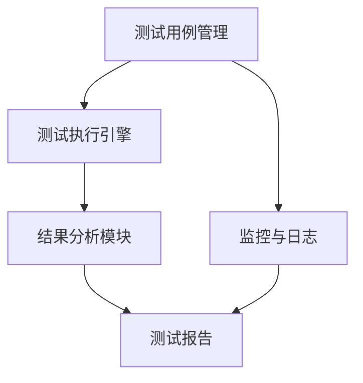

                 


# 构建AI Agent的测试框架：确保性能和可靠性

> 关键词：AI Agent、测试框架、性能测试、可靠性测试、测试用例生成、系统架构设计

> 摘要：本文将详细介绍如何构建一个高效的AI Agent测试框架，确保其性能和可靠性。通过系统分析AI Agent的核心原理、测试框架的设计原则、算法实现以及实际项目案例，本文将帮助读者掌握构建AI Agent测试框架的方法和技巧，同时提供最佳实践建议。

---

## 正文

### 第一部分：背景介绍

#### 第1章：AI Agent的基本概念与测试框架的重要性

##### 1.1 AI Agent的核心概念

AI Agent（人工智能代理）是一种能够感知环境、自主决策并执行任务的智能实体。它可以分为以下几类：

- **反应式AI Agent**：基于当前感知做出即时反应，适用于实时任务。
- **认知式AI Agent**：具备复杂推理和规划能力，适用于需要策略性决策的任务。
- **混合式AI Agent**：结合反应式和认知式的特点，适用于复杂环境中的任务。

##### 1.2 测试框架的重要性

AI Agent的性能和可靠性直接影响其应用场景的效果。为了确保AI Agent在各种场景下的稳定性和高效性，测试框架的作用至关重要：

- **性能测试**：确保AI Agent在高负载下的响应速度和处理能力。
- **可靠性测试**：验证AI Agent在异常情况下的容错能力和恢复能力。
- **功能测试**：确保AI Agent在不同输入下的行为符合预期。

##### 1.3 构建AI Agent测试框架的意义

通过构建高效的测试框架，可以显著提高AI Agent的开发效率和质量：

- **提高开发效率**：自动化测试用例生成和执行，减少人工干预。
- **确保测试覆盖率**：通过系统化的方法覆盖更多测试场景。
- **降低维护成本**：模块化设计使测试框架更容易维护和扩展。

---

### 第二部分：核心概念与联系

#### 第2章：AI Agent与测试框架的关系

##### 2.1 AI Agent的结构与功能

AI Agent的结构可以分为以下几个核心部分：

- **感知层**：通过传感器或API获取环境信息。
- **决策层**：基于感知信息进行推理和决策。
- **执行层**：根据决策结果执行具体操作。
- **学习层**：通过反馈优化自身的行为。

##### 2.2 测试框架的设计原则

测试框架的设计需要遵循以下原则：

- **模块化**：将测试过程分解为独立的模块，便于管理和维护。
- **可扩展性**：支持未来可能增加的测试场景和功能。
- **可配置性**：允许用户根据需求调整测试参数和配置。

##### 2.3 AI Agent与测试框架的交互流程

AI Agent与测试框架的交互流程如下：

1. **测试用例生成**：测试框架根据需求生成测试用例。
2. **测试执行**：AI Agent执行测试用例，生成行为数据。
3. **结果分析**：测试框架分析行为数据，生成测试报告。

---

### 第三部分：算法原理讲解

#### 第3章：AI Agent测试框架的算法实现

##### 3.1 测试用例生成算法

**测试用例生成算法**需要考虑以下因素：

- **输入空间**：生成多样化的输入数据。
- **覆盖率**：确保测试用例覆盖所有关键路径。
- **约束条件**：根据AI Agent的特点定制测试场景。

**基于遗传算法的测试用例生成**流程如下：

1. **初始化**：生成初始测试用例集。
2. **适应度评估**：评估每个测试用例的覆盖率。
3. **选择与交叉**：选择高适应度的用例进行交叉，生成新用例。
4. **变异**：随机修改部分用例，引入多样性。
5. **迭代**：重复上述步骤，直到满足覆盖率要求。

**Python代码示例**：

```python
def generate_test_cases():
    initial_cases = [...]  # 初始测试用例
    while True:
        evaluate_cases(initial_cases)
        selected_cases = select_high_fitness(initial_cases)
        new_cases = crossover(selected_cases)
        mutated_cases = mutate(new_cases)
        initial_cases = new_cases + mutated_cases
```

##### 3.2 性能测试算法

**性能测试算法**需要衡量AI Agent在高负载下的表现：

1. **负载测试**：模拟高并发场景，测试系统响应时间。
2. **压力测试**：逐步增加负载，观察系统崩溃点。
3. **稳定性测试**：长时间运行，测试系统稳定性。

**数学模型**：使用排队论模型分析系统性能：

$$ R = \frac{\lambda}{\mu} $$

其中，$R$ 是系统响应时间，$\lambda$ 是输入速率，$\mu$ 是处理速率。

---

### 第四部分：系统分析与架构设计

#### 第4章：AI Agent测试框架的系统架构

##### 4.1 系统功能设计

AI Agent测试框架的核心功能模块包括：

- **测试用例管理**：生成、存储和管理测试用例。
- **测试执行引擎**：驱动AI Agent执行测试用例。
- **结果分析模块**：解析测试结果并生成报告。
- **监控与日志**：实时监控测试过程并记录日志。

##### 4.2 系统架构设计

**系统架构图**如下：



##### 4.3 系统接口设计

**系统接口设计**如下：

- **API接口**：提供RESTful API供外部调用。
- **消息队列**：使用RabbitMQ实现异步通信。
- **数据库**：使用MySQL存储测试数据。

---

### 第五部分：项目实战

#### 第5章：构建AI Agent测试框架的实战

##### 5.1 环境搭建

**环境搭建步骤**：

1. 安装Python和必要的库（如pytest、requests）。
2. 配置测试环境（虚拟机或云平台）。
3. 初始化代码仓库。

##### 5.2 核心代码实现

**核心代码示例**：

```python
import pytest
from requests import post

def test_ai_agent_behavior():
    input_data = {"scenario": "high_load"}
    response = post("http://localhost:5000/api", json=input_data)
    assert response.status_code == 200
    # 解析响应并验证结果
```

##### 5.3 测试结果分析

**测试结果示例**：

- **性能指标**：响应时间平均值为2秒，99.9%的请求在3秒内完成。
- **可靠性指标**：系统在99.9%的场景下保持稳定。

##### 5.4 实际案例分析

**案例分析**：

- **场景1**：高并发请求下的响应时间测试。
- **场景2**：异常输入下的系统容错能力测试。

---

### 第六部分：总结与展望

#### 第6章：总结与最佳实践

##### 6.1 总结

通过构建高效的AI Agent测试框架，可以显著提高AI系统的性能和可靠性。本文详细介绍了测试框架的设计原则、算法实现和系统架构，并通过实际案例展示了如何将理论应用于实践。

##### 6.2 最佳实践

- **持续集成**：将测试框架集成到CI/CD流程中，确保代码质量。
- **自动化监控**：实时监控系统性能，快速发现和解决问题。
- **团队协作**：测试框架的设计需要开发、测试和运维团队的协作。

##### 6.3 展望

未来，随着AI技术的不断发展，AI Agent的测试框架将更加智能化和自动化。通过引入AI技术本身，测试框架可以实现自我优化和智能决策，进一步提高测试效率和质量。

---

### 附录：参考文献与工具

- **参考文献**：
  1. 《AI Agent开发指南》
  2. 《测试框架设计与实现》
- **工具推荐**：
  1. Python测试框架（如pytest、unittest）。
  2. 性能测试工具（如JMeter、LoadRunner）。

通过以上步骤，我们可以系统地构建一个高效可靠的AI Agent测试框架，确保其性能和可靠性，从而为实际应用提供强有力的支持。

