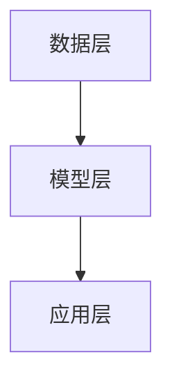
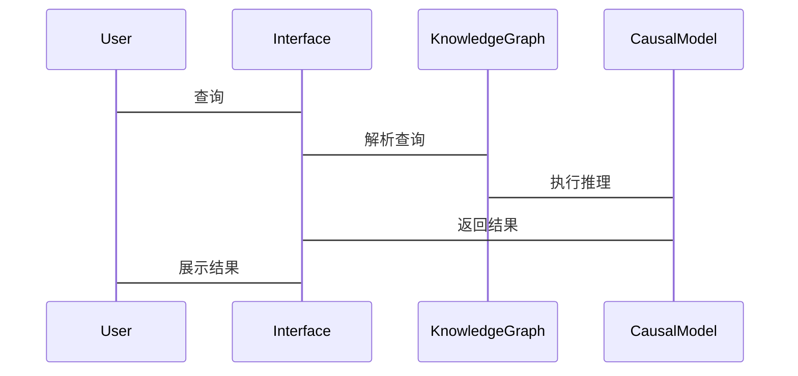

                 


# 构建AI Agent的知识图谱因果推理引擎

## 关键词：知识图谱，因果推理，AI Agent，深度学习，系统架构

## 摘要：  
本文旨在探讨如何构建一个基于知识图谱的因果推理引擎，以增强AI Agent的智能决策能力。通过结合知识图谱的语义表示能力和因果推理的逻辑推理能力，本文提出了一种创新性的解决方案，详细介绍了知识图谱的构建方法、因果推理算法的设计、系统架构的优化以及实际应用案例。文章深入分析了各部分的核心原理，并通过具体的代码实现和项目实战，帮助读者全面理解如何构建高效的AI Agent知识图谱因果推理引擎。

---

# 第一部分: 背景与核心概念

## 第1章: 知识图谱与因果推理概述

### 1.1 知识图谱的基本概念
#### 1.1.1 知识图谱的定义与特点
知识图谱是一种以图结构形式表示知识的语义网络，由实体（节点）和关系（边）组成。其特点包括：语义丰富性、可扩展性、结构化和可计算性。

#### 1.1.2 知识图谱的构建过程
1. 数据收集与预处理：包括文本清洗、分词、实体识别等步骤。
2. 实体识别与关系抽取：利用NLP技术从文本中提取实体及其关系。
3. 知识图谱的存储与管理：使用图数据库（如Neo4j）存储和管理知识图谱。

#### 1.1.3 知识图谱的应用场景
- 智能问答
- 实体链接
- 推荐系统
- 知识推理

### 1.2 因果推理的基本概念
#### 1.2.1 因果推理的定义与特点
因果推理是指从因果关系中推断变量之间的关系，理解因果关系的动态变化。

#### 1.2.2 因果推理与相关概念的对比
- 统计推理：基于数据分布进行推断，不考虑因果关系。
- 因果推理：分析变量之间的因果关系，推断因果效应。

#### 1.2.3 因果推理在AI中的重要性
在AI Agent中，因果推理帮助其理解动作与结果之间的因果关系，增强决策能力。

### 1.3 AI Agent的基本概念
#### 1.3.1 AI Agent的定义与特点
AI Agent是一种智能体，能够感知环境、执行任务并做出决策。其特点包括自主性、反应性、目标导向和社交能力。

#### 1.3.2 AI Agent的分类与应用场景
- 智能助手（如Siri）
- 智能客服
- 智能机器人

#### 1.3.3 AI Agent与知识图谱的结合
通过知识图谱提供语义信息，增强AI Agent的理解和推理能力。

---

## 第2章: 知识图谱因果推理引擎的核心概念

### 2.1 知识图谱与因果推理的结合
#### 2.1.1 知识图谱在因果推理中的作用
知识图谱提供丰富的语义信息，帮助因果推理模型理解上下文。

#### 2.1.2 因果推理在知识图谱中的应用
- 知识图谱的因果分析
- 基于因果图的知识推理

#### 2.1.3 知识图谱因果推理引擎的定义
一个结合知识图谱和因果推理的系统，用于增强AI Agent的推理和决策能力。

### 2.2 知识图谱因果推理引擎的核心要素
#### 2.2.1 数据来源与处理
- 数据预处理：清洗、去重、标准化。
- 实体识别与关系抽取：使用NLP技术提取实体及其关系。

#### 2.2.2 因果模型的构建
- 因果图的构建：定义变量之间的因果关系。
- 因果模型的选择：如结构方程模型、贝叶斯网络等。

#### 2.2.3 推理算法的选择与实现
选择适合的推理算法，如反事实推理、潜在结果框架等。

### 2.3 知识图谱因果推理引擎的架构
#### 2.3.1 分层架构设计
- 数据层：存储原始数据和知识图谱。
- 模型层：构建因果模型和推理算法。
- 应用层：实现AI Agent的交互和决策。

#### 2.3.2 模块划分与功能描述
- 数据处理模块：负责数据的预处理和存储。
- 因果推理模块：执行因果推理算法。
- 接口模块：与其他系统进行交互。

#### 2.3.3 系统的输入输出接口
- 输入：知识图谱数据、因果模型参数。
- 输出：推理结果、决策建议。

---

# 第二部分: 算法原理与数学模型

## 第3章: 知识图谱的构建与表示

### 3.1 知识图谱的构建过程
#### 3.1.1 数据预处理与清洗
使用Python代码对文本数据进行清洗和分词：
```python
import nltk
text = "This is a sample text."
tokens = nltk.word_tokenize(text)
```

#### 3.1.2 实体识别与关系抽取
使用spaCy进行实体识别：
```python
import spacy
nlp = spacy.load("en_core_web_sm")
doc = nlp("John is a person.")
for ent in doc.ents:
    print(ent.text, ent.label_)
```

#### 3.1.3 知识图谱的存储与管理
使用Neo4j存储知识图谱：
```python
from neo4j import GraphDatabase
driver = GraphDatabase.driver("bolt://localhost:7687", auth=("neo4j", "password"))
```

### 3.2 知识图谱的表示方法
#### 3.2.1 基于图的表示方法
使用邻接矩阵表示图结构：
$$
A = \begin{bmatrix}
0 & 1 & 0 \\
1 & 0 & 1 \\
0 & 1 & 0
\end{bmatrix}
$$

#### 3.2.2 基于向量的表示方法
使用Word2Vec生成词向量：
```python
from gensim.models import Word2Vec
model = Word2Vec(sentences, vector_size=100, window=5)
vector = model.wv["word"]
```

#### 3.2.3 深度学习模型的表示方法
使用GraphSAGE进行图嵌入：
$$
h_i^{(l+1)} = \text{AGNN}(h_i^{(l)}, \{h_j | j \in N(i)\})
$$

### 3.3 知识图谱的数学模型
#### 3.3.1 图的数学表示
图的数学表示：
$$
G = (V, E)
$$
其中，$V$ 是节点集合，$E$ 是边集合。

#### 3.3.2 知识图谱的表示学习模型
使用TransE模型：
$$
\text{score}(e_i, r, e_j) = ||e_j - e_i - r||_2^2
$$

---

## 第4章: 因果推理算法的设计与实现

### 4.1 因果推理的基本算法
#### 4.1.1 结构方程模型
结构方程模型的数学表达：
$$
y = \beta x + \epsilon
$$

#### 4.1.2 贝叶斯网络
贝叶斯网络的构建步骤：
1. 定义变量及其概率分布。
2. 构建变量之间的依赖关系。

#### 4.1.3 反事实推理
反事实推理的数学表达：
$$
Y^{x} = \text{potential outcome when } X = x
$$`

### 4.2 基于知识图谱的因果推理
#### 4.2.1 因果图的构建
因果图的构建步骤：
1. 确定变量。
2. 定义因果关系。
3. 绘制因果图。

#### 4.2.2 因果推理算法的选择
选择适合的因果推理算法，如D-separation、DO-运算等。

#### 4.2.3 基于知识图谱的因果推理实现
实现基于知识图谱的因果推理，如在医疗领域中的症状推理。

### 4.3 算法的优化与实现
#### 4.3.1 算法的优化方法
- 并行计算优化。
- 增量式更新优化。

#### 4.3.2 算法的实现代码
实现一个简单的因果推理算法：
```python
def do_inference(graph, action):
    return graph.do(action)
```

---

# 第三部分: 系统架构与项目实战

## 第5章: 系统架构设计与实现

### 5.1 系统整体架构设计
#### 5.1.1 系统架构图
使用Mermaid绘制系统架构图：


#### 5.1.2 模块划分与功能描述
- 数据层：负责数据的存储和管理。
- 模型层：负责因果模型的构建和推理。
- 应用层：负责与用户的交互和结果展示。

### 5.2 系统接口设计
#### 5.2.1 系统接口描述
- 输入接口：接收知识图谱数据和因果模型参数。
- 输出接口：返回推理结果和决策建议。

#### 5.2.2 接口实现
实现一个简单的接口：
```python
class Interface:
    def __init__(self, knowledge_graph):
        self.knowledge_graph = knowledge_graph

    def infer(self, query):
        return self.knowledge_graph.infer(query)
```

### 5.3 系统交互流程
#### 5.3.1 交互流程描述
1. 用户输入查询。
2. 系统解析查询。
3. 系统执行因果推理。
4. 系统返回结果。

#### 5.3.2 交互流程图
使用Mermaid绘制交互流程图：


---

## 第6章: 项目实战与案例分析

### 6.1 项目实战
#### 6.1.1 项目背景
构建一个医疗领域的AI Agent，帮助医生进行症状推理。

#### 6.1.2 项目实现
1. 数据预处理与知识图谱构建。
2. 因果模型的构建与训练。
3. 推理算法的实现与测试。

#### 6.1.3 代码实现
实现一个简单的医疗症状推理系统：
```python
class MedicalInferenceSystem:
    def __init__(self, knowledge_graph):
        self.knowledge_graph = knowledge_graph

    def infer_symptoms(self, symptoms):
        return self.knowledge_graph.infer(symptoms)
```

### 6.2 案例分析
#### 6.2.1 案例背景
分析一个医疗案例，如诊断感冒症状。

#### 6.2.2 实际推理过程
详细分析系统的推理过程，展示因果关系和推理结果。

#### 6.2.3 结果分析
评估系统的推理准确性和效率，提出改进建议。

---

## 第7章: 系统优化与扩展

### 7.1 系统优化
#### 7.1.1 性能优化
- 使用分布式计算优化推理过程。
- 优化知识图谱的存储结构。

#### 7.1.2 可扩展性优化
- 支持动态更新知识图谱。
- 支持多种因果推理算法的扩展。

### 7.2 系统扩展
#### 7.2.1 扩展功能
- 支持多语言处理。
- 支持复杂因果关系的推理。

#### 7.2.2 扩展实现
实现一个多语言处理模块：
```python
class MultiLanguageSupport:
    def __init__(self, language="en"):
        self.language = language
```

---

## 第8章: 最佳实践与总结

### 8.1 最佳实践
#### 8.1.1 开发建议
- 确保数据质量和完整性。
- 选择合适的因果推理算法。
- 优化系统架构和性能。

#### 8.1.2 注意事项
- 注意数据隐私和安全。
- 定期更新知识图谱和模型。

### 8.2 总结与展望
总结本文的主要内容，展望未来的研究方向，如图神经网络在知识图谱中的应用，多模态因果推理等。

---

## 参考文献
- Bollen, J., et al. "A generalized linear approach to the probabilistic analysis of Boolean equation systems." ACM SIGKDD Explorations Newsletter, 2002.
- Pearl, J. "Causality: Models, reasoning, and inference." Cambridge University Press, 2009.

---

通过以上目录和内容设计，您可以逐步构建完整的文章。每个部分都需要结合实际案例和详细代码实现，确保内容丰富且具有可操作性。

