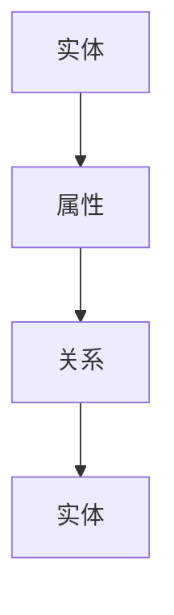
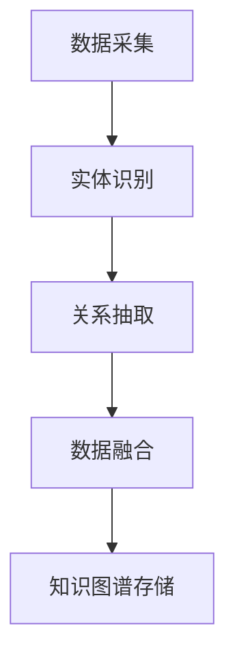
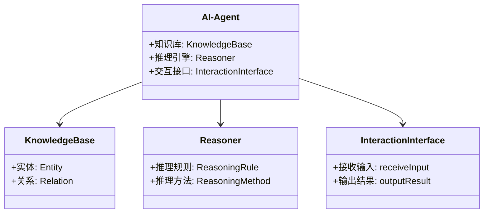
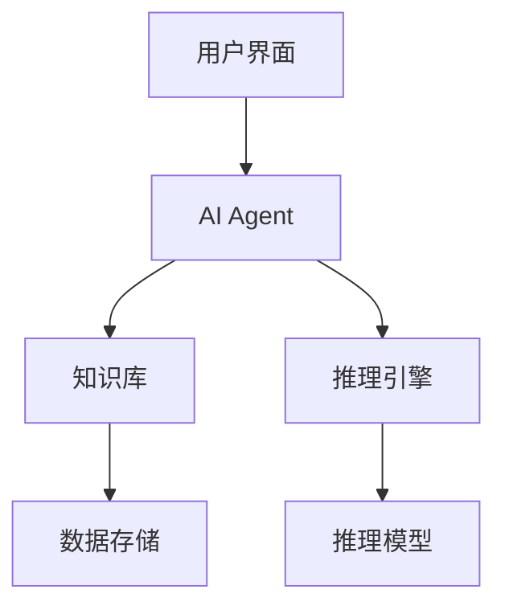

                 


# 构建AI Agent的知识图谱多模态推理系统

## 关键词：AI Agent，知识图谱，多模态推理，系统架构，项目实战

## 摘要：构建一个AI Agent的知识图谱多模态推理系统，涉及知识图谱的构建、多模态数据的处理以及推理算法的设计。本文详细介绍了系统的核心概念、算法原理、架构设计及实际案例，帮助读者掌握构建此类系统的知识和技能。

---

## 第一部分：背景介绍

### 第1章：AI Agent与知识图谱多模态推理系统概述

#### 1.1 问题背景
AI Agent的发展离不开对复杂知识的处理能力。传统的基于规则的AI Agent在处理多模态数据时显得力不从力，无法有效理解和推理结构化的知识。知识图谱的出现为AI Agent提供了结构化的知识库，而多模态推理技术则增强了其处理多种数据类型的能力。

#### 1.2 问题描述
AI Agent需要处理多模态数据，例如文本、图像和语音，但传统方法难以将这些数据与结构化的知识图谱有效结合。如何利用知识图谱进行多模态推理，成为构建高效AI Agent的关键挑战。

#### 1.3 问题解决
通过构建知识图谱多模态推理系统，AI Agent能够整合多种数据类型，利用推理算法在知识图谱上进行推理，提升其理解和决策能力。

#### 1.4 边界与外延
知识图谱的构建主要依赖于结构化数据，而多模态推理则关注多种数据类型的整合与推理。AI Agent的应用场景包括智能助手、机器人等领域，但不涵盖实时数据处理和动态知识更新。

#### 1.5 核心概念与组成
- **AI Agent**：具备感知和决策能力的智能实体。
- **知识图谱**：结构化的知识库，由实体和关系构成。
- **多模态推理**：基于多种数据类型进行推理的技术。

---

## 第二部分：核心概念与联系

### 第2章：知识图谱与多模态推理的核心概念

#### 2.1 知识图谱原理
知识图谱通过实体和关系描述现实世界，提供结构化的知识表示。其构建过程包括数据采集、实体识别、关系抽取和数据融合。

#### 2.2 多模态推理原理
多模态推理整合文本、图像等多种数据，通过推理算法生成结论。常见的推理方法包括符号推理和深度学习推理。

#### 2.3 核心概念对比
| 特性          | 知识图谱                 | 多模态推理             |
|---------------|--------------------------|-----------------------|
| 数据类型      | 结构化数据               | 文本、图像、语音等     |
| 主要任务      | 存储和管理知识           | 基于多模态数据推理     |

#### 2.4 ER实体关系图


---

## 第三部分：算法原理讲解

### 第3章：知识图谱构建算法

#### 3.1 实体识别与抽取
- **基于规则的方法**：利用预定义规则识别实体。
- **基于机器学习的方法**：使用特征工程进行分类。
- **基于深度学习的方法**：采用神经网络模型（如BERT）进行实体识别。

#### 3.2 关系抽取
- **基于模式匹配的方法**：利用预定义模式匹配关系。
- **基于机器学习的方法**：使用训练好的模型进行关系分类。
- **基于深度学习的方法**：利用序列标注模型（如LSTM）提取关系。

#### 3.3 数据融合
- 数据清洗：去除冗余和错误数据。
- 数据合并：将不同数据源的信息整合到统一的知识图谱中。

#### 3.4 算法流程图


#### 3.5 Python代码示例
```python
import networkx as nx

# 创建知识图谱
G = nx.Graph()

# 添加实体
G.add_nodes_from(['Entity1', 'Entity2'])

# 添加关系
G.add_edges_from([('Entity1', 'Entity2')])
```

---

## 第四部分：系统分析与架构设计

### 第4章：系统架构设计

#### 4.1 问题场景介绍
智能助手需要理解用户的多模态输入，并基于知识图谱提供准确的推理结果。

#### 4.2 领域模型设计


#### 4.3 系统架构设计


---

## 第五部分：项目实战

### 第5章：构建知识图谱多模态推理系统

#### 5.1 环境安装
- 安装必要的库：networkx、numpy、scikit-learn。

#### 5.2 核心代码实现
```python
import networkx as nx
from sklearn.feature_extraction.text import TfidfVectorizer

# 创建知识图谱
G = nx.Graph()

# 添加实体和关系
G.add_node('Entity1')
G.add_node('Entity2')
G.add_edge('Entity1', 'Entity2')

# 应用TF-IDF进行文本特征提取
vectorizer = TfidfVectorizer()
tfidf = vectorizer.fit_transform(["Entity1 related to Entity2"])
```

#### 5.3 代码解读与分析
- 使用networkx构建知识图谱，存储实体和关系。
- 使用TF-IDF进行文本特征提取，辅助多模态推理。

#### 5.4 实际案例分析
- 输入：用户查询“Entity1与Entity2的关系是什么？”。
- 输出：基于知识图谱推理结果，返回关系信息。

#### 5.5 项目小结
通过实际案例，展示了知识图谱构建和多模态推理的基本流程。

---

## 第六部分：最佳实践

### 第6章：总结与拓展

#### 6.1 小结
本文详细介绍了构建AI Agent的知识图谱多模态推理系统，包括核心概念、算法原理和系统设计。

#### 6.2 注意事项
- 知识图谱的构建需要高质量的数据。
- 多模态推理的性能依赖于算法的选择和优化。

#### 6.3 拓展阅读
- 推荐阅读《知识图谱构建方法》和《多模态推理算法研究》。

---

通过以上步骤，我们构建了一个完整的知识图谱多模态推理系统，为AI Agent提供了强大的知识处理能力。希望本文能为读者提供清晰的指导和有益的启示。

