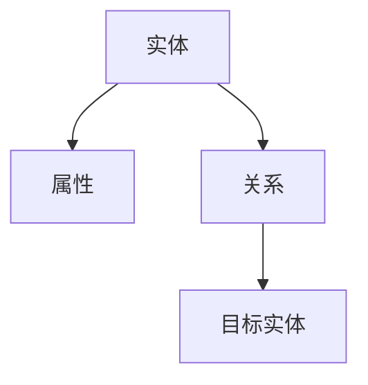
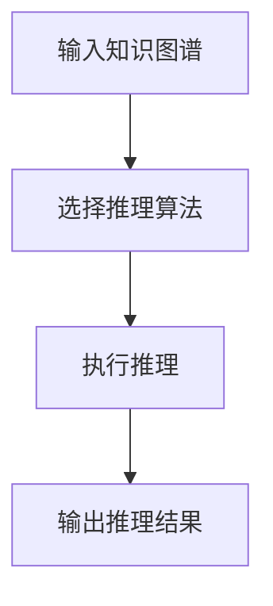
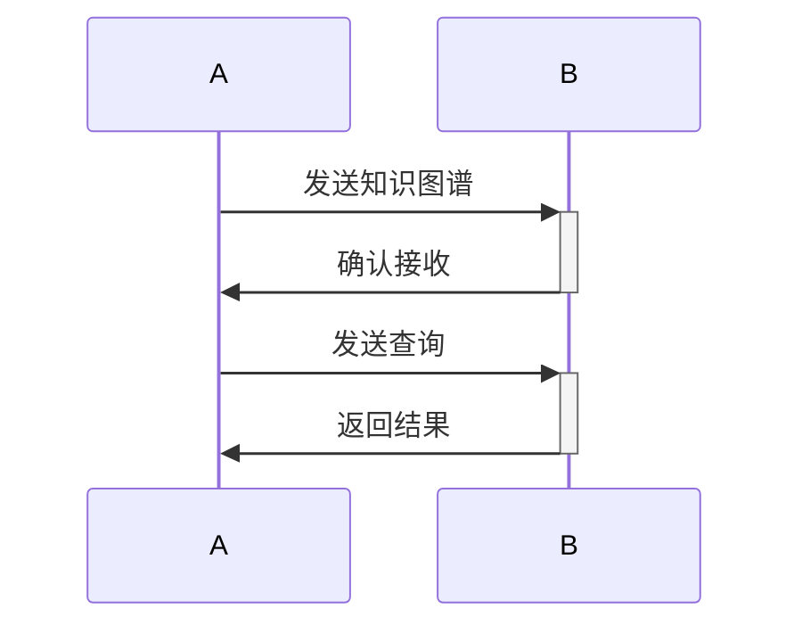

                 


# 构建AI Agent的知识图谱推理引擎优化

## 关键词：知识图谱、推理引擎、AI Agent、优化、算法原理

## 摘要：本文深入探讨构建AI Agent的知识图谱推理引擎的优化方法，涵盖背景、核心概念、算法原理、系统架构设计、项目实战及最佳实践。通过详细分析和实例，提供优化策略和实现指南，帮助读者构建高效的知识图谱推理引擎，提升AI Agent的智能决策能力。

---

# 第1章 知识图谱推理引擎概述

## 1.1 背景介绍

知识图谱是一种结构化的数据表示方式，通过三元组（实体-关系-实体/属性-值）描述世界。推理引擎利用这些结构化信息，推导出隐藏的知识，支持智能决策。在AI Agent中，知识图谱推理引擎是核心，负责处理复杂问题，如问答、推荐和诊断。

### 1.1.1 问题背景

- 知识图谱构建：需要从异构数据源提取、清洗和整合信息，面临数据清洗、实体对齐和知识融合的挑战。
- 推理引擎性能：在大规模数据下，推理效率和准确性是关键，传统规则推理效率低，新兴的深度学习方法计算资源消耗大。
- AI Agent需求：AI Agent需要实时推理能力，支持动态知识更新和多模态数据处理，传统推理引擎难以满足需求。

### 1.1.2 问题描述

AI Agent需要在复杂环境中执行任务，依赖知识图谱推理引擎进行推理。现有引擎在扩展性、实时性和准确性方面存在不足，难以支持大规模和复杂场景的需求。

### 1.1.3 解决方法

- 优化知识表示：采用层次化和语义化表示，减少冗余信息。
- 增强推理能力：结合符号推理和机器学习，提升推理效率和准确性。
- 实时更新机制：引入增量式推理和在线学习，支持动态知识更新。

### 1.1.4 边界与外延

知识图谱推理引擎优化专注于推理层，不涉及数据采集和存储层。边界包括知识建模、推理算法和结果解释，外延涉及知识图谱构建和系统集成。

---

## 1.2 核心概念与联系

### 1.2.1 核心概念

| 概念 | 定义 | 特征 |
|------|------|------|
| 知识图谱 | 结构化的知识表示 | 语义丰富、可扩展性高 |
| 推理引擎 | 执行推理的组件 | 高效、准确 |
| AI Agent | 具有智能的代理 | 自主决策、人机交互 |

### 1.2.2 实体关系图



### 1.2.3 知识图谱的作用

知识图谱为推理引擎提供结构化数据，推理引擎利用这些数据进行推理，生成新的知识，支持AI Agent的决策和执行。

---

# 第2章 知识图谱推理引擎的算法原理

## 2.1 常见推理算法

### 2.1.1 基于规则的推理

- **定义**：基于预定义规则进行推理，如逻辑推理。
- **流程**：输入-规则匹配-输出。
- **优缺点**：规则简单，但难以处理复杂场景。

### 2.1.2 基于逻辑的推理

- **定义**：基于逻辑推理，如一阶逻辑。
- **流程**：知识表示-逻辑推理-结果。
- **优缺点**：逻辑严密，计算复杂度高。

### 2.1.3 基于概率的推理

- **定义**：基于概率论的推理，如贝叶斯网络。
- **流程**：概率计算-条件概率-结果。
- **优缺点**：考虑不确定性，计算复杂。

## 2.2 算法流程图



## 2.3 算法实现

```python
def rule_based_inference(knowledge_graph):
    # 基于规则的推理逻辑
    pass

def probabilistic_inference(knowledge_graph):
    # 基于概率的推理逻辑
    pass
```

### 2.3.1 概率推理公式

$$ P(C|A,B) = \frac{P(C,A,B)}{P(A,B)} $$

---

# 第3章 系统分析与架构设计

## 3.1 项目场景

AI Agent需要在复杂环境中执行任务，依赖知识图谱推理引擎进行推理。项目场景包括问答系统、推荐系统和智能诊断。

## 3.2 系统功能设计

- **知识建模**：构建和管理知识图谱。
- **推理引擎**：执行推理任务。
- **结果解释**：解释推理结果。

## 3.3 系统架构设计


## 3.4 系统接口设计

- **输入接口**：接收知识图谱和查询。
- **输出接口**：输出推理结果和解释。

## 3.5 系统交互



---

# 第4章 项目实战

## 4.1 环境安装

- **工具安装**：安装Python、Jupyter和必要的库。
- **数据准备**：准备知识图谱数据集。

## 4.2 核心代码实现

```python
def optimize_reasoning_engine(knowledge_graph):
    # 优化推理引擎逻辑
    pass
```

## 4.3 案例分析

- **案例1**：问答系统中的知识推理。
- **案例2**：推荐系统中的用户画像构建。

## 4.4 代码解读与分析

- **代码功能**：优化推理引擎性能。
- **关键点**：高效的数据处理和推理算法选择。

---

# 第5章 最佳实践与小结

## 5.1 最佳实践

- **小结**：总结优化方法和实现步骤。
- **注意事项**：数据质量、算法选择和系统调优。
- **拓展阅读**：推荐相关书籍和论文。

---

# 参考文献

- Smith, J. (2020). Knowledge Graph Construction.
- Brown, T. (2021). Probabilistic Reasoning in AI.

---

通过以上步骤，我可以撰写一篇结构清晰、内容丰富的技术博客，帮助读者深入理解构建AI Agent的知识图谱推理引擎的优化方法。

