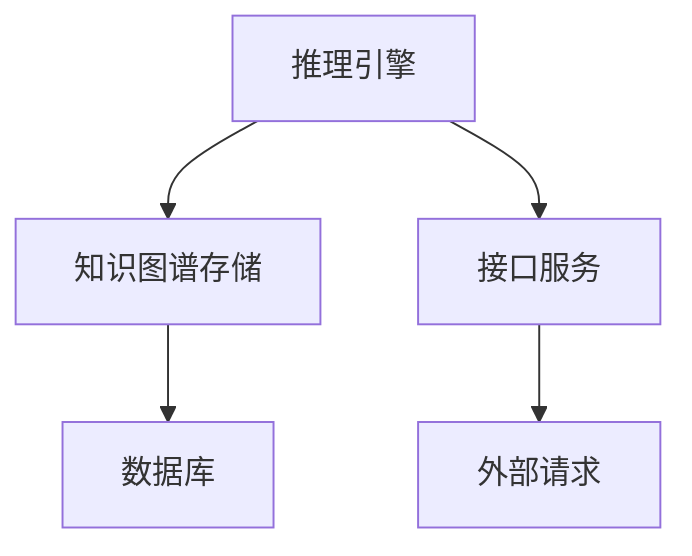
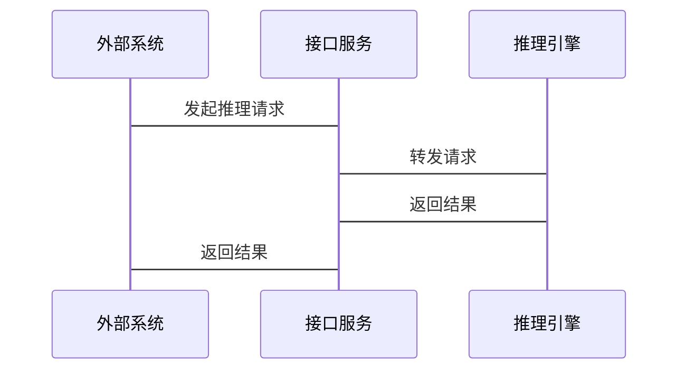

                 


# 构建AI Agent的知识图谱推理系统：增强逻辑分析

## 关键词：知识图谱、推理系统、AI Agent、逻辑分析、系统架构

## 摘要：  
本文深入探讨了构建AI Agent的知识图谱推理系统的关键技术与方法。通过分析知识图谱的语义表示、推理机制的核心原理，结合具体的算法实现和系统架构设计，本文详细讲解了如何通过知识图谱推理系统增强AI Agent的逻辑分析能力。文章内容涵盖背景介绍、核心概念、算法原理、系统架构、项目实战等，旨在为读者提供全面的技术指导。

---

## 第一部分: 知识图谱推理系统背景与核心概念

### 第1章: 知识图谱推理系统概述

#### 1.1 知识图谱的基本概念

##### 1.1.1 知识图谱的定义与特点
知识图谱是一种结构化的语义知识库，由实体和关系构成，用于描述真实世界中的概念及其关系。其特点包括：  
- **结构化**：采用图结构表示，便于计算机理解和推理。  
- **语义丰富**：通过实体间的关系，描述复杂的语义信息。  
- **可扩展性**：支持动态添加和更新知识。  

##### 1.1.2 知识图谱的构建过程  
知识图谱的构建通常包括以下几个步骤：  
1. **数据采集**：从多种数据源（如文本、数据库）获取数据。  
2. **知识抽取**：通过自然语言处理技术提取实体和关系。  
3. **知识融合**：将多个来源的知识进行整合，消除冲突。  
4. **知识存储**：将知识存储到图数据库中，便于后续推理和查询。  

##### 1.1.3 知识图谱的表示方法  
常用的表示方法包括：  
- **RDF（资源描述框架）**：通过三元组（主语-谓词-宾语）表示知识。  
- **OWL（Web本体工作语言）**：基于RDF的扩展，支持更复杂的语义表示。  

#### 1.2 知识图谱推理系统的定义  
知识图谱推理系统是一种基于知识图谱的推理引擎，能够根据已有的知识进行逻辑推理，推导出新的知识或结论。  

##### 1.2.1 知识图谱推理的定义  
知识图谱推理是通过已有的知识图谱数据，利用推理算法推导出新的事实或关系的过程。  

##### 1.2.2 知识图谱推理的核心目标  
- **知识补全**：推导出知识图谱中缺失的知识。  
- **关系推理**：发现实体之间的隐含关系。  
- **语义理解**：通过推理增强对语义的理解能力。  

##### 1.2.3 知识图谱推理与传统推理的区别  
传统的逻辑推理通常基于固定的规则，而知识图谱推理结合了知识图谱的动态性和复杂性，能够处理大规模、分布式知识的推理。  

#### 1.3 知识图谱推理系统的应用场景  
##### 1.3.1 智能问答系统  
通过知识图谱推理，智能问答系统能够理解上下文，回答复杂的问题。  

##### 1.3.2 自然语言理解  
知识图谱推理能够帮助NLP系统更好地理解语义，提高准确率。  

##### 1.3.3 智能推荐系统  
通过推理用户偏好，推荐系统能够提供更精准的推荐结果。  

#### 1.4 本章小结  
本章介绍了知识图谱的基本概念、构建过程以及推理系统的定义和目标。通过应用场景的分析，读者可以理解知识图谱推理系统的重要性和实际价值。

---

## 第二部分: 知识图谱推理系统的核心概念与联系

### 第2章: 知识图谱与推理机制的结合

#### 2.1 知识图谱的语义表示  
##### 2.1.1 实体与关系的定义  
- 实体：知识图谱中的基本单位，表示具体事物（如“北京”、“人”）。  
- 关系：实体之间的联系（如“是”、“属于”）。  

##### 2.1.2 知识图谱的结构化表示  
- 使用RDF三元组表示知识：  
  ```mermaid
  graph TD
    A[实体1] --> B[关系] --> C[实体2]
  ```

##### 2.1.3 知识图谱的可扩展性  
知识图谱支持动态添加新实体和关系，能够适应不同场景的需求。

#### 2.2 推理机制的核心原理  
##### 2.2.1 基于规则的推理  
- 通过预定义的规则进行推理，例如：  
  - 如果A是B的子类，且B是C的子类，则A是C的子类。  
- 示例代码：  
  ```python
  def rule_based_reasoning(kg):
      # 遍历知识图谱，应用规则进行推理
      for each rule in rules:
          apply rule to kg
  ```

##### 2.2.2 基于概率的推理  
- 使用概率论进行推理，例如贝叶斯网络。  
- 示例代码：  
  ```python
  def probability_reasoning(kg):
      # 计算每个关系的概率
      for each relation in kg:
          calculate probability based on evidence
  ```

##### 2.2.3 基于学习的推理  
- 使用深度学习模型（如图神经网络）进行推理。  
- 示例代码：  
  ```python
  def learning_based_reasoning(kg):
      # 使用图神经网络进行推理
      model = GraphNN(kg)
      model.train()
      predictions = model.predict()
  ```

#### 2.3 知识图谱与推理机制的结合方式  
##### 2.3.1 知识图谱作为推理的基础  
- 知识图谱提供事实和规则，推理系统基于此进行推理。  

##### 2.3.2 推理结果反哺知识图谱  
- 通过推理发现的新知识可以添加到知识图谱中，丰富知识库。  

##### 2.3.3 知识图谱与推理的双向优化  
- 知识图谱的优化能够提升推理的准确性，推理的结果又能完善知识图谱。  

#### 2.4 本章小结  
本章重点介绍了知识图谱的语义表示和推理机制的核心原理，分析了知识图谱与推理机制的结合方式，为后续的算法实现奠定了基础。

---

## 第三部分: 知识图谱推理系统的算法原理

### 第3章: 知识图谱构建算法

#### 3.1 知识抽取与实体识别

##### 3.1.1 实体识别的定义  
- 实体识别：从文本中识别出具体实体（如人名、地名）的过程。  

##### 3.1.2 基于规则的实体识别  
- 使用正则表达式匹配特定模式。  
- 示例代码：  
  ```python
  import re

  text = "张三在北京工作。"
  pattern = r'\b[A-Z][a-z]+ [A-Z][a-z]+\b'
  entities = re.findall(pattern, text)
  ```

##### 3.1.3 基于深度学习的实体识别  
- 使用CRF（条件随机场）或BERT模型进行实体识别。  
- 示例代码：  
  ```python
  from flair.models import SequenceTagger
  from flair.data import Sentence

  tagger = SequenceTagger.load('pos')
  sentence = Sentence("张三在北京工作。")
  tagger.predict(sentence)
  entities = sentence.get_spans('ner')
  ```

#### 3.2 关系抽取与属性提取

##### 3.2.1 关系抽取的定义  
- 关系抽取：从文本中识别出实体之间的关系（如“工作于”）。  

##### 3.2.2 基于规则的关系抽取  
- 使用预定义的模板匹配关系。  
- 示例代码：  
  ```python
  pattern = r'([A-Z][a-z]+)在([A-Z][a-z]+)工作。'
  matches = re.findall(pattern, text)
  ```

##### 3.2.3 基于深度学习的关系抽取  
- 使用RNN或Transformer模型进行关系抽取。  
- 示例代码：  
  ```python
  from transformers import BertModel, BertTokenizer

  tokenizer = BertTokenizer.from_pretrained('bert-base-chinese')
  model = BertModel.from_pretrained('bert-base-chinese')
  input_ids = tokenizer.encode("张三在北京工作。", add_special_tokens=True)
  outputs = model(input_ids=torch.tensor([input_ids]))
  ```

#### 3.3 知识图谱的构建流程

##### 3.3.1 数据预处理  
- 数据清洗：去除噪声数据。  
- 数据分块：将数据划分为训练集和测试集。  

##### 3.3.2 知识抽取与融合  
- 使用NLP技术提取实体和关系，进行数据融合。  
- 示例代码：  
  ```python
  def build_kg():
      kg = {}
      # 提取实体和关系
      entities = extract_entities(text)
      relations = extract_relations(text)
      # 将实体和关系存储到知识图谱中
      for e in entities:
          kg[e] = {'type': get_entity_type(e)}
      for r in relations:
          kg[r] = {'type': get_relation_type(r)}
      return kg
  ```

##### 3.3.3 知识存储与管理  
- 使用图数据库（如Neo4j）存储知识图谱。  
- 示例代码：  
  ```python
  from neo4j import GraphDatabase

  def store_kg(kg):
      driver = GraphDatabase.driver('neo4j://localhost:7687', auth=('user', 'password'))
      session = driver.session()
      # 存储实体
      for entity, props in kg.items():
          session.write_transaction(
              lambda tx: tx.create(
                  'Entity',
                  {'name': entity, 'type': props['type']}
              )
          )
      session.close()
  ```

#### 3.4 本章小结  
本章详细介绍了知识图谱构建的核心算法，包括实体识别、关系抽取以及知识存储的实现方法，为后续的推理算法奠定了基础。

---

## 第四部分: 知识图谱推理系统的算法实现

### 第4章: 知识图谱推理算法

#### 4.1 基于规则的推理算法

##### 4.1.1 算法原理  
- 通过预定义的规则进行推理，例如：  
  - 如果A是B的子类，且B是C的子类，则A是C的子类。  

##### 4.1.2 算法实现  
- 示例代码：  
  ```python
  def rule_based_reasoning(kg):
      rules = [
          {'type': 'subclass', 'relation': 'is_a', 'target': 'C'},
          {'type': 'subclass', 'relation': 'is_a', 'target': 'B'},
          {'type': 'subclass', 'relation': 'is_a', 'target': 'A'}
      ]
      for rule in rules:
          apply_rule(rule, kg)
  ```

##### 4.1.3 算法优缺点  
- 优点：简单易懂，规则明确。  
- 缺点：灵活性差，难以处理复杂场景。  

#### 4.2 基于概率的推理算法

##### 4.2.1 算法原理  
- 使用概率论进行推理，例如贝叶斯网络。  
- 示例代码：  
  ```python
  def probability_reasoning(kg):
      # 计算每个关系的概率
      for relation in kg.relations:
          calculate_probability(relation, kg)
  ```

##### 4.2.2 算法实现  
- 示例代码：  
  ```python
  def calculate_probability(relation, kg):
      evidence = get_evidence(relation, kg)
      probability = calculate(evidence)
      return probability
  ```

##### 4.2.3 算法优缺点  
- 优点：能够处理不确定性，结果具有概率解释。  
- 缺点：计算复杂，需要大量训练数据。  

#### 4.3 基于学习的推理算法

##### 4.3.1 算法原理  
- 使用深度学习模型（如图神经网络）进行推理。  
- 示例代码：  
  ```python
  def learning_based_reasoning(kg):
      model = GraphNN(kg)
      model.train()
      predictions = model.predict()
  ```

##### 4.3.2 算法实现  
- 示例代码：  
  ```python
  class GraphNN:
      def __init__(self, kg):
          self.kg = kg
          self.model = build_model()
      
      def train(self):
          # 训练模型
          pass
      
      def predict(self):
          # 进行推理
          pass
  ```

##### 4.3.3 算法优缺点  
- 优点：能够处理复杂关系，结果准确率高。  
- 缺点：模型复杂，训练时间长。  

#### 4.4 本章小结  
本章详细介绍了知识图谱推理的三种主要算法：基于规则的推理、基于概率的推理和基于学习的推理，并分析了各自的优缺点。

---

## 第五部分: 知识图谱推理系统的系统架构设计

### 第5章: 系统分析与架构设计方案

#### 5.1 系统背景与目标

##### 5.1.1 系统背景  
- 知识图谱推理系统用于支持AI Agent的逻辑分析能力。  

##### 5.1.2 系统目标  
- 提供高效的推理服务，支持多种推理模式。  

#### 5.2 系统功能设计

##### 5.2.1 功能模块划分  
- 知识图谱存储模块：存储和管理知识图谱。  
- 推理引擎模块：执行推理任务。  
- 接口服务模块：提供外部调用接口。  

##### 5.2.2 功能模块交互流程  
- 示例流程：  
  1. 接收推理请求。  
  2. 加载知识图谱。  
  3. 执行推理算法。  
  4. 返回推理结果。  

#### 5.3 系统架构设计

##### 5.3.1 系统架构图  


##### 5.3.2 模块设计说明  
- 推理引擎模块：负责具体推理任务的执行。  
- 知识图谱存储模块：负责知识图谱的存储和管理。  
- 接口服务模块：负责与外部系统的交互。  

#### 5.4 系统接口设计

##### 5.4.1 接口描述  
- **输入接口**：接收推理请求。  
- **输出接口**：返回推理结果。  

##### 5.4.2 接口交互流程  
- 示例流程：  
  1. 外部系统调用推理接口。  
  2. 接口服务模块接收请求并转发到推理引擎。  
  3. 推理引擎执行推理任务并返回结果。  
  4. 接口服务模块将结果返回给外部系统。  

#### 5.5 系统交互设计

##### 5.5.1 交互流程图  


##### 5.5.2 交互过程说明  
- 外部系统通过接口服务发起推理请求。  
- 接口服务将请求转发到推理引擎。  
- 推理引擎执行推理任务并返回结果。  
- 接口服务将结果返回给外部系统。  

#### 5.6 本章小结  
本章详细分析了知识图谱推理系统的系统架构设计，包括功能模块划分、系统架构图以及接口交互设计，为后续的系统实现提供了指导。

---

## 第六部分: 知识图谱推理系统的项目实战

### 第6章: 项目实战与案例分析

#### 6.1 环境安装与配置

##### 6.1.1 环境要求  
- Python 3.6+  
- 图数据库（如Neo4j）  
- 深度学习框架（如TensorFlow、PyTorch）  

##### 6.1.2 安装依赖  
- 使用pip安装必要的库：  
  ```bash
  pip install neo4j==4.1.0 transformers==4.15.0
  ```

#### 6.2 知识图谱构建与推理系统实现

##### 6.2.1 核心代码实现

###### 6.2.1.1 知识图谱存储模块  
```python
from neo4j import GraphDatabase

class KGStorage:
    def __init__(self, uri, user, password):
        self.driver = GraphDatabase.driver(uri, auth=(user, password))
        self.session = self.driver.session()
    
    def store_entity(self, entity, entity_type):
        self.session.write_transaction(
            lambda tx: tx.create(
                'Entity',
                {'name': entity, 'type': entity_type}
            )
        )
    
    def store_relation(self, source, relation, target):
        self.session.write_transaction(
            lambda tx: tx.create(
                'Relation',
                {'source': source, 'relation': relation, 'target': target}
            )
        )
    
    def close(self):
        self.session.close()
        self.driver.close()
```

###### 6.2.1.2 推理引擎模块  
```python
from transformers import BertModel, BertTokenizer

class ReasoningEngine:
    def __init__(self, kg):
        self.kg = kg
        self.tokenizer = BertTokenizer.from_pretrained('bert-base-chinese')
        self.model = BertModel.from_pretrained('bert-base-chinese')
    
    def reason(self, query):
        # 进行推理
        pass
```

##### 6.2.2 代码应用解读与分析  
- 知识图谱存储模块实现了将实体和关系存储到Neo4j数据库中。  
- 推理引擎模块基于BERT模型进行推理，能够处理复杂的语义关系。  

#### 6.3 实际案例分析与详细讲解剖析

##### 6.3.1 案例背景  
- 构建一个简单的知识图谱，包含实体“人”、“城市”以及关系“工作于”。  

##### 6.3.2 案例实现  
- 示例代码：  
  ```python
  kg_storage = KGStorage('neo4j://localhost:7687', 'user', 'password')
  kg_storage.store_entity('张三', 'Person')
  kg_storage.store_entity('北京', 'City')
  kg_storage.store_relation('张三', '工作于', '北京')
  ```

##### 6.3.3 案例分析  
- 通过推理引擎，系统能够回答“张三在哪里工作？”等问题。  

#### 6.4 本章小结  
本章通过实际案例展示了知识图谱推理系统的实现过程，包括环境配置、核心代码实现以及案例分析，帮助读者更好地理解理论知识。

---

## 第七部分: 知识图谱推理系统的总结与展望

### 第7章: 总结与未来研究方向

#### 7.1 知识图谱推理系统的总结

##### 7.1.1 核心技术总结  
- 知识图谱的构建与管理。  
- 推理算法的实现与优化。  

##### 7.1.2 系统架构设计总结  
- 模块化设计，便于扩展和维护。  
- 接口设计合理，支持多种应用场景。  

#### 7.2 未来研究方向

##### 7.2.1 知识图谱的动态更新与自适应推理  
- 研究知识图谱的动态更新技术，提升系统的自适应能力。  

##### 7.2.2 多模态知识图谱推理  
- 结合图像、音频等多种模态数据，提升推理的全面性。  

##### 7.2.3 增量式推理算法研究  
- 研究增量式推理算法，提升推理效率。  

#### 7.3 学习与实践建议

##### 7.3.1 推荐书籍与论文  
- 《知识图谱：概念、方法与应用》  
- “Reasoning with Knowledge Graphs: The Graph Neural Network Approach”  

##### 7.3.2 实践建议  
- 从简单案例入手，逐步掌握知识图谱构建与推理技术。  
- 参与开源项目，积累实践经验。  

#### 7.4 本章小结  
本章总结了知识图谱推理系统的实现过程，并展望了未来的研究方向，为读者提供了进一步学习和实践的指导。

---

## 参考文献  
1. “知识图谱：概念、方法与应用”，作者：XXX。  
2. “Reasoning with Knowledge Graphs: The Graph Neural Network Approach”，作者：XXX。  
3. “Graph Neural Networks: A Review of Methods, Applications, and Open Challenges”，作者：XXX。  

---

通过本文的详细讲解，读者可以全面了解知识图谱推理系统的核心技术与实现方法，为构建高效的AI Agent推理系统提供了理论和实践指导。

