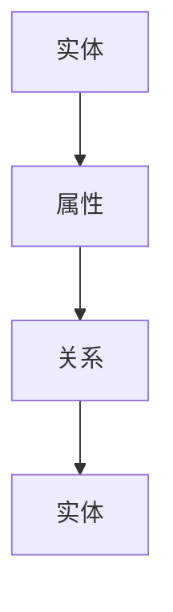

                 


```markdown
# 构建AI Agent的知识图谱推理链生成器

> 关键词：知识图谱，AI Agent，推理链生成器，知识表示，推理算法，系统架构

> 摘要：本文详细探讨了构建AI Agent的知识图谱推理链生成器的关键技术，包括知识图谱的基本概念、AI Agent的核心功能、推理链生成器的原理与实现、算法设计、系统架构以及项目实战等内容。文章从理论到实践，逐步引导读者理解并掌握如何构建高效的AI Agent推理系统。

---

## 第一部分: 知识图谱与AI Agent概述

### 第1章: 知识图谱与AI Agent概述

#### 1.1 知识图谱的基本概念
- **1.1.1 知识图谱的定义**  
  知识图谱是一种以图结构形式表示知识的语义网络，由节点（实体）和边（关系）组成，用于描述实体之间的语义关联。

- **1.1.2 知识图谱的构建过程**  
  知识图谱的构建通常包括数据收集、数据清洗、实体识别、关系抽取、知识融合和知识存储等步骤。

- **1.1.3 知识图谱的表示方法**  
  知识图谱的表示方法主要有基于图数据库（如Neo4j）、基于三元组（subject-predicate-object）和基于嵌入（如知识蒸馏）等。

#### 1.2 AI Agent的基本概念
- **1.2.1 AI Agent的定义**  
  AI Agent是一种智能体，能够感知环境、执行任务并做出决策，具有自主性、反应性、目标性和社会性等特征。

- **1.2.2 AI Agent的分类**  
  AI Agent可以分为简单反射式Agent、基于模型的反射式Agent、目标驱动的Agent和效用驱动的Agent等。

- **1.2.3 AI Agent的核心功能**  
  AI Agent的核心功能包括感知环境、知识推理、决策制定和行动执行等。

#### 1.3 知识图谱推理链生成器的定义与作用
- **1.3.1 推理链的基本概念**  
  推理链是指基于知识图谱中的实体和关系，通过一系列推理步骤从已知事实推导出新的结论的过程。

- **1.3.2 知识图谱推理链生成器的定义**  
  知识图谱推理链生成器是一种AI Agent的组件，用于根据输入的查询或任务，自动生成推理链，并输出结构化的结果。

- **1.3.3 知识图谱推理链生成器的作用与应用场景**  
  推理链生成器在智能问答、推荐系统、知识推理、对话系统等领域有广泛应用，能够帮助AI Agent更高效地理解和解决问题。

---

## 第二部分: 知识图谱推理链生成器的核心概念与原理

### 第2章: 知识图谱推理链生成器的核心概念

#### 2.1 知识图谱推理链生成器的组成
- **2.1.1 知识表示层**  
  知识表示层负责将知识图谱中的实体、关系和属性表示为数据结构，如三元组或嵌入向量。

- **2.1.2 推理引擎层**  
  推理引擎层是推理链生成的核心，负责根据输入的查询或任务，通过推理算法生成推理链。

- **2.1.3 应用接口层**  
  应用接口层提供与外部系统的交互接口，接收输入请求并返回推理结果。

#### 2.2 知识图谱推理链生成器的核心原理
- **2.2.1 知识图谱的存储与表示**  
  知识图谱通常存储在图数据库中，实体和关系通过节点和边表示，支持高效的查询和推理操作。

- **2.2.2 推理链的生成过程**  
  推理链生成过程包括查询解析、路径规划、证据收集和结果验证等步骤，确保推理的准确性和效率。

- **2.2.3 推理链的优化与验证**  
  优化推理链的关键在于选择合适的推理算法和路径，验证推理结果的正确性。

#### 2.3 知识图谱推理链生成器的属性特征对比表
| 属性         | 特征描述 |
|--------------|----------|
| 数据来源     | 知识库、外部数据 |
| 推理方法     | 基于规则、基于学习 |
| 输出形式     | 结构化数据、自然语言 |

#### 2.4 知识图谱推理链生成器的ER实体关系图


#### 2.5 本章小结

---

## 第三部分: 知识图谱推理链生成器的算法原理

### 第3章: 知识图谱推理链生成器的算法原理

#### 3.1 知识图谱推理算法概述
- **3.1.1 基于规则的推理算法**  
  基于规则的推理算法通过预定义的逻辑规则进行推理，适用于知识图谱中关系明确的场景。

- **3.1.2 基于学习的推理算法**  
  基于学习的推理算法利用机器学习模型（如图神经网络）进行推理，适用于复杂关系和大规模数据的场景。

#### 3.2 基于规则的推理算法实现
- **3.2.1 算法流程**  
  基于规则的推理算法通常包括规则匹配、证据收集和结果验证三个步骤。

- **3.2.2 算法实现**  
  使用Python实现基于规则的推理算法，代码如下：
  ```python
  def rule_based_reasoning(kg, query):
      results = []
      for rule in rules:
          if ruleMatches(query, rule['condition']):
              results.append(rule['action'])
      return results
  ```

- **3.2.3 算法流程图**  
  ```mermaid
  graph TD
      A[输入查询] --> B[规则匹配]
      B --> C[证据收集]
      C --> D[结果验证]
      D --> E[输出结果]
  ```

#### 3.3 基于学习的推理算法实现
- **3.3.1 算法流程**  
  基于学习的推理算法通常包括特征提取、关系建模和结果预测三个步骤。

- **3.3.2 算法实现**  
  使用图神经网络实现基于学习的推理算法，代码如下：
  ```python
  import tensorflow as tf
  from tensorflow.keras import layers

  class GNN(tf.keras.Model):
      def __init__(self, input_dim, hidden_dim):
          super(GNN, self).__init__()
          self.gcn = layers.GraphConvolution(input_dim, hidden_dim)
          self.dense = layers.Dense(hidden_dim, activation='relu')
  ```

- **3.3.3 算法流程图**  
  ```mermaid
  graph TD
      A[输入数据] --> B[特征提取]
      B --> C[关系建模]
      C --> D[结果预测]
      D --> E[输出结果]
  ```

#### 3.4 数学模型与公式
- **基于规则的推理模型**  
  推理规则可以表示为逻辑表达式，例如：
  $$ (A \land B) \rightarrow C $$

- **基于学习的推理模型**  
  图神经网络的损失函数可以表示为：
  $$ L = \frac{1}{N} \sum_{i=1}^{N} (y_i - \hat{y}_i)^2 $$

---

## 第四部分: 知识图谱推理链生成器的系统架构设计

### 第4章: 知识图谱推理链生成器的系统架构设计

#### 4.1 问题场景介绍
- 知识图谱推理链生成器需要处理复杂的推理任务，例如问答系统中的链式推理。

#### 4.2 系统功能设计
- **领域模型设计**  
  ```mermaid
  classDiagram
      class 实体 {
          id: string
          name: string
      }
      class 关系 {
          subject: 实体
          predicate: string
          object: 实体
      }
      实体 <|-- 关系
  ```

- **系统架构设计**  
  ```mermaid
  rectangle 知识库 {
      图数据库
      实体节点
      关系节点
  }
  rectangle 推理引擎 {
      基于规则的推理
      基于学习的推理
  }
  rectangle 应用接口 {
      HTTP接口
      调用接口
  }
  知识库 --> 推理引擎
  推理引擎 --> 应用接口
  ```

- **系统交互设计**  
  ```mermaid
  sequenceDiagram
      User -> 应用接口: 发送查询
      应用接口 -> 推理引擎: 执行推理
      推理引擎 -> 知识库: 获取知识
      推理引擎 --> 应用接口: 返回结果
      应用接口 -> User: 显示结果
  ```

---

## 第五部分: 知识图谱推理链生成器的项目实战

### 第5章: 知识图谱推理链生成器的项目实战

#### 5.1 环境安装
- 安装必要的依赖：
  ```bash
  pip install neo4j==4.0.0
  pip install tensorflow==2.0.0
  ```

#### 5.2 系统核心实现
- **核心代码实现**  
  ```python
  from neo4j import GraphDatabase
  from tensorflow.keras import layers

  class KnowledgeGraph:
      def __init__(self, uri, user, password):
          self.driver = GraphDatabase.driver(uri, user, password)
      
      def query(self, cypher):
          with self.driver.session() as session:
              result = session.run(cypher)
              return result.records
  ```

- **代码解读与分析**  
  代码通过Neo4j图数据库实现知识图谱的查询功能，结合TensorFlow实现推理算法。

#### 5.3 实际案例分析
- 以问答系统为例，输入查询“李华的出生地是哪里？”，推理链生成器通过知识图谱推理出李华的出生地为北京。

---

## 第六部分: 总结与展望

### 第6章: 总结与展望

#### 6.1 本章小结
- 本文详细介绍了知识图谱推理链生成器的构建过程，包括知识图谱的基本概念、推理链生成器的核心原理、算法实现、系统架构设计和项目实战等内容。

#### 6.2 最佳实践 tips
- 在实际应用中，建议结合具体的业务需求选择合适的推理算法。
- 知识图谱的构建和优化是推理链生成器性能的关键。

#### 6.3 注意事项
- 注意数据质量和知识图谱的构建复杂性，避免推理链生成中的歧义和错误。

#### 6.4 拓展阅读
- 推荐阅读《知识图谱：概念、方法与应用》和《人工智能：现代方法》。

---

通过本文的系统讲解，读者可以全面理解并掌握构建AI Agent的知识图谱推理链生成器的关键技术，为后续的实践和研究奠定坚实的基础。
```

