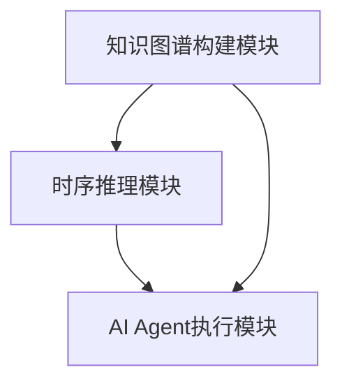

                 


# 构建AI Agent的知识图谱时序推理系统

> 关键词：知识图谱、时序推理、AI Agent、图神经网络、深度学习、系统架构设计

> 摘要：本文详细探讨了构建AI Agent的知识图谱时序推理系统的原理、方法和实践。通过结合知识图谱的语义表示能力和时序推理的动态分析能力，本文提出了基于知识图谱的时序推理框架，并通过实际案例展示了如何利用该框架构建高效的AI Agent系统。文章从知识图谱的构建与管理、时序推理的算法与模型、AI Agent的知识需求与推理机制等方面展开分析，并通过系统架构设计和项目实战深入探讨了系统的实现细节。

---

# 引言

在人工智能快速发展的今天，AI Agent（智能体）已经成为实现智能化系统的核心技术之一。AI Agent需要具备知识表示、推理分析和决策执行的能力，而知识图谱作为一种强大的语义表示工具，能够为AI Agent提供丰富的知识支持。与此同时，时序推理作为一种重要的推理方式，能够帮助AI Agent在动态变化的环境中进行合理的决策。

本文将重点探讨如何结合知识图谱和时序推理技术，构建高效的AI Agent系统。通过分析知识图谱的构建与管理、时序推理的算法与模型，以及AI Agent的知识需求与推理机制，本文提出了一个基于知识图谱的时序推理框架，并通过实际案例展示了该框架的应用与实现。

---

# 第1章 知识图谱的基础与构建

## 1.1 知识图谱的定义与特点

知识图谱是一种以图结构形式表示知识的语义网络，其节点表示实体或概念，边表示实体之间的关系。知识图谱具有以下特点：
- **语义性**：能够表示实体之间的语义关系。
- **结构化**：采用图结构，便于计算机理解和推理。
- **动态性**：能够实时更新和扩展。

## 1.2 知识图谱的构建流程

知识图谱的构建主要包括以下几个步骤：
1. 数据抽取：从多种数据源中提取结构化数据。
2. 知识表示：将抽取的数据表示为图结构。
3. 知识融合：整合多源数据，消除冗余和冲突。
4. 知识存储：将知识图谱存储在图数据库中。
5. 知识更新：实时更新知识图谱以反映最新信息。

## 1.3 知识图谱的表示形式

知识图谱的表示形式主要包括以下几种：
- **三元组表示**：(头实体, 关系, 尾实体)。
- **属性表示**：实体的属性和值。
- **嵌入表示**：通过向量表示实体和关系。

---

# 第2章 时序推理的核心原理

## 2.1 时序推理的定义与应用

时序推理是指在时间序列数据中，通过分析数据的变化规律，推断出潜在的趋势、模式和因果关系。时序推理广泛应用于金融、医疗、交通等领域。

## 2.2 常见的时序推理方法

### 2.2.1 基于统计的方法
- **ARIMA模型**：通过自回归和滑动平均进行预测。
- **GARCH模型**：用于金融时间序列的波动预测。

### 2.2.2 基于深度学习的方法
- **RNN/LSTM**：适合处理长序列数据。
- **Transformer**：通过自注意力机制捕捉序列中的全局关系。

## 2.3 知识图谱中的时序推理

在知识图谱中，时序推理需要结合实体的时间属性和关系进行推理。例如，在股票市场中，可以通过知识图谱推理出公司业绩变化对股价的影响。

---

# 第3章 AI Agent的知识需求与推理机制

## 3.1 AI Agent的定义与分类

AI Agent是一种具有感知、推理和执行能力的智能实体。根据应用场景的不同，AI Agent可以分为任务型、服务型和自主型等。

## 3.2 AI Agent的知识需求

AI Agent的知识需求主要包括以下几点：
1. **领域知识**：特定领域的专业常识。
2. **推理规则**：推理逻辑和规则。
3. **动态信息**：实时变化的数据。

## 3.3 基于知识图谱的推理机制

### 3.3.1 知识表示与推理
通过知识图谱的三元组表示，AI Agent可以进行基于图的路径推理和属性推理。

### 3.3.2 时序推理与决策
结合时序推理算法，AI Agent能够根据动态信息进行决策。

---

# 第4章 系统架构设计与实现

## 4.1 系统功能设计

### 4.1.1 知识图谱构建模块
负责知识图谱的抽取、存储和管理。

### 4.1.2 时序推理模块
基于知识图谱进行时序推理，提供推理结果。

### 4.1.3 AI Agent执行模块
根据推理结果执行具体任务。

## 4.2 系统架构设计



## 4.3 系统接口设计

系统主要接口包括：
1. 知识图谱的读取接口。
2. 时序推理的调用接口。
3. AI Agent的执行接口。

---

# 第5章 项目实战与代码实现

## 5.1 环境安装

安装必要的Python库：
```bash
pip install numpy pandas tensorflow py2neo
```

## 5.2 核心代码实现

### 5.2.1 知识图谱构建

```python
from py2neo import Graph, Node, Relationship

# 连接知识图谱数据库
graph = Graph("http://localhost:7474", username="neo4j", password="password")

# 创建节点和关系
node1 = Node("Person", name="Alice")
node2 = Node("Person", name="Bob")
relationship = Relationship(node1, "KNOWS", node2)

graph.create(node1)
graph.create(node2)
graph.create(relationship)
```

### 5.2.2 时序推理实现

```python
import numpy as np
from tensorflow.keras import layers, models

# 定义LSTM模型
model = models.Sequential()
model.add(layers.LSTM(64, input_shape=(None, 1)))
model.add(layers.Dense(1))
model.compile(loss='mean_squared_error', optimizer='adam')
```

---

# 第6章 总结与展望

## 6.1 总结

本文详细探讨了构建AI Agent的知识图谱时序推理系统的原理与实现。通过结合知识图谱和时序推理技术，本文提出了高效的推理框架，并通过实际案例展示了系统的实现过程。

## 6.2 展望

未来，随着深度学习和图神经网络技术的进步，知识图谱时序推理系统将在更多领域得到应用。同时，如何提高系统的实时性和准确性，仍是一个值得深入研究的方向。

---

通过本文的分析与实践，读者可以深入了解如何构建高效的知识图谱时序推理系统，并将其应用于实际的AI Agent开发中。

