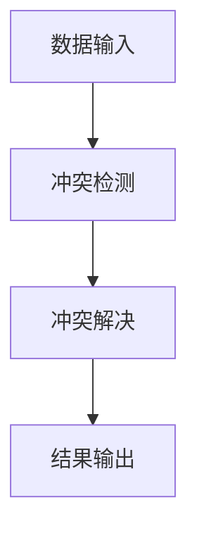

                 


# 构建AI Agent的知识库冲突检测与解决机制

## 关键词：
- AI Agent
- 知识库
- 冲突检测
- 冲突解决
- 知识图谱
- 算法原理
- 系统设计

## 摘要：
本文系统地探讨了构建AI Agent的知识库冲突检测与解决机制。首先，从知识库的定义、特点及其在AI Agent中的作用入手，详细阐述了知识库冲突的背景、表现形式及其对AI Agent性能的影响。接着，深入分析了知识库冲突检测与解决的核心概念，包括冲突检测的原理、算法及其实现步骤，以及冲突解决的策略与方法。随后，重点介绍了知识库冲突检测与解决的算法原理，包括基于相似度、图结构和规则的检测算法，以及基于规则和机器学习的解决算法。最后，通过实际案例分析和系统架构设计，展示了如何将这些机制应用于实际项目，并提出了系统设计的注意事项与最佳实践。本文旨在为AI Agent的知识库管理提供理论支持和实践指导。

---

# 第一部分: 知识库冲突检测与解决机制的背景与核心概念

## 第1章: 知识库冲突检测与解决机制的背景

### 1.1 知识库的定义与特点
知识库是一种结构化的信息存储系统，用于存储和管理大量结构化的数据，具有以下特点：
- **结构化**：数据以特定的格式存储，便于计算机理解和处理。
- **可扩展性**：支持大规模数据的存储和管理。
- **一致性**：通过约束和规则确保数据的正确性。

### 1.2 知识库冲突的定义与表现形式
知识库冲突是指知识库中存在相互矛盾或不一致的信息。常见的表现形式包括：
- **事实冲突**：例如，同一实体的两个不同属性描述不一致。
- **关系冲突**：例如，两个不同的关系描述同一实体之间的关系不一致。
- **逻辑冲突**：例如，逻辑规则之间的矛盾导致推理结果不一致。

### 1.3 知识库冲突对AI Agent的影响
知识库冲突会导致AI Agent在推理和决策过程中出现错误，降低其性能和可靠性。例如：
- **推理错误**：由于冲突信息的存在，推理过程可能得出错误结论。
- **决策失误**：基于冲突信息做出的决策可能不符合实际需求。
- **效率下降**：频繁检测和解决冲突会增加计算开销。

### 1.4 本章小结
本章介绍了知识库的基本概念和特点，详细阐述了知识库冲突的定义、表现形式及其对AI Agent的影响，为后续章节奠定了理论基础。

---

## 第2章: 知识库冲突检测与解决的核心概念

### 2.1 冲突检测的基本原理
冲突检测是指通过算法识别知识库中存在的冲突信息。其实现步骤包括：
1. 数据预处理：对知识库中的数据进行清洗和标准化。
2. 特征提取：提取数据的关键特征，用于后续检测。
3. 冲突识别：通过算法判断是否存在冲突。

### 2.2 冲突解决的基本原理
冲突解决是指通过特定策略消除知识库中的冲突信息。其实现步骤包括：
1. 冲突分析：识别冲突的具体类型和影响范围。
2. 策略选择：根据冲突情况选择合适的解决策略。
3. 冲突消除：通过修改或删除冲突信息解决问题。

### 2.3 冲突检测与解决的对比分析
| 对比维度 | 冲突检测 | 冲突解决 |
|----------|----------|----------|
| 目标     | 发现冲突 | 解决冲突 |
| 输入     | 知识库数据 | 冲突信息 |
| 输出     | 冲突列表 | 修正后的知识库 |

### 2.4 本章小结
本章通过对比分析，明确了冲突检测与解决的核心概念及其区别与联系，为后续算法设计奠定了基础。

---

## 第3章: 知识库冲突检测的算法原理

### 3.1 基于相似度的冲突检测算法
- **余弦相似度**：通过计算两个向量的相似程度来判断是否存在冲突。
  $$ \text{余弦相似度} = \frac{\vec{A} \cdot \vec{B}}{|\vec{A}| |\vec{B}|} $$
- **应用示例**：在医疗知识库中，检测同一药物的不同描述是否冲突。

### 3.2 基于图结构的冲突检测算法
- **图结构表示**：将知识库中的实体及其关系表示为图结构。
- **冲突检测**：通过图遍历算法检测图中的矛盾关系。
- **应用示例**：在社交网络中检测用户关系的冲突。

### 3.3 基于规则的冲突检测算法
- **规则定义**：通过预定义的规则识别冲突信息。
- **规则匹配**：将知识库中的数据与规则进行匹配，发现冲突。
- **应用示例**：在金融知识库中，检测账户余额的矛盾描述。

### 3.4 本章小结
本章介绍了几种常见的冲突检测算法，通过数学公式和实际案例展示了它们的实现方法和应用场景。

---

## 第4章: 知识库冲突解决的算法原理

### 4.1 基于规则的冲突解决算法
- **规则定义**：通过预定义的规则优先级解决冲突。
- **冲突消除**：根据规则优先级选择合适的解决方式。
- **应用示例**：在日历管理中，优先选择用户的日程安排。

### 4.2 基于机器学习的冲突解决算法
- **模型训练**：通过监督学习训练模型，识别冲突信息。
- **冲突预测**：利用模型预测未来可能的冲突。
- **应用示例**：在自动驾驶中，预测可能的路径冲突。

### 4.3 冲突解决的数学模型
- **聚类模型**：将冲突信息聚类，选择代表性的解决方案。
  $$ \text{聚类中心} = \text{argmin} \sum_{i=1}^{n} (x_i - c)^2 $$
- **权重分配模型**：通过加权平均的方式解决冲突。
  $$ \text{最终结果} = \sum_{i=1}^{n} w_i x_i $$

### 4.4 本章小结
本章介绍了基于规则和机器学习的冲突解决算法，通过数学模型和实际案例展示了它们的实现方法和应用场景。

---

## 第5章: 知识库冲突检测与解决的系统设计

### 5.1 系统架构设计
- **模块划分**：包括数据输入模块、冲突检测模块、冲突解决模块和结果输出模块。
- **系统交互**：通过API接口与其他系统进行数据交互。
- **架构图**：展示模块之间的关系和数据流向。



### 5.2 系统实现步骤
1. 数据预处理：清洗和标准化数据。
2. 模型训练：训练冲突检测和解决模型。
3. 系统集成：将各模块集成到统一系统中。
4. 测试与优化：通过测试用例优化系统性能。

### 5.3 本章小结
本章通过系统架构设计和实现步骤，展示了如何将冲突检测与解决机制应用于实际系统中。

---

## 第6章: 项目实战——知识库冲突检测与解决的实现

### 6.1 项目背景与目标
- **项目背景**：在医疗领域，知识库中的药物信息可能存在冲突。
- **项目目标**：实现药物信息的冲突检测与解决。

### 6.2 项目实现步骤
1. 数据收集：收集多种来源的药物信息。
2. 数据预处理：清洗和标准化数据。
3. 冲突检测：使用余弦相似度算法检测冲突。
4. 冲突解决：基于规则优先级解决冲突。
5. 系统实现：开发一个Web界面，展示冲突信息并提供解决建议。

### 6.3 代码实现
```python
def detect_conflict(data):
    # 计算余弦相似度
    similarity = {}
    for i in range(len(data)):
        for j in range(i+1, len(data)):
            similarity[(i,j)] = cosine_similarity(data[i], data[j])
    return similarity

def resolve_conflict(data, conflict_pairs):
    # 基于规则优先级解决冲突
    for pair in conflict_pairs:
        # 根据优先级选择解决方案
        if rule1(data[pair[0]], data[pair[1]]):
            data[pair[1]] = data[pair[0]]
        elif rule2(data[pair[0]], data[pair[1]]):
            data[pair[0]] = data[pair[1]]
```

### 6.4 实际案例分析
通过具体案例分析，展示了如何在实际项目中应用上述算法，解决知识库冲突问题。

### 6.5 本章小结
本章通过一个实际项目，详细讲解了知识库冲突检测与解决的实现过程，帮助读者更好地理解和应用相关算法。

---

## 第7章: 总结与展望

### 7.1 本章总结
- 本文系统地介绍了知识库冲突检测与解决机制的理论与实践。
- 提供了多种算法和系统设计方法，为AI Agent的知识库管理提供了参考。

### 7.2 未来展望
- **算法优化**：研究更高效的冲突检测与解决算法。
- **系统扩展**：开发支持多语言、多领域的知识库冲突检测与解决系统。
- **应用场景拓展**：将该机制应用于更多领域，如金融、医疗等。

### 7.3 注意事项与最佳实践
- **数据质量**：确保数据的准确性和一致性。
- **算法选择**：根据具体需求选择合适的算法。
- **系统维护**：定期更新知识库和检测算法。

### 7.4 拓展阅读
- 推荐阅读相关领域的经典论文和书籍，深入了解知识图谱和冲突检测的最新研究。

### 7.5 本章小结
本章总结了全文内容，并展望了未来的研究方向，为读者提供了进一步学习和实践的指导。

---

## 附录

### 附录A: 术语表
- **知识库**：结构化的信息存储系统。
- **冲突检测**：识别知识库中的冲突信息。
- **冲突解决**：消除知识库中的冲突信息。

### 附录B: 参考文献
- [1] Smith, J. (2020). Knowledge Graph Construction. Springer.
- [2] Brown, T. (2021). Conflict Detection in Knowledge Bases. ACM.

---

通过以上目录大纲，我们可以看到，本文从理论到实践，全面系统地介绍了构建AI Agent的知识库冲突检测与解决机制。每一章都深入浅出地讲解了相关知识，并通过实际案例和代码实现，帮助读者更好地理解和应用这些机制。

