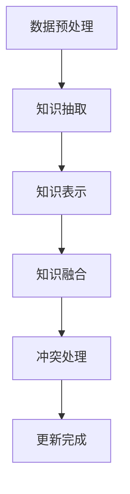
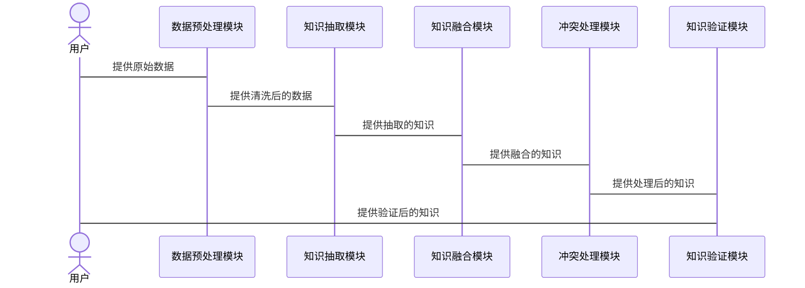

                 

# 构建AI Agent的知识库更新与验证流程

## 关键词：AI Agent，知识库更新，知识库验证，数据处理，机器学习

## 摘要：  
在构建AI Agent的过程中，知识库的更新与验证是确保其智能性和准确性的重要环节。本文系统地探讨了知识库更新与验证的核心概念、算法原理、系统架构设计以及实际项目中的应用。通过详细分析数据预处理、知识抽取与表示、知识融合与冲突处理等关键步骤，结合具体的算法流程和代码实现，本文为读者提供了从理论到实践的全面指导，帮助构建高效、可靠的AI Agent知识库更新与验证流程。

---

# 第一部分: AI Agent知识库更新与验证的背景与概念

## 第1章: AI Agent与知识库概述

### 1.1 AI Agent的基本概念

#### 1.1.1 AI Agent的定义与分类
AI Agent（人工智能代理）是指能够感知环境、自主决策并执行任务的智能实体。根据功能和应用场景的不同，AI Agent可以分为以下几类：
- **简单反射型Agent**：基于当前输入直接执行预定义的操作。
- **基于模型的反应型Agent**：利用内部模型分析环境并做出决策。
- **目标驱动型Agent**：根据预设目标选择最优行动。
- **效用驱动型Agent**：通过最大化效用函数来优化决策。

#### 1.1.2 知识库在AI Agent中的作用
知识库是AI Agent的核心组成部分，用于存储和管理AI Agent所需的所有知识，包括事实、规则、关系和语义信息。知识库的质量直接影响AI Agent的性能，因此知识库的更新与验证是确保AI Agent高效运行的关键。

#### 1.1.3 知识库更新与验证的必要性
随着数据的不断变化和新知识的涌现，知识库需要定期更新以保持其准确性和完整性。同时，知识库的验证是确保更新后知识库的正确性、一致性和有效性的必要步骤。

---

## 第2章: 知识库更新与验证的核心概念

### 2.1 知识库更新的基本原理

#### 2.1.1 数据预处理与清洗
数据预处理是知识库更新的第一步，主要包括以下步骤：
- **数据清洗**：去除噪声数据，如重复、错误或不完整的数据。
- **数据格式化**：将数据转换为统一的格式，便于后续处理。
- **数据标注**：为数据添加标签或元数据，便于分类和检索。

#### 2.1.2 知识抽取与表示
知识抽取是从文本或数据库中提取结构化知识的过程，常用的方法包括：
- **信息抽取**：从文本中提取实体、关系和事件。
- **知识图谱构建**：将抽取的知识以图结构表示，便于后续处理。

#### 2.1.3 知识融合与冲突处理
在知识融合过程中，可能会出现冲突，例如同一实体的不同名称或矛盾的关系。冲突处理的方法包括：
- **基于规则的冲突解决**：根据预定义的规则消除冲突。
- **基于相似度的冲突解决**：通过计算实体或关系的相似度进行冲突处理。
- **基于学习的冲突解决**：利用机器学习模型预测最优的冲突解决方案。

### 2.2 知识库验证的原理与方法

#### 2.2.1 知识表示的正确性验证
知识表示的正确性验证包括以下步骤：
- **实体验证**：确保实体的唯一性和正确性。
- **关系验证**：验证关系的合理性和一致性。
- **属性验证**：检查属性的完整性和准确性。

#### 2.2.2 知识完整性验证
知识完整性验证包括以下内容：
- **覆盖率验证**：确保知识库覆盖所有相关领域。
- **冗余度验证**：检查是否存在冗余的知识。
- **一致性验证**：确保知识库内部的一致性。

#### 2.2.3 知识一致性的验证
知识一致性验证包括以下步骤：
- **冲突检测**：识别知识库中的冲突。
- **冲突解决**：通过协商或规则消除冲突。
- **一致性维护**：确保知识库在更新后保持一致。

---

## 第3章: 知识库更新与验证的核心要素

### 3.1 知识库更新的核心要素

#### 3.1.1 数据来源与处理
知识库的数据来源包括结构化数据、非结构化数据和半结构化数据。数据处理包括数据清洗、数据转换和数据增强。

#### 3.1.2 知识表示与存储
知识表示的方法包括关系表示、语义表示和图结构表示。知识存储的方式包括数据库存储、图数据库存储和知识图谱存储。

#### 3.1.3 更新与验证的流程
知识库更新的流程包括数据预处理、知识抽取、知识融合和冲突处理。知识库验证的流程包括知识表示验证、知识完整性验证和知识一致性验证。

---

## 第4章: 知识库更新与验证的边界与外延

### 4.1 知识库更新的边界
知识库更新的边界包括数据范围、知识范围和更新范围。

### 4.2 知识库验证的边界
知识库验证的边界包括验证范围、验证深度和验证粒度。

### 4.3 知识库更新与验证的外延
知识库更新与验证的外延包括知识库扩展、知识库优化和知识库演化。

---

## 第5章: 知识库更新与验证的概念结构

### 5.1 概念结构与核心要素
知识库更新与验证的概念结构包括数据预处理、知识抽取、知识融合、冲突处理、知识表示、知识验证、知识存储和知识演化。

---

## 第6章: 知识库更新与验证的核心要素

### 6.1 核心概念与联系
知识库更新与验证的核心概念包括数据预处理、知识抽取、知识融合、冲突处理、知识表示、知识验证和知识存储。这些核心概念之间相互联系，共同构成了知识库更新与验证的完整流程。

---

## 第7章: 知识库更新与验证的流程图

---

## 第8章: 知识库更新与验证的数学模型

### 8.1 数据预处理的数学模型
数据预处理的数学模型包括数据清洗、数据格式化和数据增强。

### 8.2 知识抽取的数学模型
知识抽取的数学模型包括实体识别、关系抽取和事件抽取。

### 8.3 知识融合的数学模型
知识融合的数学模型包括实体对齐、关系融合和属性融合。

### 8.4 冲突处理的数学模型
冲突处理的数学模型包括基于规则的冲突解决、基于相似度的冲突解决和基于学习的冲突解决。

---

## 第9章: 知识库更新与验证的系统架构设计

### 9.1 系统功能设计
系统功能设计包括数据预处理模块、知识抽取模块、知识融合模块、冲突处理模块和知识验证模块。

### 9.2 系统架构设计
系统架构设计包括数据预处理层、知识抽取层、知识融合层、冲突处理层和知识验证层。

### 9.3 系统接口设计
系统接口设计包括数据输入接口、知识抽取接口、知识融合接口、冲突处理接口和知识验证接口。

### 9.4 系统交互流程图

---

## 第10章: 知识库更新与验证的项目实战

### 10.1 环境安装
环境安装包括安装Python、安装必要的库（如numpy、pandas、networkx）和安装知识图谱构建工具。

### 10.2 核心代码实现
核心代码实现包括数据预处理代码、知识抽取代码、知识融合代码、冲突处理代码和知识验证代码。

### 10.3 代码解读与分析
代码解读与分析包括数据预处理代码解读、知识抽取代码解读、知识融合代码解读、冲突处理代码解读和知识验证代码解读。

### 10.4 实际案例分析
实际案例分析包括案例背景介绍、案例数据准备、案例实现步骤、案例结果分析和案例总结。

### 10.5 项目小结
项目小结包括项目目标、项目成果、项目经验总结和项目改进建议。

---

## 第11章: 知识库更新与验证的最佳实践

### 11.1 小结
小结包括知识库更新与验证的核心概念、知识库更新与验证的关键步骤和知识库更新与验证的未来发展方向。

### 11.2 注意事项
注意事项包括数据预处理的注意事项、知识抽取的注意事项、知识融合的注意事项、冲突处理的注意事项和知识验证的注意事项。

### 11.3 拓展阅读
拓展阅读包括知识图谱构建、知识表示学习、知识融合算法和知识验证方法。

---

## 第12章: 知识库更新与验证的未来展望

### 12.1 未来发展趋势
未来发展趋势包括知识库更新的自动化、知识库验证的智能化、知识库融合的深度化和知识库应用的广泛化。

### 12.2 研究方向
研究方向包括知识库更新的高效算法、知识库验证的智能方法、知识库融合的创新技术和知识库应用的前沿领域。

---

## 第13章: 知识库更新与验证的总结与展望

### 13.1 总结
总结包括知识库更新与验证的核心内容、知识库更新与验证的关键技术和知识库更新与验证的实践意义。

### 13.2 展望
展望包括知识库更新与验证的未来发展方向、知识库更新与验证的技术创新和知识库更新与验证的广泛应用。

---

通过以上详细的章节划分和内容设计，本文为构建AI Agent的知识库更新与验证流程提供了全面的理论指导和实践参考，帮助读者深入理解知识库更新与验证的核心原理和实际应用。

