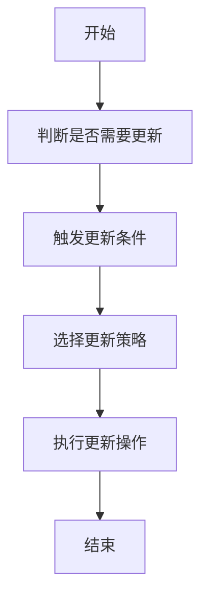
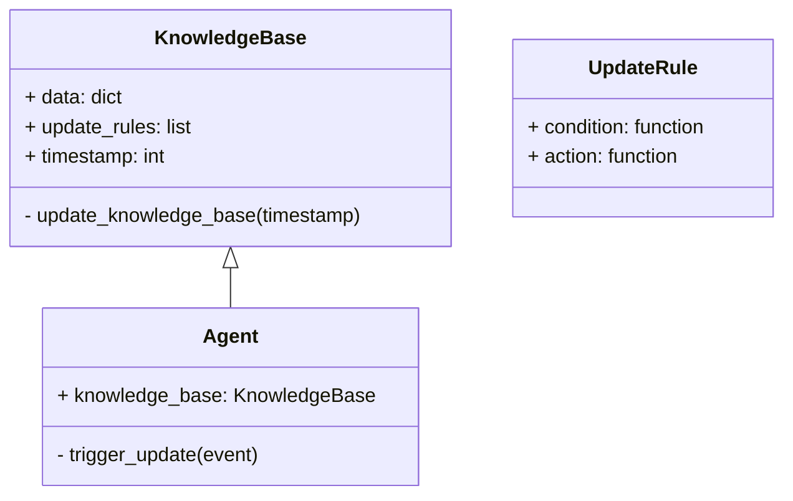
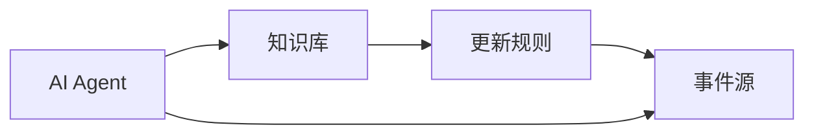
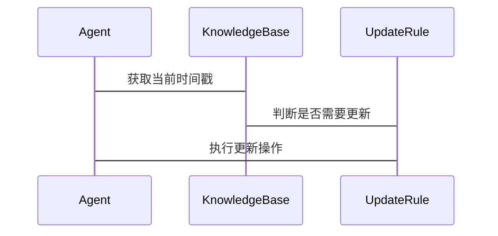

                 


# 构建AI Agent的知识更新机制：保持信息时效性

---

## 关键词：AI Agent、知识更新机制、信息时效性、机器学习、自然语言处理

---

## 摘要：

AI Agent（人工智能代理）作为人工智能技术的重要应用形式，其核心能力依赖于知识的准确性和时效性。然而，在动态变化的现实环境中，AI Agent的知识库可能会迅速过时，导致决策失误或服务失效。本文深入探讨AI Agent的知识更新机制，从理论到实践，系统性地分析如何保持知识的时效性。通过对比不同更新策略，结合实际应用场景，提出一种基于事件驱动的自适应知识更新方法，并通过具体实现案例展示其优势与适用性。本文将为AI Agent的设计与优化提供重要参考。

---

# 目录

---

## 第一部分: 背景介绍

### 第1章: 构建AI Agent的知识更新机制概述

#### 1.1 问题背景与描述
- 1.1.1 AI Agent的基本概念
  - AI Agent的定义与分类
  - 知识库在AI Agent中的核心地位
- 1.1.2 知识更新机制的重要性
  - 信息时效性对AI Agent决策的影响
  - 知识过时的典型案例分析
- 1.1.3 信息时效性问题的提出
  - 动态环境下的知识更新需求
  - 知识更新的挑战与机遇

#### 1.2 问题解决与边界
- 1.2.1 知识更新的必要性
  - 知识更新对AI Agent性能的提升作用
  - 知识更新与任务目标的关系
- 1.2.2 边界与外延
  - 知识更新的范围界定
  - 更新机制与其他系统模块的交互关系
- 1.2.3 核心要素与组成结构
  - 知识源、更新规则、触发条件的定义与作用

#### 1.3 核心概念对比
- 1.3.1 知识更新与信息更新的区别
  - 知识更新的深度与广度
  - 信息更新的范围与频率
- 1.3.2 不同知识更新机制的优缺点
  - 基于时间的更新机制
  - 基于事件的更新机制
  - 基于规则的更新机制
- 1.3.3 时效性评估指标对比
  - 更新频率、准确率、延迟时间的对比分析
  - 不同场景下的指标权重分配

---

## 第二部分: 核心概念与联系

### 第2章: 知识更新机制的原理与模型

#### 2.1 知识更新机制的原理
- 2.1.1 知识表示与存储
  - 知识图谱的构建与存储方式
  - 知识库的组织形式与可扩展性
- 2.1.2 知识更新的触发条件
  - 基于时间戳的触发机制
  - 基于事件驱动的触发机制
  - 综合规则的触发策略
- 2.1.3 更新策略的选择与优化
  - 全量更新与增量更新的适用场景
  - 基于权重的自适应更新策略
  - 知识重要性的评估与排序

#### 2.2 核心概念的属性特征对比
- 2.2.1 知识源的特征对比
  - 数据来源的可靠性与多样性
  - 数据格式的兼容性与转换成本
- 2.2.2 更新频率与延迟的权衡
  - 高频更新的计算成本与资源消耗
  - 低频更新的信息滞后风险
- 2.2.3 知识准确性的评估方法
  - 多源数据融合的准确性评估
  - 基于知识图谱的矛盾检测与修正

#### 2.3 ER实体关系图
```mermaid
er
  actor: 用户
  agent: AI Agent
  knowledge_base: 知识库
  update_rule: 更新规则
  relation: 用户 -> 更新规则 -> AI Agent -> 知识库
```

---

## 第三部分: 算法原理讲解

### 第3章: 知识更新算法的实现

#### 3.1 算法原理概述
- 3.1.1 基于时间戳的更新机制
  - 时间戳的定义与管理
  - 基于时间戳的更新触发逻辑
- 3.1.2 基于事件驱动的更新机制
  - 事件的定义与分类
  - 事件驱动的更新流程
- 3.1.3 基于权重的自适应更新机制
  - 知识权重的计算方法
  - 自适应更新策略的实现逻辑

#### 3.2 算法流程图


#### 3.3 Python实现示例
```python
def update_knowledge_base(timestamp, knowledge_base):
    if timestamp > last_update_time:
        apply_update_rule(
            knowledge_base=knowledge_base,
            timestamp=timestamp
        )
    return knowledge_base
```

#### 3.4 数学模型与公式
- 更新规则的选择概率：
$$ P(rule_i) = \frac{w_i}{\sum_{j=1}^n w_j} $$
其中，$w_i$ 表示第i个更新规则的权重，$\sum_{j=1}^n w_j$ 是权重总和。

---

## 第四部分: 系统分析与架构设计方案

### 第4章: 系统架构与设计

#### 4.1 问题场景介绍
- AI Agent的应用场景分析
  - 金融领域的实时数据分析
  - 医疗领域的诊断辅助系统
  - 智能客服的知识库维护
- 知识更新机制在不同场景中的需求差异

#### 4.2 系统功能设计
- 4.2.1 领域模型


- 4.2.2 系统架构设计


- 4.2.3 接口设计与交互流程


---

## 第五部分: 项目实战

### 第5章: 实践案例与实现

#### 5.1 环境安装与配置
- Python环境的搭建
- 依赖库的安装（如numpy、pandas、networkx）

#### 5.2 核心功能实现
- 知识更新规则的定义与实现
- 更新触发条件的代码实现
- 知识库的存储与管理

#### 5.3 代码实现与解读
```python
class KnowledgeBase:
    def __init__(self):
        self.data = {}
        self.update_rules = []
        self.timestamp = 0

    def update_knowledge_base(self, timestamp):
        if timestamp > self.timestamp:
            for rule in self.update_rules:
                if rule.condition(timestamp):
                    rule.action(self.data)
            self.timestamp = timestamp

class UpdateRule:
    def __init__(self, condition, action):
        self.condition = condition
        self.action = action

# 示例规则
def condition(timestamp):
    return timestamp % 10 == 0

def action(data):
    data['latest_update'] = timestamp

rule = UpdateRule(condition, action)
knowledge_base = KnowledgeBase()
knowledge_base.update_rules.append(rule)
knowledge_base.update_knowledge_base(10)
```

#### 5.4 实际案例分析
- 案例背景介绍
- 知识更新机制的具体应用
- 实验结果与效果评估

#### 5.5 小结
- 项目成果总结
- 实践中的经验与教训
- 可优化的空间与方向

---

## 第六部分: 总结与展望

### 第6章: 总结与展望

#### 6.1 小结
- 本文的主要内容回顾
- 知识更新机制的核心要点总结

#### 6.2 注意事项
- 实际应用中需要注意的问题
- 知识更新机制的局限性与改进方向

#### 6.3 拓展阅读
- 相关领域的研究进展
- 未来的研究方向与应用场景

---

通过以上目录结构，我们可以系统性地构建AI Agent的知识更新机制，从理论到实践，全面探讨保持信息时效性的方法与实现。

