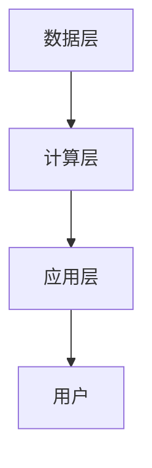

                 


# 《构建AI Agent的知识获取pipeline：从非结构化数据中学习》

## 关键词：AI Agent，知识获取，非结构化数据，机器学习，自然语言处理

## 摘要：本文详细探讨了构建AI Agent的知识获取pipeline，重点从非结构化数据中学习的核心原理、算法实现和系统设计。文章从背景与基础出发，系统地分析了知识获取pipeline的结构与流程，深入讲解了关键算法的数学模型与实现，最后通过项目实战和高级主题扩展，为读者提供了全面的知识体系和实践指南。

---

## 第一部分: 背景与基础

### 第1章: AI Agent与知识获取概述

#### 1.1 AI Agent的基本概念

AI Agent（智能体）是指能够感知环境、自主决策并执行任务的智能系统。AI Agent可以分为简单反射型、基于模型的反应型、目标驱动型和效用驱动型等类型。在现代应用场景中，AI Agent广泛应用于自动驾驶、智能客服、推荐系统等领域。

知识获取是AI Agent的核心能力之一，指的是从数据中提取、表示和应用知识的能力。知识获取的目的是帮助AI Agent理解和推理复杂的现实世界问题。

**问题背景：**  
在实际应用中，AI Agent需要处理大量的非结构化数据，如文本、图像和语音等。这些数据通常缺乏明确的结构，难以直接用于机器学习模型。因此，如何有效地从非结构化数据中提取有用的知识成为构建AI Agent的关键挑战。

#### 1.2 非结构化数据的特点与挑战

非结构化数据指的是没有固定模式和组织形式的数据，例如文本、图像、语音等。这些数据的特点包括多样性、复杂性和模糊性，处理起来具有较高的难度。

**非结构化数据的处理难点：**  
1. **数据多样性：** 文本、图像等数据类型差异大，难以统一处理。  
2. **语义理解：** 非结构化数据中包含丰富的语义信息，但提取这些信息需要复杂的自然语言处理和计算机视觉技术。  
3. **数据稀疏性：** 非结构化数据可能缺乏明确的标签或结构，导致难以训练有效的模型。  

**知识获取pipeline的目标：**  
通过设计合理的处理流程，将非结构化数据转化为结构化的知识表示，提升AI Agent的决策能力和智能水平。

---

## 第二部分: 知识获取pipeline的核心原理

### 第2章: 知识获取pipeline的结构与流程

知识获取pipeline是一个系统化的处理流程，通常包括数据预处理、特征提取、模型训练和知识表示等阶段。以下是各阶段的具体内容和实现方法。

#### 2.1 数据预处理阶段

数据预处理是知识获取pipeline的第一步，旨在将原始的非结构化数据转化为适合模型处理的形式。

**任务目标：**  
1. 清洗数据，去除噪声。  
2. 标准化数据格式，确保一致性。  
3. 提取初步的特征信息。  

**具体步骤：**  
1. **数据清洗：** 去除重复、错误或无关的信息。  
2. **分词处理：** 对文本数据进行分词，提取关键词或短语。  
3. **数据标注：** 对部分数据进行人工标注，用于模型训练。  

**代码示例：**  
以下是文本数据的分词处理代码（基于Python和jieba库）：  
```python
import jieba

text = "今天天气很好，适合出去玩。"
words = jieba.lcut(text)
print(words)  # 输出：['今天', '天气', '很', '好', '，', '适合', '出去', '玩。']
```

#### 2.2 特征提取阶段

特征提取是从数据中提取具有代表性的特征，以便后续模型能够有效地学习和表示知识。

**常用方法：**  
1. **文本表示：** 使用词袋模型、TF-IDF或词嵌入（如Word2Vec、GloVe）等方法将文本转化为向量表示。  
2. **图像处理：** 对图像进行特征提取，如使用CNN提取图像的深层特征。  

**数学模型：**  
以Word2Vec为例，其目标是通过上下文信息来学习词向量。其损失函数可以表示为：  
$$
\text{Loss} = -\sum_{i=1}^{n}\log p(w_i)
$$  
其中，\( p(w_i) \) 是词 \( w_i \) 的概率。

#### 2.3 模型训练与优化阶段

模型训练是知识获取pipeline的核心环节，通过监督学习、无监督学习或弱监督学习等方法，训练模型从非结构化数据中提取知识。

**常用算法：**  
1. **监督学习：** 使用标注数据训练分类器或回归器。  
2. **无监督学习：** 对未标注数据进行聚类或主题建模（如LDA）。  
3. **深度学习：** 使用神经网络模型（如BERT、GPT）进行语义理解。  

**案例分析：**  
以BERT模型为例，其在文本表示任务中表现出色。BERT通过预训练和微调策略，能够有效地捕捉上下文信息。

---

## 第三部分: 算法原理与数学模型

### 第3章: 文本表示方法

文本表示是知识获取的关键步骤之一，常用的文本表示方法包括词袋模型、TF-IDF和词嵌入。

#### 3.1 词袋模型

词袋模型是一种简单有效的文本表示方法，它将文本视为由词组成的无序集合。

**优缺点：**  
- 优点：简单易实现，能够处理词的组合。  
- 缺点：忽略了词序和语义信息。  

**数学表示：**  
词袋模型可以用向量表示，其中每个维度对应一个词，值为该词在文本中的出现次数。  
$$
v_i = \{1 \text{ 如果词 } i \text{ 出现在文本中，否则 } 0\}
$$

#### 3.2 TF-IDF

TF-IDF（Term Frequency-Inverse Document Frequency）是一种常用的文本权重计算方法。

**计算公式：**  
$$
\text{TF}(t, d) = \frac{\text{词 } t \text{ 在文档 } d \text{ 中的出现次数}}{\text{文档 } d \text{ 的总词数}}
$$  
$$
\text{IDF}(t) = \log\left( \frac{N}{\text{包含词 } t \text{ 的文档数}} \right)
$$  
其中，\( N \) 是文档总数。

**代码示例：**  
以下是TF-IDF的Python实现（基于scikit-learn库）：  
```python
from sklearn.feature_extraction.text import TfidfVectorizer

texts = ["This is an example.", "Another example here."]
vectorizer = TfidfVectorizer()
tfidf_matrix = vectorizer.fit_transform(texts)
print(tfidf_matrix)
```

---

## 第四部分: 系统设计与架构

### 第4章: 系统功能设计

知识获取系统的功能设计需要覆盖数据处理、模型训练和知识应用三个主要方面。

#### 4.1 功能模块划分

1. **数据预处理模块：** 负责数据清洗、分词和标注。  
2. **特征提取模块：** 对数据进行特征提取，生成向量表示。  
3. **模型训练模块：** 使用训练数据训练知识获取模型。  
4. **知识应用模块：** 将模型应用于实际场景，提取有用的知识。  

#### 4.2 系统架构设计

系统架构采用分层设计，包括数据层、计算层和应用层。

**数据层：** 存储原始数据和预处理数据。  
**计算层：** 包含特征提取和模型训练模块。  
**应用层：** 提供API接口，供上层应用调用。  

**架构图：**  


---

## 第五部分: 项目实战

### 第5章: 环境配置与核心代码实现

#### 5.1 环境配置

安装必要的依赖库，如Python的scikit-learn、TensorFlow和jieba等。

#### 5.2 核心代码实现

以下是一个简单的知识获取pipeline的代码示例：

```python
import jieba
from sklearn.feature_extraction.text import TfidfVectorizer
from sklearn.model_selection import train_test_split
from sklearn.linear_model import LogisticRegression

# 数据预处理
texts = ["今天天气很好", "明天可能下雨"]
labels = [1, 0]

# 分词处理
corpus = [' '.join(jieba.lcut(text)) for text in texts]

# 特征提取
vectorizer = TfidfVectorizer()
X = vectorizer.fit_transform(corpus)

# 模型训练
X_train, X_test, y_train, y_test = train_test_split(X, labels, test_size=0.2)
model = LogisticRegression()
model.fit(X_train, y_train)

# 模型预测
print(model.predict(X_test))  # 输出预测结果
```

---

## 第六部分: 总结与展望

### 第6章: 总结与展望

#### 6.1 本章总结

本文详细探讨了构建AI Agent的知识获取pipeline，从非结构化数据中学习的核心原理、算法实现和系统设计。通过理论分析和实践案例，为读者提供了全面的知识体系。

#### 6.2 未来展望

未来，随着AI技术的不断发展，知识获取pipeline将更加智能化和自动化。多模态数据处理、实时知识更新和模型可解释性将是研究的重要方向。

---

通过以上目录大纲和内容的详细展开，相信读者能够全面理解和掌握构建AI Agent的知识获取pipeline的核心技术和实践方法。

