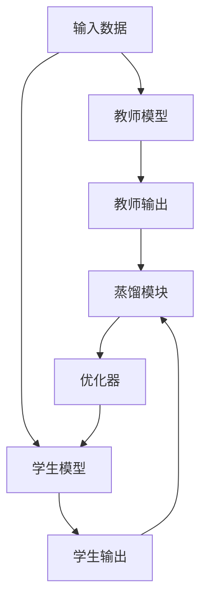
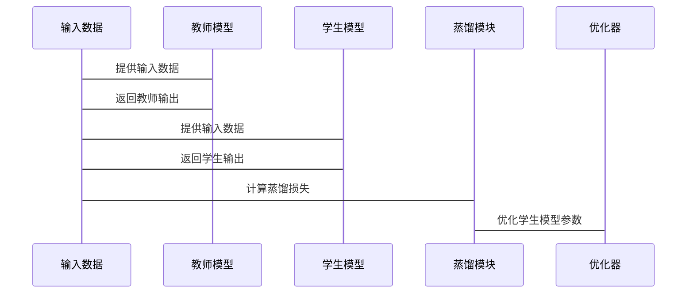

                 


# 构建AI Agent的知识蒸馏Pipeline

> 关键词：知识蒸馏，AI Agent，机器学习，深度学习，模型压缩，迁移学习

> 摘要：知识蒸馏是一种有效的模型压缩技术，通过将大型模型的知识迁移到小型模型中，从而在保持性能的同时减少计算开销。本文详细探讨了知识蒸馏在AI Agent构建中的应用，分析了其核心原理、算法流程、系统架构，并通过实战案例展示了如何实现高效的蒸馏Pipeline。文章还总结了最佳实践和未来发展方向。

---

# 第一部分: 知识蒸馏与AI Agent概述

## 第1章: 知识蒸馏的背景与概念

### 1.1 知识蒸馏的定义与背景
知识蒸馏是一种模型压缩技术，旨在通过将大型模型的知识迁移到小型模型中，从而在保持性能的同时减少计算开销。其核心思想是利用教师模型（通常是预训练的大模型）生成的中间表示或概率分布，指导学生模型进行学习。

#### 1.1.1 知识蒸馏的基本概念
- **教师模型**：通常是一个复杂的大型模型，经过大量数据训练，具有丰富的知识表示能力。
- **学生模型**：一个较小的模型，通过蒸馏过程学习教师模型的知识。
- **蒸馏过程**：通过最小化学生模型输出与教师模型输出之间的差异，使学生模型获得教师模型的决策能力。

#### 1.1.2 知识蒸馏的背景与意义
随着深度学习模型的规模越来越大，计算资源和推理成本也在不断增加。知识蒸馏作为一种有效的模型压缩技术，能够显著降低模型的计算复杂度，同时保持或甚至提升模型性能。这使得知识蒸馏在资源受限的场景下尤为重要，例如移动设备和边缘计算。

#### 1.1.3 知识蒸馏的核心目标与价值
- **目标**：将教师模型的知识迁移到学生模型，使学生模型在性能上接近教师模型，同时降低模型复杂度。
- **价值**：提升模型的部署效率，降低计算成本，适用于资源受限的环境。

### 1.2 AI Agent的基本概念与分类
AI Agent（智能体）是一种能够感知环境、做出决策并执行动作的智能系统。它可以自主或在人类指导下完成特定任务。

#### 1.2.1 AI Agent的定义
AI Agent是一个能够通过与环境交互来实现目标的实体。它可以是软件程序、机器人或其他智能系统。

#### 1.2.2 AI Agent的主要分类
AI Agent可以根据智能水平、应用领域和行为模式进行分类：

- **按智能水平**：
  - **反应式AI Agent**：根据当前感知做出实时反应。
  - **认知式AI Agent**：具有推理、规划和决策能力。
- **按应用领域**：
  - **软件AI Agent**：例如推荐系统、聊天机器人。
  - **物理AI Agent**：例如自动驾驶汽车、工业机器人。
- **按行为模式**：
  - **任务驱动型**：为完成特定任务而设计。
  - **服务驱动型**：提供持续的服务。

#### 1.2.3 AI Agent的应用场景与挑战
- **应用场景**：
  - 智能客服：提供个性化的客户支持。
  - 自动驾驶：实时感知和决策。
  - 智能助手：帮助用户完成日常任务。
- **挑战**：
  - 复杂环境中的决策优化。
  - 多目标下的平衡与协调。
  - 动态环境中的适应性问题。

### 1.3 知识蒸馏与AI Agent的结合
知识蒸馏与AI Agent的结合能够显著提升AI Agent的性能，同时降低计算开销。

#### 1.3.1 知识蒸馏在AI Agent中的作用
- **知识传递**：通过蒸馏，将教师模型的知识传递给学生模型，提升学生模型的决策能力。
- **模型压缩**：蒸馏后的学生模型通常更小，适合在资源受限的环境中运行。

#### 1.3.2 知识蒸馏如何提升AI Agent的性能
- **性能提升**：通过蒸馏，学生模型能够在保持较小规模的同时，达到与教师模型相当的性能水平。
- **推理效率提升**：蒸馏后的模型推理速度更快，适合实时任务。

#### 1.3.3 知识蒸馏与AI Agent的未来发展
随着AI Agent的应用场景越来越广泛，知识蒸馏在其中的作用将更加重要。未来的研究方向可能包括：
- 更高效的蒸馏算法。
- 更适合AI Agent的蒸馏策略。
- 蒸馏在多智能体系统中的应用。

### 1.4 本章小结
本章介绍了知识蒸馏的基本概念和AI Agent的核心概念，分析了它们的结合方式及其在提升AI Agent性能和效率中的作用。通过本章的阅读，读者可以理解知识蒸馏在AI Agent构建中的重要性。

---

## 第2章: 知识蒸馏的核心概念与原理

### 2.1 知识蒸馏的基本原理
知识蒸馏通过教师模型和学生模型之间的信息传递，将教师模型的知识迁移到学生模型。

#### 2.1.1 知识蒸馏的过程
- **教师模型输出**：教师模型对输入数据进行处理，生成中间表示或概率分布。
- **学生模型学习**：学生模型通过最小化其输出与教师模型输出之间的差异，学习教师模型的知识。
- **蒸馏损失计算**：基于教师模型和学生模型输出的差异，计算蒸馏损失，并将其加入到学生模型的总损失中。

#### 2.1.2 知识蒸馏的核心要素
- **教师模型**：知识的来源。
- **学生模型**：知识的接收者。
- **蒸馏损失函数**：衡量学生模型与教师模型之间差异的函数。

#### 2.1.3 知识蒸馏的数学模型
蒸馏损失函数通常基于KL散度（Kullback-Leibler divergence）：

$$ \text{KL}(P || Q) = \sum P \log \frac{P}{Q} $$

其中，\( P \) 是教师模型的输出概率分布，\( Q \) 是学生模型的输出概率分布。

### 2.2 知识蒸馏的主要方式
知识蒸馏可以通过不同的方式实现，主要包括软蒸馏、硬蒸馏和混合蒸馏。

#### 2.2.1 软蒸馏
软蒸馏通过最小化学生模型输出与教师模型输出之间的KL散度实现。

$$ L_{\text{distill}} = \lambda \text{KL}(P || Q) $$

其中，\( \lambda \) 是蒸馏系数，控制蒸馏损失在总损失中的权重。

#### 2.2.2 硬蒸馏
硬蒸馏通过最小化学生模型预测与教师模型预测的标签概率实现。

$$ L_{\text{distill}} = \lambda \sum (y_i - \hat{y}_i)^2 $$

其中，\( y_i \) 是教师模型的预测概率，\( \hat{y}_i \) 是学生模型的预测概率。

#### 2.2.3 混合蒸馏
混合蒸馏结合了软蒸馏和硬蒸馏的优点，同时最小化两种损失。

$$ L_{\text{total}} = L_{\text{task}} + \lambda_1 L_{\text{distill\_soft}} + \lambda_2 L_{\text{distill\_hard}} $$

### 2.3 知识蒸馏的损失函数
不同的蒸馏方式对应不同的损失函数，选择合适的损失函数是蒸馏成功的关键。

#### 2.3.1 蒸馏损失函数的定义
- 软蒸馏：基于KL散度的损失函数。
- 硬蒸馏：基于均方误差的损失函数。

#### 2.3.2 蒸馏损失函数的计算公式
- 软蒸馏：
$$ L_{\text{distill\_soft}} = \text{KL}(P || Q) $$
- 硬蒸馏：
$$ L_{\text{distill\_hard}} = \sum (y_i - \hat{y}_i)^2 $$

#### 2.3.3 不同蒸馏方式下的损失函数对比
| 蒸馏方式 | 损失函数                     |
|----------|------------------------------|
| 软蒸馏   | KL(P || Q)                   |
| 硬蒸馏   | ∑(y_i - \hat{y}_i)^2         |
| 混合蒸馏 | KL(P || Q) + ∑(y_i - \hat{y}_i)^2 |

### 2.4 知识蒸馏的优缺点
- **优点**：
  - 降低模型复杂度。
  - 提高推理效率。
  - 适用于资源受限的场景。
- **缺点**：
  - 蒸馏过程需要教师模型的参与。
  - 学生模型的性能可能受教师模型的限制。

#### 2.4.1 知识蒸馏的优点
知识蒸馏能够显著降低模型复杂度，同时保持性能，特别适合在资源受限的环境中部署AI Agent。

#### 2.4.2 知识蒸馏的缺点
蒸馏过程需要教师模型的参与，且学生模型的性能可能受教师模型的限制。

#### 2.4.3 知识蒸馏的适用场景
- 小型模型的训练。
- 资源受限环境下的部署。
- 实时任务中的应用。

### 2.5 本章小结
本章详细讲解了知识蒸馏的核心概念和原理，分析了不同蒸馏方式及其损失函数，探讨了知识蒸馏的优缺点及适用场景。通过本章的阅读，读者可以理解知识蒸馏的基本原理及其在AI Agent中的应用。

---

## 第3章: 知识蒸馏算法的流程与实现

### 3.1 知识蒸馏算法的流程
知识蒸馏算法通常包括以下几个步骤：

#### 3.1.1 教师模型的构建与训练
- **教师模型的选择**：选择一个性能优异且参数较多的大型模型作为教师模型。
- **教师模型的训练**：在大规模数据集上训练教师模型，使其具备丰富的知识表示能力。

#### 3.1.2 学生模型的构建与训练
- **学生模型的选择**：选择一个参数较少的小型模型作为学生模型。
- **学生模型的训练**：在训练过程中，同时最小化任务损失和蒸馏损失。

#### 3.1.3 蒸馏过程的详细步骤
- **输入数据**：将输入数据同时传递给教师模型和学生模型。
- **教师输出**：教师模型生成概率分布或中间表示。
- **学生输出**：学生模型生成概率分布。
- **蒸馏损失计算**：计算学生模型输出与教师模型输出之间的差异。
- **总损失计算**：将任务损失和蒸馏损失结合起来，得到总损失。
- **反向传播与优化**：通过反向传播优化学生模型的参数。

### 3.2 知识蒸馏的核心算法
知识蒸馏的核心算法包括软蒸馏、硬蒸馏和混合蒸馏。

#### 3.2.1 软蒸馏算法
软蒸馏通过最小化学生模型输出与教师模型输出之间的KL散度实现。

$$ L_{\text{total}} = L_{\text{task}} + \lambda \text{KL}(P || Q) $$

#### 3.2.2 硬蒸馏算法
硬蒸馏通过最小化学生模型输出与教师模型输出之间的标签概率实现。

$$ L_{\text{total}} = L_{\text{task}} + \lambda \sum (y_i - \hat{y}_i)^2 $$

#### 3.2.3 混合蒸馏算法
混合蒸馏结合了软蒸馏和硬蒸馏的优点，同时最小化两种损失。

$$ L_{\text{total}} = L_{\text{task}} + \lambda_1 \text{KL}(P || Q) + \lambda_2 \sum (y_i - \hat{y}_i)^2 $$

### 3.3 知识蒸馏的数学模型
知识蒸馏的数学模型通常基于KL散度或均方误差。

#### 3.3.1 蒸馏损失函数的数学表达式
- 软蒸馏：
$$ L_{\text{distill\_soft}} = \text{KL}(P || Q) $$
- 硬蒸馏：
$$ L_{\text{distill\_hard}} = \sum (y_i - \hat{y}_i)^2 $$

#### 3.3.2 总体损失函数的计算公式
- 软蒸馏：
$$ L_{\text{total}} = L_{\text{task}} + \lambda \text{KL}(P || Q) $$
- 硬蒸馏：
$$ L_{\text{total}} = L_{\text{task}} + \lambda \sum (y_i - \hat{y}_i)^2 $$

### 3.4 本章小结
本章详细讲解了知识蒸馏算法的流程与实现，分析了不同蒸馏方式的数学模型和计算公式。通过本章的阅读，读者可以理解如何在实际中实现知识蒸馏算法。

---

## 第4章: 系统分析与架构设计

### 4.1 系统分析
知识蒸馏Pipeline的构建需要考虑以下几个方面：

#### 4.1.1 系统目标
- 提供高效的蒸馏服务。
- 支持多种蒸馏方式。
- 适用于不同的AI Agent场景。

#### 4.1.2 功能需求
- 教师模型的加载与训练。
- 学生模型的训练与优化。
- 蒸馏过程的监控与调整。

#### 4.1.3 系统边界与外延
- 教师模型：知识的来源。
- 学生模型：知识的接收者。
- 蒸馏服务：提供蒸馏过程的管理与优化。

### 4.2 系统架构设计
知识蒸馏Pipeline的系统架构包括以下几个模块：

#### 4.2.1 模块划分
- 教师模型模块：负责生成教师模型的输出。
- 学生模型模块：负责生成学生模型的输出。
- 蒸馏模块：负责计算蒸馏损失并优化学生模型。

#### 4.2.2 系统架构图


#### 4.2.3 接口设计
- 教师模型接口：提供教师模型的输出接口。
- 学生模型接口：提供学生模型的输出接口。
- 蒸馏模块接口：提供蒸馏损失的计算接口。

#### 4.2.4 交互序列图


### 4.3 本章小结
本章从系统角度分析了知识蒸馏Pipeline的构建，提出了系统的模块划分和架构设计。通过本章的阅读，读者可以理解如何从系统层面设计和实现知识蒸馏Pipeline。

---

## 第5章: 项目实战

### 5.1 环境安装
- **Python版本**：3.6及以上。
- **依赖库安装**：使用pip安装以下库：
  - `torch`
  - `numpy`
  - `mermaid`
  - `matplotlib`

### 5.2 系统核心实现源代码
以下是一个简单的知识蒸馏算法的Python实现示例：

#### 5.2.1 教师模型的定义
```python
import torch
import torch.nn as nn

class TeacherModel(nn.Module):
    def __init__(self, input_size, output_size):
        super(TeacherModel, self).__init__()
        self.fc1 = nn.Linear(input_size, 128)
        self.fc2 = nn.Linear(128, output_size)
    
    def forward(self, x):
        x = torch.relu(self.fc1(x))
        x = torch.log_softmax(self.fc2(x), dim=1)
        return x
```

#### 5.2.2 学生模型的定义
```python
class StudentModel(nn.Module):
    def __init__(self, input_size, output_size):
        super(StudentModel, self).__init__()
        self.fc1 = nn.Linear(input_size, 64)
        self.fc2 = nn.Linear(64, output_size)
    
    def forward(self, x):
        x = torch.relu(self.fc1(x))
        x = torch.log_softmax(self.fc2(x), dim=1)
        return x
```

#### 5.2.3 蒸馏算法的实现
```python
def distillation_loss(teacher_output, student_output, temperature=1.0):
    teacher_output = teacher_output / temperature
    student_output = student_output / temperature
    return nn.KLDivLoss()(student_output, teacher_output).mean() * temperature**2

def train_step(student_model, teacher_model, optimizer, criterion, x, y):
    optimizer.zero_grad()
    student_output = student_model(x)
    with torch.no_grad():
        teacher_output = teacher_model(x)
    loss_task = criterion(student_output, y)
    loss_distill = distillation_loss(teacher_output, student_output)
    total_loss = loss_task + 0.5 * loss_distill
    total_loss.backward()
    optimizer.step()
    return total_loss.item()
```

### 5.3 代码解读与分析
- **教师模型**：定义了一个简单的前馈神经网络，输出经过了Softmax处理。
- **学生模型**：定义了一个更小的前馈神经网络，输出同样经过了Softmax处理。
- **蒸馏损失函数**：基于KL散度，通过调整温度参数来控制蒸馏的强度。
- **训练步骤**：在每次训练中，同时最小化任务损失和蒸馏损失。

### 5.4 实际案例分析
假设我们有一个分类任务，输入维度为10，输出类别数为10。

#### 5.4.1 环境准备
- 安装所需的Python库。
- 准备训练数据和测试数据。

#### 5.4.2 模型训练
```python
import torch.optim as optim

teacher = TeacherModel(10, 10)
student = StudentModel(10, 10)
optimizer = optim.Adam(student.parameters(), lr=0.001)
criterion = nn.NLLLoss()

for epoch in range(100):
    for batch in data_loader:
        x, y = batch
        loss = train_step(student, teacher, optimizer, criterion, x, y)
        print(f'Epoch: {epoch}, Loss: {loss}')
```

#### 5.4.3 模型评估
```python
student.eval()
with torch.no_grad():
    correct = 0
    total = 0
    for x, y in test_loader:
        outputs = student(x)
        _, predicted = torch.max(outputs.data, 1)
        total += y.size(0)
        correct += (predicted == y).sum().item()
    accuracy = correct / total
    print(f'Accuracy: {accuracy}')
```

### 5.5 本章小结
本章通过一个实际案例，展示了如何在Python中实现知识蒸馏算法。通过本章的阅读，读者可以理解如何将理论应用于实践。

---

## 第6章: 最佳实践与小结

### 6.1 最佳实践
- **选择合适的蒸馏方式**：根据具体任务选择软蒸馏、硬蒸馏或混合蒸馏。
- **调整温度参数**：通过调整温度参数控制蒸馏的强度。
- **结合数据增强**：在蒸馏过程中结合数据增强技术，提升学生模型的泛化能力。
- **监控蒸馏过程**：通过监控蒸馏过程中的损失变化，调整蒸馏策略。

### 6.2 小结
知识蒸馏是一种有效的模型压缩技术，能够显著降低模型复杂度，同时保持性能。本文详细探讨了知识蒸馏的核心概念、算法原理、系统架构，并通过实际案例展示了如何实现高效的蒸馏Pipeline。

### 6.3 注意事项
- 蒸馏过程需要教师模型的参与，可能需要额外的计算资源。
- 学生模型的性能可能受教师模型的限制，需根据具体任务进行调整。

### 6.4 拓展阅读
- 《Distilling the Knowledge in Neural Networks》
- 《Knowledge Distillation: A Survey and New Directions》
- 《Model Compression: A Comprehensive Survey and Future Directions》

### 6.5 本章小结
本章总结了知识蒸馏的最佳实践，提出了注意事项，并推荐了拓展阅读材料。通过本章的阅读，读者可以进一步深入理解和应用知识蒸馏技术。

---

# 结语
知识蒸馏作为一种重要的模型压缩技术，在AI Agent的构建中发挥着越来越重要的作用。通过本文的详细讲解，读者可以全面理解知识蒸馏的核心原理、算法实现和系统架构，并通过实际案例掌握如何在实际中应用这些知识。未来，随着AI Agent的应用场景越来越广泛，知识蒸馏将在其中发挥更大的作用。

