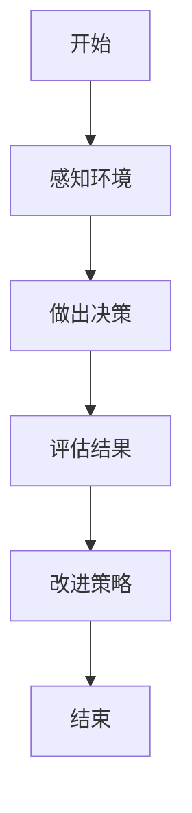
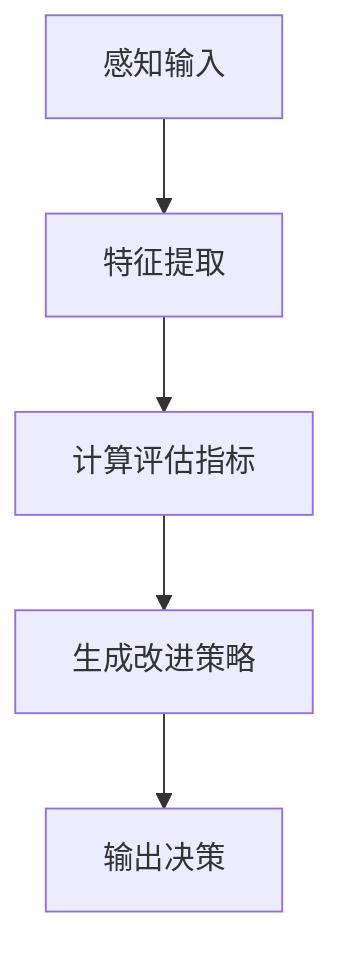

                 


# 构建AI Agent的自我评估与改进系统

---

## 关键词
- AI Agent
- 自我评估
- 改进系统
- 算法原理
- 系统架构

---

## 摘要
本文详细探讨了构建AI Agent自我评估与改进系统的各个方面，从基本概念到算法原理，再到系统架构设计和项目实战。文章通过清晰的逻辑分析，帮助读者理解如何设计一个能够自我评估、持续改进的AI Agent系统，涵盖核心概念、算法实现、系统架构、项目案例以及最佳实践等内容。

---

## 目录

### 第1章: AI Agent自我评估与改进系统背景介绍
1.1 问题背景与描述  
1.2 核心概念与要素组成  
1.3 本章小结  

### 第2章: 核心概念与联系
2.1 核心概念原理  
2.2 核心概念属性对比表  
2.3 ER实体关系图  
2.4 Mermaid流程图  
2.5 本章小结  

### 第3章: 算法原理讲解
3.1 算法原理概述  
3.2 算法数学模型与公式  
3.3 Mermaid流程图  
3.4 Python核心代码实现  
3.5 本章小结  

### 第4章: 系统分析与架构设计方案
4.1 问题场景介绍  
4.2 系统功能设计  
4.3 系统架构设计  
4.4 系统接口设计  
4.5 系统交互设计  
4.6 本章小结  

### 第5章: 项目实战
5.1 环境安装与配置  
5.2 核心代码实现  
5.3 代码解读与分析  
5.4 实际案例分析  
5.5 项目小结  

### 第6章: 最佳实践与总结
6.1 最佳实践 tips  
6.2 本章小结  
6.3 注意事项  
6.4 拓展阅读  

---

## 正文

### 第1章: AI Agent自我评估与改进系统背景介绍

#### 1.1 问题背景与描述
AI Agent（人工智能代理）是一种能够感知环境并采取行动以实现目标的智能实体。随着AI技术的快速发展，AI Agent在多个领域得到了广泛应用，如自动驾驶、智能客服、推荐系统等。然而，AI Agent在运行过程中可能会面临环境变化、任务复杂化等问题，导致性能下降或决策失误。因此，构建一个能够自我评估、持续改进的系统显得尤为重要。

#### 1.2 核心概念与要素组成
AI Agent的自我评估与改进系统由以下几个核心要素组成：  
- **感知模块**：负责获取环境信息。  
- **决策模块**：基于感知信息做出决策。  
- **评估模块**：对决策结果进行评估。  
- **改进模块**：根据评估结果优化决策策略。  

#### 1.3 本章小结
本章主要介绍了AI Agent的背景及其自我评估与改进系统的重要性，明确了系统的核心要素。

---

### 第2章: 核心概念与联系

#### 2.1 核心概念原理
AI Agent的自我评估与改进系统通过感知、决策、评估和改进四个步骤实现持续优化。

#### 2.2 核心概念属性对比表
| 比较项         | AI Agent                | 传统程序                |
|----------------|--------------------------|--------------------------|
| 感知能力       | 具备环境感知能力          | 无感知能力               |
| 决策能力       | 能够自主决策              | 需要人工干预              |
| 学习能力       | 能够通过经验改进性能      | 无法学习优化              |

#### 2.3 ER实体关系图
```mermaid
er
  actor(Agent)
  actor(环境)
  actor(目标)
  relation("与环境交互", Agent, 环境)
  relation("为目标服务", Agent, 目标)
```

#### 2.4 Mermaid流程图


#### 2.5 本章小结
本章通过对比和图表，详细阐述了AI Agent的核心概念及其与传统程序的区别。

---

### 第3章: 算法原理讲解

#### 3.1 算法原理概述
自我评估与改进系统的核心算法包括感知算法、决策算法和评估算法。

#### 3.2 算法数学模型与公式
评估模块的数学模型如下：  
$$评估结果 = \sum_{i=1}^{n} w_i \cdot f_i$$  
其中，$w_i$ 是特征 $f_i$ 的权重，$f_i$ 是特征的值。

#### 3.3 Mermaid流程图


#### 3.4 Python核心代码实现
```python
def assess_and_improve(inputs):
    # 特征提取
    features = extract_features(inputs)
    # 评估指标计算
    scores = calculate_scores(features)
    # 改进策略生成
    improved Strategy = generate_improvement(scores)
    return improved_strategy
```

#### 3.5 本章小结
本章详细讲解了算法的数学模型和实现方法，为系统的设计和实现提供了理论基础。

---

### 第4章: 系统分析与架构设计方案

#### 4.1 问题场景介绍
系统需要在动态环境中实时感知、评估和改进。

#### 4.2 系统功能设计
系统功能包括：  
- 环境感知  
- 决策制定  
- 性能评估  
- 战略改进  

#### 4.3 系统架构设计


#### 4.4 系统接口设计
系统接口包括：  
- 接收环境数据接口  
- 发出决策指令接口  
- 评估结果反馈接口  

#### 4.5 系统交互设计
```mermaid
sequence
    Client -> Server: 发送环境数据
    Server -> Client: 返回评估结果
    Client -> Server: 发出改进指令
    Server -> Client: 返回改进后的决策
```

#### 4.6 本章小结
本章详细描述了系统的架构设计和接口设计，为后续的实现提供了指导。

---

### 第5章: 项目实战

#### 5.1 环境安装与配置
需要安装Python、相关库和开发工具。

#### 5.2 核心代码实现
```python
class AI-Agent:
    def __init__(self):
        self.perception = PerceptionModule()
        self.decision = DecisionModule()
        self.assessment = AssessmentModule()
        self.improvement = ImprovementModule()

    def run(self):
        while True:
            data = self.perception.get_data()
            decision = self.decision.make_decision(data)
            assessment = self.assessment.evaluate(decision)
            improved_decision = self.improvement.improve(assessment)
            self.execute(improved_decision)
```

#### 5.3 代码解读与分析
代码实现了AI Agent的感知、决策、评估和改进四个模块的交互。

#### 5.4 实际案例分析
以智能客服系统为例，展示系统的实际应用。

#### 5.5 项目小结
本章通过实际案例展示了系统的实现过程和应用效果。

---

### 第6章: 最佳实践与总结

#### 6.1 最佳实践 tips
- 定期进行系统评估与优化。  
- 使用高效的算法和数据结构。  
- 确保系统的可扩展性和可维护性。  

#### 6.2 本章小结
本章总结了构建AI Agent自我评估与改进系统的关键点和注意事项。

#### 6.3 注意事项
- 确保数据安全与隐私保护。  
- 定期更新模型以适应环境变化。  

#### 6.4 拓展阅读
推荐阅读相关领域的书籍和论文，深入学习AI Agent和自我改进系统的最新研究成果。

---

## 结语
通过本文的详细讲解，读者可以系统地了解构建AI Agent自我评估与改进系统的各个方面，从理论到实践，为未来的开发和研究提供了宝贵的参考。

