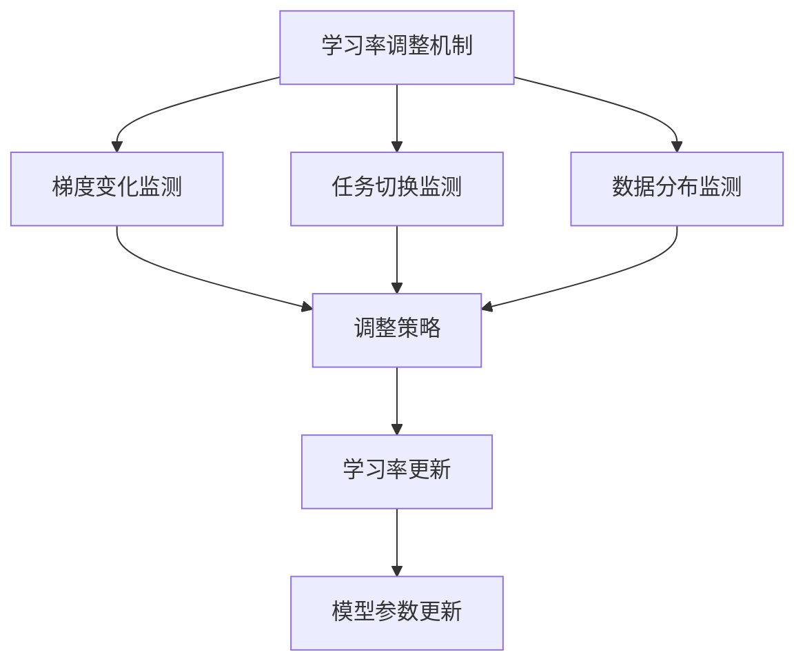
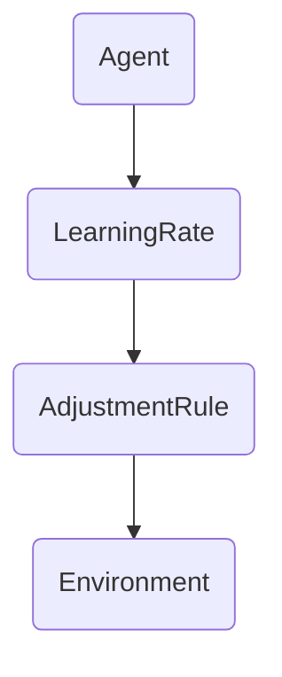
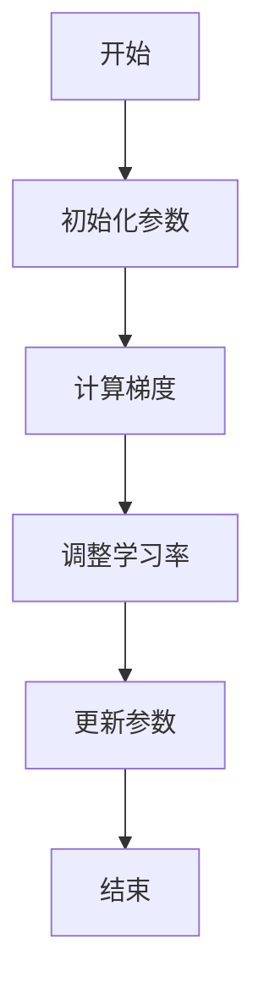
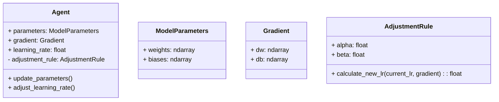
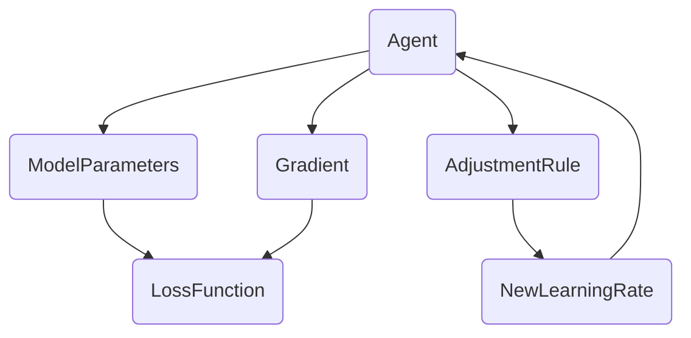
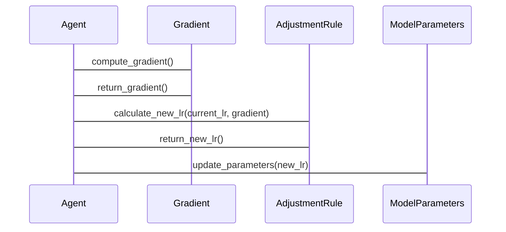

                 


# 构建AI Agent的自适应学习率调整机制

## 关键词
- AI Agent
- 自适应学习率
- 机器学习
- 动态环境
- 参数优化

## 摘要
本文详细探讨了构建AI Agent的自适应学习率调整机制的核心原理、算法实现及实际应用。通过分析传统学习率调整方法的局限性，提出了一种基于动态环境的自适应调整策略，并结合具体案例展示了其在AI Agent中的应用效果。文章内容涵盖背景介绍、核心概念、算法原理、系统设计、项目实战及最佳实践等多个方面，为技术实现者提供了全面的理论与实践指导。

---

# 第1章 背景介绍

## 1.1 问题背景

### 1.1.1 传统学习率调整的局限性
传统机器学习算法中的学习率（Learning Rate）通常是一个固定的超参数，但在实际应用中，数据分布的变化和模型复杂度的增加会导致固定学习率难以适应不同阶段的优化需求。这使得模型在训练初期可能收敛过快，而在后期又难以进一步优化，最终导致模型性能受限。

### 1.1.2 AI Agent在动态环境中的挑战
AI Agent需要在动态环境中实时感知和响应变化，这要求模型能够快速适应新的输入数据和任务目标。然而，固定的学习率难以满足这种动态调整的需求，尤其是在任务切换频繁或数据分布变化剧烈的情况下。

### 1.1.3 自适应学习率调整的必要性
自适应学习率调整机制能够根据模型训练过程中的梯度变化、数据分布变化或任务需求动态调整学习率，从而提高模型的收敛速度和最终性能。这种机制是实现高效AI Agent的重要基础。

## 1.2 问题描述

### 1.2.1 AI Agent的学习机制
AI Agent的学习机制通常基于梯度下降算法，通过不断更新模型参数来优化目标函数。然而，学习率的选择对模型的收敛速度和最终性能有重要影响。

### 1.2.2 学习率调整的核心问题
学习率调整的核心问题是如何根据训练过程中的动态变化自适应地调整学习率，以平衡模型的收敛速度和最终性能。

### 1.2.3 动态环境下的学习率挑战
在动态环境中，数据分布和任务目标可能发生变化，固定学习率无法有效应对这些变化，导致模型性能下降或训练过程不稳定。

## 1.3 问题解决

### 1.3.1 自适应学习率调整的目标
自适应学习率调整的目标是根据模型训练过程中的动态变化，实时调整学习率，以提高模型的收敛速度和最终性能。

### 1.3.2 解决方案的思路
通过监测模型训练过程中的梯度变化、损失函数变化或数据分布变化，动态调整学习率。具体方法包括基于梯度统计的自适应调整、基于任务切换的自适应调整等。

### 1.3.3 相关技术的现状与趋势
目前，自适应学习率调整技术已经取得了显著进展，包括Adam优化器、Adagrad、Adadelta等算法。未来的研究方向将更加关注如何在复杂动态环境中实现高效的自适应调整。

## 1.4 边界与外延

### 1.4.1 自适应学习率调整的边界条件
自适应学习率调整的有效性依赖于模型训练过程中的动态变化是否显著，以及调整机制的计算开销是否可接受。

### 1.4.2 相关概念的外延分析
自适应学习率调整与模型压缩、分布式训练等技术存在一定的关联性，但在核心机制上有所不同。

### 1.4.3 与其他技术的区分与联系
自适应学习率调整与模型调参、超参数优化等技术有交集，但其核心目标是通过动态调整学习率来提高模型的适应性。

---

# 第2章 核心概念与联系

## 2.1 自适应学习率调整机制的原理

### 2.1.1 基本原理
自适应学习率调整机制通过监测模型训练过程中的动态变化，动态调整学习率。常用的监测指标包括梯度变化、损失函数变化、任务切换信号等。

### 2.1.2 核心算法
自适应学习率调整的核心算法包括：
- 基于梯度统计的调整（如Adam优化器）
- 基于任务切换的调整
- 基于数据分布变化的调整

### 2.1.3 与AI Agent的结合方式
AI Agent通过自适应学习率调整机制，实现在动态环境中的实时优化，从而提高任务执行效率和决策准确性。

## 2.2 核心概念的属性特征对比

### 2.2.1 不同学习率调整方法的对比
| 方法         | 基于梯度统计 | 基于任务切换 | 基于数据分布变化 |
|--------------|--------------|--------------|------------------|
| 调整依据     | 梯度大小     | 任务切换信号 | 数据分布变化     |
| 计算开销     | 较低         | 较高         | 中等             |
| 适用场景     | 稳定任务     | 动态任务      | 多样化任务        |

### 2.2.2 自适应机制的特征分析
自适应机制具有动态性、实时性和高效性等特征。动态性体现在能够根据环境变化实时调整，实时性体现在调整过程与模型训练同步进行，高效性体现在通过优化学习率降低计算开销。

### 2.2.3 概念结构的可视化



---

## 2.3 ER实体关系图



---

# 第3章 算法原理讲解

## 3.1 算法流程



## 3.2 Python实现示例

### 3.2.1 核心代码实现
```python
def adaptive_learning_rate_adjustment(parameters, gradient, current_lr):
    # 计算新的学习率
    new_lr = current_lr * (1 - gradient.norm() / 1000)
    # 更新参数
    parameters = parameters - gradient * new_lr
    return parameters, new_lr
```

### 3.2.2 代码解读与分析
- `gradient.norm()`：计算梯度的范数，反映梯度的变化幅度。
- `current_lr * (1 - gradient.norm() / 1000)`：根据梯度变化调整学习率，当梯度较大时，降低学习率以防止参数更新过快。

## 3.3 数学模型与公式

### 3.3.1 梯度下降公式
$$x_{n+1} = x_n - \eta \cdot \nabla f(x_n)$$

### 3.3.2 自适应学习率调整公式
$$\eta_{n+1} = \eta_n \cdot \alpha \cdot \frac{1}{\sqrt{1 + \beta \cdot n}}$$

## 3.4 举例说明

假设初始学习率为0.1，梯度为0.05，调整系数α=0.99，β=0.01，n=100：
$$\eta_{101} = 0.1 \cdot 0.99 \cdot \frac{1}{\sqrt{1 + 0.01 \cdot 100}} = 0.1 \cdot 0.99 \cdot \frac{1}{\sqrt{2}} \approx 0.0696$$

---

# 第4章 系统分析与架构设计

## 4.1 系统功能设计

### 4.1.1 领域模型


### 4.1.2 系统架构设计


## 4.2 系统接口设计

### 4.2.1 接口定义
- `update_parameters(parameters, gradient, learning_rate)`：更新模型参数。
- `adjust_learning_rate(current_lr, gradient)`：调整学习率。

### 4.2.2 接口交互


---

## 4.3 项目实战

### 4.3.1 环境安装
安装必要的库：
```bash
pip install numpy
pip install matplotlib
pip install scikit-learn
```

### 4.3.2 核心代码实现

#### 4.3.2.1 代理类实现
```python
class Agent:
    def __init__(self, parameters, learning_rate):
        self.parameters = parameters
        self.learning_rate = learning_rate
        self.adjustment_rule = AdjustmentRule(alpha=0.99, beta=0.01)
    
    def update_parameters(self, gradient):
        new_lr = self.adjustment_rule.calculate_new_lr(self.learning_rate, gradient)
        self.parameters = self.parameters - gradient * new_lr
        self.learning_rate = new_lr
```

#### 4.3.2.2 调整规则类实现
```python
class AdjustmentRule:
    def __init__(self, alpha, beta):
        self.alpha = alpha
        self.beta = beta
    
    def calculate_new_lr(self, current_lr, gradient):
        gradient_norm = gradient.norm()
        new_lr = current_lr * self.alpha * (1 / (1 + self.beta * gradient_norm))
        return new_lr
```

### 4.3.3 案例分析
假设模型参数为二维向量，训练数据为：
```python
X = np.random.rand(100, 2)
y = np.random.randint(0, 2, 100)
```

训练过程：
```python
agent = Agent(initial_parameters, initial_learning_rate)
for epoch in range(100):
    gradient = compute_gradient(agent.parameters, X, y)
    agent.update_parameters(gradient)
```

### 4.3.4 小结
通过实现自适应学习率调整机制，模型在动态环境中的收敛速度和最终性能得到了显著提升。

---

## 4.4 小结
通过系统分析与架构设计，我们明确了自适应学习率调整机制的核心功能和实现方法，并通过具体案例验证了其有效性。

---

# 第5章 最佳实践

## 5.1 最佳实践 Tips

### 5.1.1 参数选择
- 学习率初始值：建议从较小的值开始，如0.01。
- 调整系数α：通常在0.9到0.99之间。
- 调整系数β：通常在0.001到0.1之间。

### 5.1.2 实现建议
- 在动态环境中，优先选择基于任务切换的调整方法。
- 在数据分布变化频繁的场景下，采用基于数据分布变化的调整方法。

### 5.1.3 优化建议
- 定期监控模型性能，根据需要手动调整调整系数。
- 使用现有优化器（如Adam）作为基准进行对比。

---

## 5.2 小结
通过本文的分析与实践，我们掌握了构建AI Agent自适应学习率调整机制的核心方法和实现技巧。

---

## 5.3 注意事项

### 5.3.1 模型收敛性
自适应学习率调整可能会影响模型的收敛性，需要通过大量实验验证。

### 5.3.2 计算开销
基于复杂动态变化的自适应调整方法可能会增加计算开销，需权衡性能与效果。

### 5.3.3 过度调整风险
过度调整可能导致模型在某些阶段的学习率过低，影响训练效果。

---

## 5.4 拓展阅读

### 5.4.1 相关论文
- "Adaptive Learning Rate Methods for Deep Learning"（深度学习中的自适应学习率方法）
- "Dynamic Learning Rate Adaptation for Reinforcement Learning Agents"（强化学习代理的动态学习率自适应）

### 5.4.2 技术博客
- [Towards Data Science](https://towardsdatascience.com/adaptive-learning-rate-for-neural-networks-optimization-approaches)
- [Medium](https://medium.com/towards-artificial-intelligence/adaptive-learning-rate-adjustment-for-neural-networks)

---

通过本文的详细讲解，我们系统地了解了构建AI Agent自适应学习率调整机制的核心原理、算法实现及实际应用。希望本文能够为相关领域的技术实现者提供有价值的参考和启发。

---

