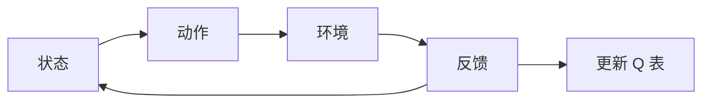
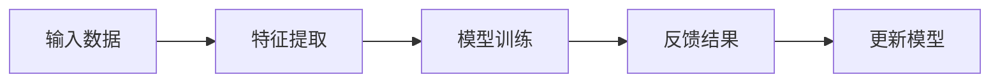
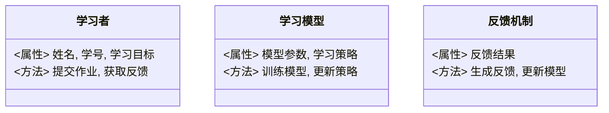
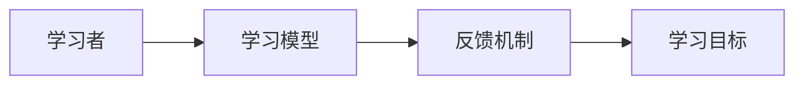
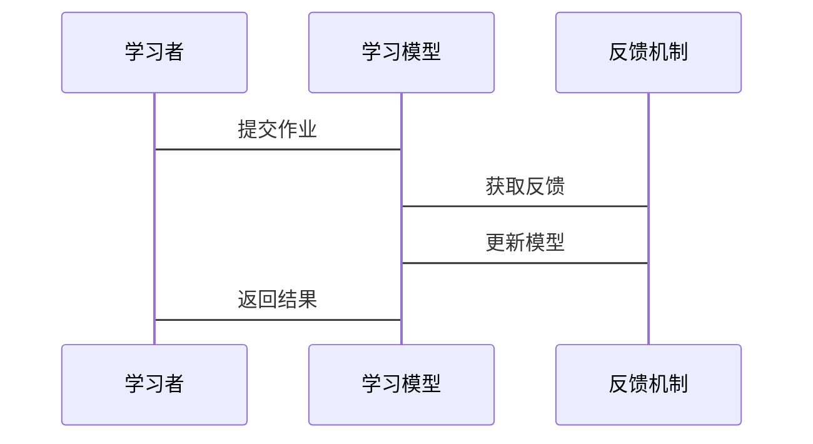

                 


# 构建AI Agent的自适应学习系统

> 关键词：AI Agent, 自适应学习系统, 强化学习, 系统架构, 项目实战

> 摘要：本文详细介绍了如何构建一个基于AI Agent的自适应学习系统。从背景介绍到核心概念，从算法原理到系统架构，从项目实战到最佳实践，全面解析了系统的构建过程和关键实现技术。文章通过理论与实践相结合的方式，帮助读者深入理解自适应学习系统的设计与实现。

---

# 第一部分: 构建AI Agent的自适应学习系统背景介绍

## 第1章: 问题背景与描述

### 1.1 问题背景
#### 1.1.1 传统学习系统的问题与局限性
传统的学习系统通常基于固定的规则和静态的数据，难以适应动态变化的学习环境和个性化需求。例如，传统的教学系统可能无法根据学生的学习进度和兴趣调整教学内容，导致学习效果不佳。

#### 1.1.2 AI Agent在学习系统中的潜力
AI Agent（智能代理）具有感知环境、自主决策和执行任务的能力，可以为自适应学习系统提供强大的技术支持。通过AI Agent，学习系统能够实时感知学习者的状态，并动态调整学习策略。

#### 1.1.3 自适应学习的需求与挑战
自适应学习系统的核心目标是根据学习者的个性化需求和学习进度，动态调整学习内容和教学策略。然而，实现这一目标需要解决数据采集、算法优化、系统架构等多个方面的挑战。

### 1.2 问题描述
#### 1.2.1 自适应学习系统的定义
自适应学习系统是一种能够根据学习者的需求和状态，动态调整学习内容、教学策略和评估方法的智能系统。

#### 1.2.2 AI Agent在自适应学习中的角色
AI Agent在自适应学习系统中扮演感知、决策和执行的角色，能够实时感知学习环境和学习者状态，并根据反馈调整学习策略。

#### 1.2.3 系统的核心目标与应用场景
- 核心目标：实现个性化学习、提高学习效率、优化学习体验。
- 应用场景：教育、培训、企业学习、终身学习等。

### 1.3 问题解决与边界
#### 1.3.1 自适应学习系统的解决方案
通过结合AI Agent和机器学习算法，构建一个能够感知、决策和执行的自适应学习系统。

#### 1.3.2 系统的边界与外延
- 系统边界：仅关注学习过程中的自适应调整，不涉及数据存储和外部系统集成。
- 系统外延：可以扩展到个性化推荐、智能问答等领域。

#### 1.3.3 核心要素与组成结构
- 学习者：系统的核心用户，通过行为数据和反馈与系统交互。
- 学习模型：基于机器学习算法构建的学习者画像和推荐模型。
- 环境感知：通过传感器或日志数据感知学习环境的变化。
- 反馈机制：根据学习者的行为数据和环境变化，动态调整学习策略。

---

# 第二部分: 核心概念与联系

## 第2章: AI Agent与自适应学习的核心概念

### 2.1 AI Agent的基本原理
#### 2.1.1 感知、决策与执行模块
- 感知模块：通过传感器或日志数据感知学习环境和学习者状态。
- 决策模块：基于感知数据，利用机器学习算法生成决策。
- 执行模块：根据决策结果执行操作，如调整学习内容或反馈信息。

#### 2.1.2 AI Agent的分类与特点
- 分类：基于规则的AI Agent、基于模型的AI Agent、强化学习AI Agent。
- 特点：自主性、反应性、目标导向性。

#### 2.1.3 自适应学习的核心机制
- 基于强化学习的自适应机制：通过奖励函数优化学习策略。
- 基于监督学习的自适应机制：通过标签数据调整模型参数。

### 2.2 核心概念对比与联系
#### 2.2.1 传统学习系统 vs 自适应学习系统
| 特性                | 传统学习系统              | 自适应学习系统              |
|---------------------|---------------------------|-----------------------------|
| 数据驱动            | 静态规则驱动              | 动态数据驱动                |
| 个性化支持          | 有限或无                   | 强大的个性化支持             |
| 环境适应能力        | 较弱                     | 强大                       |

#### 2.2.2 AI Agent vs 自适应算法
- AI Agent：具有感知和决策能力，能够主动调整系统行为。
- 自适应算法：基于数据变化，调整模型参数或策略。

#### 2.2.3 概念属性对比表格
| 属性                | AI Agent                  | 自适应学习系统              |
|---------------------|---------------------------|-----------------------------|
| 核心功能            | 感知、决策、执行          | 动态调整学习策略            |
| 技术基础            | 机器学习、强化学习        | 机器学习、深度学习          |
| 应用场景            | 智能推荐、自动化控制      | 个性化学习、动态教育        |

### 2.3 系统架构的ER实体关系图
```mermaid
er
actor: 学习者
model: 学习模型
environment: 学习环境
feedback: 反馈机制
goal: 学习目标

actor --> model: 输入数据
model --> environment: 交互
environment --> feedback: 生成反馈
feedback --> model: 更新模型
goal --> model: 定义目标
```

---

# 第三部分: 算法原理讲解

## 第3章: 算法原理与实现

### 3.1 强化学习算法
#### 3.1.1 强化学习的数学模型
$$ Q-learning 算法公式：Q(s, a) = Q(s, a) + \alpha (r + \gamma \max Q(s', a') - Q(s, a)) $$

#### 3.1.2 强化学习流程图


#### 3.1.3 强化学习代码实现
```python
class QLearningAgent:
    def __init__(self, state_space, action_space):
        self.state_space = state_space
        self.action_space = action_space
        self.q_table = np.zeros((state_space, action_space))
        self.learning_rate = 0.1
        self.discount_factor = 0.9

    def get_action(self, state):
        if np.random.random() < 0.9:
            return np.argmax(self.q_table[state])
        else:
            return np.random.randint(self.action_space)

    def update_q_table(self, state, action, reward, next_state):
        self.q_table[state, action] += self.learning_rate * (
            reward + self.discount_factor * np.max(self.q_table[next_state]) - self.q_table[state, action]
        )
```

### 3.2 自适应学习算法
#### 3.2.1 自适应算法的数学模型
$$ 聚类算法公式：x_i' = x_i + \alpha \cdot \nabla f(x_i) $$

#### 3.2.2 自适应算法流程图


#### 3.2.3 自适应算法代码实现
```python
class AdaptiveLearningModel:
    def __init__(self, input_dim):
        self.model = self.build_model(input_dim)
        self.optimizer = Adam(lr=0.001)
        self.loss_function = 'binary_crossentropy'

    def build_model(self, input_dim):
        model = Sequential()
        model.add(Dense(64, activation='relu', input_dim=input_dim))
        model.add(Dense(32, activation='relu'))
        model.add(Dense(1, activation='sigmoid'))
        model.compile(loss=self.loss_function, optimizer=self.optimizer, metrics=['accuracy'])
        return model

    def train(self, x, y):
        self.model.fit(x, y, epochs=10, batch_size=32)
```

---

# 第四部分: 系统分析与架构设计

## 第4章: 系统分析与架构设计方案

### 4.1 问题场景介绍
- 场景描述：构建一个支持个性化学习的自适应学习系统。
- 关键需求：动态调整学习内容、实时反馈学习效果、支持多平台接入。

### 4.2 系统功能设计
#### 4.2.1 领域模型类图


#### 4.2.2 系统架构设计


### 4.3 系统接口设计
- 学习者接口：提交作业、获取反馈。
- 系统接口：训练模型、更新策略。

### 4.4 系统交互流程图


---

# 第五部分: 项目实战

## 第5章: 项目实战与实现

### 5.1 环境安装
- 安装Python、TensorFlow、Keras、Scikit-learn等库。

### 5.2 系统核心实现
#### 5.2.1 核心代码实现
```python
class AdaptiveLearningSystem:
    def __init__(self):
        self.agent = QLearningAgent(state_space=10, action_space=5)
        self.model = AdaptiveLearningModel(input_dim=10)

    def run(self):
        for _ in range(100):
            state = self.get_current_state()
            action = self.agent.get_action(state)
            reward, next_state = self.execute_action(action)
            self.agent.update_q_table(state, action, reward, next_state)
            self.model.train(...)
```

#### 5.2.2 代码应用解读与分析
- 代码实现：通过强化学习和自适应算法，动态调整学习策略。
- 系统功能：实现个性化学习推荐、实时反馈和学习效果评估。

### 5.3 实际案例分析
#### 5.3.1 教育平台中的应用
- 案例描述：在在线教育平台中，利用自适应学习系统为学习者提供个性化学习路径。
- 实施步骤：数据采集、模型训练、系统集成。

### 5.4 项目小结
- 项目成果：实现了基于AI Agent的自适应学习系统。
- 经验总结：强化学习和自适应算法的结合能够显著提升学习效果。

---

# 第六部分: 最佳实践

## 第6章: 最佳实践与小结

### 6.1 小结
- 本文详细介绍了构建AI Agent的自适应学习系统的核心概念、算法原理和系统架构。
- 通过项目实战，展示了系统的实现过程和实际应用。

### 6.2 注意事项
- 数据隐私和安全问题需要重点关注。
- 系统的可扩展性和可维护性需要在设计阶段充分考虑。

### 6.3 拓展阅读
- 推荐书籍：《强化学习导论》、《自适应控制系统》。
- 推荐论文：《基于强化学习的自适应学习系统研究》。

---

通过以上结构，您可以逐步实现构建一个基于AI Agent的自适应学习系统，并将其应用于实际场景中。希望本文对您有所帮助！

