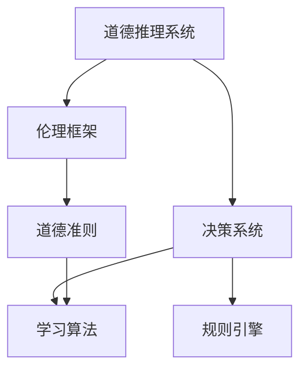
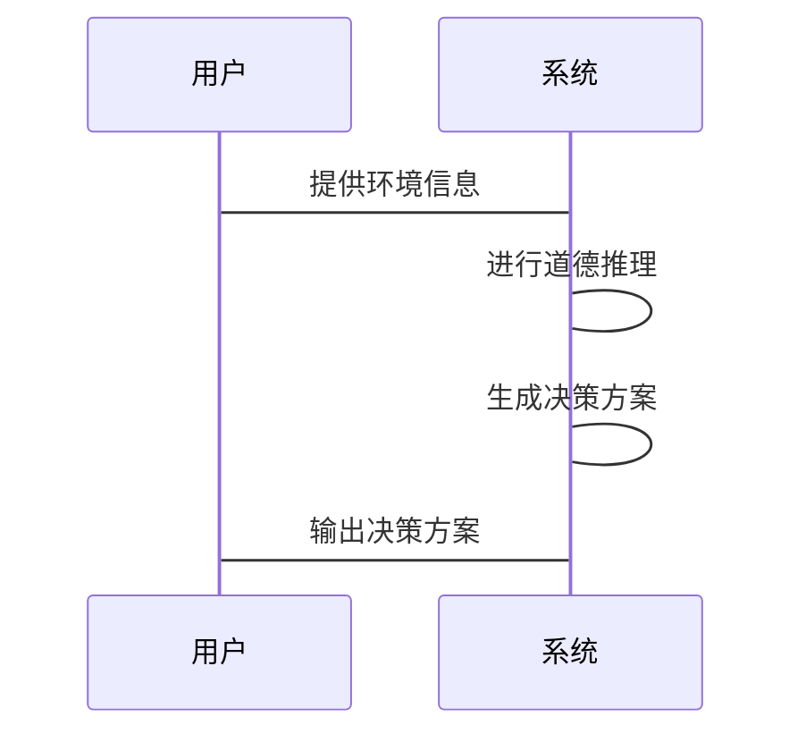

                 


# 《构建AI Agent的道德推理与决策系统》

> 关键词：AI Agent、道德推理、决策系统、伦理框架、系统架构、算法原理

> 摘要：本文旨在探讨如何构建一个具备道德推理与决策能力的AI Agent系统。通过分析道德推理的核心原理、决策系统的算法实现，以及系统架构的设计，提出一套完整的解决方案。文章结合理论与实践，提供详细的代码实现和系统设计，帮助读者理解并掌握AI Agent的道德推理与决策系统的构建方法。

---

## 第一章: 引言

### 1.1 问题背景
人工智能（AI）技术的快速发展，使得AI Agent在各个领域的应用越来越广泛。然而，AI Agent在做出决策时，往往会面临复杂的伦理和道德问题。例如，自动驾驶汽车在紧急情况下如何选择最优的行动方案？AI医疗系统在诊断疾病时如何平衡患者的利益与医疗资源的分配？这些问题的解决需要AI Agent具备道德推理能力，能够根据伦理框架做出符合人类价值观的决策。

### 1.2 问题描述
AI Agent的决策系统通常基于数据和算法进行推理，但缺乏对道德和伦理的深度理解。这可能导致AI Agent在某些情况下做出不符合人类伦理规范的决策。例如，一个推荐系统可能会为了提高点击率而推荐虚假信息，忽视用户的长远利益。因此，构建一个具备道德推理能力的AI Agent系统，是当前AI技术发展的重要挑战。

### 1.3 问题解决
本文将从道德推理的核心原理出发，结合决策系统的算法实现，提出一套完整的AI Agent道德推理与决策系统的构建方案。通过引入伦理框架、规则引擎和学习算法，实现AI Agent在复杂场景下的道德决策能力。

### 1.4 概念结构与核心要素
- **道德推理**：基于伦理框架，对问题进行分析和判断，得出符合道德标准的结论。
- **决策系统**：通过算法和规则，从多个选项中选择最优的行动方案。
- **伦理框架**：定义AI Agent在决策过程中需要遵守的道德准则和优先级。
- **规则引擎**：用于实现基于规则的道德推理。
- **学习算法**：通过数据学习，优化AI Agent的道德决策能力。

---

## 第二章: 道德推理与决策系统的原理

### 2.1 道德推理的逻辑框架
道德推理是AI Agent在决策过程中需要遵循的一套逻辑规则。本文提出了一个三层次的道德推理框架：

1. **基础层**：定义基本的道德准则和伦理规范。
2. **中间层**：根据具体场景，对道德准则进行权重排序。
3. **顶层**：结合场景特征，生成具体的决策方案。

### 2.2 决策系统的构建
决策系统的构建需要考虑以下几个关键因素：
1. **输入**：包括环境信息、目标和约束条件。
2. **处理逻辑**：包括道德推理、规则匹配和学习优化。
3. **输出**：生成最优的决策方案。

### 2.3 道德框架与决策系统的对比分析
| 对比维度 | 道德框架 | 决策系统 |
|----------|----------|----------|
| 输入     | 道德准则、伦理规范 | 环境信息、目标 |
| 输出     | 道德判断、伦理建议 | 决策方案 |
| 目标     | 辅助决策 | 实现目标 |

### 2.4 实体关系图



---

## 第三章: 算法原理与实现

### 3.1 基于规则的道德推理算法
基于规则的道德推理算法是一种简单但有效的实现方式。以下是其实现步骤：

1. **定义规则**：例如，"在紧急情况下，优先保护人类生命"。
2. **匹配规则**：根据当前场景，匹配适用的规则。
3. **生成决策**：根据匹配的规则，生成具体的决策方案。

### 3.2 基于案例的道德推理算法
基于案例的道德推理算法是一种基于经验的推理方法：

1. **案例库**：存储历史决策案例。
2. **案例检索**：根据当前场景，检索相似的案例。
3. **决策生成**：结合检索到的案例，生成决策方案。

### 3.3 基于学习的道德推理算法
基于学习的道德推理算法利用机器学习技术，从大量数据中学习道德决策模式：

1. **数据预处理**：清洗和标注数据。
2. **模型训练**：使用深度学习模型进行训练。
3. **决策生成**：根据输入场景，生成决策。

### 3.4 算法实现代码

```python
# 基于规则的道德推理算法
def rule_based_moral_reasoning(scene, rules):
    matched_rules = []
    for rule in rules:
        if rule_matches(scene, rule):
            matched_rules.append(rule)
    return matched_rules

# 基于案例的道德推理算法
def case_based_moral_reasoning(scene, case_base):
    similar_cases = []
    for case in case_base:
        if case_similarity(scene, case):
            similar_cases.append(case)
    return similar_cases

# 基于学习的道德推理算法
def learning_based_moral_reasoning(scene, model):
    decision = model.predict(scene)
    return decision
```

---

## 第四章: 系统架构与设计

### 4.1 问题场景介绍
以自动驾驶汽车为例，AI Agent需要在紧急情况下做出决策，例如在碰撞不可避免时，如何选择最优的行动方案。

### 4.2 系统功能设计
1. **道德推理模块**：负责基于伦理框架进行道德推理。
2. **决策系统模块**：根据推理结果，生成具体的决策方案。
3. **学习优化模块**：通过学习不断优化决策模型。

### 4.3 系统架构图


### 4.4 接口设计
1. **输入接口**：接收环境信息和目标。
2. **输出接口**：输出决策方案。
3. **学习接口**：接收反馈数据，优化模型。

### 4.5 交互流程图



---

## 第五章: 项目实战

### 5.1 环境安装
1. Python 3.8+
2. 安装必要的库：numpy, pandas, scikit-learn

### 5.2 核心代码实现
```python
# 道德推理系统实现
class MoralReasoningSystem:
    def __init__(self, rules, case_base, model):
        self.rules = rules
        self.case_base = case_base
        self.model = model

    def infer(self, scene):
        # 基于规则推理
        matched_rules = rule_based_moral_reasoning(scene, self.rules)
        # 基于案例推理
        similar_cases = case_based_moral_reasoning(scene, self.case_base)
        # 基于学习推理
        learned_decision = learning_based_moral_reasoning(scene, self.model)
        return matched_rules, similar_cases, learned_decision

# 示例场景
scene = {
    "type": "emergency",
    "context": "自动驾驶汽车遇到紧急情况"
}
rules = [
    "优先保护人类生命",
    "尽量减少财产损失"
]
case_base = [
    {"type": "emergency", "decision": "转向安全区域"},
    {"type": "emergency", "decision": "减速停车"}
]
model = {"type": "random_forest"}

# 初始化系统
mrs = MoralReasoningSystem(rules, case_base, model)
# 进行推理
matched_rules, similar_cases, learned_decision = mrs.infer(scene)
print("匹配的规则:", matched_rules)
print("相似的案例:", similar_cases)
print("学习算法的决策:", learned_decision)
```

### 5.3 实际案例分析
以自动驾驶汽车为例，假设遇到紧急情况，系统需要在以下两种方案中选择：
1. 转向安全区域，可能导致财产损失。
2. 减速停车，可能导致更大的危险。

系统会基于道德推理生成最优决策。

---

## 第六章: 最佳实践与小结

### 6.1 小结
本文详细介绍了如何构建一个具备道德推理与决策能力的AI Agent系统，包括算法原理、系统架构和项目实战。通过结合规则推理、案例推理和学习推理，可以实现更高效的道德决策。

### 6.2 注意事项
1. 道德推理需要结合具体场景，避免一刀切。
2. 系统的可解释性是关键，需要确保决策过程透明。
3. 学习算法需要不断优化，以适应新的道德规范。

### 6.3 拓展阅读
1. 《道德机器》：探讨AI系统在道德决策中的挑战。
2. 《强化学习与决策》：深入理解强化学习在决策系统中的应用。

---

通过本文的系统构建与分析，读者可以掌握AI Agent道德推理与决策系统的实现方法，并能够将其应用于实际场景中。

