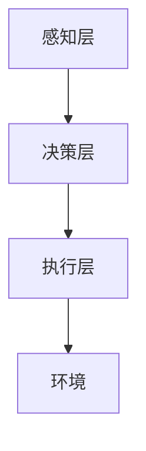
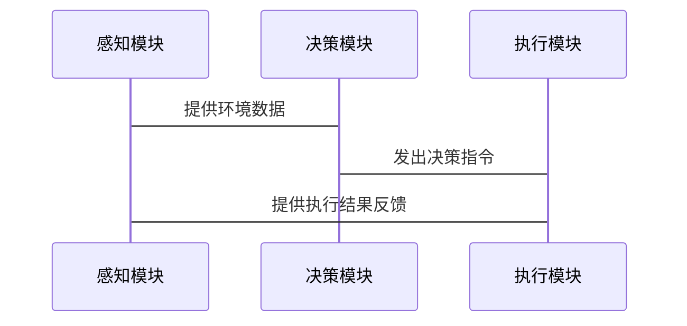

                 


# 《构建AI Agent的长期规划与决策系统》

---

## 关键词：
AI Agent，长期规划，决策系统，强化学习，动态规划，系统架构

---

## 摘要：
本文详细探讨了构建AI Agent的长期规划与决策系统的各个方面，从核心概念到算法原理，再到系统架构和项目实战。通过强化学习和动态规划等算法，结合系统架构设计和实际案例分析，为读者提供一个全面的构建指南。

---

# 第一部分：引言

## 第1章：AI Agent的背景与概念

### 1.1 AI Agent的基本概念

#### 1.1.1 什么是AI Agent
AI Agent（人工智能代理）是指能够感知环境、做出决策并采取行动的智能实体。它可以是一个软件程序、机器人或其他智能系统，其核心目标是通过与环境交互来实现特定任务。

#### 1.1.2 AI Agent的核心特征
1. **自主性**：能够在没有外部干预的情况下自主运作。
2. **反应性**：能够实时感知环境并做出反应。
3. **目标导向性**：以实现特定目标为导向进行决策和行动。
4. **学习能力**：能够通过经验改进自身的性能。

#### 1.1.3 AI Agent的应用场景
- **自动驾驶**：通过实时感知环境做出驾驶决策。
- **智能助手**：如Siri、Alexa，能够理解用户需求并执行任务。
- **机器人控制**：用于工业自动化或服务机器人。

---

### 1.2 长期规划与决策系统的必要性

#### 1.2.1 长期规划的定义与意义
- **长期规划**：是指在较长的时间范围内，为实现目标制定一系列策略和步骤。
- **意义**：帮助AI Agent在复杂环境中做出全局性决策，避免短视行为。

#### 1.2.2 决策系统的核心作用
- **信息处理**：将感知到的信息转化为决策依据。
- **选择最优行动**：基于当前状态和目标，选择最优行动方案。
- **动态调整**：根据环境变化实时调整决策。

#### 1.2.3 长期规划与决策系统的结合
- **规划与决策的协同**：通过长期规划指导决策，确保行动的一致性和目标的实现。
- **动态更新**：根据环境反馈不断优化规划和决策。

---

### 1.3 本书的目标与结构

#### 1.3.1 本书的目标
- 掌握AI Agent的长期规划与决策系统的构建方法。
- 理解相关算法和系统架构的设计原理。
- 能够通过实际案例实现一个简单的AI Agent系统。

#### 1.3.2 本书的结构安排
- 第一部分：引言，介绍AI Agent的基本概念和本书目标。
- 第二部分：AI Agent的核心概念与理论基础。
- 第三部分：算法原理与数学模型。
- 第四部分：系统架构设计。
- 第五部分：项目实战与案例分析。
- 第六部分：总结与展望。

#### 1.3.3 如何阅读本书
- 建议读者按章节顺序阅读，从理论到实践逐步深入。
- 配合代码示例和图表，理解复杂的概念和算法。

---

## 第2章：长期规划与决策系统的概念模型

### 2.1 长期规划的核心要素

#### 2.1.1 目标设定
- **目标层次**：分为高层次目标和低层次目标。
- **目标分解**：将高层次目标分解为可执行的具体任务。

#### 2.1.2 行动规划
- **行动序列**：根据当前状态和目标，制定一系列行动步骤。
- **优先级排序**：确定行动的优先级，确保关键任务优先执行。

#### 2.1.3 状态评估
- **状态表示**：用状态变量描述环境和系统的当前情况。
- **状态评估方法**：通过评估函数对状态进行评分，判断当前状态的好坏。

---

### 2.2 决策系统的原理

#### 2.2.1 信息处理流程
1. **感知环境**：通过传感器或数据源获取环境信息。
2. **信息处理**：对感知到的信息进行分析和处理，提取有用特征。
3. **决策生成**：基于处理后的信息，生成决策方案。
4. **执行决策**：将决策方案转化为具体行动。

#### 2.2.2 决策树与决策图
- **决策树**：一种树状结构，用于表示可能的决策路径。
- **决策图**：一种图结构，用于表示决策的依赖关系和转移关系。

#### 2.2.3 知识表示与推理
- **知识表示**：用符号或模型表示问题中的知识和信息。
- **推理机制**：基于知识库进行逻辑推理，得出结论。

---

### 2.3 长期规划与决策系统的关联

#### 2.3.1 长期规划的层次结构
- **高层次规划**：制定长期目标和战略。
- **低层次规划**：具体执行计划和步骤。

#### 2.3.2 决策系统的动态更新
- **动态调整**：根据环境变化实时更新规划和决策。
- **反馈机制**：通过执行结果反馈优化规划。

#### 2.3.3 系统的自适应能力
- **自适应学习**：通过机器学习算法提高系统的自适应能力。
- **容错与纠错**：系统能够在出现错误时快速恢复并继续运行。

---

## 第3章：长期规划与决策系统的算法基础

### 3.1 强化学习与决策树

#### 3.1.1 强化学习的基本原理
- **定义**：一种通过试错机制学习策略的方法。
- **核心要素**：环境、状态、动作、奖励。
- **学习目标**：找到最优策略，使累积奖励最大化。

#### 3.1.2 决策树的构建与优化
- **决策树构建**：根据特征和标签训练生成决策树。
- **剪枝优化**：通过剪枝减少过拟合，提高泛化能力。

#### 3.1.3 算法的数学模型
$$
R(s,a) = \text{奖励函数，表示在状态}s下采取动作$a$的奖励值}
$$
$$
Q(s,a) = \text{动作值函数，表示在状态}s下采取动作$a$的期望未来奖励}
$$

---

### 3.2 动态规划与状态转移

#### 3.2.1 动态规划的核心思想
- **定义**：通过分解问题，将复杂问题分解为更简单的子问题。
- **核心思想**：通过状态转移方程，计算每个状态的价值函数。

#### 3.2.2 状态转移矩阵的构建
- **状态表示**：用向量表示不同状态。
- **转移概率**：表示从一个状态转移到另一个状态的概率。

#### 3.2.3 动态规划的数学公式
$$
V_{\text{new}}(s) = \max_a \sum_{s'} P(s'|s,a) V_{\text{old}}(s')
$$
其中，$V_{\text{new}}(s)$表示更新后的价值函数，$V_{\text{old}}(s)$表示旧的价值函数，$P(s'|s,a)$表示从状态$s$采取动作$a$后转移到状态$s'$的概率。

---

### 3.3 马尔可夫决策过程（MDP）

#### 3.3.1 MDP的基本概念
- **状态空间**：系统可能处于的所有状态。
- **动作空间**：系统可能采取的所有动作。
- **转移概率**：从当前状态采取某个动作后转移到下一个状态的概率。
- **奖励函数**：在状态和动作下获得的奖励。

#### 3.3.2 MDP的数学模型
$$
\pi(s) = \text{策略函数，表示在状态}s下采取的动作}
$$
$$
Q(s,a) = \mathbb{E}[R|s,a] + \gamma \mathbb{E}[\max Q(s',a')|s,a]
$$
其中，$\gamma$表示折扣因子，$\mathbb{E}$表示期望值。

---

## 第4章：系统架构

---

### 4.1 系统功能设计

#### 4.1.1 领域模型
- **领域模型**：描述系统中各个实体及其关系的概念模型。
- **类图**：用Mermaid表示系统中各个类及其关系。

#### 4.1.2 功能模块
1. **感知模块**：负责感知环境信息。
2. **处理模块**：对感知到的信息进行处理和分析。
3. **决策模块**：基于处理后的信息生成决策。
4. **执行模块**：将决策转化为具体行动。

---

### 4.2 系统架构设计

#### 4.2.1 模块划分
- **感知层**：负责数据采集和初步处理。
- **决策层**：负责策略制定和决策生成。
- **执行层**：负责具体行动的执行。

#### 4.2.2 架构图


---

### 4.3 接口设计

#### 4.3.1 接口定义
- **输入接口**：感知模块接收环境数据。
- **输出接口**：执行模块输出具体行动。

#### 4.3.2 交互流程


---

## 第5章：项目实战

### 5.1 环境安装

#### 5.1.1 安装Python
```bash
python --version
pip install --upgrade pip
```

#### 5.1.2 安装依赖库
```bash
pip install numpy matplotlib
```

---

### 5.2 系统核心实现

#### 5.2.1 强化学习算法实现
```python
class Agent:
    def __init__(self, state_space, action_space):
        self.state_space = state_space
        self.action_space = action_space
        self.Q = {s: {a: 0 for a in action_space} for s in state_space}

    def get_action(self, state):
        max_action = max(self.Q[state], key=lambda k: self.Q[state][k])
        return max_action

    def update_Q(self, state, action, reward, next_state):
        alpha = 0.1
        gamma = 0.9
        self.Q[state][action] += alpha * (reward + gamma * max(self.Q[next_state].values()) - self.Q[state][action])
```

---

### 5.3 代码应用解读与分析

#### 5.3.1 代码功能分析
- **初始化**：创建Q值表，初始化为0。
- **选择动作**：选择当前状态下Q值最高的动作。
- **更新Q值**：基于当前状态、动作、奖励和下一个状态更新Q值。

#### 5.3.2 算法流程
1. **初始化Q值表**。
2. **选择动作并执行**。
3. **获取奖励并更新Q值**。
4. **循环执行**。

---

### 5.4 实际案例分析

#### 5.4.1 案例描述
假设我们构建一个简单的AI Agent，用于控制一个小车在迷宫中寻找出口。

#### 5.4.2 系统实现
```python
import numpy as np

class Maze:
    def __init__(self, size):
        self.size = size
        self.current_state = 0

    def get_next_state(self, action):
        # 根据动作返回下一个状态
        pass

    def get_reward(self):
        # 返回当前状态的奖励值
        pass

agent = Agent(range(10), ['left', 'right', 'forward', 'backward'])
```

---

## 第6章：总结与展望

### 6.1 最佳实践 tips
- **持续学习**：AI Agent需要不断学习和优化。
- **系统监控**：实时监控系统状态，及时发现和解决问题。
- **性能调优**：通过参数调整和算法优化提高系统性能。

### 6.2 小结
通过本文的介绍，读者可以掌握构建AI Agent长期规划与决策系统的各个方面，包括理论、算法、系统架构和实际应用。

### 6.3 注意事项
- **数据质量**：确保感知模块获取高质量的数据。
- **算法选择**：根据具体场景选择合适的算法。
- **系统安全**：确保系统运行的安全性和稳定性。

### 6.4 拓展阅读
- **强化学习经典论文**：如《Deep Q-Networks》。
- **动态规划书籍**：如《动态规划与最优控制》。

---

## 结语
构建AI Agent的长期规划与决策系统是一个复杂而有趣的过程，需要结合理论与实践。通过本文的学习，读者可以掌握相关知识，并在实际项目中灵活应用。希望本文能为读者提供有价值的指导和启发。

