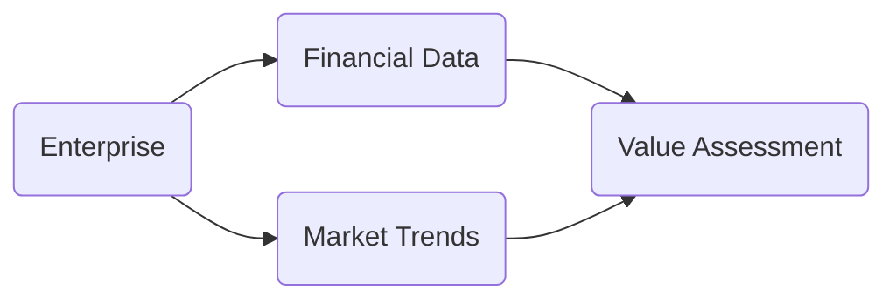

                 


# 构建AI辅助的并购交易分析系统

> 关键词：AI辅助，并购交易，数据分析，自然语言处理，时间序列分析，系统架构

> 摘要：本文详细探讨了构建AI辅助的并购交易分析系统的各个方面，从背景介绍到系统设计，再到项目实战。文章首先分析了并购交易的基本概念及其在传统分析中的局限性，然后详细介绍了AI技术在并购分析中的应用，包括自然语言处理和时间序列分析等算法原理。接着，文章从系统架构的角度，设计了基于AI的并购交易分析系统的整体框架，并通过实际案例展示了系统的实现过程。最后，本文总结了构建AI辅助并购交易分析系统的关键点，并提供了最佳实践建议。

---

# 第一部分: 并购交易分析系统概述

# 第1章: 并购交易分析的背景与需求

## 1.1 并购的基本概念

### 1.1.1 并购的定义与分类

并购（Mergers and Acquisitions，简称M&A）是指一家企业与其他企业（被并购方）通过股权收购或资产收购的方式，将其整合到自己的业务体系中。并购可以分为以下几种类型：

1. **横向并购**：同一行业内的企业合并，旨在扩大市场份额或消除竞争。
2. **纵向并购**：上下游产业的企业合并，以增强供应链控制能力。
3. **混合并购**：与企业现有业务无直接关联的并购，通常用于多元化发展。

### 1.1.2 并购交易的流程与关键环节

并购交易通常包括以下几个关键环节：

1. **目标企业筛选**：根据财务状况、市场地位等因素筛选潜在并购目标。
2. **尽职调查**：对目标企业的财务、法律、运营等方面进行详细调查。
3. **估值与定价**：基于尽职调查结果，评估目标企业价值并确定交易价格。
4. **交易结构设计**：设计并购的具体方式（如股权收购或资产收购）。
5. **法律与财务交割**：完成交易的法律和财务流程。
6. **整合与协同效应实现**：将目标企业与自身业务进行整合，最大化协同效应。

### 1.1.3 并购交易中的信息不对称问题

在并购交易中，信息不对称是一个普遍存在的问题。卖方通常掌握更多信息，而买方可能因为信息不足而做出错误决策。AI技术可以通过分析大量公开数据，帮助买方克服信息不对称问题。

---

## 1.2 AI辅助并购交易的必要性

### 1.2.1 并购交易中的数据复杂性

并购交易涉及大量非结构化数据（如新闻报道、行业报告）和结构化数据（如财务报表、股价数据）。传统的数据分析方法难以高效处理这些复杂数据。

### 1.2.2 传统并购分析的局限性

传统并购分析主要依赖人工经验，存在以下局限性：

1. **效率低下**：人工分析耗时长，难以应对大量数据。
2. **主观性较强**：分析结果受分析师主观判断影响较大。
3. **信息不完整**：难以充分利用非结构化数据。

### 1.2.3 AI技术在并购分析中的优势

AI技术可以通过以下方式提升并购分析的效率和准确性：

1. **自动化数据处理**：快速处理大量结构化和非结构化数据。
2. **深度学习模型**：利用深度学习模型发现数据中的隐藏模式。
3. **实时监控与预警**：通过实时数据分析，识别潜在风险。

---

## 1.3 当前并购交易分析系统的现状

### 1.3.1 现有系统的优缺点分析

目前，市场上已经有一些并购分析工具，但大多数工具存在以下问题：

1. **功能单一**：仅能进行简单的数据查询和统计分析。
2. **缺乏智能化**：无法利用AI技术进行深度分析。
3. **可扩展性差**：难以应对复杂的并购场景。

### 1.3.2 并购交易分析中的主要挑战

1. **数据获取难度**：部分并购数据可能来自非公开渠道。
2. **模型泛化能力不足**：AI模型在不同行业中的表现可能差异较大。
3. **监管合规性**：并购交易需遵守相关法律法规，增加了系统设计的复杂性。

### 1.3.3 AI辅助并购交易系统的应用前景

随着AI技术的不断进步，AI辅助并购交易系统的应用前景广阔。未来，AI系统可以通过分析历史交易数据，预测并购成功的概率，并为决策者提供个性化建议。

---

## 1.4 本章小结

本章介绍了并购的基本概念、交易流程以及AI辅助并购的必要性。通过分析传统并购分析的局限性和AI技术的优势，我们得出结论：AI技术可以显著提升并购交易的效率和准确性。接下来，我们将从核心概念和技术原理的角度深入探讨AI辅助并购交易系统的构建。

---

# 第二部分: AI辅助并购交易分析的核心概念

# 第2章: 并购交易分析的核心要素

## 2.1 并购交易中的关键实体

### 2.1.1 企业价值评估

企业价值（Enterprise Value，EV）是衡量企业整体价值的重要指标，通常用于并购定价。企业价值的计算公式为：

$$ EV = 债务 + 权益 + 净资产 + 其他调整项 $$

### 2.1.2 财务数据分析

财务数据是并购分析的核心内容，包括收入、利润、现金流等指标。这些数据可以通过财务报表获取，并用于评估企业的财务健康状况。

### 2.1.3 市场趋势分析

市场趋势分析包括行业发展趋势、宏观经济指标（如GDP增长率、通货膨胀率）等。这些信息可以帮助分析并购交易的市场环境。

---

## 2.2 AI辅助分析的实体关系

### 2.2.1 实体关系图（ER图）

以下是一个简化的ER图，展示了并购交易中的主要实体及其关系：



---

## 2.3 核心概念的数学模型

### 2.3.1 企业价值评估公式

企业价值（EV）可以通过以下公式计算：

$$ EV = 股权价值 + 税后净债务价值 $$

其中，股权价值（Equity Value）和净债务价值（Net Debt）可以通过财务报表获取。

### 2.3.2 市场趋势预测模型

市场趋势预测可以采用时间序列分析模型，例如ARIMA（AutoRegressive Integrated Moving Average）。其基本公式为：

$$ \hat{y}_t = \alpha \cdot y_{t-1} + (1-\alpha) \cdot \text{mean}(y) $$

其中，$\alpha$ 是平滑参数，$y_{t-1}$ 是前一期的观测值，$\text{mean}(y)$ 是历史数据的平均值。

---

## 2.4 本章小结

本章从核心概念的角度分析了并购交易中的关键实体及其关系。通过企业价值评估、财务数据分析和市场趋势分析，我们可以更好地理解并购交易的内在逻辑。接下来，我们将深入探讨AI技术在并购分析中的具体应用。

---

# 第三部分: AI辅助并购交易分析的算法原理

# 第3章: 自然语言处理在并购分析中的应用

## 3.1 自然语言处理简介

### 3.1.1 NLP的基本概念

自然语言处理（NLP）是人工智能的一个重要分支，旨在使计算机能够理解、处理和生成人类语言。NLP的核心任务包括文本分类、信息提取、机器翻译等。

### 3.1.2 NLP在文本分析中的应用

在并购分析中，NLP主要用于处理新闻报道、公司公告等非结构化文本数据。例如，通过分析公司公告，可以提取并购交易的相关信息。

---

## 3.2 并购相关文本的特征提取

### 3.2.1 文本预处理步骤

1. **分词**：将文本分割成单词或短语。
2. **去除停用词**：去掉常见词汇（如“and”、“the”）以减少计算量。
3. **词干提取**：将单词转换为其基本形式（如“running”变为“run”）。

### 3.2.2 关键词提取算法

关键词提取算法可以通过TF-IDF（Term Frequency-Inverse Document Frequency）实现。TF-IDF公式为：

$$ TF-IDF(t, D) = \text{TF}(t, D) \times \text{IDF}(t, D) $$

其中，$\text{TF}(t, D)$ 是词 $t$ 在文档 $D$ 中的频率，$\text{IDF}(t, D)$ 是词 $t$ 的逆文档频率。

### 3.2.3 主题模型的应用

主题模型（如LDA，Latent Dirichlet Allocation）可以用于提取文本的主题信息。LDA模型的基本步骤如下：

1. **预处理文本**：分词、去除停用词。
2. **构建词汇表**：统计所有单词的频率。
3. **主题建模**：通过迭代优化，确定每个主题的单词分布。

---

## 3.3 基于NLP的并购分析流程

以下是基于NLP的并购分析流程：


---

## 3.4 代码实现

以下是一个简单的关键词提取代码示例：

```python
from sklearn.feature_extraction.text import TfidfVectorizer

# 假设text为待处理的文本
vectorizer = TfidfVectorizer()
tfidf = vectorizer.fit_transform([text])
feature_names = vectorizer.get_feature_names_out()
```

---

## 3.5 本章小结

本章详细介绍了自然语言处理在并购分析中的应用，包括文本预处理、关键词提取和主题建模等技术。通过NLP技术，我们可以更好地挖掘非结构化数据中的有价值信息。接下来，我们将探讨时间序列分析在并购预测中的应用。

---

# 第四部分: 系统分析与架构设计

# 第4章: 时间序列分析在并购预测中的应用

## 4.1 时间序列分析的基本概念

### 4.1.1 时间序列的定义与特征

时间序列是指按时间顺序排列的数据，通常用于预测未来趋势。时间序列的特征包括趋势（Trend）、季节性（Seasonality）和随机性（Noise）。

### 4.1.2 时间序列分析的方法

时间序列分析常用的方法包括：

1. **移动平均法（MA）**：基于过去若干期的平均值进行预测。
2. **指数平滑法（Exponential Smoothing）**：通过加权平均预测未来值。
3. **ARIMA模型**：基于差分和自回归的组合模型。

---

## 4.2 并购预测的时间序列模型

### 4.2.1 并购预测的场景介绍

并购预测通常基于历史交易数据，预测未来可能发生的并购事件。例如，可以通过分析某行业的并购频率，预测未来该行业的并购趋势。

### 4.2.2 时间序列模型的选择

对于并购预测，ARIMA模型是一个合适的选择。ARIMA模型的参数选择需要根据数据的特性进行调整。

---

## 4.3 时间序列分析的代码实现

以下是一个基于ARIMA模型的代码示例：

```python
from statsmodels.tsa.arima_model import ARIMA

# 假设data为时间序列数据
model = ARIMA(data, order=(1, 1, 1))
model_fit = model.fit()
forecast = model_fit.forecast(steps=5)
```

---

## 4.4 本章小结

本章介绍了时间序列分析在并购预测中的应用，重点讲解了ARIMA模型的原理和实现。通过时间序列分析，我们可以更好地预测并购交易的趋势和概率。接下来，我们将从系统架构的角度设计基于AI的并购交易分析系统。

---

# 第五部分: 项目实战

# 第5章: 基于AI的并购交易分析系统实现

## 5.1 系统设计与功能模块

### 5.1.1 系统功能模块

1. **数据采集模块**：采集并购相关的结构化和非结构化数据。
2. **分析引擎模块**：基于NLP和时间序列分析进行数据处理。
3. **可视化模块**：以图表形式展示分析结果。

### 5.1.2 系统架构图

以下是一个简化的系统架构图：


---

## 5.2 系统实现与代码示例

### 5.2.1 环境安装

1. 安装Python和必要的库：
   ```bash
   pip install numpy pandas scikit-learn statsmodels
   ```

### 5.2.2 核心代码实现

以下是一个简单的并购分析代码示例：

```python
import numpy as np
import pandas as pd
from sklearn.feature_extraction.text import TfidfVectorizer
from statsmodels.tsa.arima_model import ARIMA

# 示例数据
text_data = "The company is planning to acquire a new business unit."
financial_data = np.array([100, 200, 150])

# NLP分析
vectorizer = TfidfVectorizer()
tfidf = vectorizer.fit_transform([text_data])
feature_names = vectorizer.get_feature_names_out()

# 时间序列分析
model = ARIMA(financial_data, order=(1, 1, 1))
model_fit = model.fit()
forecast = model_fit.forecast(steps=5)
```

---

## 5.3 案例分析与解读

假设我们有一个简单的并购案例，目标是预测某公司的并购概率。我们可以通过以下步骤进行分析：

1. **数据采集**：收集目标公司的财务数据和新闻报道。
2. **数据预处理**：清洗数据并提取关键词。
3. **模型训练**：使用NLP和时间序列分析模型进行预测。
4. **结果可视化**：将预测结果以图表形式展示。

---

## 5.4 本章小结

本章通过实际案例展示了AI辅助并购交易分析系统的实现过程。从环境安装到代码实现，再到案例分析，我们详细讲解了系统的构建步骤。接下来，我们将总结构建AI辅助并购交易分析系统的关键点，并提供最佳实践建议。

---

# 第六部分: 总结与展望

# 第6章: 构建AI辅助并购交易分析系统的总结与展望

## 6.1 总结

本文详细探讨了构建AI辅助并购交易分析系统的各个方面，包括背景介绍、核心概念、算法原理、系统架构设计和项目实战。通过NLP和时间序列分析等技术，我们可以显著提升并购交易的分析效率和准确性。

## 6.2 展望

未来，随着AI技术的不断发展，AI辅助并购交易分析系统将更加智能化和个性化。以下是未来可能的发展方向：

1. **多模态数据融合**：结合文本、图像等多种数据源进行分析。
2. **强化学习应用**：通过强化学习优化并购决策。
3. **实时分析能力**：实现对并购交易的实时监控和预警。

---

# 第七部分: 最佳实践与注意事项

## 7.1 最佳实践

1. **数据质量**：确保数据的准确性和完整性。
2. **模型调优**：通过交叉验证等方法优化模型性能。
3. **系统维护**：定期更新模型和数据，保持系统的高效运行。

## 7.2 注意事项

1. **合规性**：确保系统符合相关法律法规。
2. **数据隐私**：保护用户数据隐私，避免数据泄露。
3. **系统稳定性**：确保系统在高并发场景下的稳定运行。

---

# 结语

构建AI辅助的并购交易分析系统是一项复杂而有意义的工程。通过本文的详细讲解，我们希望读者能够掌握系统构建的核心技术，并在实际应用中取得成功。未来，随着AI技术的不断进步，AI辅助并购交易分析系统将为并购决策提供更加智能化和个性化的支持。

---

