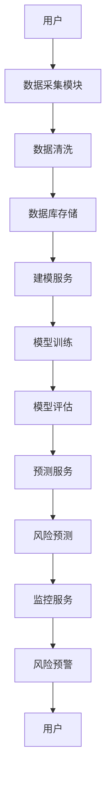
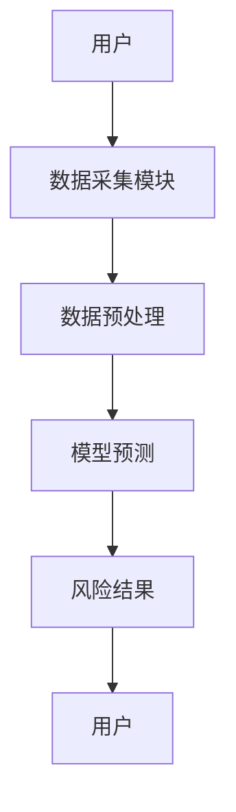
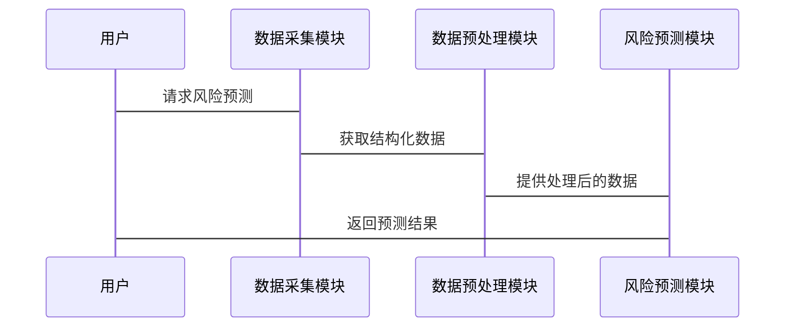

                 

# 第四部分：系统分析与架构设计

---

# 第4章：AI辅助金融风险度量系统的架构设计

## 4.1 系统功能模块设计

### 4.1.1 数据采集模块

- **功能描述**：负责从多种数据源（如股票市场数据、新闻、社交媒体等）获取实时或历史数据。
- **输入**：数据源地址、采集时间范围。
- **输出**：结构化数据，存储到数据库中。
- **流程**：
  1. 确定数据源类型（API接口、CSV文件、数据库等）。
  2. 采集数据并进行清洗（去除无效数据、处理缺失值）。
  3. 将清洗后的数据存储到数据库中，供后续模块使用。

### 4.1.2 风险建模模块

- **功能描述**：利用机器学习或深度学习算法构建风险预测模型。
- **输入**：训练数据、模型参数。
- **输出**：训练好的风险预测模型。
- **流程**：
  1. 数据预处理（归一化、特征选择）。
  2. 选择合适的算法（如XGBoost、LSTM等）。
  3. 模型训练与调参。
  4. 模型评估（使用验证集）。

### 4.1.3 风险预测模块

- **功能描述**：基于训练好的模型，对未来的金融风险进行预测。
- **输入**：实时数据、模型。
- **输出**：风险预测结果（如VaR、ES值）。
- **流程**：
  1. 获取实时数据。
  2. 数据预处理。
  3. 模型预测。
  4. 结果存储或展示。

### 4.1.4 风险监控模块

- **功能描述**：实时监控市场变化，及时发现潜在风险。
- **输入**：实时数据流、风险阈值。
- **输出**：风险预警信息。
- **流程**：
  1. 实时数据采集。
  2. 数据分析（计算风险指标）。
  3. 风险指标与阈值对比。
  4. 发送预警通知（如邮件、短信）。

---

## 4.2 系统架构设计

### 4.2.1 分层架构设计

- **前端层**：用户界面，展示风险预测结果、预警信息等。
- **服务层**：业务逻辑处理，如数据采集、模型训练等。
- **数据层**：数据存储与管理，如数据库、缓存等。

### 4.2.2 微服务架构设计

- **数据采集服务**：负责从不同数据源采集数据。
- **建模服务**：负责模型训练与管理。
- **预测服务**：负责实时风险预测。
- **监控服务**：负责风险监控与预警。

### 4.2.3 数据流与服务交互设计

- 数据采集服务获取数据后，传输给建模服务进行处理。
- 建模服务完成模型训练后，将模型部署到预测服务。
- 预测服务根据实时数据进行预测，并将结果传输给监控服务。
- 监控服务根据预测结果触发预警通知。

---

## 4.3 系统接口设计

### 4.3.1 数据接口设计

- **输入接口**：数据采集模块接收原始数据。
- **输出接口**：预测结果输出给前端或第三方系统。

### 4.3.2 模型接口设计

- **输入接口**：训练数据输入建模模块。
- **输出接口**：训练好的模型输出到预测模块。

### 4.3.3 用户接口设计

- **输入接口**：用户输入查询条件、参数设置等。
- **输出接口**：展示风险预测结果、预警信息等。

---

## 4.4 系统交互流程图

### 4.4.1 数据采集与处理流程

### 4.4.2 风险预测流程

---

## 4.5 系统交互序列图

### 4.5.1 风险预测场景

---

## 4.6 本章小结

本章详细介绍了AI辅助金融风险度量系统的架构设计，包括功能模块设计、架构设计、接口设计以及系统交互流程图。通过分层和微服务架构的设计，确保了系统的模块化和可扩展性。同时，通过详细的交互流程图和序列图，展示了系统各模块之间的协作关系，为后续的系统实现提供了理论基础。

