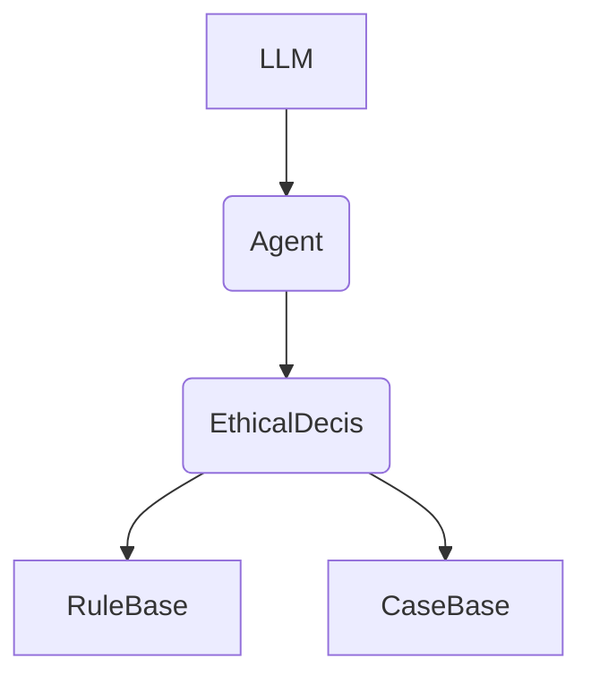
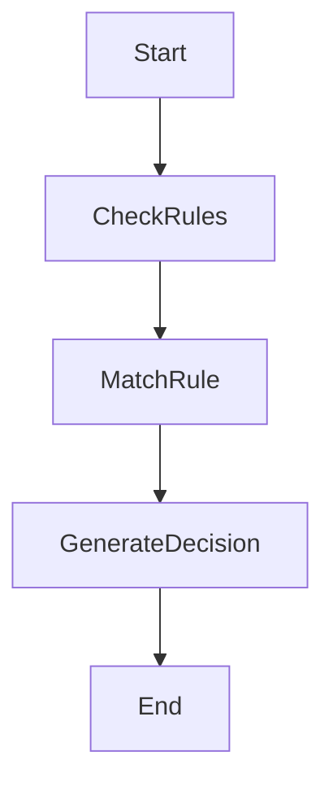
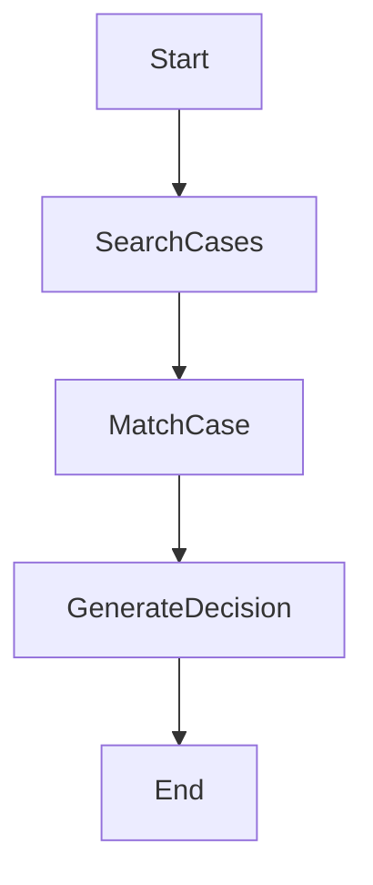
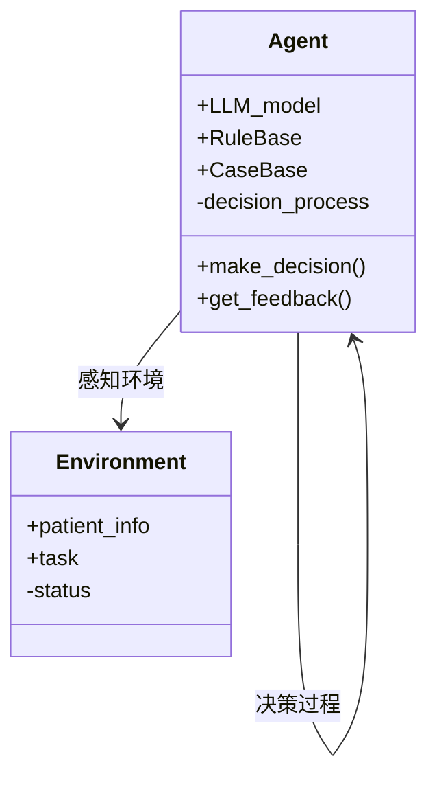
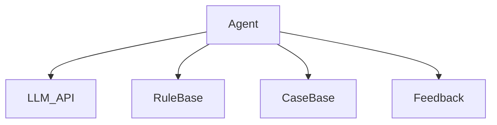
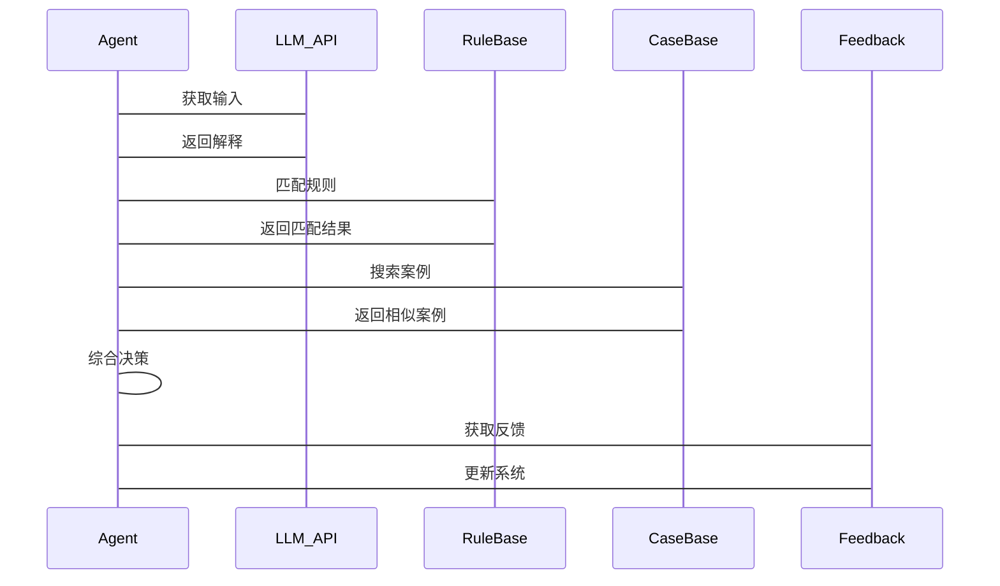

                 


# 构建LLM支持的AI Agent伦理决策系统

## 关键词：LLM, AI Agent, 伦理决策系统, 大语言模型, 人工智能, 系统架构

## 摘要：  
随着人工智能技术的快速发展，AI Agent在各个领域的应用日益广泛。然而，AI Agent在决策过程中面临的伦理问题也愈发突出。为了构建一个能够处理复杂伦理问题的AI Agent系统，我们结合大语言模型（LLM）的能力，提出了一种基于LLM支持的伦理决策系统。本文将从背景、核心概念、算法原理、系统架构、项目实战等多个方面详细阐述这一系统的构建过程，并探讨其在实际应用中的潜力和挑战。

---

# 第1章 背景介绍与核心概念

## 1.1 问题背景与问题描述

### 1.1.1 当前AI Agent的发展现状
AI Agent（智能体）作为人工智能的核心技术之一，近年来取得了显著进展。从简单的任务执行到复杂的决策判断，AI Agent的能力不断提升。然而，随着AI Agent在医疗、金融、司法等高风险领域的应用，其决策的伦理性和透明性问题也逐渐暴露出来。

### 1.1.2 LLM在AI Agent中的应用趋势
大语言模型（LLM）如GPT-4、PaLM等，凭借其强大的自然语言处理能力和知识库，为AI Agent的决策能力提供了新的可能性。LLM不仅能够理解上下文，还能通过推理和生成能力帮助AI Agent做出更智能的决策。

### 1.1.3 伦理决策在AI Agent中的重要性
AI Agent的决策直接影响到用户的信任和系统的社会接受度。在某些场景下，错误的决策可能导致严重后果。因此，构建一个能够处理伦理问题的AI Agent系统显得尤为重要。

### 1.1.4 问题解决思路
- 利用LLM的自然语言处理能力，构建一个能够理解伦理问题的决策模块。
- 通过规则和案例库，为AI Agent提供伦理决策的依据。
- 设计一个动态调整的机制，使得系统能够根据新的信息和反馈不断优化伦理决策能力。

## 1.2 核心概念与组成

### 1.2.1 核心概念的定义
- **AI Agent**：智能体，能够在环境中感知并自主决策以实现目标。
- **LLM**：大语言模型，具备强大的自然语言理解、生成和推理能力。
- **伦理决策系统**：通过伦理框架和规则，帮助AI Agent做出符合伦理的决策。

### 1.2.2 系统组成
1. **感知模块**：负责收集和理解环境信息。
2. **伦理决策模块**：基于LLM和伦理规则，生成决策。
3. **执行模块**：将决策转化为具体行动。
4. **反馈模块**：根据结果优化决策过程。

---

# 第2章 核心概念与联系

## 2.1 核心概念原理

### 2.1.1 LLM的基本原理
大语言模型通过大量数据训练，能够理解上下文并生成自然语言文本。其核心在于通过概率模型预测下一个词，从而实现文本生成和理解。

### 2.1.2 AI Agent的核心机制
AI Agent通过感知环境、分析任务、制定策略和执行行动来完成目标。其决策过程依赖于知识库、推理能力和动态调整能力。

### 2.1.3 伦理决策的理论基础
伦理决策系统依赖于伦理框架、案例推理和反馈优化。这些理论为AI Agent提供了伦理判断的标准和依据。

## 2.2 核心概念对比

### 2.2.1 LLM与传统NLP模型的对比
| 特性 | LLM | 传统NLP模型 |
|------|------|-------------|
| 模型复杂度 | 高 | 较低       |
| 上下文理解 | 强大 | 较弱       |
| 应用范围 | 广泛 | 有限       |

### 2.2.2 AI Agent与传统决策系统的对比
| 特性 | AI Agent | 传统决策系统 |
|------|----------|--------------|
| 自主性 | 高 | 较低         |
| 学习能力 | 强 | 较弱         |
| 适应性 | 高 | 较低         |

### 2.2.3 伦理决策与非伦理决策的对比
| 特性 | 伦理决策 | 非伦理决策 |
|------|----------|------------|
| 决策依据 | 伦理规则 | 任务目标   |
| 风险性 | 高 | 较低        |
| 复杂性 | 高 | 中等        |

## 2.3 ER实体关系图


---

# 第3章 算法原理

## 3.1 基于规则的伦理决策算法

### 3.1.1 算法原理
基于规则的伦理决策系统通过预定义的伦理规则，对输入情况进行匹配，生成决策。公式表示为：
$$ \text{决策} = f_{\text{规则}}(\text{输入}) $$

### 3.1.2 算法实现


### 3.1.3 代码实现
```python
def ethical_decision_rule_based(input, rule_base):
    for rule in rule_base:
        if rule.applies_to(input):
            return rule.apply(input)
    return None
```

## 3.2 基于案例的伦理决策算法

### 3.2.1 算法原理
基于案例的伦理决策系统通过相似案例匹配，生成决策。公式表示为：
$$ \text{决策} = f_{\text{案例}}(\text{输入}) $$

### 3.2.2 算法实现


### 3.2.3 代码实现
```python
def ethical_decision_case_based(input, case_base):
    similar_cases = []
    for case in case_base:
        if case.similarity(input) > 0.8:
            similar_cases.append(case)
    if similar_cases:
        return similar_cases[0].decision
    else:
        return None
```

---

# 第4章 系统分析与架构设计

## 4.1 问题场景介绍
在医疗领域，AI Agent需要根据患者情况推荐治疗方案，这需要考虑伦理因素，如患者意愿、治疗效果和经济负担。

## 4.2 系统功能设计

### 4.2.1 领域模型


### 4.2.2 系统架构


### 4.2.3 接口设计
- **LLM API**：调用大语言模型进行理解和生成。
- **Rule Base**：存储和查询伦理规则。
- **Case Base**：存储和查询历史案例。
- **Feedback**：接收用户反馈以优化决策。

### 4.2.4 交互流程


---

# 第5章 项目实战

## 5.1 环境安装
```bash
pip install transformers
pip install torch
pip install numpy
```

## 5.2 核心代码实现

### 5.2.1 LLM接口
```python
from transformers import AutoModelForCausalLM, AutoTokenizer

model = AutoModelForCausalLM.from_pretrained('gpt2')
tokenizer = AutoTokenizer.from_pretrained('gpt2')
```

### 5.2.2 伦理决策模块
```python
class EthicalDecisionSystem:
    def __init__(self, llm_model, rule_base, case_base):
        self.llm_model = llm_model
        self.rule_base = rule_base
        self.case_base = case_base

    def make_decision(self, input):
        # 使用LLM解释输入
        explanation = self.llm_model.explain(input)
        # 匹配规则
        rule_match = self.rule_base.match(explanation)
        # 搜索案例
        case_match = self.case_base.search(explanation)
        # 综合决策
        decision = self._combine(rule_match, case_match)
        return decision

    def _combine(self, rule_match, case_match):
        # 综合规则和案例的匹配结果
        pass
```

### 5.2.3 案例分析
假设一个医疗场景，AI Agent需要在有限资源下为多个患者分配治疗方案。系统通过伦理规则和历史案例，推荐最优决策。

## 5.3 代码解读与分析
- **LLM接口**：负责与大语言模型交互，理解输入并生成决策建议。
- **伦理决策模块**：整合规则和案例匹配结果，生成最终决策。
- **反馈机制**：根据用户反馈优化决策算法。

## 5.4 项目小结
通过实际案例，我们验证了LLM支持的AI Agent伦理决策系统的可行性和有效性。系统能够根据伦理规则和案例库，帮助AI Agent做出更合理的决策。

---

# 第6章 最佳实践与总结

## 6.1 最佳实践
- **规则设计**：确保伦理规则的全面性和合理性。
- **案例库构建**：不断增加多样化的案例，提升系统决策能力。
- **反馈优化**：根据实际应用反馈，持续优化决策算法。

## 6.2 小结
本文详细阐述了构建LLM支持的AI Agent伦理决策系统的背景、核心概念、算法原理和系统架构。通过实际项目实战，验证了系统的可行性和潜力。

## 6.3 注意事项
- **规则的严谨性**：确保伦理规则的科学性和适用性。
- **案例的多样性**：案例库需要覆盖多种场景，避免决策偏差。
- **系统的透明性**：确保用户能够理解AI Agent的决策过程。

## 6.4 拓展阅读
- 探索多模态LLM在伦理决策中的应用。
- 研究更复杂的伦理推理算法。
- 深入研究AI Agent的可解释性问题。

---

通过以上内容，我们构建了一个基于LLM的AI Agent伦理决策系统，为解决复杂场景下的伦理决策问题提供了新的思路。未来，随着技术的不断发展，这一系统将在更多领域展现出其价值。

