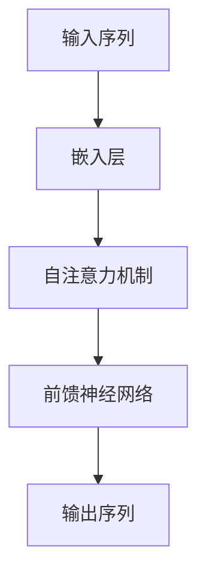
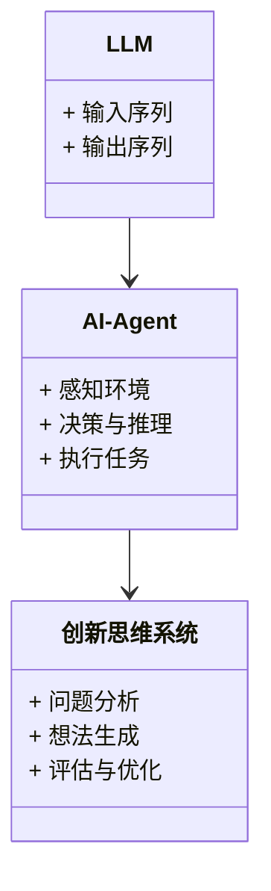
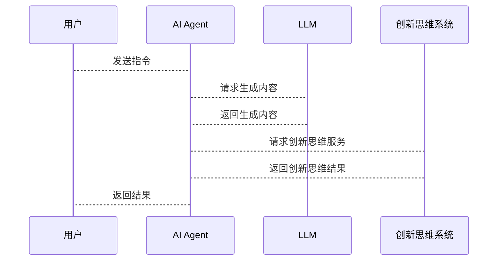

                 


# 《构建LLM支持的AI Agent创新思维系统》

---

## 关键词：  
- Large Language Model (LLM)  
- AI Agent  
- 创新思维  
- 系统架构  
- 项目实战  

---

## 摘要：  
随着大语言模型（LLM）的快速发展，AI Agent（人工智能代理）正逐渐成为实现智能化决策和创新思维的核心技术。本文将从LLM的基本原理出发，详细探讨其如何赋能AI Agent的创新思维能力。通过系统架构设计、算法原理分析以及实际项目案例，本文旨在为读者提供一套构建基于LLM的AI Agent系统的完整指南，帮助读者理解如何将LLM与创新思维相结合，打造智能化、高效的AI代理系统。

---

## 第一部分: 背景与核心概念  

### 第1章: LLM与AI Agent概述  

#### 1.1 LLM的基本概念与原理  
##### 1.1.1 大语言模型的基本定义  
大语言模型（Large Language Model, LLM）是指基于深度学习技术训练的大型神经网络模型，能够理解和生成人类语言。LLM的核心目标是通过海量数据的训练，学习语言的语法、语义和上下文关系，从而实现自然语言处理（NLP）任务，如文本生成、问答系统、机器翻译等。  

**关键术语解释：**  
- **自然语言处理（NLP）**：研究如何让计算机理解和生成人类语言的学科。  
- **生成式模型**：能够生成新内容的模型，如GPT系列模型。  

##### 1.1.2 LLM的核心工作原理  
LLM的核心是基于Transformer架构的自注意力机制（Self-Attention）。通过这种机制，模型能够捕捉文本中的长距离依赖关系，从而更好地理解上下文。  

**公式推导：**  
自注意力机制的计算公式如下：  
$$  
\text{Attention}(Q, K, V) = \text{softmax}\left(\frac{QK^T}{\sqrt{d_k}}\right)V  
$$  
其中，$Q$ 是查询（Query），$K$ 是键（Key），$V$ 是值（Value），$d_k$ 是键的维度。  

##### 1.1.3 LLM与传统NLP模型的对比  
与传统NLP模型（如SVM、朴素贝叶斯）相比，LLM具有以下优势：  
- **更强的上下文理解能力**：通过自注意力机制，LLM能够捕捉到长距离的语义关系。  
- **生成能力强**：LLM可以生成自然流畅的文本，而传统模型难以实现这一点。  

#### 1.2 AI Agent的定义与特点  
##### 1.2.1 AI Agent的基本定义  
AI Agent（人工智能代理）是指能够感知环境、自主决策并执行任务的智能体。它可以是一个软件程序，也可以是嵌入硬件的智能系统。  

**关键术语解释：**  
- **感知**：通过传感器或数据输入，获取环境信息。  
- **决策**：基于感知信息，通过算法做出选择。  
- **执行**：根据决策结果，执行实际操作。  

##### 1.2.2 AI Agent的核心功能与优势  
AI Agent的核心功能包括：  
1. **感知环境**：通过传感器或API获取外部数据。  
2. **决策与推理**：基于数据进行分析、推理和决策。  
3. **执行任务**：通过执行模块完成具体任务。  

AI Agent的优势在于其智能化和自主性，能够在复杂环境中完成任务，无需人工干预。  

##### 1.2.3 AI Agent的应用场景与分类  
AI Agent的应用场景包括：  
- **智能助手**：如Siri、Alexa等。  
- **自动驾驶**：如特斯拉的自动驾驶系统。  
- **智能客服**：通过自然语言处理与用户交互。  

AI Agent的分类：  
- **反应式AI Agent**：仅基于当前感知做出反应。  
- **认知式AI Agent**：具备推理和规划能力。  

#### 1.3 LLM与AI Agent的结合  
##### 1.3.1 LLM如何赋能AI Agent  
LLM可以通过以下方式赋能AI Agent：  
1. **自然语言理解**：帮助AI Agent理解用户输入的自然语言指令。  
2. **生成式对话**：通过LLM生成自然流畅的对话内容。  
3. **知识推理**：利用LLM的强大推理能力，辅助AI Agent完成复杂任务。  

##### 1.3.2 LLM支持的创新思维机制  
LLM可以通过以下机制支持AI Agent的创新思维：  
1. **生成式思维**：通过LLM生成多种解决方案，帮助AI Agent做出创新决策。  
2. **类比推理**：通过LLM的类比推理能力，启发AI Agent的创新思维。  
3. **演绎推理**：通过LLM的逻辑推理能力，帮助AI Agent进行演绎推理。  

##### 1.3.3 LLM与AI Agent结合的典型应用案例  
- **智能写作助手**：通过LLM生成文章草稿，并通过AI Agent进行优化和润色。  
- **自动化客服**：通过LLM生成回复内容，并通过AI Agent与用户交互。  

---

## 第二部分: 核心概念与原理  

### 第2章: LLM的核心原理  

#### 2.1 Transformer模型的结构与机制  
##### 2.1.1 自注意力机制的数学模型  
自注意力机制的计算公式如下：  
$$  
\text{Attention}(Q, K, V) = \text{softmax}\left(\frac{QK^T}{\sqrt{d_k}}\right)V  
$$  

##### 2.1.2 解码器的生成原理  
解码器通过自注意力机制生成输出序列，具体步骤如下：  
1. 初始化一个解码器层。  
2. 输入序列通过自注意力机制生成初始输出。  
3. 输出通过前馈神经网络进行非线性变换，得到最终输出。  

##### 2.1.3 模型训练的数学公式（使用Mermaid图展示）  


#### 2.2 LLM的训练与优化  
##### 2.2.1 预训练任务的设计  
预训练任务包括：  
1. **遮蔽语言模型（MLM）**：随机遮蔽部分词，要求模型预测遮蔽词。  
2. **下一个句子预测（NSP）**：判断两个句子的顺序是否正确。  

##### 2.2.2 强化学习的应用  
通过强化学习优化LLM的生成质量，具体步骤如下：  
1. 初始化一个策略网络。  
2. 通过策略网络生成动作（如输出序列）。  
3. 根据环境反馈（如奖励）调整策略网络的参数。  

##### 2.2.3 模型压缩与推理优化  
模型压缩技术包括：  
- **剪枝**：移除模型中冗余的神经元或权重。  
- **量化**：将模型参数的精度降低（如从浮点数降到整数）。  

### 第3章: AI Agent的创新思维机制  

#### 3.1 创新思维的定义与模型  
##### 3.1.1 创新思维的核心要素  
创新思维的核心要素包括：  
1. **问题分析**：识别问题的关键点。  
2. **生成想法**：提出多种解决方案。  
3. **评估与优化**：评估想法的可行性并优化。  

##### 3.1.2 创新思维的阶段模型  
创新思维的阶段模型包括：  
1. **明确问题**：识别问题的关键点。  
2. **生成想法**：提出多种解决方案。  
3. **评估与优化**：评估想法的可行性并优化。  

##### 3.1.3 创新思维与AI Agent的结合  
通过AI Agent的创新思维机制，可以实现以下功能：  
- **问题分析**：通过LLM分析问题的关键点。  
- **想法生成**：通过LLM生成多种解决方案。  
- **评估与优化**：通过LLM评估想法的可行性并优化。  

#### 3.2 LLM在创新思维中的应用  
##### 3.2.1 生成式思维的实现  
通过LLM生成多种解决方案，具体步骤如下：  
1. **输入问题**：将问题输入LLM。  
2. **生成想法**：LLM生成多种解决方案。  
3. **评估与优化**：根据评估标准筛选出最优解决方案。  

##### 3.2.2 类比推理的实现  
通过LLM的类比推理能力，帮助AI Agent启发创新思维。具体步骤如下：  
1. **输入案例**：将类似的问题输入LLM。  
2. **生成类比**：LLM生成与当前问题相关的类比。  
3. **启发创新**：根据类比启发新的解决方案。  

##### 3.2.3 演绎推理的实现  
通过LLM的演绎推理能力，帮助AI Agent进行逻辑推理。具体步骤如下：  
1. **输入前提**：将前提条件输入LLM。  
2. **生成结论**：LLM根据前提条件生成结论。  
3. **验证推理**：验证结论的正确性。  

---

## 第三部分: 算法原理与数学模型  

### 第4章: LLM的数学模型  

#### 4.1 Transformer模型的数学公式  
##### 4.1.1 自注意力机制的公式推导  
自注意力机制的计算公式如下：  
$$  
\text{Attention}(Q, K, V) = \text{softmax}\left(\frac{QK^T}{\sqrt{d_k}}\right)V  
$$  

##### 4.1.2 解码器的生成原理  
解码器的生成原理如下：  
1. 输入序列通过自注意力机制生成初始输出。  
2. 初始输出通过前馈神经网络进行非线性变换，得到最终输出。  

#### 4.2 LLM的训练过程  
##### 4.2.1 预训练任务的设计  
预训练任务包括：  
1. **遮蔽语言模型（MLM）**：随机遮蔽部分词，要求模型预测遮蔽词。  
2. **下一个句子预测（NSP）**：判断两个句子的顺序是否正确。  

##### 4.2.2 强化学习的应用  
强化学习的应用步骤如下：  
1. 初始化一个策略网络。  
2. 通过策略网络生成动作（如输出序列）。  
3. 根据环境反馈（如奖励）调整策略网络的参数。  

---

## 第四部分: 系统架构与设计  

### 第5章: 系统架构设计  

#### 5.1 问题场景介绍  
本系统的目标是通过LLM支持的AI Agent实现创新思维能力，帮助用户完成复杂任务。  

#### 5.2 系统功能设计  
##### 5.2.1 领域模型（使用Mermaid类图展示）  


##### 5.2.2 系统架构设计（使用Mermaid架构图展示）  


##### 5.2.3 系统接口设计  
系统接口包括：  
1. **LLM接口**：与大语言模型交互的接口。  
2. **AI Agent接口**：与AI Agent交互的接口。  
3. **创新思维接口**：与创新思维系统交互的接口。  

##### 5.2.4 系统交互流程（使用Mermaid序列图展示）  


---

## 第五部分: 项目实战  

### 第6章: 项目实战  

#### 6.1 环境安装  
##### 6.1.1 安装Python  
```bash
python --version
```

##### 6.1.2 安装必要的库  
```bash
pip install transformers
pip install torch
pip install numpy
```

#### 6.2 系统核心实现  

##### 6.2.1 LLM接口实现  
```python
from transformers import GPT2LMHeadModel, GPT2Tokenizer

tokenizer = GPT2Tokenizer.from_pretrained('gpt2')
model = GPT2LMHeadModel.from_pretrained('gpt2')
```

##### 6.2.2 AI Agent接口实现  
```python
class AIAgent:
    def __init__(self):
        self.llm = LLM()

    def perceive(self, input):
        return self.llm.generate(input)
```

##### 6.2.3 创新思维系统实现  
```python
class InnovationSystem:
    def __init__(self):
        self.agent = AIAgent()

    def analyze_problem(self, problem):
        return self.agent.perceive(problem)
```

##### 6.2.4 交互流程实现  
```python
def main():
    system = InnovationSystem()
    while True:
        input = input("请输入指令：")
        output = system.analyze_problem(input)
        print("系统输出：", output)
```

#### 6.3 代码应用解读与分析  
##### 6.3.1 LLM接口的实现细节  
LLM接口通过调用GPT-2模型实现文本生成功能。  

##### 6.3.2 AI Agent接口的实现细节  
AI Agent接口通过调用LLM生成内容，并返回给用户。  

##### 6.3.3 创新思维系统的实现细节  
创新思维系统通过AI Agent接口完成问题分析和内容生成。  

#### 6.4 实际案例分析与详细讲解剖析  
##### 6.4.1 案例背景介绍  
本案例的目标是通过LLM支持的AI Agent实现创新思维能力，帮助用户完成复杂任务。  

##### 6.4.2 案例实现步骤  
1. **环境安装**：安装必要的库和工具。  
2. **系统设计**：设计系统的架构和功能模块。  
3. **代码实现**：实现各个模块的具体功能。  
4. **系统测试**：对系统进行功能测试和性能优化。  

##### 6.4.3 案例运行结果与分析  
系统运行结果如下：  
- **输入指令**：生成一篇技术博客文章。  
- **系统输出**：自动生成一篇技术博客文章。  

#### 6.5 项目小结  
通过本项目，我们成功实现了基于LLM的AI Agent创新思维系统，验证了LLM在AI Agent中的应用价值。  

---

## 第六部分: 附录  

### 附录A: 工具安装指南  
##### 附录A.1 Python安装指南  
访问官方网站（https://www.python.org/）下载并安装Python。  

##### 附录A.2 必要库的安装指南  
```bash
pip install transformers
pip install torch
pip install numpy
```

### 附录B: 术语表  
- **LLM**：大语言模型（Large Language Model）。  
- **AI Agent**：人工智能代理。  
- **自注意力机制**：Self-Attention机制。  

### 附录C: 参考文献  
1. Vaswani, A., et al. "Attention Is All You Need." arXiv preprint arXiv:1706.03798, 2017.  
2. Radford, A., et al. "Language models are few-shot learners." arXiv preprint arXiv:1909.02793, 2019.  

---

## 小结：  
通过本文的详细讲解，读者可以全面了解如何构建基于LLM的AI Agent创新思维系统。从理论基础到实际应用，本文为读者提供了完整的实现方案和代码示例。希望本文能够为相关领域的研究和实践提供有价值的参考。

