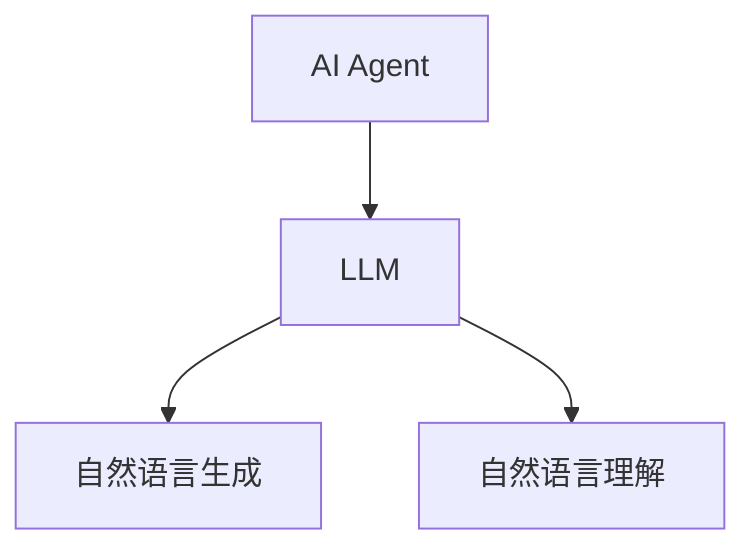

                 

# 构建LLM支持的AI Agent创造性写作系统

> 关键词：大语言模型（LLM）、AI Agent、创造性写作、自然语言处理（NLP）、系统架构

> 摘要：本文详细探讨了如何构建一个由大语言模型（LLM）支持的AI Agent系统，用于创造性写作。通过分析LLM和AI Agent的核心概念，阐述其在创造性写作中的应用，并结合系统架构设计和实际案例，展示如何构建一个高效、智能的创造性写作系统。

---

## 第一部分：构建LLM支持的AI Agent创造性写作系统概述

### 第1章：LLM与AI Agent概述

#### 1.1 LLM与AI Agent的核心概念

##### 1.1.1 大语言模型（LLM）的基本概念
大语言模型（LLM）是基于深度学习的自然语言处理模型，如GPT系列、BERT系列等。这些模型通过大量数据训练，能够理解和生成人类语言。LLM的核心在于其概率生成能力，即根据输入的上下文，预测下一个可能的词或句子。

**关键概念：**
- **训练数据**：模型通过大量文本数据进行预训练，学习语言的结构和模式。
- **生成机制**：基于概率分布生成文本，如解码器结构（如Transformer的解码器）。
- **可微调性**：通过微调（Fine-tuning）可以针对特定任务优化模型。

**数学公式示例：**
LLM的生成过程可以表示为条件概率分布：
$$ P(y|x) $$
其中，$x$ 是输入文本，$y$ 是生成的输出文本。

##### 1.1.2 AI Agent的定义与特点
AI Agent是一种智能代理，能够感知环境并采取行动以实现目标。AI Agent可以是软件程序，能够与用户交互，执行任务，如信息检索、决策支持等。

**关键特点：**
- **自主性**：能够独立执行任务。
- **反应性**：能够实时响应输入。
- **目标导向性**：基于目标采取行动。
- **学习能力**：能够通过经验改进性能。

##### 1.1.3 LLM与AI Agent的结合
将LLM集成到AI Agent中，赋予其自然语言理解和生成能力，使其能够更自然地与用户交互，并执行复杂的语言任务。

**示意图：**

#### 1.2 创造性写作的挑战与机遇

##### 1.2.1 创造性写作的传统方法
传统创造性写作依赖作家的个人经验和灵感，过程耗时且效率较低。AI技术的应用为创造性写作提供了新的可能性。

##### 1.2.2 AI在创造性写作中的优势
- **效率提升**：AI可以快速生成初稿，节省时间。
- **创意拓展**：AI能够提供新的视角和创意。
- **个性化输出**：根据用户需求生成不同风格的作品。

##### 1.2.3 当前存在的问题与挑战
- **创意独特性**：生成的内容可能缺乏原创性。
- **质量控制**：需要确保生成内容的质量。
- **用户接受度**：用户可能对AI生成的内容存在疑虑。

#### 1.3 系统构建的必要性

##### 1.3.1 提升创作效率
通过自动化生成初稿，减少重复劳动，提升创作效率。

##### 1.3.2 拓展创作可能性
AI能够帮助创作者探索新的创意领域，拓展创作边界。

##### 1.3.3 个性化创作需求
满足不同用户对个性化创作的需求，提供定制化服务。

#### 1.4 系统边界与外延

##### 1.4.1 系统的功能边界
系统专注于创造性写作，不涉及其他任务如图像生成或数据分析。

##### 1.4.2 系统的适用范围
适用于文学创作、剧本编写、广告文案等多个领域。

##### 1.4.3 系统的扩展性分析
系统可以通过模块化设计，方便扩展新的功能或集成新的模型。

#### 1.5 核心概念结构与要素

##### 1.5.1 LLM在系统中的作用
- **文本生成**：生成创意内容。
- **上下文理解**：理解用户的输入并生成相关回应。

##### 1.5.2 AI Agent的功能模块
- **输入解析模块**：解析用户的输入需求。
- **生成模块**：生成符合需求的文本。
- **反馈模块**：收集用户反馈并优化生成结果。

##### 1.5.3 系统的核心要素组成
- **用户界面**：与用户交互的界面。
- **LLM引擎**：文本生成的核心模块。
- **AI Agent逻辑**：处理用户请求和生成回应的逻辑模块。

---

## 第二部分：LLM与AI Agent的核心原理

### 第2章：LLM与AI Agent的核心原理

#### 2.1 LLM的工作原理

##### 2.1.1 大语言模型的训练过程
LLM通过监督学习和无监督学习进行训练，包括预训练和微调两个阶段。

##### 2.1.2 概率生成机制
基于概率分布生成文本，如：
$$ P(y|x) = \prod_{i=1}^{n} P(y_i|x_{<i}) $$
其中，$x$ 是输入序列，$y_i$ 是生成的第 $i$ 个词。

##### 2.1.3 模型的可解释性
通过注意力机制等技术，提高模型的可解释性，帮助用户理解生成结果的原因。

#### 2.2 AI Agent的决策机制

##### 2.2.1 任务分解与优先级排序
AI Agent将复杂任务分解为简单任务，并根据优先级排序执行。

##### 2.2.2 多目标优化策略
通过多目标优化算法，在多个目标之间找到平衡点，确保任务高效完成。

##### 2.2.3 动态环境适应性
AI Agent能够实时感知环境变化，调整策略以适应新的情况。

#### 2.3 LLM与AI Agent的协同工作

##### 2.3.1 

---

（由于篇幅限制，其余部分将在后续章节中详细展开。）

