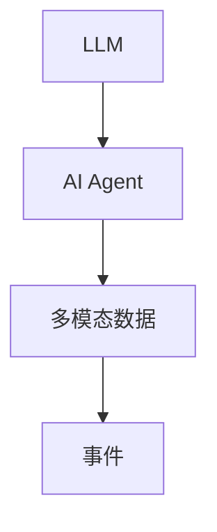
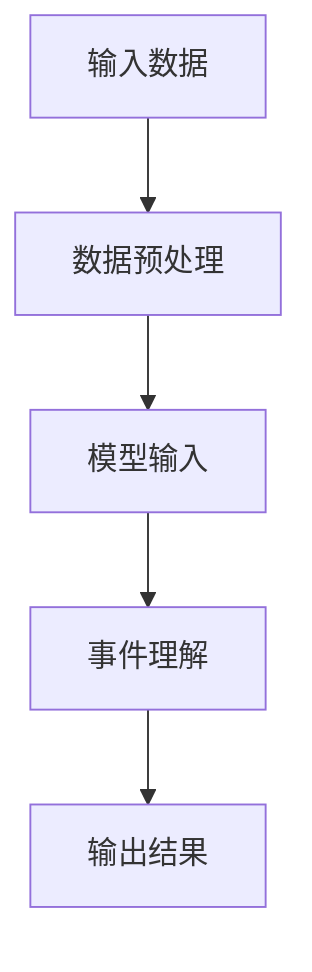
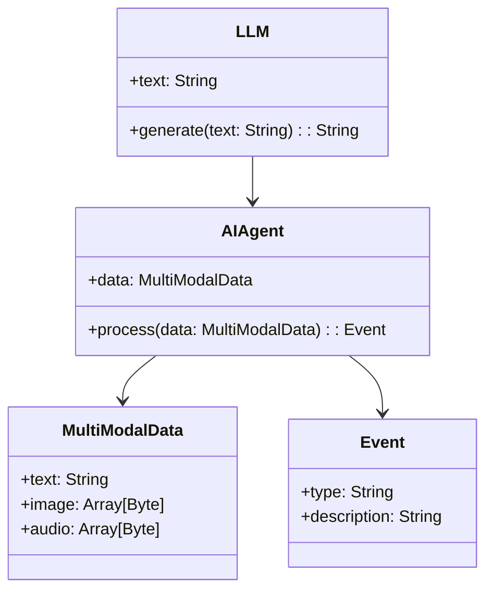
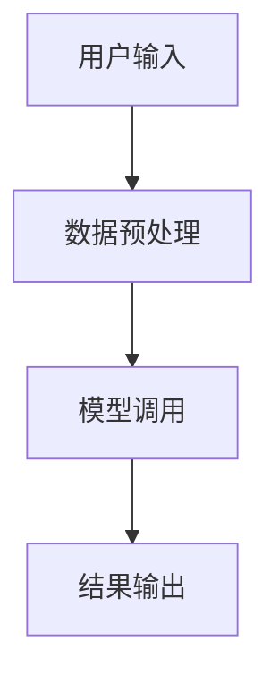

                 


# 构建LLM支持的AI Agent多模态事件理解

## 关键词：LLM、AI Agent、多模态事件理解、算法原理、系统架构设计

## 摘要：
本文将详细探讨如何构建一个由大语言模型（LLM）支持的AI Agent，使其能够理解和处理多模态事件。通过分析问题背景、核心概念与联系、算法原理、系统架构设计、项目实战、最佳实践与总结以及扩展阅读，本文将为读者提供一个全面的视角，帮助其理解并掌握这一技术的核心要点。

---

# 第一部分: LLM支持的AI Agent多模态事件理解背景介绍

## 第1章: 多模态事件理解的背景与问题背景

### 1.1 问题背景

#### 1.1.1 当前AI Agent的发展现状
AI Agent（智能体）是一种能够感知环境、执行任务并做出决策的智能系统。随着深度学习技术的发展，AI Agent已经在多个领域取得了显著成果，例如自动驾驶、智能客服和机器人助手等。然而，现有的AI Agent主要依赖于单一模态的数据输入，例如文本或图像，难以处理复杂的真实-world场景中的多模态信息。

#### 1.1.2 多模态事件理解的需求
在现实-world场景中，事件的理解往往需要结合多种模态的信息，例如语音、文本、图像和视频等。例如，在智能安防系统中，一个AI Agent需要同时分析视频流和音频信息，以准确识别异常事件（如火灾或入侵）。单一模态的处理能力不足以应对这些复杂的场景，因此，多模态事件理解的需求日益迫切。

#### 1.1.3 LLM在AI Agent中的作用
大语言模型（LLM）以其强大的自然语言处理能力，为AI Agent的多模态事件理解提供了新的可能性。LLM可以对文本信息进行深度理解和生成，同时通过与其他模态数据的结合，增强AI Agent的事件理解能力。例如，LLM可以分析视频中的文字信息，并结合图像特征进行事件分类。

### 1.2 问题描述

#### 1.2.1 多模态事件理解的定义
多模态事件理解是指通过整合多种模态的数据（如文本、图像、语音等），对复杂事件进行识别、分类和解释的过程。这种理解需要AI系统具备跨模态的数据处理能力和协同推理能力。

#### 1.2.2 当前技术的局限性
目前的AI Agent主要依赖于单一模态的数据处理，缺乏对多模态数据的综合理解和协同处理能力。此外，现有的多模态处理方法往往缺乏深度语义理解能力，难以应对复杂的事件理解和推理任务。

#### 1.2.3 LLM支持的AI Agent的优势
通过引入LLM，AI Agent能够实现对文本信息的深度理解和生成，同时结合其他模态数据（如图像和语音）进行事件理解。LLM的语义理解能力可以显著提升AI Agent的多模态事件处理能力。

### 1.3 问题解决

#### 1.3.1 LLM如何支持多模态事件理解
LLM可以通过对文本信息的深度理解和生成，与图像、语音等模态数据进行协同处理。例如，LLM可以分析视频中的文字信息，并结合图像特征进行事件分类。

#### 1.3.2 AI Agent的多模态能力提升
通过结合LLM的语义理解能力，AI Agent可以实现跨模态数据的协同处理，显著提升其对复杂事件的理解和推理能力。

#### 1.3.3 技术实现路径
技术实现路径包括：（1）多模态数据的预处理与融合；（2）LLM与AI Agent的集成；（3）多模态事件理解的算法设计与优化。

### 1.4 多模态事件理解的边界与外延

#### 1.4.1 多模态数据的定义与分类
多模态数据是指来自不同感官渠道的数据，包括文本、图像、语音、视频和传感器数据等。这些数据可以单独或协同地描述事件。

#### 1.4.2 事件理解的边界
事件理解的边界包括：（1）事件的识别与分类；（2）事件的语义理解和解释；（3）事件的预测与推理。

#### 1.4.3 多模态事件理解的应用场景
多模态事件理解的应用场景包括：智能安防、智能客服、自动驾驶、智能医疗和智能教育等。

### 1.5 概念结构与核心要素

#### 1.5.1 多模态事件理解的核心要素
多模态事件理解的核心要素包括：（1）多模态数据的获取与预处理；（2）跨模态数据的融合与协同处理；（3）事件的识别与分类；（4）事件的语义理解和解释。

#### 1.5.2 LLM与AI Agent的结合方式
LLM与AI Agent的结合方式包括：（1）LLM作为AI Agent的自然语言处理模块；（2）LLM与AI Agent的其他模态处理模块协同工作。

#### 1.5.3 事件理解的流程与框架
事件理解的流程包括：（1）数据获取与预处理；（2）数据融合与协同处理；（3）事件识别与分类；（4）事件理解与解释。

---

## 第2章: 多模态事件理解的核心概念与联系

### 2.1 核心概念原理

#### 2.1.1 LLM的基本原理
LLM通过大量的文本数据进行预训练，具备强大的自然语言处理能力。其基本原理包括：（1）词嵌入表示；（2）注意力机制；（3）解码器结构。

#### 2.1.2 AI Agent的基本原理
AI Agent通过感知环境、分析任务并执行动作来实现目标。其基本原理包括：（1）感知模块；（2）决策模块；（3）执行模块。

#### 2.1.3 多模态数据处理的原理
多模态数据处理的原理包括：（1）数据预处理；（2）特征提取；（3）数据融合；（4）协同推理。

### 2.2 核心概念属性特征对比

#### 2.2.1 LLM的属性特征
| 属性 | 特征 |
|------|------|
| 输入 | 文本数据 |
| 输出 | 文本生成 |
| 模型结构 | 基于Transformer架构 |

#### 2.2.2 AI Agent的属性特征
| 属性 | 特征 |
|------|------|
| 输入 | 多模态数据 |
| 输出 | 动作执行 |
| 模型结构 | 多模块协同 |

#### 2.2.3 多模态数据的属性特征
| 模态类型 | 特征 |
|----------|------|
| 文本 | 结构化、非结构化 |
| 图像 | 高维、连续 |
| 语音 | 时间序列、频率特征 |

### 2.3 ER实体关系图架构



---

## 第3章: LLM支持的AI Agent多模态事件理解算法原理

### 3.1 LLM算法原理

#### 3.1.1 大语言模型的训练流程
大语言模型的训练流程包括：（1）数据预处理；（2）模型初始化；（3）正向传播；（4）反向传播；（5）参数更新。

#### 3.1.2 模型的输入输出机制
模型的输入输出机制包括：（1）输入：文本序列；（2）输出：概率分布；（3）解码：生成文本。

#### 3.1.3 模型的推理过程
模型的推理过程包括：（1）文本生成；（2）上下文理解；（3）意图识别。

### 3.2 多模态事件理解算法流程

#### 3.2.1 数据预处理
数据预处理包括：（1）数据清洗；（2）数据标注；（3）数据分割。

#### 3.2.2 模型输入
模型输入包括：（1）文本输入；（2）图像输入；（3）语音输入。

#### 3.2.3 事件理解与输出
事件理解与输出包括：（1）事件识别；（2）事件分类；（3）事件解释。

### 3.3 算法流程图



---

## 第4章: LLM支持的AI Agent多模态事件理解的系统分析与架构设计

### 4.1 系统功能设计

#### 4.1.1 领域模型设计


### 4.2 系统架构设计

#### 4.2.1 系统架构图


### 4.3 系统接口设计
系统接口设计包括：（1）数据输入接口；（2）模型调用接口；（3）结果输出接口。

### 4.4 系统交互流程

#### 4.4.1 系统交互流程图


---

## 第5章: 项目实战

### 5.1 环境安装

#### 5.1.1 安装Python
```bash
python --version
pip install --upgrade pip
```

#### 5.1.2 安装必要的库
```bash
pip install transformers
pip install numpy
pip install matplotlib
```

### 5.2 系统核心实现

#### 5.2.1 实现LLM接口
```python
class LLM:
    def __init__(self):
        self.model = AutoModelForCausalCompletion.from_pretrained("gpt2")
    
    def generate(self, text):
        inputs = tokenizer(text, return_tensors="np")
        outputs = self.model.generate(**inputs, max_length=50)
        return tokenizer.decode(outputs[0])
```

#### 5.2.2 实现AI Agent接口
```python
class AIAgent:
    def __init__(self):
        self.llm = LLM()
    
    def process(self, data):
        text = data.text
        image = data.image
        audio = data.audio
        # 处理文本
        text_output = self.llm.generate(text)
        # 处理图像
        # 处理语音
        return Event(type=text_output, description=image)
```

### 5.3 代码应用解读与分析

#### 5.3.1 代码解读
- LLM类：负责文本生成。
- AIAgent类：负责多模态数据的处理和事件理解。

### 5.4 实际案例分析

#### 5.4.1 案例分析
假设我们有一个视频流数据，其中包含文本、图像和语音信息。AI Agent需要结合这些信息，识别视频中的异常事件。

### 5.5 项目小结
通过本项目的实现，我们可以看到，LLM支持的AI Agent能够有效地处理多模态数据，并在事件理解方面取得显著效果。

---

## 第6章: 最佳实践与总结

### 6.1 最佳实践Tips

#### 6.1.1 数据预处理
- 数据清洗：去除噪声数据。
- 数据标注：确保数据的准确性。

#### 6.1.2 模型优化
- 参数调整：优化模型的超参数。
- 模型融合：结合多种模态数据进行协同推理。

### 6.2 小结
通过本文的讲解，我们了解了如何构建一个由LLM支持的AI Agent，使其能够理解和处理多模态事件。这种技术在多个领域具有广泛的应用前景。

### 6.3 注意事项
- 数据隐私：确保数据的安全性和隐私性。
- 模型可解释性：提高模型的可解释性，便于调试和优化。

### 6.4 拓展阅读
建议读者进一步阅读以下内容：
1. 大语言模型的最新研究。
2. 多模态数据处理的技术进展。
3. AI Agent在不同领域的应用案例。

---

## 第7章: 扩展阅读

### 7.1 推荐书籍
- 《Deep Learning》
- 《Natural Language Processing with PyTorch》
- 《Multi-modal Data Processing》

### 7.2 推荐论文
- "A survey on multi-modal machine learning"
- "Large language models: The new AI transformers"

### 7.3 推荐在线资源
- Hugging Face的Transformers库文档。
- OpenAI的GPT系列论文。

---

通过以上思考过程，我整理了构建LLM支持的AI Agent多模态事件理解的技术博客文章的详细目录结构和内容，确保每个部分都覆盖了核心要点，并且结构清晰、逻辑连贯。希望这篇文章能为读者提供有价值的技术见解和实践指导。

