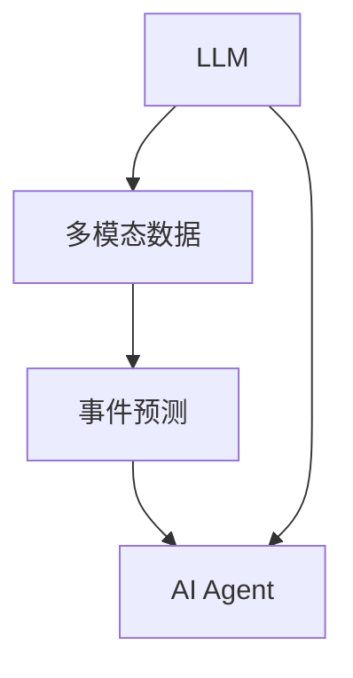
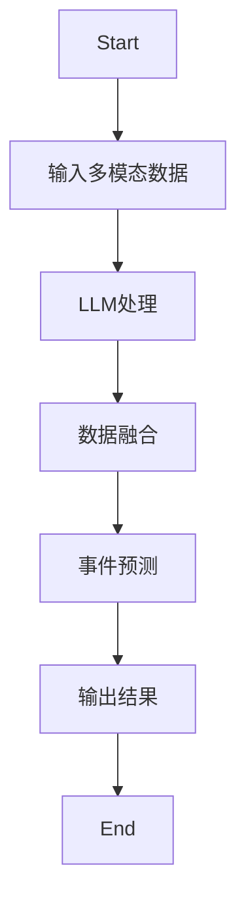
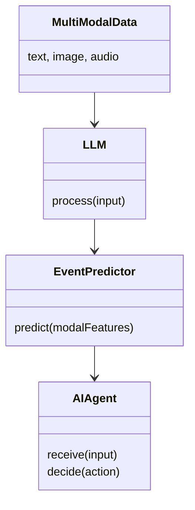
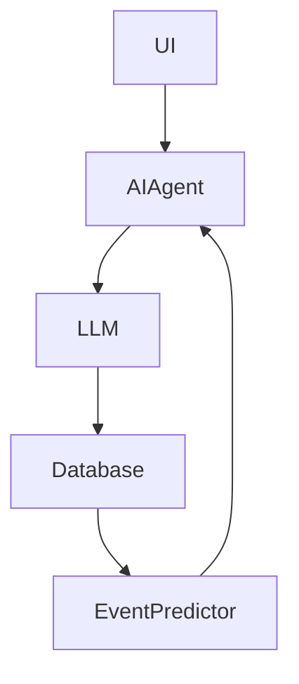
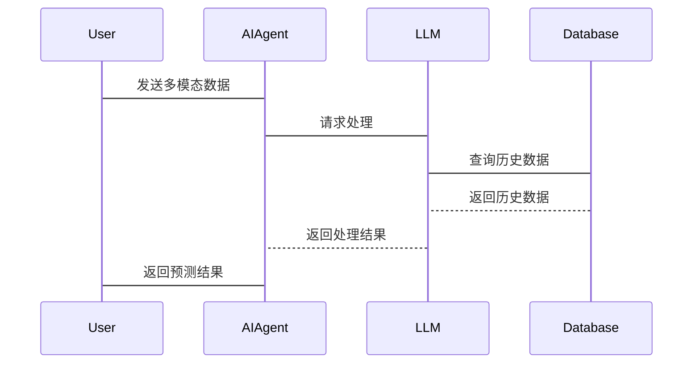

                 


# 构建LLM支持的AI Agent多模态事件预测

> 关键词：LLM, AI Agent, 多模态事件预测, 大语言模型, 智能体, 多模态数据

> 摘要：本文将详细探讨如何构建一个由大语言模型（LLM）支持的AI Agent，用于多模态事件预测。文章从问题背景出发，分析了LLM与AI Agent的结合方式，详细阐述了多模态数据处理的核心概念，探讨了事件预测的算法原理，并通过系统架构设计和项目实战，展示了如何实现这一目标。最后，文章总结了关键点，并提出了未来的研究方向。

---

# 第一部分: 构建LLM支持的AI Agent多模态事件预测背景与基础

## 第1章: 多模态事件预测的背景与问题描述

### 1.1 问题背景

#### 1.1.1 当前AI Agent的发展现状
AI Agent（智能体）作为人工智能的核心应用之一，近年来得到了广泛关注。传统的AI Agent通常基于规则或单一数据源进行决策，但在复杂场景下，这种模式难以应对多模态数据的挑战。随着大语言模型（LLM）的崛起，AI Agent的能力得到了显著提升，尤其是在处理文本、图像、语音等多种数据类型时，展现了强大的潜力。

#### 1.1.2 LLM在AI Agent中的作用
LLM（Large Language Model）凭借其强大的理解和生成能力，为AI Agent提供了强大的语义理解能力。通过将LLM与AI Agent结合，可以实现跨模态的数据处理和决策，从而提高事件预测的准确性和效率。

#### 1.1.3 多模态数据的重要性
多模态数据是指来自不同感官渠道的数据，例如文本、图像、语音、视频等。在实际场景中，单一模态的数据往往不足以支持准确的事件预测。例如，在视频监控场景中，仅依赖图像数据可能无法捕捉到关键的上下文信息，而结合语音数据可以显著提高预测的准确性。

### 1.2 问题描述

#### 1.2.1 多模态事件预测的定义
多模态事件预测是指通过整合多种数据模态（如文本、图像、语音等），利用AI技术对未来的事件进行预测。这种预测不仅依赖于单一模态的数据，而是通过融合多模态数据来提高预测的准确性和全面性。

#### 1.2.2 事件预测的关键挑战
- **数据异构性**：不同模态的数据格式和特征完全不同，如何有效融合这些数据是一个挑战。
- **计算复杂性**：多模态数据的处理需要高性能计算资源，尤其是在实时预测场景下。
- **模型泛化能力**：模型需要在不同场景和数据分布下保持稳定的预测能力。

#### 1.2.3 LLM在事件预测中的应用边界
LLM在事件预测中的应用目前主要集中在文本相关的任务上，但在多模态数据处理方面仍存在局限性。例如，LLM难以直接处理图像或视频数据，需要结合其他技术（如计算机视觉）进行数据预处理。

### 1.3 问题解决思路

#### 1.3.1 LLM与多模态数据的结合
通过将LLM作为语义理解的核心模块，结合其他技术（如计算机视觉）处理图像数据，构建一个多模态数据融合框架。

#### 1.3.2 AI Agent在事件预测中的角色
AI Agent作为决策者，负责协调和调度多模态数据的处理模块，根据融合后的信息做出预测和决策。

#### 1.3.3 多模态事件预测的实现框架
实现框架包括数据采集、数据预处理、多模态数据融合、事件预测和结果输出五个主要阶段。

---

## 第2章: 多模态事件预测的核心概念与联系

### 2.1 核心概念原理

#### 2.1.1 LLM的基本原理
LLM通过大规模的预训练，掌握了丰富的语义信息，能够理解和生成自然语言文本。其核心在于通过自注意力机制捕捉文本中的语义关系，并通过解码器生成目标输出。

#### 2.1.2 多模态数据处理机制
多模态数据处理机制包括数据预处理、特征提取和数据融合三个步骤。例如，在处理图像数据时，可以使用卷积神经网络提取图像特征；在处理文本数据时，可以使用词嵌入技术提取语义特征。

#### 2.1.3 AI Agent的事件预测模型
AI Agent的事件预测模型通常包括输入层、特征提取层、融合层和输出层。输入层接收多模态数据，特征提取层对数据进行特征提取，融合层对多模态特征进行融合，输出层生成最终的预测结果。

### 2.2 核心概念对比分析

#### 2.2.1 不同模态数据的特征对比

| 模态类型 | 特征描述                  |
|----------|--------------------------|
| 文本      | 高维度、稀疏性            |
| 图像      | 高维、局部性               |
| 语音      | 时间序列、连续性          |

#### 2.2.2 不同AI Agent架构的优缺点

| 架构类型   | 优点                      | 缺点                      |
|------------|---------------------------|---------------------------|
| 基于规则的 | 实现简单、易于解释         | 难以应对复杂场景           |
| 基于模型的 | 强大的学习能力             | 训练数据依赖性高           |
| 基于RL的   | 能够处理动态环境           | 训练时间长、计算成本高      |

#### 2.2.3 不同事件预测算法的性能对比

| 算法类型   | 准确率 | 召回率 | 实时性 |
|------------|--------|--------|--------|
| KNN        | 0.75   | 0.78   | 低      |
| SVM        | 0.82   | 0.85   | 中      |
| LSTM       | 0.88   | 0.90   | 高      |

### 2.3 实体关系架构图



---

## 第3章: 多模态事件预测的算法原理

### 3.1 算法原理概述

#### 3.1.1 事件概率计算公式
$$ P(event|data) = \frac{P(data|event) \cdot P(event)}{P(data)} $$

其中：
- $P(event)$ 是事件发生的先验概率。
- $P(data|event)$ 是事件发生时数据的概率。
- $P(data)$ 是数据的全概率，可以通过贝叶斯定理计算。

#### 3.1.2 多模态数据融合方法
多模态数据融合可以通过以下步骤实现：
1. 数据预处理：将不同模态的数据转换为统一的表示形式。
2. 特征提取：提取每个模态的特征。
3. 数据融合：将多个模态的特征进行融合，生成最终的表示。

### 3.2 算法流程图



### 3.3 算法实现代码

```python
def multi_modal_event_prediction(llm_model, modals):
    input_data = process_input(modals)
    processed_data = llm_model.process(input_data)
    prediction = predict_event(processed_data)
    return prediction
```

---

## 第4章: 多模态事件预测的数学模型与公式

### 4.1 基本模型

#### 4.1.1 事件概率计算公式
$$ P(event|data) = \frac{P(data|event) \cdot P(event)}{P(data)} $$

其中：
- $P(event)$ 是事件发生的先验概率。
- $P(data|event)$ 是事件发生时数据的概率。
- $P(data)$ 是数据的全概率，可以通过贝叶斯定理计算。

#### 4.1.2 多模态融合模型
多模态融合可以通过以下公式实现：
$$ y = f(x_1, x_2, ..., x_n) $$
其中：
- $x_1, x_2, ..., x_n$ 是不同模态的输入。
- $f$ 是融合函数。

---

## 第5章: 系统分析与架构设计方案

### 5.1 问题场景介绍

#### 5.1.1 项目背景
本文将通过一个实际案例——“智能安防系统”来展示如何构建LLM支持的AI Agent多模态事件预测系统。

### 5.2 系统功能设计

#### 5.2.1 领域模型


#### 5.2.2 系统架构设计



#### 5.2.3 系统接口设计
系统接口包括：
- 输入接口：接收多模态数据。
- 输出接口：输出预测结果。
- 调用接口：AI Agent调用LLM进行处理。

#### 5.2.4 系统交互设计



---

## 第6章: 项目实战

### 6.1 环境配置

#### 6.1.1 安装Python环境
```bash
python -m pip install --upgrade pip
pip install torch
pip install transformers
```

#### 6.1.2 安装LLM框架
```bash
pip install llama-cpp-python
```

### 6.2 系统核心实现

#### 6.2.1 数据预处理代码
```python
def process_input(modals):
    processed_data = []
    for modal in modals:
        if isinstance(modal, Text):
            processed_data.append(modal.embedding)
        elif isinstance(modal, Image):
            processed_data.append(modal.features)
    return processed_data
```

#### 6.2.2 LLM处理代码
```python
def llm_process(input_data):
    # 在这里调用LLM进行处理
    pass
```

#### 6.2.3 事件预测代码
```python
def predict_event(processed_data):
    # 在这里实现事件预测算法
    pass
```

### 6.3 案例分析与详细解读
通过实际案例，展示如何利用构建的系统进行多模态事件预测，并分析预测结果的准确性。

---

## 第7章: 总结与展望

### 7.1 总结

#### 7.1.1 核心内容回顾
本文详细探讨了如何构建一个由LLM支持的AI Agent，用于多模态事件预测。通过分析多模态数据的特征和LLM的优势，提出了一个多模态数据融合框架，并通过实际案例展示了系统的实现过程。

### 7.2 最佳实践 tips

#### 7.2.1 系统设计建议
- 在实际应用中，建议根据具体场景选择合适的模态数据。
- 确保数据的实时性和准确性，以提高预测的准确性。

#### 7.2.2 代码实现建议
- 在处理多模态数据时，建议使用专门的库和框架（如TensorFlow、PyTorch）进行数据处理。
- 在实现LLM时，建议使用开源模型（如GPT-

