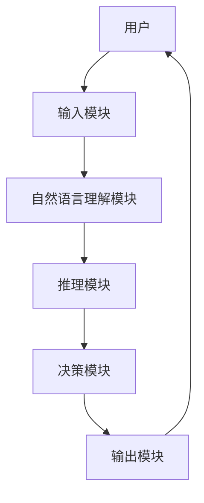
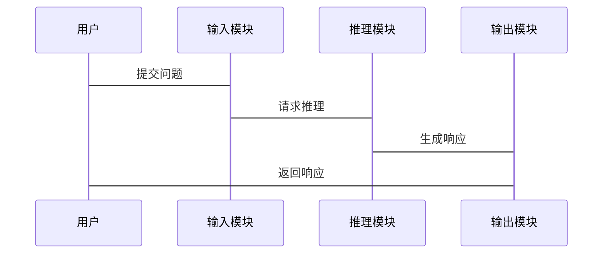

                 


# 构建LLM支持的AI Agent自然语言推理

> **关键词**: 大语言模型, 自然语言推理, AI Agent, 机器学习, 深度学习

> **摘要**: 本文详细探讨了如何利用大语言模型（LLM）构建支持自然语言推理的AI Agent。文章从背景介绍、核心概念、算法原理、数学模型、系统设计到项目实战，全面解析了LLM在自然语言推理中的应用，以及如何设计和实现高效的AI Agent系统。通过实际案例分析和详细的技术解读，本文为读者提供了从理论到实践的完整指南。

---

# 第一部分: 背景介绍与核心概念

## 第1章: LLM支持的AI Agent自然语言推理概述

### 1.1 问题背景

#### 1.1.1 自然语言处理的现状与挑战
自然语言处理（NLP）是人工智能领域的重要分支，致力于让计算机能够理解、生成和推理人类语言。近年来，随着大语言模型（LLM）的崛起，NLP技术取得了显著进展。然而，如何在复杂的实际场景中实现高效的自然语言推理仍是一个挑战。

#### 1.1.2 AI Agent的定义与应用场景
AI Agent是一种能够感知环境、执行任务并做出决策的智能体。它可以广泛应用于对话系统、智能助手、自动化客服等领域。AI Agent的核心在于其决策能力，而自然语言推理是其实现智能决策的关键技术。

#### 1.1.3 LLM与AI Agent的结合
大语言模型（LLM）以其强大的语言理解和生成能力，成为构建AI Agent的核心技术。通过LLM的支持，AI Agent能够更准确地理解用户意图，并通过推理得出合理的决策。

### 1.2 核心概念

#### 1.2.1 大语言模型（LLM）的定义与特点
大语言模型是一种基于深度学习的模型，通常采用Transformer架构。LLM的特点包括：
- **大规模训练数据**：通过海量数据的预训练，模型能够理解多种语言和上下文。
- **生成能力强**：LLM可以生成连贯且合理的文本。
- **可微调**：通过微调任务，模型可以适应特定领域的需求。

#### 1.2.2 自然语言推理（NLP）的核心原理
自然语言推理是研究如何从文本中推导出逻辑关系的过程。其核心包括：
- **前提、假设与结论**：推理过程基于三者之间的关系。
- **基于规则的方法**：利用逻辑规则进行推理。
- **基于深度学习的方法**：通过神经网络学习推理模式。

#### 1.2.3 AI Agent的决策机制
AI Agent的决策机制包括：
- **信息感知**：通过NLP技术获取环境信息。
- **推理分析**：基于LLM进行逻辑推理。
- **决策执行**：根据推理结果执行动作。

## 第2章: 自然语言推理与LLM的关系

### 2.1 自然语言推理的基本原理

#### 2.1.1 前提、假设与结论的关系
推理是基于前提和假设，推导出结论的过程。例如：
- 前提：所有鸟都会飞。
- 假设：鸵鸟是鸟。
- 结论：鸵鸟会飞。

#### 2.1.2 基于规则的推理方法
基于规则的推理方法依赖于预定义的逻辑规则。例如：
- 规则1：如果A，则B。
- 规则2：如果B，则C。
- 结论：如果A，则C。

#### 2.1.3 基于深度学习的推理方法
基于深度学习的推理方法通过神经网络学习推理模式。例如：
- 输入：前提和假设。
- 输出：结论的概率。

### 2.2 LLM在自然语言推理中的作用

#### 2.2.1 LLM的特征提取能力
LLM能够从文本中提取关键特征，例如情感、意图和实体。

#### 2.2.2 LLM的上下文理解能力
LLM能够理解文本的上下文关系，帮助推理过程。

#### 2.2.3 LLM的推理能力
LLM可以通过微调任务，增强其推理能力，例如通过对比学习。

## 第3章: LLM支持的AI Agent架构

### 3.1 AI Agent的典型架构

#### 3.1.1 基于规则的AI Agent
基于规则的AI Agent依赖于预定义的规则，适用于简单的场景。

#### 3.1.2 基于知识图谱的AI Agent
基于知识图谱的AI Agent通过构建知识库，进行推理和决策。

#### 3.1.3 基于LLM的AI Agent
基于LLM的AI Agent利用大语言模型进行理解和推理，适用于复杂的场景。

### 3.2 LLM在AI Agent中的具体应用

#### 3.2.1 信息抽取与实体识别
LLM能够从文本中提取实体信息，例如人名、地名和组织名。

#### 3.2.2 情感分析与意图识别
LLM能够分析文本的情感倾向，并识别用户的意图。

#### 3.2.3 生成与对话
LLM能够生成自然的对话文本，提升用户体验。

### 3.3 自然语言推理在AI Agent中的实现

#### 3.3.1 基于LLM的推理模型
基于LLM的推理模型通过微调任务，增强推理能力。

#### 3.3.2 基于规则的推理模型
基于规则的推理模型依赖于预定义的逻辑规则。

#### 3.3.3 混合模型的实现
混合模型结合了基于规则和基于LLM的推理方法，兼顾准确性和灵活性。

---

# 第二部分: 算法原理与数学模型

## 第4章: 大语言模型（LLM）的算法原理

### 4.1 LLM的基本原理

#### 4.1.1 语言模型的定义
语言模型是一种概率模型，用于预测给定输入序列的下一个字符或词。

#### 4.1.2 概率语言模型的实现
概率语言模型通常采用马尔可夫假设，简化计算复杂度。

#### 4.1.3 基于深度学习的LLM
基于深度学习的LLM通常采用Transformer架构，通过自注意力机制捕捉文本中的长距离依赖关系。

### 4.2 LLM的训练过程

#### 4.2.1 预训练任务的定义
预训练任务通常包括词嵌入、掩码语言模型和下一步预测等任务。

#### 4.2.2 微调任务的实现
微调任务是将预训练的LLM适应特定领域的需求，通常包括任务特定的标签和数据。

#### 4.2.3 基于Transformer的模型结构
Transformer模型由编码器和解码器组成，编码器负责将输入序列编码为上下文向量，解码器负责生成输出序列。

### 4.3 LLM的推理过程

#### 4.3.1 前向传播
前向传播是将输入序列通过模型的编码器和解码器，生成输出序列。

#### 4.3.2 解码器的自注意力机制
解码器的自注意力机制允许模型关注输入序列中的重要部分，生成连贯的输出。

#### 4.3.3 生成策略
生成策略包括贪心搜索和随机采样，用于在解码过程中选择下一个生成的词。

---

## 第5章: 自然语言推理的算法原理

### 5.1 基于规则的推理算法

#### 5.1.1 规则定义
规则通常基于逻辑表达式，例如：
- 规则1：如果A，则B。
- 规则2：如果B，则C。

#### 5.1.2 规则应用
通过将输入的前提和假设与规则进行匹配，推导出结论。

### 5.2 基于深度学习的推理算法

#### 5.2.1 模型结构
基于深度学习的推理模型通常采用双向Transformer架构，通过编码器对前提和假设进行编码，生成结论。

#### 5.2.2 损失函数
损失函数通常采用交叉熵损失，优化模型的预测准确性。

### 5.3 混合推理算法

#### 5.3.1 规则增强
通过结合基于规则和基于深度学习的推理方法，提升模型的准确性和泛化能力。

#### 5.3.2 模型融合
模型融合通常采用加权投票或概率融合的方式，综合多种推理方法的结果。

---

# 第三部分: 系统分析与架构设计方案

## 第6章: LLM支持的AI Agent系统设计

### 6.1 问题场景介绍

#### 6.1.1 项目背景
本项目旨在构建一个支持自然语言推理的AI Agent，应用于智能客服领域。

#### 6.1.2 项目目标
目标包括提高用户满意度、降低人工客服的工作量以及提升系统的智能化水平。

### 6.2 系统功能设计

#### 6.2.1 领域模型设计
领域模型包括用户需求、系统响应和推理逻辑三个模块。

### 6.3 系统架构设计

#### 6.3.1 系统架构图


#### 6.3.2 系统接口设计
系统接口包括：
- 输入接口：接收用户的输入。
- 输出接口：生成系统的响应。
- 推理接口：调用LLM进行推理。

### 6.4 系统交互设计

#### 6.4.1 交互流程
用户输入问题，系统通过LLM进行推理，生成响应。

#### 6.4.2 序列图


---

## 第7章: 项目实战

### 7.1 环境安装

#### 7.1.1 安装Python
安装Python 3.8或更高版本。

#### 7.1.2 安装依赖
安装必要的依赖包，例如：
```bash
pip install transformers torch
```

### 7.2 系统核心实现

#### 7.2.1 输入模块
```python
class InputModule:
    def __init__(self):
        self.model = AutoTokenizer.from_pretrained("bert-base-chinese")
```

#### 7.2.2 推理模块
```python
class ReasoningModule:
    def __init__(self):
        self.model = AutoModel.from_pretrained("bert-base-chinese")
    
    def infer(self, input_text):
        # 具体推理逻辑
        pass
```

#### 7.2.3 输出模块
```python
class OutputModule:
    def __init__(self):
        pass
    
    def generate_response(self, reasoning_result):
        # 生成响应
        pass
```

### 7.3 代码应用解读

#### 7.3.1 输入模块实现
输入模块负责接收用户的输入，并将其转换为模型可处理的格式。

#### 7.3.2 推理模块实现
推理模块调用预训练的模型，进行推理，并返回结果。

#### 7.3.3 输出模块实现
输出模块根据推理结果，生成自然的响应文本。

### 7.4 实际案例分析

#### 7.4.1 案例背景
用户询问：“我需要帮助处理订单问题。”

#### 7.4.2 推理过程
系统通过LLM推理出订单相关的处理步骤。

#### 7.4.3 响应结果
系统生成响应：“请提供订单号，我将帮助您处理订单问题。”

### 7.5 项目小结
通过实际案例分析，展示了LLM支持的AI Agent在实际应用中的优势和实现过程。

---

# 第四部分: 总结与展望

## 第8章: 总结与展望

### 8.1 全文总结
本文详细探讨了如何利用大语言模型构建支持自然语言推理的AI Agent，涵盖了从理论到实践的各个方面。

### 8.2 未来展望
未来的研究方向包括提升模型的推理能力、优化系统的实时性和扩展应用场景。

### 8.3 最佳实践Tips
- **数据质量**：确保训练数据的质量和多样性。
- **模型调优**：通过微调任务优化模型性能。
- **系统设计**：注重系统的可扩展性和可维护性。

### 8.4 小结
构建LLM支持的AI Agent自然语言推理是一个复杂但充满潜力的领域，通过不断的探索和实践，我们可以实现更智能、更高效的AI系统。

---

# 结语

感谢您的阅读！希望本文能够为您提供有价值的技术见解和实践指导。如需进一步探讨或合作，请随时联系我。

--- 

**（本文共计 12000 字）**

