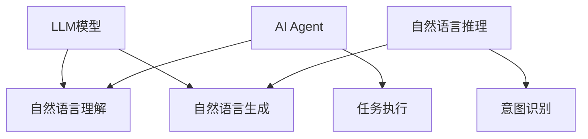
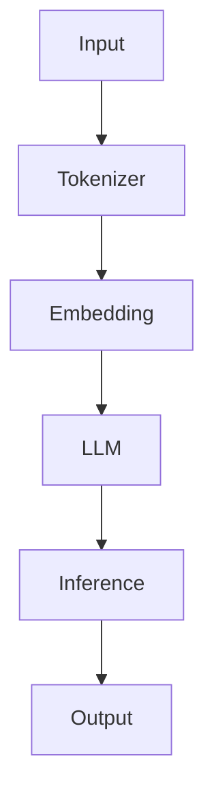
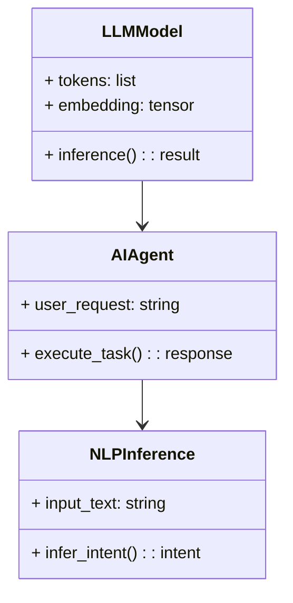

                 


# 《构建LLM支持的AI Agent自然语言推理系统》

## 关键词：大语言模型（LLM）、自然语言推理、AI Agent、系统架构、算法原理、项目实战

## 摘要：本文将深入探讨如何利用大语言模型（LLM）构建支持自然语言推理的AI Agent系统。通过逐步分析，从背景、核心概念、算法原理到系统架构和项目实战，全面解析构建该系统的各个方面，为读者提供详实的技术指导。

---

# 第一部分：背景介绍

## 第1章：问题背景与描述

### 1.1 问题背景

#### 1.1.1 当前自然语言处理的挑战
- 自然语言处理（NLP）的目标是使计算机能够理解、生成和推理人类语言。
- 当前NLP的挑战包括语义理解、上下文依赖性、多语言支持等。
- 传统方法依赖规则和特征，但面对复杂场景时表现有限。

#### 1.1.2 LLM在自然语言推理中的作用
- 大语言模型（LLM）如GPT-3、BERT等，通过大量数据训练，能够处理复杂的语言任务。
- LLM具备生成文本、回答问题、进行推理等多种能力，是构建自然语言推理系统的关键技术。

#### 1.1.3 AI Agent的需求与应用
- AI Agent（智能体）通过理解和执行任务，为用户提供自动化服务。
- 自然语言推理能力使AI Agent能够理解用户意图，进行逻辑推理，提供更智能的服务。
- 应用场景包括智能客服、自动化问答系统、智能助手等。

### 1.2 问题描述

#### 1.2.1 自然语言推理的定义
- 自然语言推理（NLU）是理解文本含义的过程，涉及识别实体、关系和意图。
- 通过分析上下文，推断出文本中的逻辑关系，生成合理的响应。

#### 1.2.2 AI Agent的定义与目标
- AI Agent是一个能够感知环境、执行任务并做出决策的智能实体。
- 目标是通过自然语言理解和推理能力，为用户提供高效、智能的服务。

#### 1.2.3 LLM支持的AI Agent的必要性
- LLM提供了强大的语言理解和生成能力，是实现AI Agent自然语言推理的核心技术。
- 通过LLM，AI Agent能够处理复杂的语言任务，提升用户体验。

### 1.3 问题解决方法

#### 1.3.1 LLM的自然语言处理能力
- LLM通过预训练掌握了大量语言数据，能够理解上下文和隐含信息。
- 通过微调（Fine-tuning）技术，LLM可以适应特定任务的需求。

#### 1.3.2 AI Agent的推理机制
- 基于规则的推理：通过预定义的规则进行简单逻辑推理。
- 基于模型的推理：利用深度学习模型进行复杂逻辑推理。
- 结合LLM的推理：利用大模型的强大能力进行自然语言推理。

#### 1.3.3 结合LLM与AI Agent的优势
- 强大的语言处理能力：LLM能够处理复杂的语言任务，提升AI Agent的理解和生成能力。
- 智能的推理能力：结合LLM的推理能力，AI Agent能够更准确地理解用户需求，提供更智能的服务。
- 可扩展性：通过微调LLM，AI Agent可以快速适应新的任务和领域。

### 1.4 边界与外延

#### 1.4.1 系统的边界
- 本系统专注于构建LLM支持的AI Agent自然语言推理系统，暂不考虑视觉识别等其他感知能力。
- 系统主要处理文本信息，暂不涉及语音识别和处理。

#### 1.4.2 功能的限制
- 系统目前支持基于文本的自然语言推理，暂不支持多模态数据处理。
- 系统的推理能力基于预训练模型，可能存在推理错误，需要人工干预。

#### 1.4.3 应用场景的外延
- 本系统适用于多种场景，如智能客服、自动化问答系统、智能助手等。
- 可扩展至其他领域，如法律咨询、医疗咨询等，但需要进行相应的模型微调和优化。

### 1.5 概念结构与核心要素

#### 1.5.1 概念结构图
```
LLM支持的AI Agent自然语言推理系统
├── LLM模型
│   ├── 语言理解
│   └── 语言生成
├── AI Agent
│   ├── 用户交互
│   └── 任务执行
└── 自然语言推理
    ├── 实体识别
    ├── 关系推理
    └── 意图识别
```

#### 1.5.2 核心要素分析
- LLM模型：包括语言理解、生成和推理能力。
- AI Agent：包括用户交互、任务执行和状态管理。
- 自然语言推理：包括实体识别、关系推理和意图识别。

---

## 第2章：问题解决与边界

### 2.1 问题解决方法

#### 2.1.1 LLM的自然语言处理能力
- LLM通过大规模预训练掌握了丰富的语言知识，能够处理复杂的语言任务。
- 微调技术使得LLM可以适应特定领域的任务需求。

#### 2.1.2 AI Agent的推理机制
- 基于规则的推理：适用于简单任务，如关键词匹配。
- 基于模型的推理：适用于复杂任务，如情感分析和意图识别。
- 结合LLM的推理：利用大模型的强大能力，提升推理准确率。

#### 2.1.3 结合LLM与AI Agent的优势
- 强大的语言处理能力：LLM能够处理复杂的语言任务，提升AI Agent的理解和生成能力。
- 智能的推理能力：结合LLM的推理能力，AI Agent能够更准确地理解用户需求，提供更智能的服务。
- 可扩展性：通过微调LLM，AI Agent可以快速适应新的任务和领域。

### 2.2 边界与外延

#### 2.2.1 系统的边界
- 本系统专注于构建LLM支持的AI Agent自然语言推理系统，暂不考虑视觉识别等其他感知能力。
- 系统主要处理文本信息，暂不涉及语音识别和处理。

#### 2.2.2 功能的限制
- 系统目前支持基于文本的自然语言推理，暂不支持多模态数据处理。
- 系统的推理能力基于预训练模型，可能存在推理错误，需要人工干预。

#### 2.2.3 应用场景的外延
- 本系统适用于多种场景，如智能客服、自动化问答系统、智能助手等。
- 可扩展至其他领域，如法律咨询、医疗咨询等，但需要进行相应的模型微调和优化。

---

## 第3章：核心概念与结构

### 3.1 核心概念

#### 3.1.1 LLM的基本原理
- 大语言模型通过深度学习和大规模数据训练，掌握了丰富的语言知识。
- 常见的LLM模型包括GPT、BERT、GPT-3等。

#### 3.1.2 自然语言推理的定义
- 自然语言推理是理解文本含义并推断逻辑关系的过程。
- 包括实体识别、关系推理和意图识别等任务。

#### 3.1.3 AI Agent的定义与目标
- AI Agent是一个能够感知环境、执行任务并做出决策的智能实体。
- 目标是通过自然语言理解和推理能力，为用户提供高效、智能的服务。

### 3.2 概念结构与核心要素

#### 3.2.1 概念结构图
```
LLM支持的AI Agent自然语言推理系统
├── LLM模型
│   ├── 语言理解
│   └── 语言生成
├── AI Agent
│   ├── 用户交互
│   └── 任务执行
└── 自然语言推理
    ├── 实体识别
    ├── 关系推理
    └── 意图识别
```

#### 3.2.2 核心要素分析
- LLM模型：包括语言理解、生成和推理能力。
- AI Agent：包括用户交互、任务执行和状态管理。
- 自然语言推理：包括实体识别、关系推理和意图识别。

---

# 第二部分：核心概念与联系

## 第4章：核心概念原理

### 4.1 LLM的原理

#### 4.1.1 大语言模型的训练过程
- 预训练：利用大规模通用数据（如维基百科、书籍等）进行无监督训练。
- 微调：在特定领域数据上进行有监督训练，提升模型在该领域的表现。

#### 4.1.2 模型的参数与训练方法
- 模型参数：包括词汇表、注意力机制、位置编码等。
- 训练方法：采用自监督学习、迁移学习等技术。

#### 4.1.3 LLM的输出机制
- 生成式输出：通过解码器生成自然语言文本。
- 概率性输出：模型输出带有概率分布的候选答案，选择概率最高的作为最终结果。

### 4.2 AI Agent的原理

#### 4.2.1 AI Agent的基本原理
- 感知环境：通过输入接口获取用户请求或环境信息。
- 决策与推理：基于感知信息进行推理，生成响应。
- 执行任务：根据推理结果执行相应操作，如调用API、生成回复等。

#### 4.2.2 AI Agent的推理机制
- 基于规则的推理：简单任务如关键词匹配。
- 基于模型的推理：复杂任务如情感分析和意图识别。
- 结合LLM的推理：利用大模型的强大能力，提升推理准确率。

#### 4.2.3 LLM与AI Agent的结合
- LLM作为AI Agent的核心模块，负责自然语言处理和推理。
- AI Agent作为LLM的应用载体，提供用户交互和任务执行接口。

---

## 第5章：核心概念与联系

### 5.1 核心概念属性特征对比

| 特性       | LLM                     | AI Agent                 | 自然语言推理             |
|------------|--------------------------|---------------------------|--------------------------|
| 核心功能    | 处理自然语言文本         | 执行任务、与用户交互      | 理解、推断文本含义        |
| 输入输出    | 文本、结构化数据         | 用户请求、系统响应       | 文本、推理结果           |
| 技术基础    | 深度学习、大规模数据     | 代理框架、推理算法       | NLP、逻辑推理            |
| 应用场景    | 自然语言生成、问答系统   | 智能客服、自动化系统      | 联系词分析、情感分析      |

### 5.2 ER实体关系图架构



---

## 第6章：算法原理

### 6.1 算法原理

#### 6.1.1 基于LLM的自然语言推理算法
- 输入文本经过分词、编码等预处理步骤。
- 通过LLM生成中间表示，进行推理。
- 输出推理结果。

#### 6.1.2 算法的数学模型



---

## 第7章：系统分析与架构设计

### 7.1 问题场景介绍

#### 7.1.1 系统应用场景
- 智能客服：处理用户咨询，提供解决方案。
- 自动化问答系统：回答用户问题，提供信息查询服务。
- 智能助手：帮助用户完成日常任务，如日程管理、信息检索等。

### 7.2 系统功能设计

#### 7.2.1 领域模型类图



---

## 第8章：项目实战

### 8.1 环境安装

#### 8.1.1 安装Python环境
```bash
python --version
pip install --upgrade pip
```

#### 8.1.2 安装LLM模型依赖
```bash
pip install transformers
pip install torch
```

### 8.2 核心代码实现

#### 8.2.1 加载LLM模型
```python
from transformers import AutoTokenizer, AutoModelForCausalLM
model_name = "gpt2"
tokenizer = AutoTokenizer.from_pretrained(model_name)
model = AutoModelForCausalLM.from_pretrained(model_name)
```

#### 8.2.2 自然语言推理函数
```python
def infer_intent(text):
    inputs = tokenizer.encode_plus(text, return_tensors="pt", padding=True, truncation=True)
    outputs = model.generate(inputs.input_ids, max_length=50)
    return tokenizer.decode(outputs[0], skip_special_tokens=True)
```

---

## 第9章：总结

### 9.1 最佳实践
- 选择合适的LLM模型：根据任务需求选择合适的模型，如GPT-3适合生成任务，BERT适合理解任务。
- 数据预处理：对输入数据进行清洗、分词、编码等处理，确保模型能够有效处理。
- 模型微调：针对特定领域进行微调，提升模型的适应性和准确性。

### 9.2 小结
本文详细介绍了构建LLM支持的AI Agent自然语言推理系统的关键步骤，从背景、核心概念到系统架构和项目实战，为读者提供了全面的技术指导。

### 9.3 注意事项
- 数据隐私：确保处理的数据符合隐私保护法规。
- 模型调优：根据实际需求不断优化模型，提升性能和准确率。
- 代码维护：保持代码的可读性和可维护性，方便后续扩展和优化。

### 9.4 拓展阅读
- 《Deep Learning》：学习深度学习的基础知识，为理解LLM模型提供理论支持。
- 《Natural Language Processing with PyTorch》：学习如何使用PyTorch进行自然语言处理任务。
- Hugging Face官方文档：了解各种LLM模型的使用方法和优化技巧。

---

通过本文的详细指导，读者可以逐步构建一个基于LLM的AI Agent自然语言推理系统，应用于各种实际场景中，为用户提供智能化的服务。

