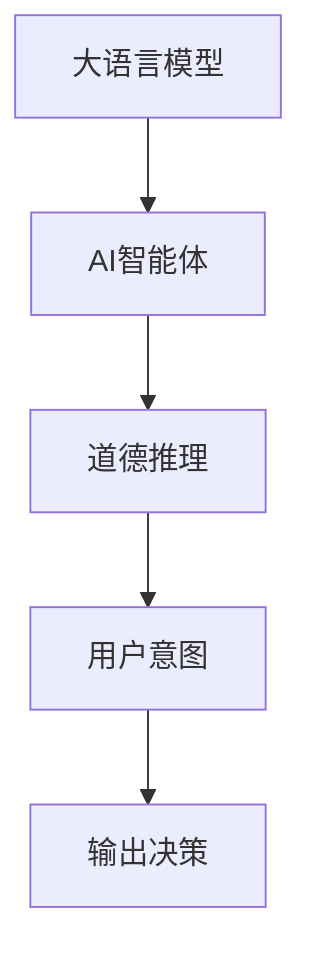
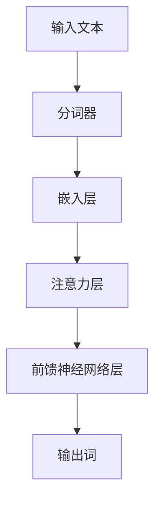
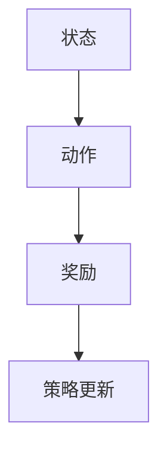
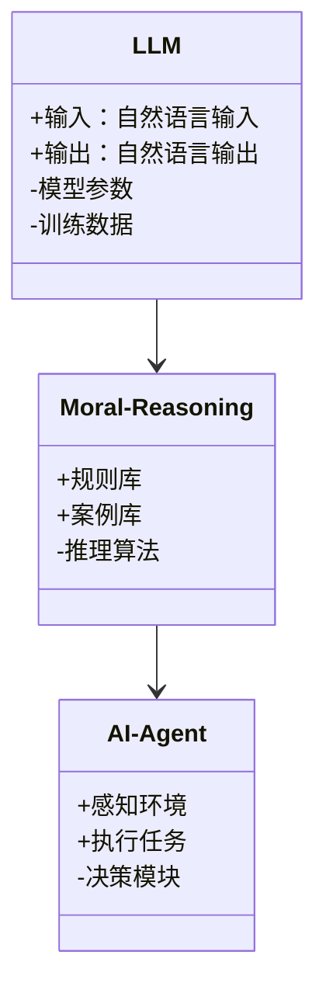
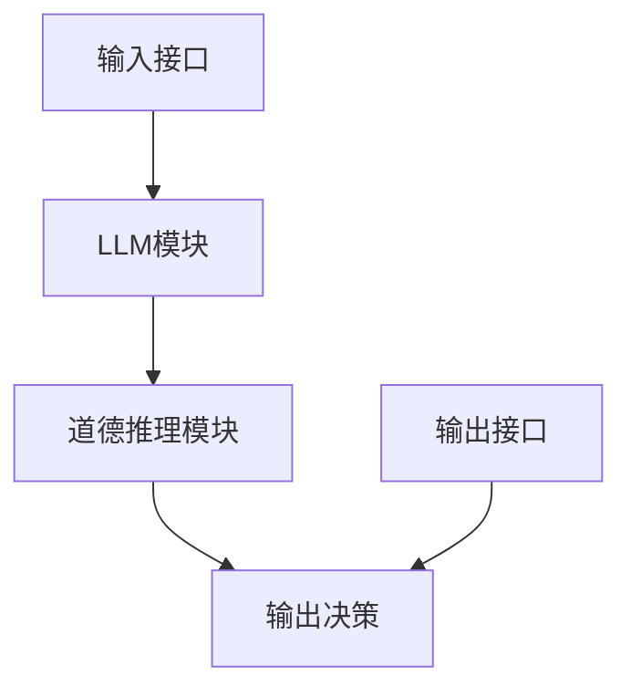
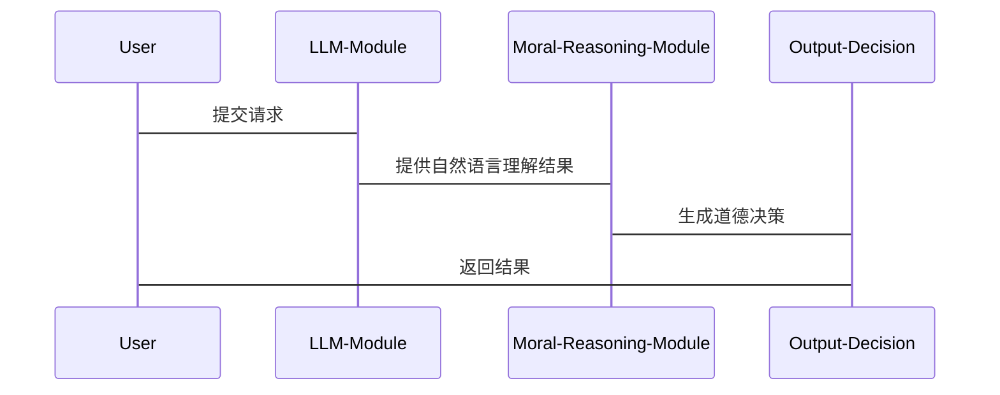

                 


# 构建LLM支持的AI Agent道德推理系统

## 关键词：LLM、AI Agent、道德推理、系统架构、算法原理、项目实战

## 摘要：本文系统地探讨了如何构建一个基于LLM（大语言模型）的AI Agent道德推理系统。通过分析当前AI Agent的发展现状和LLM的应用潜力，本文提出了构建道德推理系统的核心目标和实现方法。从算法原理到系统架构设计，再到项目实战，本文详细阐述了系统的构建过程，并通过实际案例分析，展示了系统的应用场景和效果。本文还探讨了系统的边界、局限性和与其他AI系统的区别，为读者提供了全面的视角。

---

## 第一部分：构建LLM支持的AI Agent道德推理系统概述

### 第1章：背景介绍

#### 1.1 问题背景

##### 1.1.1 当前AI Agent的发展现状

AI Agent（人工智能代理）是一种能够感知环境、执行任务并做出决策的智能系统。近年来，随着深度学习和大语言模型（LLM）的快速发展，AI Agent在多个领域得到了广泛应用，例如智能助手、自动驾驶、智能客服等。这些系统通过自然语言处理和强化学习技术，能够执行复杂的任务并提供高效的服务。

##### 1.1.2 LLM在AI Agent中的应用潜力

大语言模型（LLM）是基于大量数据训练的大型神经网络模型，具有强大的自然语言理解和生成能力。将LLM集成到AI Agent中，可以显著提升其对话能力、推理能力和问题解决能力。LLM不仅能够理解用户的意图，还能通过上下文进行推理和生成合理的响应，使得AI Agent更加智能化和人性化。

##### 1.1.3 道德推理在AI系统中的重要性

随着AI Agent的应用越来越广泛，其决策可能对人类社会产生深远影响。例如，在自动驾驶中，AI Agent需要在紧急情况下做出道德选择；在智能客服中，AI Agent需要在处理用户请求时遵守伦理规范。因此，构建一个能够进行道德推理的AI Agent系统，对于确保AI行为的伦理性和社会接受度至关重要。

---

#### 1.2 问题描述

##### 1.2.1 AI Agent在实际应用中的伦理挑战

AI Agent的决策可能涉及复杂的伦理问题。例如，自动驾驶汽车在紧急情况下需要在保护乘客和保护路人之间做出选择；智能客服在处理用户请求时可能需要在公司利益和用户体验之间找到平衡。这些问题需要AI Agent具备道德推理能力，以确保其决策符合社会伦理和法律法规。

##### 1.2.2 LLM支持的道德推理系统的必要性

尽管LLM在自然语言处理方面表现出色，但其本身并不具备道德推理能力。为了使AI Agent能够进行道德推理，需要将LLM与专门的道德推理算法结合。这种结合不仅可以提升AI Agent的决策能力，还能确保其行为符合伦理规范。

##### 1.2.3 系统目标与核心问题

本系统的目标是构建一个基于LLM的AI Agent道德推理系统，使其能够在复杂场景中进行道德推理，并做出符合伦理规范的决策。核心问题是：如何将LLM与道德推理算法结合，使其具备伦理决策能力。

---

#### 1.3 问题解决

##### 1.3.1 LLM支持的道德推理系统的核心目标

- 提供一个能够进行道德推理的AI Agent系统。
- 确保系统在复杂场景中的决策符合伦理规范。
- 提供一个可扩展的系统架构，便于后续优化和功能扩展。

##### 1.3.2 系统设计的主要解决思路

- 结合LLM的自然语言处理能力与道德推理算法，构建一个具备道德推理能力的AI Agent。
- 设计一个模块化的系统架构，便于功能扩展和维护。
- 通过案例分析和规则库构建，提升系统的道德推理能力。

##### 1.3.3 系统实现的关键技术

- LLM的集成与优化。
- 道德推理算法的设计与实现。
- 系统架构的模块化设计。

---

#### 1.4 边界与外延

##### 1.4.1 系统的适用范围

- 适用于需要道德推理的AI Agent系统，例如自动驾驶、智能客服、医疗AI等。
- 适用于需要处理复杂场景的AI系统，例如应急决策、伦理咨询等。

##### 1.4.2 系统的局限性

- 系统的道德推理能力依赖于训练数据和规则库，可能存在局限性。
- 系统的决策能力受限于当前算法和数据，可能无法处理极端复杂场景。

##### 1.4.3 系统与其他AI系统的区别与联系

与其他AI系统相比，本系统的核心区别在于其道德推理能力。通过结合LLM和道德推理算法，系统能够进行伦理决策，而传统AI系统不具备这种能力。

---

#### 1.5 概念结构与核心要素组成

##### 1.5.1 系统的核心概念

- 大语言模型（LLM）：提供自然语言处理能力。
- AI Agent：具备感知环境和执行任务的能力。
- 道德推理：基于伦理规范进行决策的能力。

##### 1.5.2 系统的关键属性

- 自然语言处理能力：基于LLM的自然语言理解和生成能力。
- 道德推理能力：基于规则库和案例推理的伦理决策能力。
- 可扩展性：模块化设计，便于功能扩展。

##### 1.5.3 系统的核心要素组成

- 用户输入：用户的请求或指令。
- LLM模块：提供自然语言理解和生成能力。
- 道德推理模块：基于规则库和案例推理，生成道德决策。
- 输出决策：系统根据道德推理结果，生成最终的响应或决策。

---

### 第2章：核心概念与联系

#### 2.1 LLM与AI Agent的基本原理

##### 2.1.1 LLM的定义与工作原理

大语言模型（LLM）是一种基于深度学习的自然语言处理模型，通常采用Transformer架构。LLM通过大量数据的训练，能够理解和生成自然语言文本。其核心原理包括词嵌入、自注意力机制和前馈神经网络。

##### 2.1.2 AI Agent的定义与功能

AI Agent是一种智能系统，能够感知环境、执行任务并做出决策。其功能包括信息处理、目标设定、决策制定和执行。

##### 2.1.3 LLM与AI Agent的结合方式

LLM作为AI Agent的核心模块，负责处理自然语言输入和生成自然语言输出。AI Agent通过LLM进行人机交互，并结合道德推理模块进行决策。

---

#### 2.2 核心概念对比

##### 2.2.1 LLM与传统NLP模型的对比

| 特性             | LLM                       | 传统NLP模型         |
|------------------|---------------------------|--------------------|
| 处理能力         | 高效处理复杂任务         | 适合简单任务         |
| 模型规模         | 大型或超大规模           | 小型或中型           |
| 自然语言能力     | 强大的理解和生成能力     | 较弱的自然语言能力     |

##### 2.2.2 AI Agent与传统AI系统的对比

| 特性             | AI Agent                  | 传统AI系统          |
|------------------|---------------------------|--------------------|
| 自主性           | 高度自主                   | 较低自主性           |
| 适应性           | 能够适应动态环境           | 适应性较弱           |
| 决策能力         | 具备复杂决策能力           | 决策能力有限           |

##### 2.2.3 道德推理与传统推理方式的对比

| 特性             | 道德推理                   | 传统推理             |
|------------------|---------------------------|--------------------|
| 决策依据         | 伦理规范和案例推理       | 逻辑推理和数学模型     |
| 决策目标         | 符合伦理规范               | 追求最优解             |
| 决策复杂性       | 高度复杂                   | 较低复杂性             |

---

#### 2.3 ER实体关系图



---

### 第3章：算法原理讲解

#### 3.1 LLM的训练与优化

##### 3.1.1 监督微调



##### 3.1.2 强化学习



##### 3.1.3 LLM的数学模型

损失函数：
$$ \text{Loss} = -\sum_{i=1}^{n} \log p(y_i|x_i) $$

概率计算：
$$ p(y|x) = \text{softmax}(z) $$

---

#### 3.2 道德推理算法

##### 3.2.1 基于规则的推理

规则库：
$$ \text{Rule} = \{ R_1, R_2, \dots, R_n \} $$

决策逻辑：
$$ \text{Decision} = \argmax_{r \in \text{Rule}} \text{score}(r) $$

##### 3.2.2 基于案例的推理

案例库：
$$ \text{Case} = \{ C_1, C_2, \dots, C_m \} $$

相似度计算：
$$ \text{Similarity}(C_i, C_j) = \sum_{k=1}^{n} w_k \cdot f_k(C_i, C_j) $$

---

## 第4章：系统分析与架构设计

### 4.1 系统应用场景

- 自动驾驶：在紧急情况下做出道德决策。
- 智能客服：在处理用户请求时遵守伦理规范。
- 医疗AI：在诊断和治疗建议中考虑伦理问题。

### 4.2 项目介绍

- 项目名称：LLM支持的AI Agent道德推理系统。
- 项目目标：构建一个具备道德推理能力的AI Agent系统。

### 4.3 系统功能设计

#### 4.3.1 领域模型



---

#### 4.4 系统架构设计



---

#### 4.5 系统接口设计

- 输入接口：接收用户的自然语言输入。
- 输出接口：输出系统的决策结果。
- 接口规范：定义输入输出的数据格式和交互协议。

---

#### 4.6 系统交互流程



---

## 第5章：项目实战

### 5.1 环境安装

- 安装Python和相关库（如TensorFlow、PyTorch）。
- 安装LLM框架（如Hugging Face Transformers）。

### 5.2 系统核心实现

#### 5.2.1 LLM模块实现

```python
class LLMModule:
    def __init__(self, model_name):
        self.model = AutoModelForCausalLM.from_pretrained(model_name)
        self.tokenizer = AutoTokenizer.from_pretrained(model_name)
    
    def generate(self, input_text):
        inputs = self.tokenizer(input_text, return_tensors="pt")
        outputs = self.model.generate(inputs.input_ids, max_length=50)
        return self.tokenizer.decode(outputs[0], skip_special_tokens=True)
```

---

#### 5.2.2 道德推理模块实现

```python
class MoralReasoningModule:
    def __init__(self, rules, cases):
        self.rules = rules
        self.cases = cases
    
    def infer(self, input_text):
        # 基于规则的推理
        rule_scores = {rule: 1.0 for rule in self.rules}
        # 基于案例的推理
        case_scores = {}
        for case in self.cases:
            similarity = self.calculate_similarity(case, input_text)
            case_scores[case] = similarity
        # 综合评分
        total_score = {rule: rule_scores[rule] * case_scores.get(rule, 0.0) for rule in self.rules}
        best_rule = max(total_score, key=total_score.get)
        return best_rule
```

---

#### 5.2.3 系统接口设计

```python
class SystemInterface:
    def __init__(self, llm_module, moral_reasoning_module):
        self.llm = llm_module
        self.moral_reasoning = moral_reasoning_module
    
    def process_request(self, input_text):
        reasoning = self.moral_reasoning.infer(input_text)
        response = self.llm.generate(input_text + "根据" + reasoning + "，请生成一个合适的响应。")
        return response
```

---

### 5.3 代码应用解读与分析

- **LLM模块**：负责自然语言处理任务，生成符合伦理规范的响应。
- **道德推理模块**：基于规则和案例进行推理，确保决策符合伦理规范。
- **系统接口**：统一接口设计，便于与其他系统集成。

---

### 5.4 案例分析

#### 案例1：自动驾驶中的伦理决策

用户输入：前方遇到紧急情况，需要在保护乘客和保护路人之间做出选择。

系统推理：
1. LLM模块分析输入，提取关键信息。
2. 道德推理模块基于规则库和案例库，生成决策建议。
3. 系统接口返回最终决策。

---

## 第6章：最佳实践与总结

### 6.1 最佳实践

- 确保系统的规则库和案例库全面且合理。
- 定期更新LLM模型，提升系统的自然语言处理能力。
- 进行充分的测试和验证，确保系统的决策符合伦理规范。

### 6.2 小结

本文系统地探讨了如何构建一个基于LLM的AI Agent道德推理系统，从背景介绍到算法原理，再到系统设计和项目实战，为读者提供了全面的视角。通过本系统的构建，可以为AI Agent在复杂场景中的应用提供伦理保障。

### 6.3 注意事项

- 系统的决策能力受限于规则库和案例库，需要定期更新和优化。
- 系统的伦理决策可能无法覆盖所有复杂场景，需要结合具体情况灵活调整。

### 6.4 拓展阅读

- 《Large Language Models for Reasoning》
- 《Ethics in AI: A Technical Perspective》
- 《Designing Ethical AI Systems》

---

## 总结

构建LLM支持的AI Agent道德推理系统是一个复杂而重要的任务。通过结合大语言模型的自然语言处理能力和道德推理算法，可以显著提升AI Agent的决策能力，使其在复杂场景中做出符合伦理规范的决策。本文通过系统的分析和详细的代码实现，为读者提供了一个完整的构建方案，为未来的研究和实践提供了参考。

