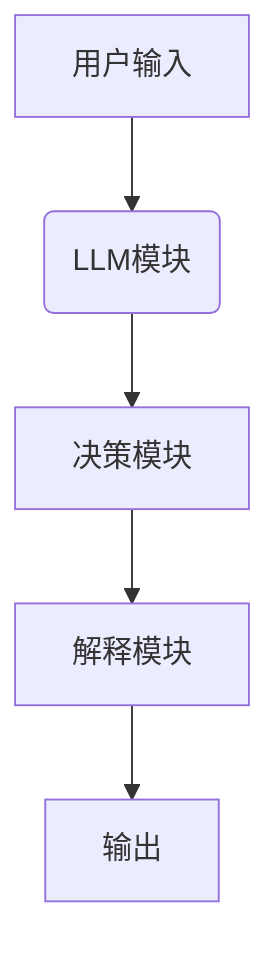
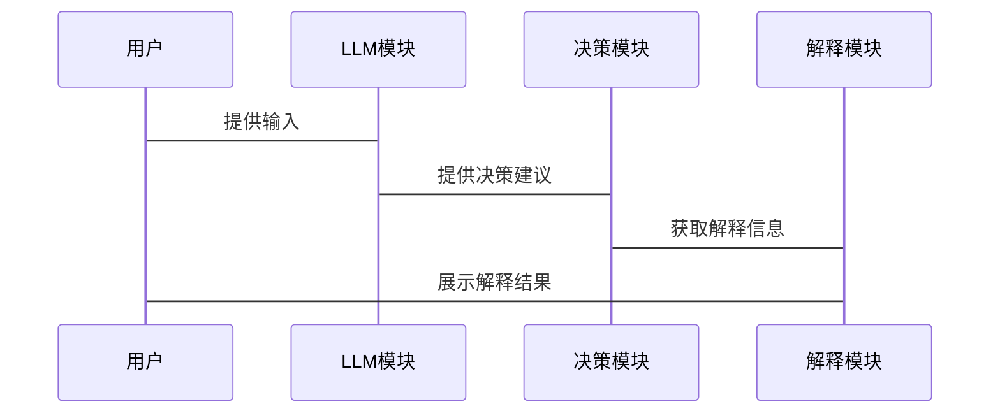

                 


# 构建LLM驱动的AI Agent可解释决策系统

> 关键词：LLM，AI Agent，可解释性，决策系统，算法原理，系统架构，项目实战

> 摘要：本文将探讨如何结合大语言模型（LLM）与人工智能代理（AI Agent）构建一个可解释的决策系统。文章首先介绍了问题背景、核心概念与应用场景，随后深入分析了LLM与AI Agent的原理及其结合方式，详细阐述了可解释性设计的重要性与实现方法。接着，从系统架构设计、功能模块实现到接口设计，全面解析了构建该系统的技术细节。通过一个实际的项目案例，展示了如何将理论应用于实践，并提出了优化与扩展的方向。最后，文章总结了关键点，提供了最佳实践建议，并展望了未来的发展趋势。

---

## 第一部分：背景与核心概念

### 第1章：LLM驱动的AI Agent概述

#### 1.1 问题背景与挑战

- **问题背景**：随着AI技术的快速发展，决策系统在各个领域得到广泛应用。然而，现有决策系统面临可解释性不足的问题，导致用户难以信任和依赖这些系统。
  
- **挑战**：传统的决策系统基于规则或统计模型，缺乏灵活性和深度理解能力。而大语言模型（LLM）虽然在生成和理解自然语言方面表现出色，但其决策过程往往缺乏透明度，难以解释。

- **LLM的优势**：LLM能够处理复杂的语言任务，具备强大的上下文理解和生成能力，可以为AI Agent提供丰富的语义信息支持。

#### 1.2 LLM与AI Agent的结合

- **AI Agent的核心概念**：AI Agent是一个能够感知环境、自主决策并执行任务的智能体。它需要具备问题解决、规划和学习能力。

- **LLM在AI Agent中的角色**：LLM作为AI Agent的核心模块，负责理解和生成自然语言，提供决策支持和知识查询服务。

- **结合的意义**：通过结合LLM，AI Agent能够更好地理解和处理复杂场景，提升决策的准确性和可解释性。

#### 1.3 应用场景与前景

- **智能客服**：AI Agent可以通过LLM理解和处理用户的查询，提供个性化的服务。
  
- **自动驾驶**：LLM驱动的AI Agent可以辅助车辆做出更符合人类驾驶习惯的决策。
  
- **企业决策支持**：通过分析企业内外部数据，提供可解释的决策建议，提升企业运营效率。

---

## 第二部分：核心概念与原理

### 第2章：LLM与AI Agent的原理

#### 2.1 LLM的工作机制

- **Transformer模型**：LLM基于Transformer架构，通过自注意力机制捕捉文本中的长程依赖关系，实现高效的序列建模。
  
- **编码器与解码器**：编码器将输入文本转化为隐层表示，解码器根据编码结果生成输出文本。
  
- **训练过程**：基于大量数据进行无监督预训练，通过微调任务特定的数据进行优化。

#### 2.2 AI Agent的决策模型

- **状态表示**：AI Agent通过感知环境信息，将其转化为状态表示，用于决策过程。
  
- **动作选择**：基于当前状态和历史信息，选择最优的动作以实现目标。
  
- **奖励机制**：通过奖励函数评估决策的效果，指导AI Agent的学习和优化。

#### 2.3 LLM与AI Agent的结合原理

- **知识共享**：LLM作为知识库，为AI Agent提供丰富的语义信息支持。
  
- **决策生成**：AI Agent利用LLM生成决策建议，并结合上下文信息进行优化。
  
- **可解释性增强**：通过LLM的可解释性技术，提升AI Agent决策过程的透明度。

---

## 第三部分：可解释性设计

### 第3章：可解释性的重要性与实现方法

#### 3.1 可解释性在决策系统中的意义

- **信任与责任**：可解释性是用户信任AI Agent决策的基础，同时也是责任追溯的必要条件。
  
- **法律与伦理要求**：在医疗、金融等领域，可解释性是合规性的基本要求。
  
- **技术优化的需要**：通过分析解释，可以发现和修正模型的缺陷，提升系统性能。

#### 3.2 可解释性的实现方法

- **层次化分解**：将决策过程分解为多个层次，逐一解释每个层次的决策逻辑。
  
- **显式规则**：通过制定明确的规则，确保AI Agent的决策过程透明可解释。
  
- **可视化工具**：利用图表、流程图等方式，直观展示决策过程和关键因素。

#### 3.3 LLM驱动AI Agent的可解释性框架

- **决策树分析**：将决策过程转化为决策树结构，展示各决策节点的影响因素。
  
- **关键因素提取**：从LLM的输出中提取影响决策的关键因素，进行重点解释。
  
- **语义解释**：通过对LLM生成文本的语义分析，解释决策背后的逻辑和原因。

---

## 第四部分：系统架构与设计

### 第4章：系统架构设计

#### 4.1 系统功能模块

- **输入模块**：接收用户输入或环境反馈，解析为系统可处理的信息。
  
- **LLM模块**：负责理解和生成自然语言，提供决策支持。
  
- **决策模块**：基于LLM输出和环境信息，生成决策指令。
  
- **解释模块**：对决策过程进行解释和可视化，提升系统透明度。

#### 4.2 系统架构图



#### 4.3 接口设计

- **输入接口**：支持多种格式的输入，如文本、语音等。
  
- **输出接口**：提供多种格式的输出，如文本、语音、动作指令等。
  
- **解释接口**：展示决策过程的详细解释，方便用户理解。

#### 4.4 交互流程图



---

## 第五部分：项目实战

### 第5章：项目实战

#### 5.1 项目介绍

- **项目背景**：构建一个基于LLM的智能客服系统，提升用户体验。
  
- **目标**：实现用户咨询的自动响应，提供可解释的决策支持。

#### 5.2 核心实现

- **环境配置**：安装必要的库，如Python、TensorFlow、Hugging Face库。
  
- **代码实现**：基于LLM构建对话模块，设计决策逻辑，实现解释功能。

#### 5.3 代码示例

```python
import transformers
from transformers import AutoModelForCausalLM, AutoTokenizer

model_name = "gpt2"
tokenizer = AutoTokenizer.from_pretrained(model_name)
model = AutoModelForCausalLM.from_pretrained(model_name)

def generate_response(prompt):
    inputs = tokenizer.encode(prompt, return_tensors="pt")
    outputs = model.generate(inputs, max_length=50, num_beams=5, temperature=0.7)
    response = tokenizer.decode(outputs[0], skip_special_tokens=True)
    return response

# 示例对话
prompt = "用户询问如何处理退款问题。"
response = generate_response(prompt)
print(response)
```

#### 5.4 案例分析

- **案例背景**：用户询问产品问题，AI Agent基于LLM生成回复。
  
- **决策过程**：LLM理解用户意图，生成多个候选回复，决策模块选择最优回复，并通过解释模块展示解释。

---

## 第六部分：优化与扩展

### 第6章：优化与扩展

#### 6.1 系统优化

- **模型优化**：通过模型蒸馏等技术，降低计算成本，提升推理速度。
  
- **可解释性增强**：引入更多解释方法，如注意力权重分析，提升解释的详细程度。

#### 6.2 多模态扩展

- **视觉信息**：结合图像识别技术，提升AI Agent的理解能力。
  
- **语音交互**：支持语音输入和输出，拓展系统的应用场景。

#### 6.3 未来趋势

- **实时反馈**：结合实时数据，优化决策过程。
  
- **人机协作**：通过人机协作，提升系统的灵活性和适应性。

---

## 第七部分：总结与展望

### 第7章：总结与展望

#### 7.1 核心观点总结

- LLM与AI Agent的结合为构建可解释的决策系统提供了新的可能性。
  
- 可解释性是提升系统信任和责任的重要因素。

#### 7.2 最佳实践

- 在设计阶段，优先考虑系统的可解释性需求。
  
- 通过可视化工具和层次化分解，提升决策过程的透明度。

#### 7.3 未来展望

- 随着技术的发展，可解释性将成为AI系统的核心竞争力。
  
- 结合多模态信息，构建更智能、更可靠的决策系统。

---

## 参考文献

- [1] Radford, A., et al. "Language models are few-shot learners." arXiv preprint arXiv:1909.02795 (2019).
- [2] Vaswani, A., et al. "Attention is all you need." arXiv preprint arXiv:1706.03798 (2017).
- [3] Yosinski, J., et al. "Understanding deep learning (_predictions) requires looking inside the network." arXiv preprint arXiv:1506.05579 (2015).

---

通过以上目录和内容的详细规划，文章将系统地介绍如何构建一个基于LLM的可解释AI Agent决策系统，从理论到实践，为读者提供全面的指导和深度的见解。

