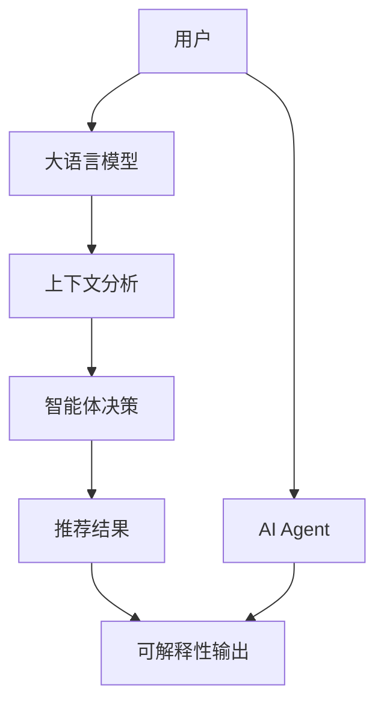
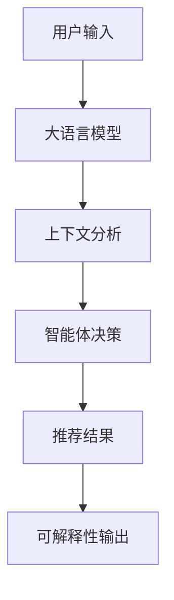
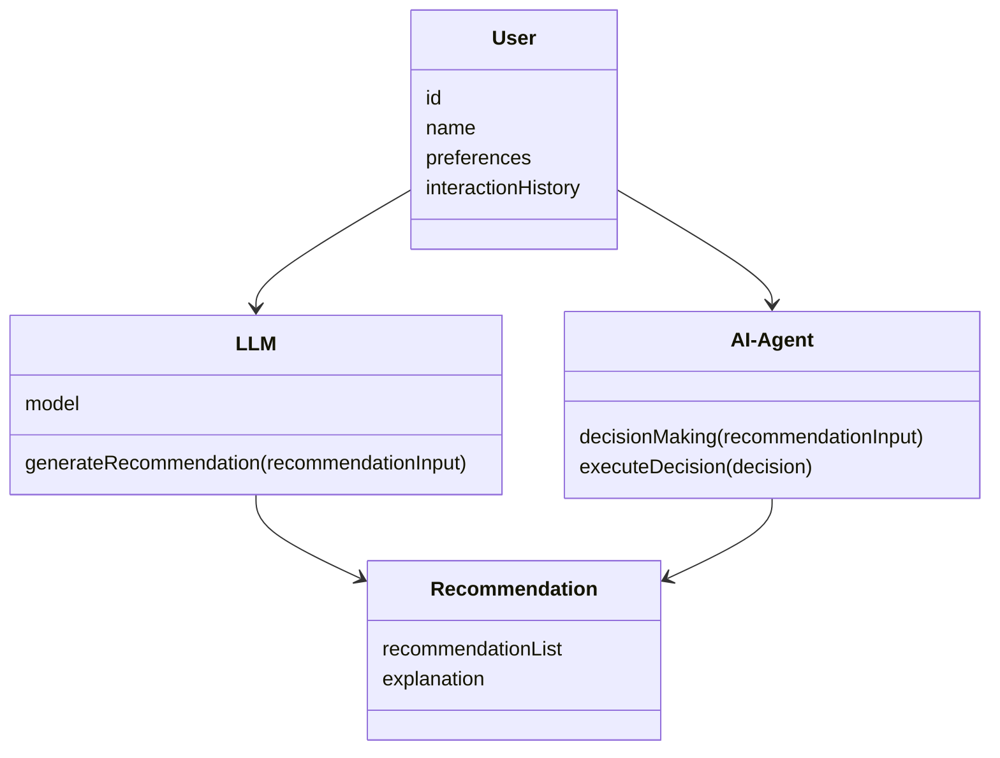
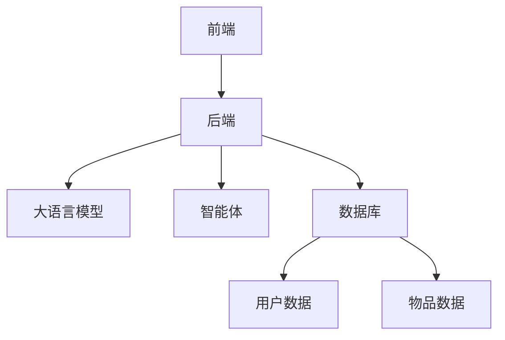
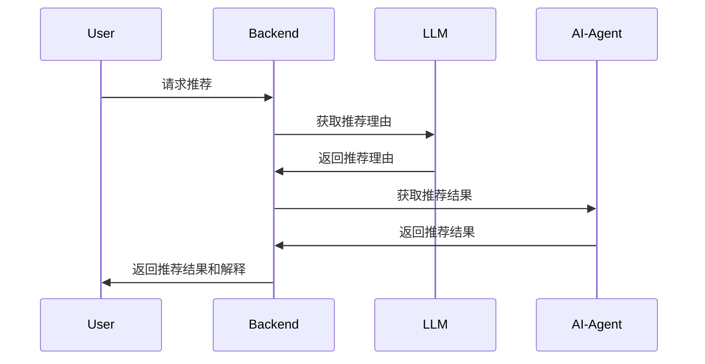
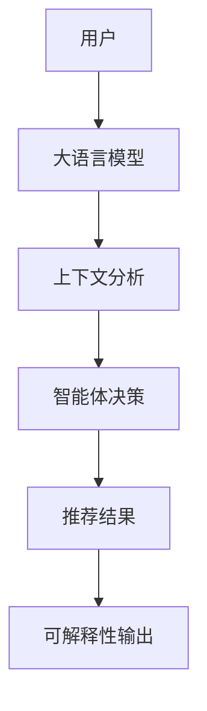

                 


# 构建LLM驱动的AI Agent可解释推荐系统

## 关键词：LLM、AI Agent、推荐系统、可解释性、自然语言处理、深度学习

## 摘要：本文详细探讨如何利用大语言模型（LLM）构建可解释的AI Agent推荐系统。从问题背景到核心概念，从算法原理到系统架构，从项目实战到最佳实践，系统性地分析和实现这一推荐系统。通过详细的技术分析和实例演示，展示LLM驱动的AI Agent在推荐系统中的优势和实现方法，同时确保推荐结果的可解释性，为实际应用提供理论和实践指导。

---

## 第一部分: 背景与核心概念

## 第1章: 问题背景与描述

### 1.1 问题背景

#### 1.1.1 当前推荐系统的挑战
推荐系统在现代互联网应用中扮演着至关重要的角色，但现有推荐系统面临以下挑战：
- **实时性不足**：传统推荐系统通常基于离线数据，无法实时响应用户需求。
- **可解释性差**：复杂的算法模型（如深度学习模型）往往被视为“黑箱”，用户难以理解推荐的原因。
- **个性化不足**：难以捕捉用户的动态需求和情感变化。

#### 1.1.2 大语言模型的崛起
大语言模型（LLM）如GPT-3、PaLM等具备以下优势：
- **强大的上下文理解能力**：LLM能够处理复杂的文本信息，捕捉用户的真实意图。
- **可解释性增强**：通过生成式的输出，可以为推荐结果提供自然语言解释。
- **多任务处理能力**：LLM可以同时处理多种任务，如文本生成、意图识别等。

#### 1.1.3 可解释性的重要性
可解释性在推荐系统中的重要性体现在：
- **用户信任**：用户更愿意信任可以解释推荐理由的系统。
- **合规性要求**：在金融、医疗等领域，可解释性是合规的基本要求。
- **系统调试**：可解释性有助于快速定位和修复系统问题。

### 1.2 问题描述

#### 1.2.1 推荐系统的基本概念
推荐系统通过分析用户行为、偏好和内容特征，生成个性化推荐结果。传统的推荐算法包括协同过滤、基于内容的推荐和混合推荐。

#### 1.2.2 LLM驱动的AI Agent的定义
LLM驱动的AI Agent是一种能够理解用户需求、生成推荐结果并提供可解释性说明的智能体。它通过自然语言处理技术与用户交互，动态调整推荐策略。

#### 1.2.3 可解释推荐系统的必要性
可解释推荐系统需要满足以下条件：
- **透明性**：用户能够理解推荐的原因。
- **可追溯性**：推荐结果可以被追踪和验证。
- **可调整性**：用户可以对推荐结果进行反馈和调整。

### 1.3 问题解决

#### 1.3.1 LLM在推荐系统中的作用
LLM在推荐系统中的作用包括：
- **意图识别**：通过自然语言处理技术准确理解用户需求。
- **内容生成**：生成个性化的推荐理由和解释。
- **动态调整**：根据用户反馈实时优化推荐策略。

#### 1.3.2 AI Agent的决策机制
AI Agent的决策机制包括：
- **感知层**：通过多模态输入（文本、行为数据）感知用户需求。
- **认知层**：利用LLM进行推理和决策。
- **执行层**：根据决策结果生成推荐内容并输出。

#### 1.3.3 可解释性实现的路径
实现可解释推荐系统需要：
- **模型透明化**：选择具有可解释性的算法或提供解释的接口。
- **结果可视化**：通过可视化方式展示推荐理由。
- **用户交互**：通过用户反馈不断优化推荐策略。

### 1.4 边界与外延

#### 1.4.1 推荐系统的边界
推荐系统的边界包括：
- **输入范围**：用户输入的文本、行为数据等。
- **输出范围**：推荐结果和解释说明。
- **系统范围**：前端展示和后端处理。

#### 1.4.2 LLM驱动的边界
LLM驱动的边界包括：
- **数据输入**：用户输入的文本数据。
- **模型处理**：LLM生成推荐理由。
- **结果输出**：推荐结果和解释说明。

#### 1.4.3 可解释性的边界
可解释性的边界包括：
- **解释范围**：推荐理由的深度和广度。
- **用户需求**：不同用户对解释的需求可能不同。
- **系统能力**：系统能够提供的解释类型和详细程度。

### 1.5 概念结构与核心要素

#### 1.5.1 核心概念对比表格
以下是核心概念的对比表格：

| 比较维度       | LLM驱动的AI Agent推荐系统 | 传统推荐系统 |
|----------------|--------------------------|--------------|
| 输入数据       | 用户文本输入、行为数据   | 用户行为数据  |
| 处理方式       | 利用LLM生成推荐理由       | 基于规则或模型 |
| 输出结果       | 推荐结果 + 解释说明       | 推荐结果      |
| 可解释性       | 高                     | 低           |
| 交互能力       | 高                     | 中           |

#### 1.5.2 ER实体关系图
以下是推荐系统的核心实体关系图：



---

## 第2章: 核心概念与联系

### 2.1 核心概念原理

#### 2.1.1 LLM的基本原理
LLM的基本原理包括：
- **预训练**：通过大量的文本数据进行预训练，学习语言的结构和语义。
- **微调**：在特定任务上进行微调，提升任务相关的性能。
- **生成机制**：通过解码器生成与输入相关的文本输出。

#### 2.1.2 AI Agent的核心机制
AI Agent的核心机制包括：
- **感知**：通过多模态输入感知用户需求。
- **推理**：基于感知信息进行推理和决策。
- **执行**：根据决策结果生成推荐内容并输出。

#### 2.1.3 可解释推荐的实现方法
可解释推荐的实现方法包括：
- **基于规则的解释**：通过预定义的规则生成解释。
- **基于模型的解释**：通过模型生成解释，如LIME解释方法。
- **基于用户的解释**：通过用户反馈生成动态解释。

### 2.2 概念属性特征对比

#### 2.2.1 LLM与传统机器学习模型对比
以下是LLM与传统机器学习模型的对比表格：

| 比较维度       | LLM                          | 传统机器学习模型 |
|----------------|------------------------------|------------------|
| 数据需求       | 需要大量文本数据              | 需要标注数据      |
| 可解释性       | 生成式输出，可解释性较高       | 黑箱模型，解释性差 |
| 处理能力       | 能处理复杂任务，如自然语言理解 | 适合结构化数据处理 |

#### 2.2.2 AI Agent与传统推荐系统的对比
以下是AI Agent与传统推荐系统的对比表格：

| 比较维度       | AI Agent推荐系统               | 传统推荐系统        |
|----------------|------------------------------|--------------------|
| 输入数据       | 用户文本输入、行为数据         | 用户行为数据         |
| 处理方式       | 利用AI Agent进行推理和决策     | 基于规则或模型进行推荐 |
| 输出结果       | 推荐结果 + 解释说明            | 推荐结果            |
| 交互能力       | 高                           | 中                 |

#### 2.2.3 可解释性与不可解释性对比
以下是可解释性与不可解释性对比的表格：

| 比较维度       | 可解释推荐系统              | 不可解释推荐系统     |
|----------------|-----------------------------|--------------------|
| 用户信任       | 高                         | 低                 |
| 系统调试       | 容易定位和修复               | 困难               |
| 合规性要求       | 符合合规要求                | 可能不符合合规要求  |

### 2.3 ER实体关系图
以下是推荐系统的实体关系图：


---

## 第三部分: 算法原理与数学模型

## 第3章: 推荐系统算法原理

### 3.1 推荐系统流程

以下是推荐系统的流程图：



### 3.2 数学模型

#### 3.2.1 基于概率的推荐模型
以下是一个基于概率的推荐模型：

$$ P(r_i | u_j) = \frac{count(u_j, r_i)}{\sum_{i} count(u_j, r_i)} $$

其中，$P(r_i | u_j)$ 表示用户 $u_j$ 对物品 $r_i$ 的概率，$count(u_j, r_i)$ 表示用户 $u_j$ 对物品 $r_i$ 的交互次数。

#### 3.2.2 基于相似性的推荐模型
以下是一个基于余弦相似性的推荐模型：

$$ sim(u_j, u_k) = \frac{\sum_{i} u_j(r_i) \cdot u_k(r_i)}{\sqrt{\sum_{i} u_j(r_i)^2} \cdot \sqrt{\sum_{i} u_k(r_i)^2}} $$

其中，$sim(u_j, u_k)$ 表示用户 $u_j$ 和 $u_k$ 的相似性，$u_j(r_i)$ 表示用户 $u_j$ 对物品 $r_i$ 的评分。

#### 3.2.3 基于深度学习的推荐模型
以下是一个基于深度学习的推荐模型，使用嵌入（embedding）技术：

$$ f(x) = \text{激活}(W_e x + b_e) $$

其中，$x$ 是输入向量，$W_e$ 和 $b_e$ 是嵌入层的权重和偏置，$\text{激活}$ 是激活函数。

---

## 第四部分: 系统分析与架构设计方案

## 第4章: 系统分析与架构设计

### 4.1 问题场景介绍

推荐系统通常应用于电商、社交网络、媒体等多个领域。本文以电商推荐为例，设计一个基于LLM的AI Agent推荐系统。

### 4.2 项目介绍

本项目旨在构建一个可解释的推荐系统，利用LLM生成推荐理由，并通过AI Agent实现动态调整。

### 4.3 系统功能设计

以下是系统功能设计的类图：



### 4.4 系统架构设计

以下是系统架构设计的架构图：



### 4.5 系统接口设计

以下是系统接口设计的序列图：



### 4.6 系统交互设计

以下是系统交互设计的流程图：



---

## 第五部分: 项目实战

## 第5章: 项目实战

### 5.1 环境安装

安装以下工具：
- Python 3.8+
- pip
- transformers库
- mermaid-cli

安装命令：
```bash
pip install transformers mermaid-cli
```

### 5.2 核心代码实现

以下是核心代码实现：

```python
from transformers import AutoTokenizer, AutoModelForCausalLM
import torch

# 初始化LLM模型和tokenizer
model_name = "facebook/palm-1"
tokenizer = AutoTokenizer.from_pretrained(model_name)
model = AutoModelForCausalLM.from_pretrained(model_name)

def generate_recommendation(user_input):
    inputs = tokenizer(user_input, return_tensors="pt")
    outputs = model.generate(**inputs, max_length=100)
    recommendation = tokenizer.decode(outputs[0], skip_special_tokens=True)
    return recommendation

# 示例调用
user_input = "推荐一些适合夏天的书籍"
print(generate_recommendation(user_input))
```

### 5.3 代码应用解读与分析

上述代码实现了以下功能：
1. **初始化模型和tokenizer**：使用预训练的LLM模型。
2. **生成推荐**：根据用户输入生成推荐结果。
3. **返回推荐结果**：输出推荐内容。

### 5.4 实际案例分析

以下是实际案例分析：

假设用户输入：“推荐一些适合夏天的书籍”，系统会生成以下推荐：

**推荐结果**：《小王子》、《百年孤独》、《追风筝的人》。
**解释说明**：这些书籍内容轻松，适合在夏天阅读。

### 5.5 项目小结

通过上述代码实现，我们可以看到LLM在推荐系统中的强大能力。生成式的推荐理由不仅提高了推荐的准确性，还增强了系统的可解释性。

---

## 第六部分: 最佳实践

## 第6章: 最佳实践

### 6.1 小结

本文详细介绍了如何利用LLM构建可解释的AI Agent推荐系统。从问题背景到系统设计，从算法原理到项目实战，系统性地分析了推荐系统的实现方法。

### 6.2 注意事项

在实际应用中需要注意以下几点：
- **数据隐私**：确保用户数据的安全性和隐私性。
- **模型性能**：优化模型性能，提升推荐速度和准确性。
- **用户体验**：提供良好的用户交互体验，增强用户信任。

### 6.3 拓展阅读

推荐阅读以下资料：
- **《Large Language Models: A Survey》**：了解LLM的基本原理和发展历程。
- **《Explainable AI: A Survey》**：深入理解可解释AI的理论和方法。

---

## 总结

通过本文的详细讲解，读者可以全面了解如何利用LLM构建可解释的AI Agent推荐系统。从理论到实践，从算法到系统设计，本文提供了丰富的技术细节和实现方案。希望本文能为读者在推荐系统领域的研究和实践提供有价值的参考。

