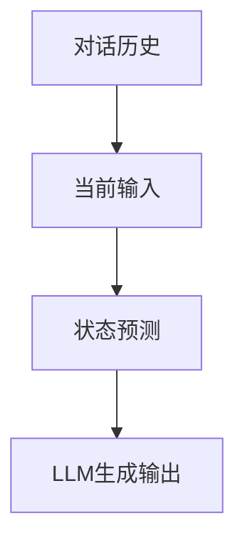
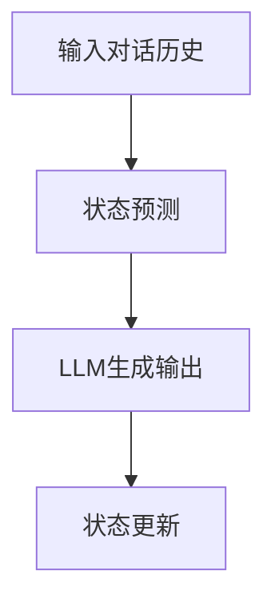
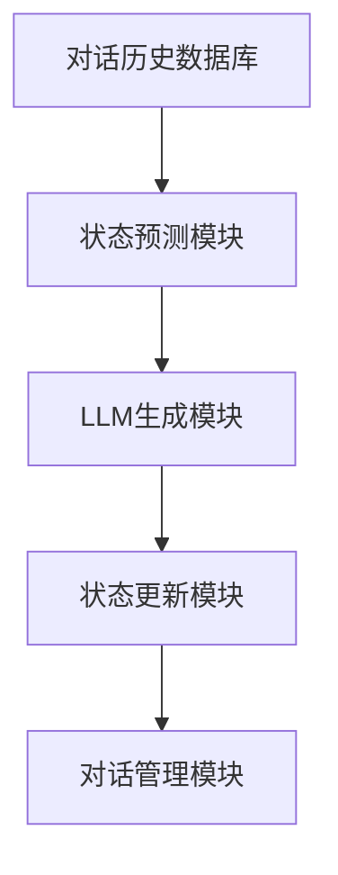
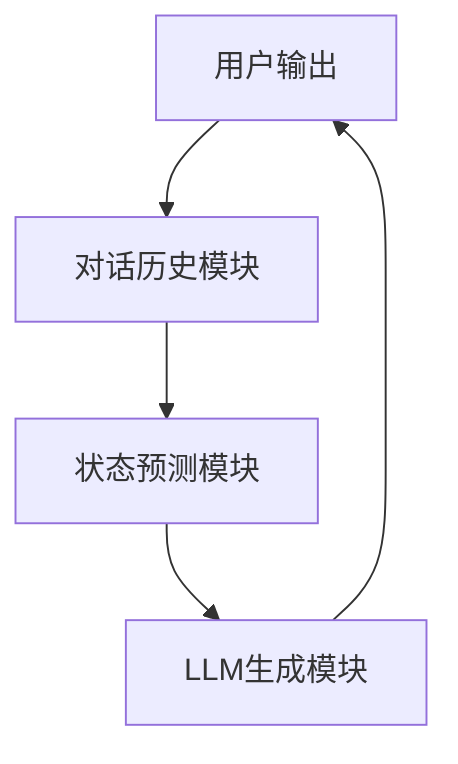

                 


# 构建LLM驱动的AI Agent多轮对话状态追踪

## 关键词：LLM, AI Agent, 对话状态追踪, 多轮对话, 机器学习

## 摘要：  
随着大语言模型（LLM）的快速发展，AI Agent在多轮对话中的应用越来越广泛。为了提高对话系统的交互能力和用户体验，对话状态追踪成为关键的技术之一。本文将深入分析LLM驱动的AI Agent多轮对话状态追踪的实现方法，涵盖背景、核心概念、算法原理、系统架构、项目实战及最佳实践，帮助读者全面理解并掌握这一技术。

---

# 第1章: 背景介绍

## 1.1 问题背景  
在人机交互系统中，多轮对话是实现自然交流的重要方式。然而，对话过程中，系统需要实时理解用户意图并保持上下文的连贯性，这对对话状态的准确追踪提出了高要求。传统的基于规则的对话系统难以应对复杂场景，而基于LLM的AI Agent通过结合深度学习技术，能够更好地处理多轮对话中的动态状态变化。

## 1.2 问题描述  
对话状态追踪的核心任务是根据历史对话内容，推理当前对话的状态，包括用户意图、对话上下文等。LLM驱动的AI Agent需要在每一轮对话中更新状态信息，并指导下一步的交互行为。然而，如何高效、准确地追踪对话状态，仍然是一个具有挑战性的技术问题。

## 1.3 问题解决  
通过引入LLM技术，AI Agent能够利用模型的强大能力，从对话历史中提取关键信息，动态更新对话状态。这种基于模型的方法不仅提高了状态追踪的准确性，还能够处理复杂的上下文依赖关系。

## 1.4 边界与外延  
对话状态追踪的边界包括对话历史的长度、对话的主题范围，以及模型的训练数据。其外延则涉及自然语言理解（NLU）、对话管理（DM）和生成式对话（NLG）等技术，这些技术共同构成了完整的对话系统。

## 1.5 概念结构与核心要素  
对话状态由以下几个核心要素组成：  
1. **对话历史**：用户和系统的历史交互内容。  
2. **当前输入**：用户的最新输入。  
3. **状态表示**：对当前对话状态的编码表示。  
4. **LLM输出**：基于状态的模型生成输出。  

---

# 第2章: 核心概念与联系

## 2.1 核心概念原理  
对话状态追踪的关键在于如何将对话历史转化为状态表示。LLM通过自注意力机制，能够捕捉对话中的长距离依赖关系，从而更准确地捕捉用户意图。  

## 2.2 概念属性特征对比  
以下是几种常见的状态追踪方法的对比：

| 方法   | 输入类型       | 输出类型       | 优点                     | 缺点                     |
|--------|----------------|----------------|--------------------------|--------------------------|
| HMM    | 序列数据       | 状态概率       | 建模简单，计算高效       | 无法处理长距离依赖       |
| CRF    | 标签序列       | 状态预测       | 精度高，适合序列标注     | 需要大量标注数据         |
| Transformer | 序列数据       | 状态表示       | 能处理长距离依赖，表达能力强 | 计算复杂，需要大量训练数据 |

## 2.3 ER实体关系图  


---

# 第3章: 算法原理讲解

## 3.1 算法原理概述  
对话状态追踪的实现可以基于以下几种算法：  
1. **HMM（隐马尔可夫模型）**：适用于简单的状态转移问题，但难以处理复杂的上下文信息。  
2. **CRF（条件随机场）**：适合序列标注任务，能够捕捉局部依赖关系。  
3. **Transformer**：通过自注意力机制，能够捕捉全局依赖关系，适合处理复杂的对话场景。  

## 3.2 算法流程图  


## 3.3 Python源代码实现  
以下是一个基于Transformer的对话状态追踪算法的实现示例：

```python
import torch
import torch.nn as nn
import torch.optim as optim

class TransformerModel(nn.Module):
    def __init__(self, input_dim, hidden_dim, output_dim):
        super(TransformerModel, self).__init__()
        self.embedding = nn.Embedding(input_dim, hidden_dim)
        self.transformer = nn.Transformer(hidden_dim, hidden_dim, num_layers=2)
        self.fc = nn.Linear(hidden_dim, output_dim)

    def forward(self, x):
        embedded = self.embedding(x)
        transformed = self.transformer(embedded)
        output = self.fc(transformed)
        return output

# 示例数据
input_dim = 100
hidden_dim = 512
output_dim = 10

model = TransformerModel(input_dim, hidden_dim, output_dim)
criterion = nn.CrossEntropyLoss()
optimizer = optim.Adam(model.parameters(), lr=0.001)

# 训练过程
for epoch in range(10):
    for inputs, labels in dataloader:
        outputs = model(inputs)
        loss = criterion(outputs, labels)
        loss.backward()
        optimizer.step()
        optimizer.zero_grad()
```

---

# 第4章: 系统分析与架构设计

## 4.1 系统应用场景  
AI Agent需要在多种场景中实现多轮对话，例如智能客服、虚拟助手、教育机器人等。  

## 4.2 系统功能设计  
1. **对话历史记录**：存储用户和系统的交互记录。  
2. **状态预测**：基于对话历史，预测当前对话状态。  
3. **LLM输出生成**：根据状态生成下一步的交互内容。  
4. **状态更新**：根据新的对话内容，更新对话状态。  

## 4.3 系统架构设计  


## 4.4 系统接口设计  
1. **输入接口**：接收用户的对话输入。  
2. **状态接口**：提供当前对话状态的查询接口。  
3. **输出接口**：生成系统的对话输出。  

## 4.5 系统交互流程图  


---

# 第5章: 项目实战

## 5.1 环境安装  
```bash
pip install torch transformers mermaid4jupyter
```

## 5.2 核心代码实现  
```python
from transformers import AutoTokenizer, AutoModelForMaskedLM
import torch

# 加载预训练模型
tokenizer = AutoTokenizer.from_pretrained('bert-base-uncased')
model = AutoModelForMaskedLM.from_pretrained('bert-base-uncased')

# 定义状态更新函数
def update_state(dialogue, model, tokenizer):
    inputs = tokenizer(dialogue, return_tensors='pt')
    outputs = model(**inputs)
    # 获取状态表示
    state_repr = outputs.last_hidden_state[:, 0, :]
    return state_repr

# 示例对话
dialogue = "今天天气怎么样？今天是晴天。"
state_repr = update_state(dialogue, model, tokenizer)
```

## 5.3 案例分析  
假设用户与AI Agent的对话如下：  
1. **用户**：我需要预订一张去上海的机票。  
2. **系统**：请问您的出发日期是什么时候？  
3. **用户**：明天。  
4. **系统**：请问您需要 Economy 还是 Business 阶级？  

通过状态追踪，系统能够准确理解用户的意图，并动态更新对话状态，最终完成机票预订任务。

---

# 第6章: 最佳实践与小结

## 6.1 最佳实践  
1. **数据质量**：确保训练数据的多样性和代表性。  
2. **模型选择**：根据具体场景选择合适的模型架构。  
3. **持续优化**：通过用户反馈不断优化对话状态追踪的准确性。  

## 6.2 小结  
构建LLM驱动的AI Agent多轮对话状态追踪系统，需要综合运用自然语言处理、深度学习和对话系统设计的技术。通过合理选择算法和架构，能够显著提升对话系统的交互能力和用户体验。

## 6.3 注意事项  
1. 避免过度依赖单一算法，结合多种方法提高鲁棒性。  
2. 定期监控和更新模型，确保其适应新的对话场景。  
3. 注意数据隐私和安全问题，确保用户信息的安全性。  

## 6.4 拓展阅读  
1. 《Deep Learning for Dialog Systems》  
2. 《Transformers for NLP: State-of-the-art Pretraining, Fine-tuning, and Beyond》  
3. 《Large Language Models：A Survey》  

--- 

通过以上内容，读者可以系统地了解构建LLM驱动的AI Agent多轮对话状态追踪的技术细节，并能够将其应用到实际项目中。

