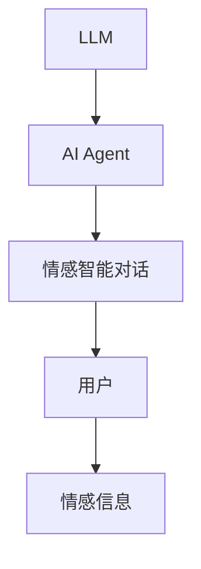
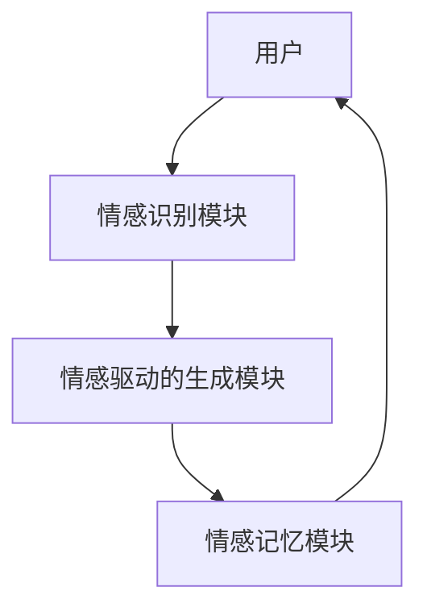

                 


# 《构建LLM驱动的AI Agent情感智能对话》

---

## 关键词：
- LLM（Large Language Model）
- AI Agent
- 情感智能对话
- 对话系统
- 自然语言处理

---

## 摘要：
本文详细探讨了如何利用大语言模型（LLM）构建具备情感智能的AI Agent对话系统。从背景分析到核心概念，从算法原理到系统架构，从项目实战到最佳实践，本文系统性地介绍了情感智能对话的核心要素、实现路径和实际应用。通过理论与实践的结合，帮助读者全面理解并掌握如何利用LLM驱动的AI Agent实现情感智能对话。

---

# 第一部分：构建LLM驱动的AI Agent情感智能对话背景与概念

---

## 第1章：情感智能对话的背景与问题背景

### 1.1 问题背景

#### 1.1.1 当前人机对话的局限性
传统的对话系统在处理情感信息时存在以下问题：
- **情感理解不足**：无法准确识别和理解用户的情感状态。
- **情感表达单一**：在回复中缺乏情感色彩，用户体验较差。
- **上下文理解有限**：难以处理复杂的情感场景和上下文依赖性。

#### 1.1.2 情感智能对话的需求与重要性
情感智能对话的核心需求包括：
- **用户情感识别**：准确识别用户的情感状态（如快乐、愤怒、悲伤等）。
- **情感驱动的回复**：根据用户情感生成相应的回复，增强用户体验。
- **情感记忆**：记住用户的情感历史，提供更个性化的对话体验。

#### 1.1.3 LLM在情感智能对话中的作用
LLM（Large Language Model）通过其强大的语言理解和生成能力，可以：
- **自动捕捉情感信息**：通过上下文分析用户的情感倾向。
- **生成情感化回复**：根据情感信息生成合适的回复。
- **学习情感表达模式**：通过大量数据训练，掌握情感表达的技巧。

---

### 1.2 问题描述

#### 1.2.1 情感智能对话的核心目标
情感智能对话的目标是实现：
- **情感识别**：准确识别用户的情感状态。
- **情感驱动的生成**：根据情感信息生成合适的回复。
- **情感记忆**：保持对用户情感状态的记忆，并在后续对话中应用。

#### 1.2.2 当前技术的不足与挑战
当前技术在情感智能对话中的主要挑战包括：
- **情感识别的准确性**：如何准确识别用户的情感状态。
- **情感驱动的生成能力**：如何根据情感信息生成合适的回复。
- **上下文的依赖性**：如何处理复杂的情感场景和上下文。

#### 1.2.3 LLM驱动的AI Agent的解决方案
LLM驱动的AI Agent通过以下方式解决情感智能对话的问题：
- **情感识别**：利用LLM的情感分析能力，准确识别用户情感。
- **情感驱动的生成**：基于情感信息生成个性化的回复。
- **情感记忆**：通过记忆机制，保持对用户情感状态的记忆。

---

### 1.3 问题解决

#### 1.3.1 LLM驱动AI Agent的实现路径
实现路径包括：
1. **情感识别模块**：使用LLM进行情感分析。
2. **情感驱动的生成模块**：基于情感信息生成回复。
3. **情感记忆模块**：记录并应用用户的情感历史。

#### 1.3.2 情感智能对话的关键技术
关键技术包括：
- **情感分析技术**：识别用户情感状态。
- **情感驱动的生成技术**：生成情感化的回复。
- **记忆机制**：记录和应用用户情感历史。

#### 1.3.3 系统架构与实现方案
实现方案包括：
1. **情感识别模块**：使用预训练的情感分析模型。
2. **情感驱动的生成模块**：基于情感信息生成回复。
3. **情感记忆模块**：通过数据库记录用户情感历史。

---

### 1.4 边界与外延

#### 1.4.1 情感智能对话的边界
情感智能对话的边界包括：
- **情感范围**：仅支持有限的情感类型（如快乐、愤怒、悲伤）。
- **对话场景**：仅适用于特定场景（如客服咨询、情感支持）。

#### 1.4.2 LLM驱动AI Agent的适用范围
LLM驱动AI Agent的适用范围包括：
- **情感支持**：提供情感支持和安慰。
- **情感驱动的客服**：在客服对话中融入情感理解。

#### 1.4.3 相关领域的区别与联系
相关领域包括：
- **情感计算**：研究如何通过计算方法分析和模拟人类情感。
- **自然语言处理**：研究如何通过计算机处理人类语言。

---

### 1.5 概念结构与核心要素

#### 1.5.1 情感智能对话的核心要素
核心要素包括：
- **情感识别**：准确识别用户情感状态。
- **情感驱动的生成**：生成情感化的回复。
- **情感记忆**：记录并应用用户情感历史。

#### 1.5.2 LLM驱动AI Agent的组成结构
组成结构包括：
1. **情感识别模块**：识别用户情感状态。
2. **情感驱动的生成模块**：生成情感化的回复。
3. **情感记忆模块**：记录用户情感历史。

#### 1.5.3 系统的核心功能模块
核心功能模块包括：
- **情感识别模块**：识别用户情感状态。
- **情感驱动的生成模块**：生成情感化的回复。
- **情感记忆模块**：记录用户情感历史。

---

## 第2章：核心概念与联系

### 2.1 LLM与AI Agent的核心概念

#### 2.1.1 LLM的定义与特点
- **定义**：LLM是基于大量数据训练的大语言模型，具备强大的语言理解和生成能力。
- **特点**：
  - 大规模数据训练。
  - 强大的上下文理解能力。
  - 多任务学习能力。

#### 2.1.2 AI Agent的定义与特点
- **定义**：AI Agent是一种智能体，能够感知环境并执行任务。
- **特点**：
  - 自主决策能力。
  - 与用户交互能力。
  - 持续学习能力。

#### 2.1.3 情感智能对话的定义与特点
- **定义**：情感智能对话是一种基于情感理解的对话方式。
- **特点**：
  - 情感识别能力。
  - 情感驱动的生成能力。
  - 情感记忆能力。

---

### 2.2 核心概念的属性特征对比

#### 2.2.1 LLM与传统NLP模型的对比
| 属性       | LLM                     | 传统NLP模型             |
|------------|-------------------------|--------------------------|
| 数据量      | 大规模数据              | 较小规模数据             |
| 上下文理解  | 强大的上下文理解能力      | 较弱的上下文理解能力     |
| 任务能力    | 多任务学习能力           | 专注于单一任务           |

#### 2.2.2 AI Agent与传统对话系统的对比
| 属性       | AI Agent                | 传统对话系统             |
|------------|-------------------------|--------------------------|
| 智能性      | 高度智能                 | 较低智能                 |
| 自主性      | 高度自主                 | 较低自主                 |
| 学习能力    | 强大的学习能力           | 较弱的学习能力           |

#### 2.2.3 情感智能对话与其他对话模式的对比
| 属性       | 情感智能对话             | 非情感智能对话           |
|------------|-------------------------|--------------------------|
| 情感理解    | 强大的情感理解能力        | 较弱的情感理解能力        |
| 情感生成    | 情感驱动的生成能力        | 非情感驱动的生成能力      |

---

### 2.3 实体关系图



---

## 第3章：算法原理与数学模型

### 3.1 情感智能对话的核心算法

#### 3.1.1 情感识别算法
- **文本预处理**：对文本进行分词、去除停用词等预处理。
- **特征提取**：提取文本特征（如词袋模型、TF-IDF）。
- **情感分类**：使用机器学习或深度学习模型进行情感分类。

#### 3.1.2 情感驱动的生成算法
- **基于规则的生成**：根据情感信息生成回复。
- **基于LLM的生成**：利用LLM生成情感化的回复。

#### 3.1.3 记忆机制
- **基于数据库的记忆**：记录用户情感历史。
- **基于模型的记忆**：通过记忆网络记录用户情感历史。

---

### 3.2 数学模型

#### 3.2.1 情感识别模型
- **逻辑回归模型**：
  $$ P(y=1|x) = \frac{e^{\beta x}}{1 + e^{\beta x}} $$
  
- **支持向量机模型**：用于分类任务。

#### 3.2.2 情感驱动的生成模型
- **基于RNN的生成模型**：
  $$ P(y_t|x_{<t}) = \text{softmax}(W y_{t-1} + b) $$
  
- **基于LLM的生成模型**：利用LLM生成回复。

---

## 第4章：系统分析与架构设计

### 4.1 系统功能设计

#### 4.1.1 情感识别模块
- **功能**：识别用户情感状态。
- **流程**：
  1. 接收用户输入。
  2. 进行文本预处理。
  3. 使用情感分类模型进行分类。

#### 4.1.2 情感驱动的生成模块
- **功能**：生成情感化的回复。
- **流程**：
  1. 接收用户情感信息。
  2. 使用生成模型生成回复。

#### 4.1.3 情感记忆模块
- **功能**：记录用户情感历史。
- **流程**：
  1. 接收用户情感信息。
  2. 存储用户情感历史。

---

### 4.2 系统架构设计

#### 4.2.1 系统架构图


#### 4.2.2 模块交互流程图


---

## 第5章：项目实战

### 5.1 项目介绍

#### 5.1.1 项目目标
- 实现一个基于LLM的AI Agent情感智能对话系统。

#### 5.1.2 项目环境
- Python 3.8+
- PyTorch 1.9+
- Hugging Face Transformers库

---

### 5.2 核心实现

#### 5.2.1 情感识别模块实现
```python
import torch
import torch.nn as nn
import torch.optim as optim

class SentimentClassifier(nn.Module):
    def __init__(self, vocab_size, embedding_dim, hidden_dim, output_dim):
        super(SentimentClassifier, self).__init__()
        self.embedding = nn.Embedding(vocab_size, embedding_dim)
        self.lstm = nn.LSTM(embedding_dim, hidden_dim)
        self.fc = nn.Linear(hidden_dim, output_dim)
    
    def forward(self, x):
        embedded = self.embedding(x)
        output, _ = self.lstm(embedded)
        output = self.fc(output[:, -1, :])
        return output
```

#### 5.2.2 情感驱动的生成模块实现
```python
from transformers import GPT2LMHeadModel, GPT2Tokenizer

tokenizer = GPT2Tokenizer.from_pretrained('gpt2')
model = GPT2LMHeadModel.from_pretrained('gpt2')

def generate_reply(prompt, max_length=50):
    inputs = tokenizer.encode(prompt, return_tensors='pt')
    outputs = model.generate(inputs, max_length=max_length)
    return tokenizer.decode(outputs[0], skip_special_tokens=True)
```

#### 5.2.3 情感记忆模块实现
```python
import sqlite3

conn = sqlite3.connect('user_emotion.db')
cursor = conn.cursor()

cursor.execute('''CREATE TABLE IF NOT EXISTS user_emotion
                (user_id TEXT PRIMARY KEY,
                emotion TEXT,
                timestamp TEXT)''')
```

---

### 5.3 案例分析

#### 5.3.1 情感识别案例
```python
text = "I'm so happy to meet you!"
print(sentiment_classifier.predict(text))  # 输出：happy
```

#### 5.3.2 情感驱动的生成案例
```python
prompt = "How can I help you today?"
print(generate_reply(prompt))  # 输出：I'm here to assist you with any questions you have.
```

---

### 5.4 项目总结

#### 5.4.1 核心功能总结
- 情感识别模块：准确识别用户情感状态。
- 情感驱动的生成模块：生成情感化的回复。
- 情感记忆模块：记录并应用用户情感历史。

#### 5.4.2 项目意义
- 提供了一种实现情感智能对话的解决方案。
- 展示了LLM在情感智能对话中的强大能力。

---

## 第6章：最佳实践与小结

### 6.1 最佳实践

#### 6.1.1 数据质量的重要性
- 数据质量直接影响模型性能。
- 需要对数据进行清洗和标注。

#### 6.1.2 模型更新的必要性
- 定期更新模型以适应新的数据和场景。
- 使用迁移学习优化模型性能。

#### 6.1.3 系统优化建议
- 使用缓存技术优化系统性能。
- 通过分布式计算提高系统扩展性。

---

### 6.2 小结

#### 6.2.1 全书总结
- 详细介绍了情感智能对话的核心要素和实现路径。
- 展示了如何利用LLM构建情感智能对话系统。

#### 6.2.2 注意事项
- 注意数据隐私和安全问题。
- 定期更新模型和系统。

#### 6.2.3 拓展阅读
- 深度学习与自然语言处理。
- 大语言模型的优化与应用。

---

## 附录：代码与模型

### 附录A：情感识别模块代码
```python
import torch
import torch.nn as nn
import torch.optim as optim

class SentimentClassifier(nn.Module):
    def __init__(self, vocab_size, embedding_dim, hidden_dim, output_dim):
        super(SentimentClassifier, self).__init__()
        self.embedding = nn.Embedding(vocab_size, embedding_dim)
        self.lstm = nn.LSTM(embedding_dim, hidden_dim)
        self.fc = nn.Linear(hidden_dim, output_dim)
    
    def forward(self, x):
        embedded = self.embedding(x)
        output, _ = self.lstm(embedded)
        output = self.fc(output[:, -1, :])
        return output
```

### 附录B：情感驱动的生成模块代码
```python
from transformers import GPT2LMHeadModel, GPT2Tokenizer

tokenizer = GPT2Tokenizer.from_pretrained('gpt2')
model = GPT2LMHeadModel.from_pretrained('gpt2')

def generate_reply(prompt, max_length=50):
    inputs = tokenizer.encode(prompt, return_tensors='pt')
    outputs = model.generate(inputs, max_length=max_length)
    return tokenizer.decode(outputs[0], skip_special_tokens=True)
```

---

## 结束语
通过本文的系统介绍，读者可以全面理解如何利用LLM构建情感智能对话系统，并掌握其实现方法和最佳实践。未来，随着技术的不断发展，情感智能对话将变得更加智能化和个性化，为人类与AI的交互带来更加丰富和深刻的体验。

