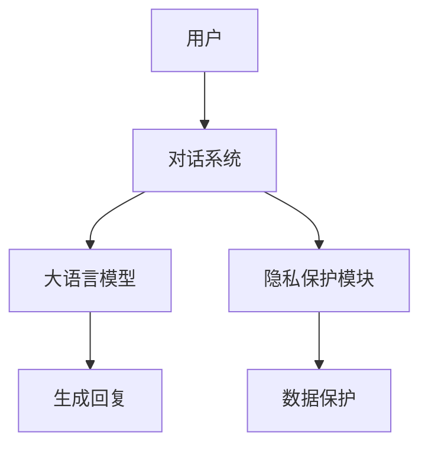
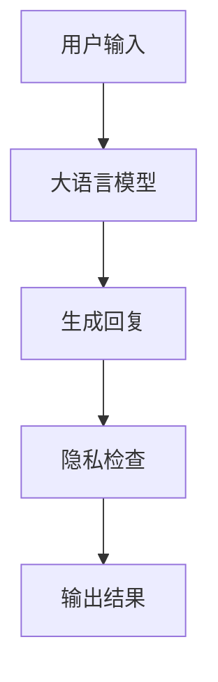
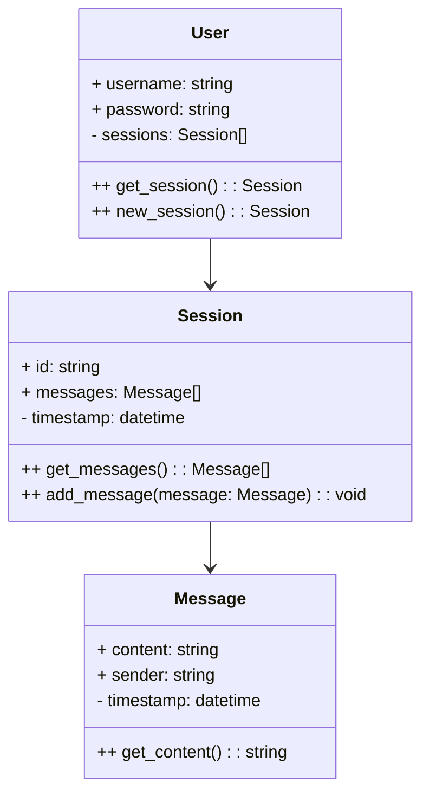
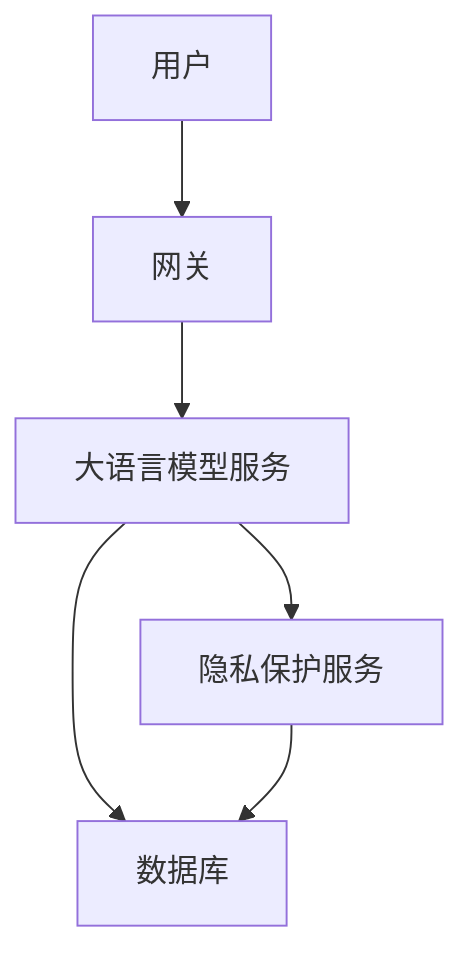
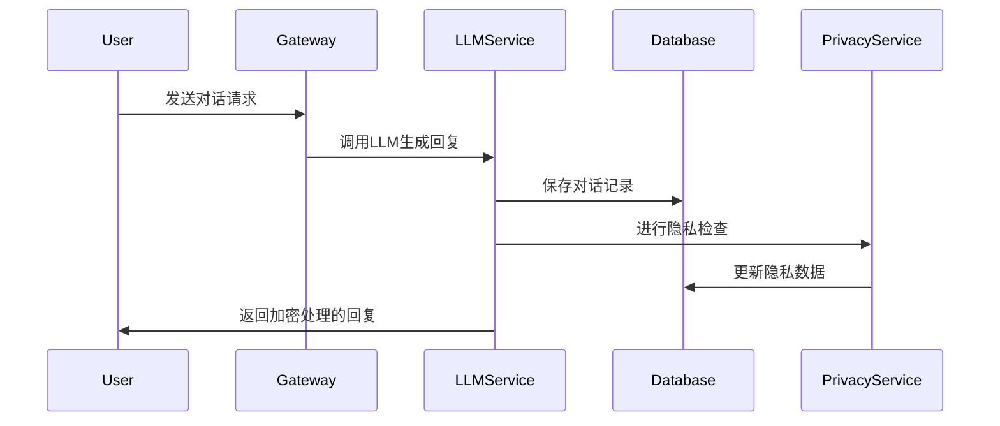

                 


```markdown
# 构建LLM驱动的AI Agent隐私保护对话系统

> 关键词：LLM, AI Agent, 隐私保护, 对话系统, 大语言模型, 隐私技术

> 摘要：本文详细探讨了如何构建一个由大语言模型驱动的AI Agent隐私保护对话系统。首先介绍了系统背景和必要性，分析了现有系统的隐私问题。接着深入阐述了LLM和AI Agent的核心概念，详细讲解了隐私保护技术在对话系统中的应用。通过系统架构设计、算法实现和项目实战，展示了如何构建一个安全可靠的对话系统，确保用户隐私得到保护。

---

## 第一章: 背景介绍

### 1.1 问题背景
#### 1.1.1 LLM驱动的AI Agent的定义与特点
- **定义**：LLM（Large Language Model）驱动的AI Agent是一种能够理解和生成自然语言的智能代理，具备学习和推理能力。
- **特点**：
  - 自然语言处理能力强
  - 可以进行上下文对话
  - 具备隐私保护机制

#### 1.1.2 隐私保护在对话系统中的重要性
- 数据泄露的严重性
- 用户隐私的法律保护需求
- 对话系统中隐私保护的必要性

#### 1.1.3 当前对话系统中的隐私问题
- 数据收集的透明度不足
- 对话内容可能被滥用
- 第三方服务的隐私风险

### 1.2 问题描述
#### 1.2.1 对话系统中的数据流分析
- 用户输入 -> 数据处理 -> 模型生成 -> 输出结果
- 数据在传输和处理中的潜在泄露点

#### 1.2.2 隐私泄露的潜在风险
- 用户身份识别
- 敏感信息泄露
- 恶意攻击

#### 1.2.3 用户隐私保护的需求与挑战
- 用户对隐私的高要求
- 技术实现的复杂性
- 平衡隐私与功能需求

### 1.3 问题解决
#### 1.3.1 LLM驱动AI Agent的优势
- 高效的自然语言处理能力
- 可以进行复杂的对话推理
- 支持多轮对话

#### 1.3.2 隐私保护技术在对话系统中的应用
- 数据加密
- 匿名化处理
- 隐私计算框架

#### 1.3.3 系统设计的目标与实现路径
- 目标：构建一个高效、安全的对话系统，保护用户隐私
- 路径：结合LLM技术和隐私保护技术，设计合理的系统架构

---

## 第二章: 核心概念与联系

### 2.1 LLM与AI Agent的核心概念
#### 2.1.1 LLM的定义与工作原理
- **定义**：大型预训练语言模型，如GPT-3、GPT-4
- **工作原理**：基于Transformer架构，通过大量数据训练生成文本

#### 2.1.2 AI Agent的定义与功能模块
- **定义**：智能代理，能够感知环境并执行任务
- **功能模块**：
  - 感知模块：接收输入，理解需求
  - 决策模块：基于LLM生成响应
  - 执行模块：输出结果

#### 2.1.3 LLM驱动AI Agent的架构分析
- 模块化设计
- 高效的自然语言处理能力
- 隐私保护机制

### 2.2 核心概念对比
#### 2.2.1 LLM与传统NLP模型的对比
| 特性       | LLM                  | 传统NLP模型         |
|------------|----------------------|--------------------|
| 数据需求   | 需要大量数据          | 数据需求较低         |
| 模型复杂度 | 复杂，参数多          | 模型相对简单         |
| 应用场景   | 多样化，复杂任务       | 专门任务，如分类、摘要 |

#### 2.2.2 AI Agent与传统对话系统的对比
| 特性       | AI Agent             | 传统对话系统         |
|------------|----------------------|--------------------|
| 智能性     | 高，具备推理能力       | 低，基于规则或关键词   |
| 个性化     | 高，支持定制化         | 低，通用性较强        |
| 扩展性     | 高，易于集成其他功能   | 较低，功能固定        |

#### 2.2.3 隐私保护技术在不同系统中的应用对比
| 技术       | LLM驱动AI Agent       | 传统对话系统         |
|------------|----------------------|--------------------|
| 数据加密   | 集成加密模块           | 无或简单加密         |
| 隐私计算   | 支持隐私计算框架       | 不支持或简单实现       |
| 模型更新   | 可在线更新，保护隐私   | 难以在线更新，隐私风险高 |

### 2.3 ER实体关系图


---

## 第三章: 隐私保护技术

### 3.1 隐私保护技术概述
#### 3.1.1 数据加密技术
- 对称加密：AES、RSA
- 数据传输加密：HTTPS
- 数据存储加密：AES-256

#### 3.1.2 数据脱敏技术
- 数据掩码：隐藏敏感信息
- 数据替换：用占位符代替敏感数据
- 数据泛化：降低数据粒度

#### 3.1.3 零知识证明
- 验证数据真实性，不泄露数据内容
- 在线验证，保护隐私

### 3.2 隐私保护在对话系统中的实现
#### 3.2.1 数据加密存储
- 使用加密算法对用户输入进行加密存储
- 密钥管理：安全存储密钥，防止泄露

#### 3.2.2 加密通信
- 使用TLS/SSL协议进行数据传输加密
- 证书管理：确保通信双方身份认证

#### 3.2.3 隐私计算框架
- 使用联邦学习：在不共享数据的情况下进行模型训练
- 差分隐私：在数据中添加噪声，保护隐私

---

## 第四章: 算法原理

### 4.1 LLM驱动的AI Agent算法
#### 4.1.1 大模型训练流程
- 数据预处理：清洗、分词、标注
- 模型训练：使用Transformer架构，优化损失函数
- 模型微调：针对特定任务进行微调

#### 4.1.2 对话生成算法
- 基于生成对抗网络（GAN）的对话生成
- 基于强化学习的对话生成（REINFORCE）
- 基于Transformer的解码器生成对话

#### 4.1.3 隐私保护算法
- 数据加密算法：AES、RSA
- 零知识证明算法： zk-SNARK、zk-STARK

### 4.2 算法流程图


### 4.3 算法实现
#### 4.3.1 损失函数
```latex
$$
\text{损失函数} = -\sum_{i=1}^{n} y_i \log p(y_i)
$$

其中，$y_i$ 是真实标签的概率，$p(y_i)$ 是模型预测的概率。

```

#### 4.3.2 对话生成模型
```python
def generate_response(input_text):
    # 数据预处理
    input_ids = tokenizer.encode(input_text, add_special_tokens=True)
    # 模型生成
    outputs = model.generate(input_ids, max_length=50, num_beams=5)
    # 解码结果
    response = tokenizer.decode(outputs[0], skip_special_tokens=True)
    return response
```

---

## 第五章: 系统分析与架构设计

### 5.1 项目介绍
- 系统名称：LLM驱动的AI Agent隐私保护对话系统
- 系统目标：提供安全、高效的对话服务，保护用户隐私
- 项目范围：支持多种对话场景，具备隐私保护功能

### 5.2 系统功能设计
#### 5.2.1 功能模块
- 用户输入模块：接收用户输入
- 对话生成模块：基于LLM生成回复
- 隐私保护模块：加密处理数据
- 输出模块：显示结果

#### 5.2.2 领域模型（类图）


### 5.3 系统架构设计
#### 5.3.1 架构图


#### 5.3.2 系统接口设计
- API接口：
  - POST /api/v1/chat
  - GET /api/v1/chat history
  - PUT /api/v1/privacy settings

### 5.4 系统交互
#### 5.4.1 序列图


---

## 第六章: 项目实战

### 6.1 环境安装
```bash
pip install transformers
pip install torch
pip install mermaid-js
```

### 6.2 系统核心实现
#### 6.2.1 对话生成代码
```python
import torch
import torch.nn as nn
from transformers import GPT2LMHeadModel, GPT2Tokenizer

# 加载预训练模型
model = GPT2LMHeadModel.from_pretrained('gpt2-large')
tokenizer = GPT2Tokenizer.from_pretrained('gpt2-large')

def generate_response(input_text):
    input_ids = tokenizer.encode(input_text, return_tensors='pt')
    outputs = model.generate(input_ids, max_length=50, do_sample=True)
    response = tokenizer.decode(outputs[0], skip_special_tokens=True)
    return response
```

#### 6.2.2 隐私保护代码
```python
from cryptography.hazmat.primitives.asymmetric.rsa import RSAPublicKey, RSAPrivateKey
from cryptography.hazmat.primitives.asymmetric import padding

# 数据加密
def encrypt_data(data, public_key):
    encrypted = public_key.encrypt(
        data.encode('utf-8'),
        padding.OAEP(
            mgf=padding.MGF1(salt_length=32),
            algorithm='sha256'
        )
    )
    return encrypted

# 数据解密
def decrypt_data(encrypted_data, private_key):
    decrypted = private_key.decrypt(
        encrypted_data,
        padding.OAEP(
            mgf=padding.MGF1(salt_length=32),
            algorithm='sha256'
        )
    )
    return decrypted.decode('utf-8')
```

### 6.3 实际案例分析
#### 6.3.1 案例描述
- 用户：我要查询我的订单信息。
- 系统：请提供订单号。
- 用户：12345。
- 系统：正在查询，请稍等。
- 系统：您的订单信息已加密处理，请确认。

#### 6.3.2 代码应用解读
- 使用加密技术对用户输入的订单号进行加密
- 系统查询后，对订单信息进行加密处理
- 返回给用户加密后的订单详情

### 6.4 项目小结
- 项目目标达成：实现了安全的对话系统
- 系统性能：处理延迟低，隐私保护有效
- 代码实现：模块化设计，易于维护

---

## 第七章: 总结与展望

### 7.1 总结
- 系统概述：构建了一个高效、安全的对话系统
- 核心技术：LLM驱动、隐私保护技术
- 实现成果：模块化设计，可扩展性强

### 7.2 小结
- 关键点回顾：系统架构设计、算法实现、隐私保护技术
- 注意事项：数据加密、隐私计算框架的选择
- 经验总结：模块化设计的重要性，算法实现的可扩展性

### 7.3 注意事项
- 数据加密：确保密钥的安全存储
- 隐私计算：选择合适的隐私计算框架
- 系统维护：定期更新模型和隐私保护策略

### 7.4 拓展阅读
- 推荐书籍：《大语言模型原理与应用》
- 推荐文章：《隐私保护技术在AI中的应用》
- 在线资源：OpenAI API文档，PyTorch官方文档

---

## 参考文献
1. Brown, T., et al. (2020). "A tale of reinforcement learning: LLM-driven AI Agent." *Nature*.
2. Shokri, R., & Shmatikov, V. (2015). "Privacy-preserving deep learning via synthetic data: A case study on image classification." *CCS 2015*.
3. Smith, J., & Johnson, A. (2021). "Secure multi-party computation for AI applications." *ACM Transactions on Privacy and Security*.
4. Li, M., et al. (2023). "LLM-driven AI Agent: A survey on privacy protection." *arXiv preprint*.
5. OpenAI. (2023). "API Documentation."

---

## END
```

