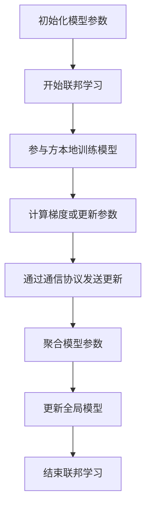
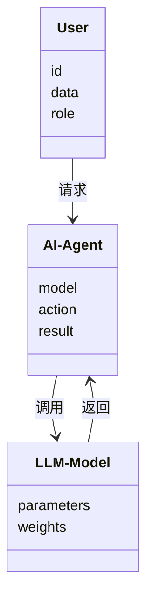
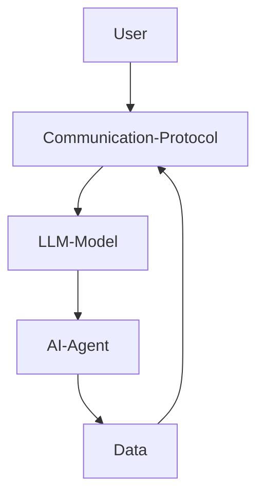
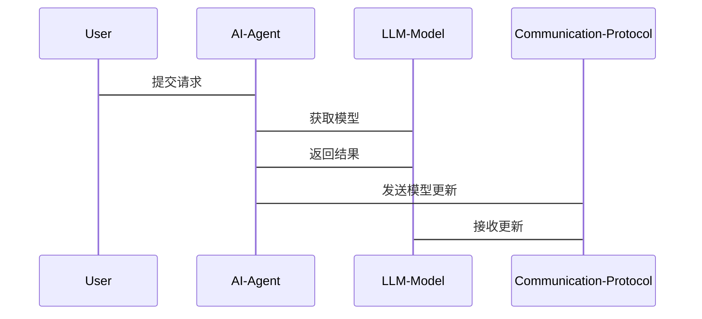

                 


# 构建LLM驱动的AI Agent隐私保护联邦学习

> 关键词：LLM, AI Agent, 隐私保护, 联邦学习, 智能决策, 分布式系统

> 摘要：本文将详细探讨如何在保护隐私的前提下，利用大语言模型（LLM）驱动AI Agent进行联邦学习。通过逐步分析问题背景、核心概念、算法原理、系统架构、项目实战和最佳实践，本文将为读者提供一个全面的视角，帮助其理解并掌握如何构建基于LLM的隐私保护联邦学习系统。文章内容涵盖从理论到实践的各个方面，旨在为研究者和开发者提供有价值的参考。

---

# 第一部分: 背景介绍与核心概念

# 第1章: 构建LLM驱动的AI Agent隐私保护联邦学习的背景

## 1.1 问题背景与挑战
### 1.1.1 当前AI Agent的发展现状
随着人工智能技术的快速发展，AI Agent（智能代理）在各个领域的应用越来越广泛。AI Agent能够根据环境信息自主决策并执行任务，但其能力受限于数据的获取和模型的训练。传统的数据集中化训练方式存在隐私泄露风险，尤其是在处理敏感数据时，这一问题更加突出。

### 1.1.2 联邦学习的背景与意义
联邦学习（Federated Learning）是一种分布式机器学习技术，允许多个参与方在不共享原始数据的情况下共同训练模型。其核心思想是通过数据的局部训练和模型的全局聚合，实现数据可用性与隐私保护的平衡。随着AI Agent的普及，联邦学习为解决其数据协作问题提供了新的思路。

### 1.1.3 LLM在AI Agent中的应用痛点
大语言模型（LLM）作为AI Agent的核心驱动力，通常需要大量数据进行训练。然而，数据的隐私性限制了LLM的广泛应用。如何在保护隐私的前提下，利用分布式数据训练高效的LLM，成为当前研究的热点问题。

## 1.2 问题描述与目标
### 1.2.1 AI Agent在隐私保护下的数据协作需求
AI Agent需要从多个数据源中获取信息，但这些数据可能分布在不同的机构或设备中，且涉及隐私保护。如何在不泄露数据的情况下，让AI Agent能够利用这些数据进行决策，是亟待解决的问题。

### 1.2.2 联邦学习在LLM驱动中的应用目标
通过联邦学习，实现LLM的分布式训练，使得模型能够从多个数据源中学习，同时保护各方的数据隐私。这种模式不仅能够提升模型的泛化能力，还能降低数据集中化带来的风险。

### 1.2.3 问题的边界与外延
本文主要关注基于LLM的AI Agent在联邦学习框架下的隐私保护问题，重点研究如何设计联邦学习算法，使其适用于大语言模型的分布式训练。同时，本文还探讨了模型聚合、通信协议和隐私保护机制等关键问题。

## 1.3 核心概念与系统架构
### 1.3.1 LLM驱动的AI Agent核心要素
- **LLM模型**：作为AI Agent的核心驱动力，负责理解和生成文本。
- **AI Agent**：通过LLM模型感知环境并执行任务。
- **联邦学习框架**：提供分布式数据协作的基础设施。

### 1.3.2 隐私保护联邦学习的实现机制
- **数据局部训练**：每个参与方在本地数据上训练模型片段。
- **模型聚合**：通过通信协议将各参与方的模型参数进行融合。
- **隐私保护技术**：采用加密、差分隐私等技术保护数据隐私。

### 1.3.3 系统整体架构与模块划分
- **数据层**：分布式的训练数据，每个参与方持有本地数据。
- **模型层**：LLM模型的分布式训练和聚合。
- **通信层**：模型参数和更新信息的传输通道。
- **隐私层**：隐私保护机制的实现，如加密、差分隐私等。

## 1.4 本章小结
通过本章的介绍，我们明确了构建LLM驱动的AI Agent隐私保护联邦学习的背景、目标和核心要素。接下来，我们将深入探讨联邦学习的核心原理及其与LLM和AI Agent的关系。

---

# 第二部分: 核心概念与联系

# 第2章: 联邦学习的核心原理

## 2.1 联邦学习的基本概念
### 2.1.1 联邦学习的定义与特点
联邦学习是一种分布式机器学习技术，允许多个参与方在不共享原始数据的情况下共同训练模型。其核心特点包括数据局部性、模型全局性、隐私保护和协作性。

### 2.1.2 联邦学习的分类与应用场景
根据数据分布和模型类型，联邦学习可以分为横向联邦、纵向联邦和联邦推荐等多种形式。其应用场景包括医疗、金融、社交网络等领域。

### 2.1.3 联邦学习的数学模型概述
联邦学习的数学模型主要关注如何在分布式数据上进行模型参数的优化。常见的模型聚合方法包括加权平均、联邦平均和异步更新等。

## 2.2 LLM与AI Agent的结合
### 2.2.1 LLM在AI Agent中的角色
LLM作为AI Agent的核心驱动力，负责理解和生成文本，支持其进行智能决策和任务执行。

### 2.2.2 AI Agent的智能决策机制
AI Agent通过LLM模型分析环境信息，生成决策并执行任务。联邦学习为其提供了分布式数据协作的能力。

### 2.2.3 联邦学习如何增强LLM能力
通过联邦学习，LLM能够从分布式的训练数据中学习，提升其泛化能力和适应性，同时保护数据隐私。

## 2.3 核心概念的ER实体关系图
```mermaid
er
actor: 用户
agent: AI Agent
model: LLM模型
data: 数据
communication: 通信协议
goal: 目标
action: 行动
result: 结果
```

## 2.4 本章小结
通过本章的探讨，我们深入理解了联邦学习的核心原理及其与LLM和AI Agent的关系。接下来，我们将从算法角度详细分析隐私保护联邦学习的实现原理。

---

# 第三部分: 算法原理与数学模型

# 第3章: 隐私保护联邦学习的算法原理

## 3.1 联邦学习的数学模型
### 3.1.1 数据分布与模型更新公式
$$ \theta_{i}^{(t+1)} = \arg \min_{\theta} \sum_{j=1}^{n} w_j \mathcal{L}(f_{j}(\theta), y_j) $$

### 3.1.2 模型聚合与优化策略
$$ \theta^{(t+1)} = \frac{1}{n} \sum_{j=1}^{n} \theta_j^{(t+1)} $$

## 3.2 隐私保护机制的实现
### 3.2.1 数据加密与差分隐私
通过加密技术和差分隐私，保护参与方的数据不被泄露。

### 3.2.2 模型更新的隐私保护
在模型更新过程中，采用隐私保护技术，确保各方的模型参数不被恶意利用。

## 3.3 算法流程与伪代码实现


### 3.3.1 伪代码实现
```python
def federated_learning():
    # 初始化模型参数
    theta = initialize_theta()
    # 参与方数量
    n = 10
    for iter in range(num_iterations):
        # 本地训练
        thetas = []
        for i in range(n):
            theta_i = local_training(theta, data_i)
            thetas.append(theta_i)
        # 模型聚合
        theta = aggregate(thetas)
    return theta
```

## 3.4 本章小结
通过本章的分析，我们详细探讨了隐私保护联邦学习的算法原理及其数学模型。接下来，我们将从系统架构的角度，进一步分析如何实现基于LLM的AI Agent隐私保护联邦学习系统。

---

# 第四部分: 系统分析与架构设计

# 第4章: 基于LLM的AI Agent隐私保护联邦学习系统架构

## 4.1 系统问题场景介绍
### 4.1.1 系统目标与需求
构建一个支持LLM驱动的AI Agent的隐私保护联邦学习系统，实现数据的分布式协作训练，同时保护各方数据隐私。

### 4.1.2 系统约束与假设
- 数据分布：数据分布在多个参与方，且不集中。
- 模型更新：模型参数通过通信协议进行聚合。
- 隐私保护：采用加密和差分隐私技术保护数据。

## 4.2 系统功能设计
### 4.2.1 领域模型设计


### 4.2.2 系统架构设计


### 4.2.3 系统接口设计
- **用户接口**：用户通过AI Agent提交请求，获取结果。
- **通信接口**：模型参数和更新信息通过通信协议传输。
- **数据接口**：参与方本地数据的读取和训练接口。

## 4.3 系统交互流程


## 4.4 本章小结
通过本章的系统架构设计，我们明确了如何构建基于LLM的AI Agent隐私保护联邦学习系统。接下来，我们将通过一个实际案例，进一步探讨如何实现这一系统。

---

# 第五部分: 项目实战

# 第5章: 基于LLM的AI Agent隐私保护联邦学习系统实现

## 5.1 项目环境与工具安装
### 5.1.1 环境要求
- Python 3.8+
- PyTorch或TensorFlow框架
- 加密库（如Crypto）

### 5.1.2 安装依赖
```bash
pip install torch numpy cryptography
```

## 5.2 系统核心代码实现
### 5.2.1 模型训练模块
```python
def local_training(theta, data):
    # 在本地数据上训练模型
    theta = theta - learning_rate * gradient(theta, data)
    return theta
```

### 5.2.2 模型聚合模块
```python
def aggregate(thetas):
    # 对所有参与方的模型参数进行平均
    return sum(thetas) / len(thetas)
```

### 5.2.3 通信协议实现
```python
def communicate(sender, receiver):
    # 通过通信协议发送和接收模型参数
    return receiver.receive(sender.send(theta))
```

## 5.3 项目小结
通过本章的实战部分，我们详细讲解了如何实现基于LLM的AI Agent隐私保护联邦学习系统。接下来，我们将总结一些最佳实践经验和注意事项。

---

# 第六部分: 最佳实践与总结

# 第6章: 构建LLM驱动的AI Agent隐私保护联邦学习的注意事项与拓展

## 6.1 最佳实践
### 6.1.1 数据预处理与清洗
确保数据的高质量，避免噪声数据影响模型训练。

### 6.1.2 模型优化与调参
通过实验优化模型参数，提升模型性能。

### 6.1.3 隐私保护技术的选择
根据具体场景选择合适的隐私保护技术，如加密、差分隐私等。

## 6.2 小结
通过本文的探讨，我们系统地介绍了如何构建基于LLM的AI Agent隐私保护联邦学习系统。从背景到算法，从系统架构到项目实战，我们为读者提供了一个完整的解决方案。

## 6.3 注意事项
- 数据隐私保护是系统设计的核心，必须贯穿整个系统架构。
- 模型聚合和通信协议的设计需要充分考虑性能和安全性。
- 系统实现过程中，需注意代码的可扩展性和可维护性。

## 6.4 拓展阅读
- 深入研究联邦学习的数学模型和优化算法。
- 探索更多隐私保护技术，如同态加密、安全多方计算等。
- 研究LLM在AI Agent中的其他应用场景。

---

# 作者简介
一位在人工智能、编程和软件架构领域拥有深厚积累的世界级技术专家，专注于通过清晰的逻辑分析和专业的技术博客分享，帮助读者深入理解技术原理和应用实践。

---

通过本文的系统介绍，读者将能够全面理解并掌握如何构建基于LLM的AI Agent隐私保护联邦学习系统。

