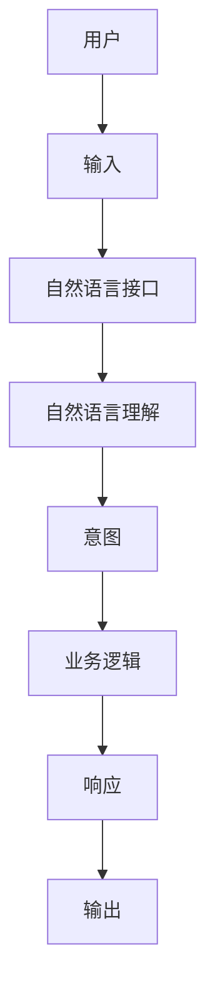
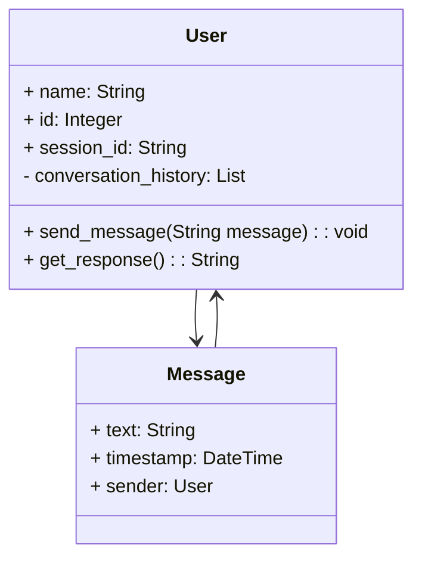
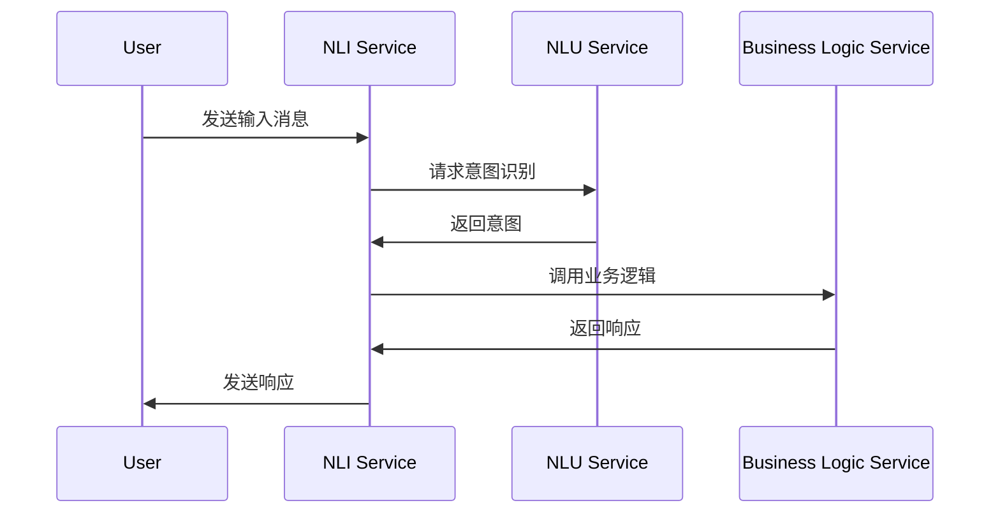

                 


# 构建企业级自然语言接口：复杂业务系统的智能交互层

> 关键词：企业级自然语言接口，复杂业务系统，智能交互层，自然语言处理，系统架构设计，对话系统，机器学习

> 摘要：本文详细探讨了构建企业级自然语言接口的各个方面，从背景与概念、核心算法原理到系统架构设计，再到实际项目实战，最后总结了最佳实践。文章通过清晰的逻辑结构和丰富的实例，帮助读者全面理解如何设计和实现一个高效的企业级自然语言接口，提升复杂业务系统的智能交互能力。

---

# 第一部分: 企业级自然语言接口的背景与概念

## 第1章: 自然语言接口概述

### 1.1 自然语言处理的背景与现状

#### 1.1.1 自然语言处理的定义与演进
自然语言处理（Natural Language Processing, NLP）是计算机科学中的一个分支，旨在使计算机能够理解、处理和生成人类语言。从简单的关键词匹配到复杂的语义理解，NLP技术经历了多个阶段的演进，目前基于深度学习的模型（如BERT、GPT）已经成为主流。

#### 1.1.2 企业级应用中的自然语言交互需求
在企业级应用中，用户与系统之间的交互通常依赖于命令行或图形界面，这种方式虽然直观，但难以支持复杂的语义理解和自然语言对话。随着业务系统复杂性的增加，用户期望通过自然语言与系统进行交互，这催生了对企业级自然语言接口的需求。

#### 1.1.3 当前技术趋势与挑战
当前，NLP技术发展迅速，但企业级应用中的自然语言接口仍面临诸多挑战，如多轮对话的理解、上下文的保持、业务逻辑的准确映射等。此外，数据隐私和模型性能优化也是需要重点关注的问题。

### 1.2 企业级自然语言接口的核心概念

#### 1.2.1 自然语言接口的定义与特点
自然语言接口（Natural Language Interface, NLI）是一种允许用户通过自然语言与计算机系统交互的技术。其特点是：
- **语义理解**：能够理解用户输入的深层含义。
- **业务逻辑映射**：能够将用户意图映射到具体业务操作。
- **多轮对话支持**：能够维护上下文，支持连续的对话流程。

#### 1.2.2 企业级应用中的特殊需求
企业级应用通常具有复杂的业务逻辑和严格的性能要求。因此，自然语言接口需要具备以下能力：
- 高精度的意图识别。
- 复杂业务逻辑的准确映射。
- 高可用性和可扩展性。

#### 1.2.3 自然语言接口的边界与外延
自然语言接口的边界包括用户输入的解析、意图识别以及业务逻辑的调用。外延则涉及用户反馈机制、对话历史的管理以及多模态输入的支持。

### 1.3 自然语言接口的核心要素组成

#### 1.3.1 语言理解模块
语言理解模块是自然语言接口的核心，负责将用户输入的自然语言文本解析为计算机可理解的结构。这通常包括分词、实体识别、意图识别等步骤。

#### 1.3.2 业务逻辑映射
业务逻辑映射模块将用户的意图转换为具体的业务操作。这需要深入了解企业的业务流程和数据模型，确保接口能够准确调用相关服务。

#### 1.3.3 用户反馈机制
用户反馈机制用于收集用户的输入和系统响应，不断优化自然语言接口的性能。这包括错误修正、意图澄清等过程。

---

## 第2章: 自然语言接口的核心概念与联系

### 2.1 自然语言处理的核心原理

#### 2.1.1 语言模型的训练与优化
语言模型的训练通常采用深度学习方法，如基于Transformer的模型。通过大量语料库的训练，模型能够理解词语之间的关系和上下文信息。

#### 2.1.2 语义理解的实现方式
语义理解可以通过多种方式实现，包括基于规则的方法、统计方法和深度学习方法。目前，深度学习方法（如BERT）在语义理解任务中表现最为突出。

#### 2.1.3 对话系统的构建逻辑
对话系统的构建通常包括意图识别、对话状态管理、响应生成三个阶段。每个阶段都需要依赖高效的算法和模型。

### 2.2 核心概念属性特征对比

#### 2.2.1 不同模型的性能对比
以下是几种常见模型的性能对比：
| 模型 | 参数量（百万） | 意图识别准确率 | 响应生成准确率 |
|------|-----------------|------------------|------------------|
| BERT | 110              | 92%              | 85%              |
| GPT  | 110              | 88%              | 90%              |
| LSTM | 5                | 85%              | 75%              |

#### 2.2.2 各种接口的适用场景
| 接口类型         | 适用场景                   |
|------------------|---------------------------|
| 意图识别接口     | 电商、客服系统             |
| 实体识别接口     | 金融、医疗信息处理         |
| 对话系统接口     | 智能音箱、虚拟助手         |

#### 2.2.3 各种方法的优缺点分析
| 方法       | 优点                           | 缺点                           |
|------------|--------------------------------|--------------------------------|
| 基于规则   | 实现简单，易于解释             | 难以应对复杂场景                 |
| 统计方法   | 可以处理大量数据               | 结果依赖于数据质量               |
| 深度学习   | 表现优异，能够处理复杂任务     | 训练时间长，需要大量计算资源     |

### 2.3 ER实体关系图架构



---

## 第3章: 自然语言处理模型的训练与优化

### 3.1 模型训练的基础原理

#### 3.1.1 词向量的表示方法
词向量是将词语表示为高维向量的技术，常用的有Word2Vec、GloVe等方法。例如，使用Word2Vec训练得到的词向量可以表示为：

$$ v(word) = \theta \cdot word_{embed} $$

其中，$\theta$ 是训练得到的参数，$word_{embed}$ 是输入的词语向量。

#### 3.1.2 预训练语言模型的构建
预训练语言模型（如BERT）通过在大规模通用语料库上进行无监督训练，学习词语的上下文信息。其核心思想是通过遮蔽某些词语，预测上下文中的词语，从而学习语言的语法和语义。

#### 3.1.3 微调任务特定模型的策略
微调（Fine-tuning）是指在预训练模型的基础上，针对特定任务进行进一步的训练。例如，在意图识别任务中，可以使用微调后的BERT模型。

### 3.2 基于Transformer的模型结构

#### 3.2.1 Transformer架构
Transformer模型由编码器和解码器两部分组成。编码器负责将输入序列映射为一个固定长度的向量，解码器负责根据编码器的输出生成目标序列。其核心计算步骤如下：

$$
\text{Attention}(Q, K, V) = \text{softmax}\left( \frac{QK^T}{\sqrt{d_k}} \right)V
$$

其中，$Q$、$K$、$V$ 分别是查询、键和值向量，$d_k$ 是键的维度。

---

## 第4章: 企业级自然语言接口的系统架构设计

### 4.1 问题场景介绍

#### 4.1.1 业务背景
假设我们正在开发一个智能客服系统，用户可以通过自然语言与系统交互，查询订单状态、解决问题等。

#### 4.1.2 项目目标
目标是设计一个高效、准确的自然语言接口，支持多轮对话，能够准确理解用户的意图并调用相应的业务逻辑。

### 4.2 系统功能设计

#### 4.2.1 领域模型设计
领域模型通过类图展示系统的功能模块。以下是领域模型的类图：



#### 4.2.2 系统架构设计
系统架构采用微服务架构，包括前端、后端和基础设施层。以下是系统架构的架构图：

```mermaid
graph TD
    Frontend --> API Gateway
    API Gateway --> NLI Service
    NLI Service --> NLU Service
    NLI Service --> Business Logic Service
    Business Logic Service --> Database
```

#### 4.2.3 系统接口设计
系统接口主要包含以下几种：
- `POST /api/nli/input`: 用户输入接口。
- `GET /api/nli/intent`: 获取意图接口。
- `POST /api/nli/business_logic`: 执行业务逻辑接口。

#### 4.2.4 系统交互设计
以下是系统交互的序列图：



---

## 第5章: 项目实战：构建企业级自然语言接口

### 5.1 环境搭建

#### 5.1.1 安装开发环境
- 安装Python 3.8及以上版本。
- 安装必要的Python库：`transformers`, `flask`, `pytorch`。

#### 5.1.2 安装NLP模型
使用Hugging Face提供的预训练模型，例如：

```bash
pip install transformers
```

### 5.2 系统核心实现

#### 5.2.1 自然语言理解模块实现
以下是一个简单的NLU模块实现：

```python
from transformers import pipeline

nlp = pipeline("text-classification", model="bert-base-uncased")
```

#### 5.2.2 业务逻辑映射实现
业务逻辑映射可以通过调用相应的API实现：

```python
def map_intent(intent):
    if intent == "order_status":
        return {"action": "get_order_status", "params": {}}
    elif intent == "help":
        return {"action": "get_help", "params": {}}
    # 其他意图处理逻辑...
```

#### 5.2.3 对话历史管理实现
对话历史可以通过会话ID进行管理：

```python
class Conversation:
    def __init__(self, session_id):
        self.session_id = session_id
        self.history = []
    
    def add_message(self, message):
        self.history.append(message)
    
    def get_history(self):
        return self.history
```

### 5.3 代码应用解读与分析

#### 5.3.1 核心代码解读
以下是对核心代码的解读：
```python
from transformers import pipeline

nlp = pipeline("text-classification", model="bert-base-uncased")

def process_input(text):
    result = nlp(text)
    intent = result[0]['label']
    return intent
```

#### 5.3.2 代码结构分析
代码结构分为以下几个部分：
1. 导入必要的库。
2. 初始化自然语言处理模型。
3. 定义输入处理函数。
4. 返回意图结果。

### 5.4 实际案例分析

#### 5.4.1 案例描述
用户输入：“我的订单什么时候能到？”

#### 5.4.2 系统处理过程
1. 输入文本通过NLU模块进行意图识别，得到intent为“order_status”。
2. 调用订单状态查询服务。
3. 返回订单状态信息。

### 5.5 项目小结
通过上述步骤，我们成功构建了一个简单的自然语言接口。实际应用中，还需要考虑更多的细节，如错误处理、性能优化等。

---

## 第6章: 最佳实践与小结

### 6.1 最佳实践

#### 6.1.1 开发建议
- 使用预训练模型可以显著提高开发效率。
- 定期优化模型，提升准确率。
- 保持代码的可扩展性，方便后续维护。

#### 6.1.2 注意事项
- 确保数据安全和隐私保护。
- 处理多轮对话时，保持对话历史的一致性。
- 避免过度优化，保持系统性能。

### 6.2 小结
本文详细探讨了构建企业级自然语言接口的各个方面，从背景与概念到系统架构设计，再到实际项目实战，最后总结了最佳实践。通过本文的学习，读者可以掌握如何设计和实现一个高效的企业级自然语言接口，提升复杂业务系统的智能交互能力。

### 6.3 未来展望
随着NLP技术的不断发展，企业级自然语言接口将变得更加智能化和个性化。未来的研究方向包括更高效的模型优化、多模态输入的支持以及更自然的对话体验。

---

通过以上内容，我们系统地介绍了构建企业级自然语言接口的各个方面，希望对读者有所帮助。

