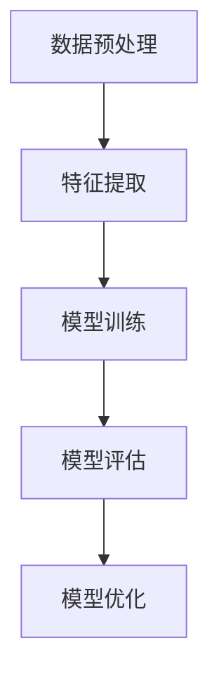
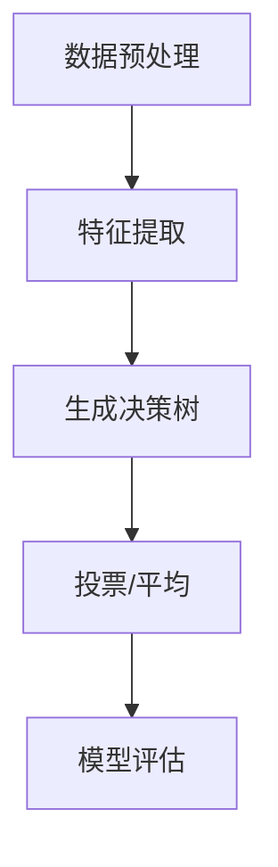
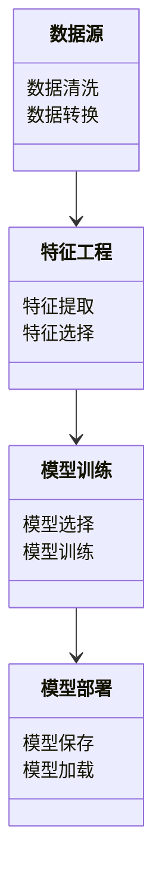
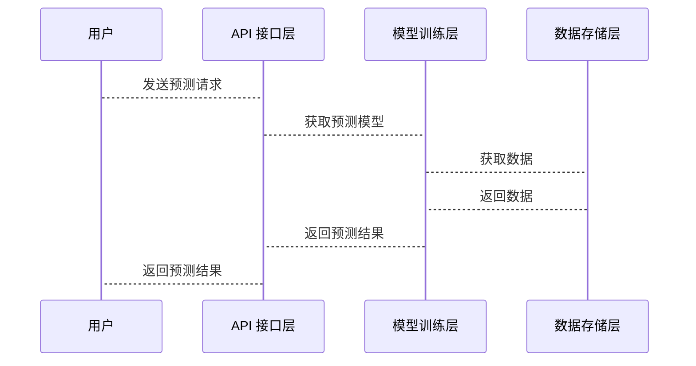

                 


# {{构建企业级预测性分析平台：跨业务领域的综合预测模型}}

> 关键词：预测性分析平台，机器学习，深度学习，大数据，预测模型，跨业务领域

> 摘要：本文将详细介绍如何构建一个企业级预测性分析平台，涵盖从基础概念到实际应用的各个方面。通过分析跨业务领域的综合预测模型，我们将探讨其在不同业务场景中的应用，以及如何利用先进的算法和系统架构来实现高效、可靠的预测能力。本文将从背景介绍、核心概念、算法原理、系统架构设计、项目实战到总结，全面解析企业级预测性分析平台的构建过程。

---

# 第一部分: 企业级预测性分析平台的背景与核心概念

---

## # 第1章: 预测性分析平台的背景与概念

### ## 1.1 预测性分析平台的背景

#### ### 1.1.1 数据驱动决策的兴起

随着大数据技术的快速发展，企业逐渐意识到数据的价值。通过分析海量数据，企业能够发现潜在的业务模式、优化运营流程、提升客户体验，甚至预测未来的市场趋势。预测性分析平台正是基于这一背景应运而生，它利用机器学习和深度学习技术，帮助企业从数据中提取洞察，做出更明智的决策。

#### ### 1.1.2 企业级预测性分析的定义

企业级预测性分析是指在企业范围内，利用先进的数据分析技术，对未来的业务趋势、客户行为、市场变化等进行预测。与传统的报表分析不同，预测性分析不仅关注过去的事实，还关注未来的可能性，为企业提供前瞻性的决策支持。

#### ### 1.1.3 预测性分析平台的必要性

在当今竞争激烈的市场环境中，企业需要快速响应市场变化，预测性分析平台能够帮助企业提前发现潜在风险，抓住发展机遇。例如，在金融行业，预测性分析可以用于信用评估和欺诈 detection；在零售行业，可以用于销售预测和库存优化。

---

### ## 1.2 预测性分析的核心技术基础

#### ### 1.2.1 机器学习与深度学习

机器学习是预测性分析的核心技术之一。通过训练模型，机器学习算法可以从数据中自动提取特征，并预测新的数据点。深度学习作为机器学习的一个分支，通过多层神经网络模型，能够处理更复杂的非结构化数据，如文本、图像和视频。

#### ### 1.2.2 数据挖掘与大数据处理

数据挖掘是预测性分析的另一个重要技术基础。通过数据挖掘，企业可以从海量数据中发现隐藏的模式和趋势。大数据技术（如 Hadoop 和 Spark）则为数据挖掘提供了高效的数据处理能力。

#### ### 1.2.3 模型评估与优化

模型评估是预测性分析的重要环节。通过评估模型的准确率、召回率、F1 分数等指标，企业可以了解模型的性能，并对其进行优化。常用的优化方法包括参数调优、特征工程和模型集成。

---

### ## 1.3 跨业务领域预测模型的特点

#### ### 1.3.1 跨业务预测的挑战

跨业务预测的挑战主要体现在数据的多样性和模型的泛化能力上。不同业务领域通常具有不同的数据特征和业务逻辑，如何在跨业务场景下构建通用的预测模型是一个难点。

#### ### 1.3.2 跨业务预测的优势

跨业务预测的优势在于能够充分利用企业的整体数据资源，发现跨业务之间的关联性。例如，在零售和金融业务中，可以通过跨业务预测发现客户的行为模式，从而制定更精准的营销策略。

#### ### 1.3.3 跨业务预测的实现方式

跨业务预测的实现方式通常包括数据融合、特征提取和模型训练三个步骤。通过数据融合，企业可以将不同业务领域的数据整合到一个统一的数据集，然后通过特征提取和模型训练，构建跨业务预测模型。

---

### ## 1.4 本章小结

本章介绍了预测性分析平台的背景、核心技术基础以及跨业务领域预测模型的特点。通过这些内容，我们明确了预测性分析平台的重要性和实现的复杂性，为后续章节的深入分析奠定了基础。

---

## # 第2章: 预测性分析平台的核心概念与联系

### ## 2.1 核心概念原理

#### ### 2.1.1 预测模型的输入输出

预测模型的输入通常是结构化或非结构化的数据，输出则是对未来的预测结果。例如，在销售预测模型中，输入可能是历史销售数据和市场趋势，输出则是未来的销售预测值。

#### ### 2.1.2 数据特征的提取与处理

数据特征提取是预测模型训练的关键步骤。通过特征工程，可以将原始数据转化为对模型更有用的特征。例如，将日期特征分解为年、月、日等子特征。

#### ### 2.1.3 模型训练与部署

模型训练是通过优化算法（如梯度下降）调整模型参数，以最小化预测误差的过程。模型部署则是将训练好的模型集成到企业现有的 IT 系统中，以便实时预测。

---

### ## 2.2 核心概念对比表格

#### ### 2.2.1 预测模型类型对比

| 模型类型       | 优点                     | 缺点                     |
|----------------|--------------------------|--------------------------|
| 线性回归       | 简单，易于解释             | 无法处理非线性关系         |
| 随机森林       | 能处理非线性关系，鲁棒性好   | 黑箱模型，解释性差         |
| 支持向量机     | 准确率高，适合小数据集       | 不适合高维数据             |

#### ### 2.2.2 数据特征重要性对比

| 特征名称       | 重要性评分                 | 影响预测结果的方式         |
|----------------|---------------------------|---------------------------|
| 客户年龄       | 高                        | 年龄较大的客户可能更倾向于购买高端产品 |
| 购买记录       | 高                        | 近期购买频率影响未来购买行为 |
| 收入水平       | 中                        | 收入水平与购买力相关       |

#### ### 2.2.3 模型性能指标对比

| 指标名称       | 定义                     | 适用场景                 |
|----------------|--------------------------|--------------------------|
| 准确率         | 正确预测的比例           | 分类问题                 |
| 召回率         | 预测为正的实际正例比例     | 分类问题                 |
| F1 分数       | 准确率和召回率的调和平均值   | 分类问题                 |

---

### ## 2.3 ER实体关系图架构

```mermaid
erd
actor 预测性分析平台用户 {
    role 用户
    permission 查看预测结果
}

actor 数据存储 {
    role 数据库
    permission 提供数据支持
}

actor 模型训练 {
    role 训练器
    permission 训练预测模型
}

预测性分析平台用户 --> 数据存储: 查询数据
预测性分析平台用户 --> 模型训练: 请求模型训练
模型训练 --> 数据存储: 获取数据
```

---

### ## 2.4 本章小结

本章通过对比分析预测模型类型、数据特征重要性和模型性能指标，帮助读者更好地理解预测性分析平台的核心概念。同时，通过 ER 实体关系图，展示了平台的主要角色及其关系，为后续章节的系统架构设计奠定了基础。

---

## # 第3章: 预测性分析平台的算法原理

---

### ## 3.1 线性回归算法原理

#### ### 3.1.1 线性回归的数学模型

线性回归是一种简单的回归分析方法，其数学模型如下：

$$ y = \beta_0 + \beta_1 x + \epsilon $$

其中，$y$ 是目标变量，$x$ 是自变量，$\beta_0$ 和 $\beta_1$ 是回归系数，$\epsilon$ 是误差项。

#### ### 3.1.2 线性回归的实现步骤

1. 数据预处理：对数据进行清洗和标准化。
2. 特征提取：选择对目标变量影响较大的特征。
3. 模型训练：使用最小二乘法优化回归系数。
4. 模型评估：计算模型的 R 平方值和均方误差。

#### ### 3.1.3 线性回归的优缺点

- **优点**：简单易实现，解释性强。
- **缺点**：只能处理线性关系，无法处理复杂的非线性关系。

---

#### ### 3.1.4 线性回归的 mermaid 流程图



---

#### ### 3.1.5 线性回归的 Python 代码实现

```python
import numpy as np
from sklearn.linear_model import LinearRegression

# 示例数据
X = np.array([[1, 2], [3, 4], [5, 6]])
y = np.array([7, 8, 9])

# 创建线性回归模型
model = LinearRegression()

# 训练模型
model.fit(X, y)

# 预测结果
print(model.predict(X))
```

---

### ## 3.2 随机森林算法原理

#### ### 3.2.1 随机森林的数学模型

随机森林是一种基于决策树的集成学习算法，其数学模型如下：

$$ y = \text{sign}\left(\sum_{i=1}^{n} \text{Tree}(x)_i\right) $$

其中，$\text{Tree}(x)_i$ 是第 $i$ 棵决策树的预测结果，$\text{sign}$ 是符号函数。

#### ### 3.2.2 随机森林的实现步骤

1. 数据预处理：对数据进行清洗和标准化。
2. 特征提取：选择对目标变量影响较大的特征。
3. 模型训练：生成多棵决策树，并对预测结果进行投票或取平均值。
4. 模型评估：计算模型的准确率和 F1 分数。

#### ### 3.2.3 随机森林的优缺点

- **优点**：能够处理非线性关系，鲁棒性好。
- **缺点**：黑箱模型，解释性差。

---

#### ### 3.2.4 随机森林的 mermaid 流程图



---

#### ### 3.2.5 随机森林的 Python 代码实现

```python
import numpy as np
from sklearn.ensemble import RandomForestRegressor

# 示例数据
X = np.array([[1, 2], [3, 4], [5, 6]])
y = np.array([7, 8, 9])

# 创建随机森林模型
model = RandomForestRegressor(n_estimators=100)

# 训练模型
model.fit(X, y)

# 预测结果
print(model.predict(X))
```

---

### ## 3.3 本章小结

本章详细介绍了线性回归和随机森林两种经典的预测算法，包括其数学模型、实现步骤、优缺点以及代码实现。通过这些内容，读者可以理解预测性分析平台的核心算法原理。

---

## # 第4章: 预测性分析平台的系统架构设计

---

### ## 4.1 问题场景介绍

预测性分析平台需要解决的主要问题包括：

1. 如何高效地处理海量数据？
2. 如何构建跨业务领域的预测模型？
3. 如何保证预测结果的准确性和实时性？

---

### ## 4.2 系统功能设计

#### ### 4.2.1 领域模型 mermaid 类图



---

#### ### 4.2.2 系统架构设计 mermaid 架构图

```mermaid
archi
    数据采集层 --> 数据存储层
    数据存储层 --> 数据处理层
    数据处理层 --> 模型训练层
    模型训练层 --> API 接口层
    API 接口层 --> 用户界面层
```

---

#### ### 4.2.3 系统接口设计

1. 数据接口：负责与数据源对接，获取数据。
2. 模型接口：负责模型的训练、保存和加载。
3. 预测接口：负责接收预测请求，返回预测结果。

---

#### ### 4.2.4 系统交互 mermaid 序列图



---

### ## 4.3 本章小结

本章通过问题场景介绍、系统功能设计、架构设计和交互设计，展示了预测性分析平台的整体架构。通过这些设计，企业可以高效地构建和部署预测模型，满足业务需求。

---

## # 第5章: 预测性分析平台的项目实战

---

### ## 5.1 项目介绍

本章将以一个跨业务领域的预测性分析平台项目为例，详细介绍项目的实施过程。项目目标是通过构建预测模型，帮助企业实现销售预测和客户 churn 分类。

---

### ## 5.2 环境安装

#### ### 5.2.1 安装 Python 和必要的库

```bash
pip install numpy pandas scikit-learn
```

---

### ## 5.3 系统核心实现源代码

#### ### 5.3.1 数据预处理代码

```python
import pandas as pd

# 读取数据
data = pd.read_csv('data.csv')

# 数据清洗
data.dropna(inplace=True)
data = pd.get_dummies(data)
```

#### ### 5.3.2 模型训练代码

```python
from sklearn.model import LinearRegression
from sklearn.ensemble import RandomForestRegressor

# 创建线性回归模型
model_lr = LinearRegression()

# 创建随机森林模型
model_rf = RandomForestRegressor(n_estimators=100)

# 训练模型
model_lr.fit(X_train, y_train)
model_rf.fit(X_train, y_train)
```

---

#### ### 5.3.3 模型评估代码

```python
from sklearn.metrics import r2_score, mean_squared_error

# 线性回归模型评估
print('线性回归模型 R 平方值:', model_lr.score(X_test, y_test))
print('线性回归模型均方误差:', mean_squared_error(y_test, model_lr.predict(X_test)))

# 随机森林模型评估
print('随机森林模型准确率:', model_rf.score(X_test, y_test))
print('随机森林模型 F1 分数:', f1_score(y_test, model_rf.predict(X_test)))
```

---

#### ### 5.3.4 代码应用解读与分析

通过上述代码，我们可以实现数据预处理、模型训练和模型评估。线性回归模型适合处理线性关系，而随机森林模型则适合处理非线性关系。在实际应用中，可以根据具体业务需求选择合适的模型。

---

### ## 5.4 实际案例分析

#### ### 5.4.1 销售预测案例

假设我们有一个销售预测案例，数据集包含历史销售数据、市场趋势和客户信息。通过构建线性回归模型，我们可以预测未来的销售量。

#### ### 5.4.2 客户 churn 分类案例

通过构建随机森林分类模型，我们可以预测客户 churn 的概率。这有助于企业制定客户保留策略。

---

### ## 5.5 项目小结

本章通过实际案例分析，展示了预测性分析平台的项目实施过程。通过代码实现和案例分析，读者可以更好地理解如何将理论应用于实践。

---

## # 第6章: 总结与展望

---

### ## 6.1 总结

本文详细介绍了如何构建企业级预测性分析平台，涵盖了从背景介绍、核心概念、算法原理、系统架构设计到项目实战的各个方面。通过本文的学习，读者可以掌握预测性分析平台的核心技术，并能够在实际工作中应用这些知识。

---

### ## 6.2 展望

随着人工智能和大数据技术的不断发展，预测性分析平台将在企业级应用中发挥越来越重要的作用。未来，我们可以期待更智能、更高效的预测模型，以及更强大的数据分析工具。

---

### ## 6.3 最佳实践 tips

1. 在构建预测性分析平台时，数据质量至关重要。确保数据的完整性和准确性。
2. 根据具体业务需求选择合适的预测算法，而不是一味追求复杂模型。
3. 定期对模型进行评估和优化，以保证预测结果的准确性。

---

### ## 6.4 注意事项

1. 预测模型的性能依赖于数据质量和特征选择。
2. 模型部署后，需要实时监控其性能，并及时进行优化。
3. 在实际应用中，注意保护数据隐私和合规性。

---

### ## 6.5 拓展阅读

1. 《机器学习实战》
2. 《深入理解深度学习》
3. 《大数据分析与挖掘》

---

# 结语

通过本文的学习，读者可以系统地了解如何构建企业级预测性分析平台，并能够在实际工作中应用这些知识。希望本文能为读者提供有价值的参考和启发。

