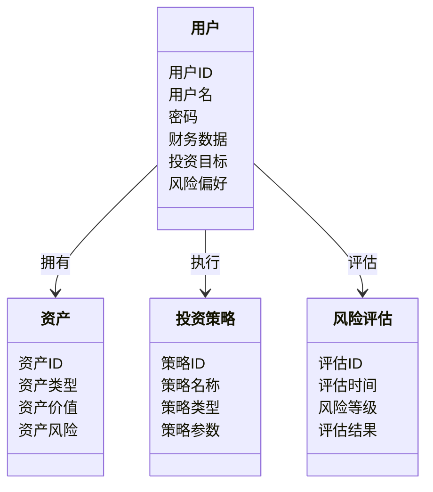
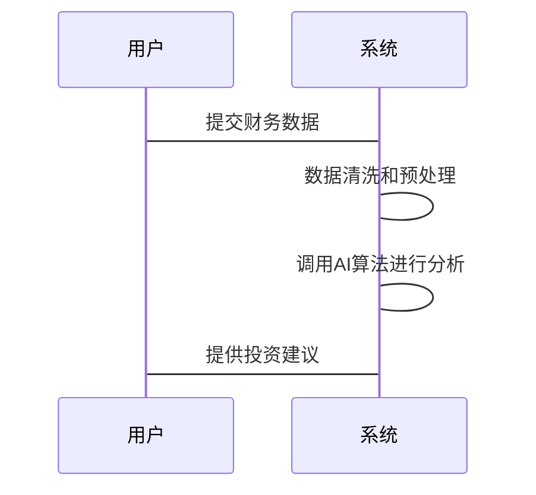

                 


# 构建全方位的AI驱动财富管理平台

> 关键词：人工智能、财富管理、机器学习、自然语言处理、投资组合优化、风险管理

> 摘要：本文将探讨如何利用人工智能技术构建一个全方位的财富管理平台。通过分析传统财富管理的局限性，介绍AI驱动财富管理的核心概念与技术基础，详细阐述系统架构设计、算法实现及项目实战，最后总结AI在财富管理中的优势与未来发展趋势。

---

# 第1章: AI驱动财富管理平台的背景与核心概念

## 1.1 财富管理的传统模式与局限性

### 1.1.1 传统财富管理的定义与特点
财富管理是指通过科学的资产配置、投资组合优化和风险管理，帮助客户实现财务目标的过程。传统财富管理主要依赖人工服务，包括面对面的咨询、手动数据分析和静态的投资策略。

### 1.1.2 传统财富管理中的痛点与挑战
1. **效率低下**：传统模式依赖人工操作，效率低，难以满足大规模客户的需求。
2. **个性化不足**：难以根据客户需求实时调整投资策略。
3. **数据处理能力有限**：无法高效处理海量数据，导致决策滞后。
4. **成本高昂**：人工服务成本高，难以覆盖中低端客户。

### 1.1.3 传统与AI驱动模式的对比分析
AI驱动的财富管理通过自动化、智能化的方式优化投资决策，显著提升了效率和个性化服务水平，同时降低了成本。

## 1.2 AI驱动财富管理的定义与特点

### 1.2.1 AI驱动财富管理的定义
AI驱动财富管理是利用人工智能技术（如机器学习、自然语言处理等）来优化资产配置、风险评估和投资组合管理的过程。

### 1.2.2 AI在财富管理中的核心作用
1. **实时数据分析**：通过AI技术快速处理大量数据，提供实时的投资建议。
2. **个性化服务**：根据客户需求动态调整投资策略，提供定制化服务。
3. **风险管理**：通过AI算法实时监控市场风险，提前预警潜在问题。

### 1.2.3 AI驱动财富管理的优势与劣势
优势：
- 高效性：AI能够快速处理大量数据，提供实时的投资建议。
- 个性化：可以根据客户的具体需求动态调整投资策略。
- 风险控制：通过AI算法实时监控市场风险，提前预警潜在问题。

劣势：
- 技术依赖：AI系统的稳定性和准确性依赖于算法和数据质量。
- 信任问题：客户可能对AI决策的透明性和可靠性存疑。

## 1.3 AI驱动财富管理平台的基本框架

### 1.3.1 平台的整体架构
AI驱动财富管理平台通常包括以下几个模块：
1. **用户交互界面**：用户可以通过网页或移动应用与平台互动。
2. **数据采集与处理**：收集用户的财务数据、市场数据等。
3. **AI算法引擎**：利用机器学习、自然语言处理等技术进行分析和预测。
4. **投资策略生成**：根据分析结果生成投资策略并优化投资组合。
5. **风险管理与监控**：实时监控投资组合的风险，及时调整策略。

### 1.3.2 平台的核心功能模块
1. **用户画像与需求分析**：根据用户提供的财务数据和投资目标，构建用户画像。
2. **资产配置与风险评估**：基于用户画像，进行资产配置和风险评估。
3. **投资组合优化**：根据资产配置和风险评估结果，优化投资组合。
4. **智能投顾**：提供个性化的投资建议和实时市场分析。
5. **风险管理与监控**：实时监控投资组合的风险，及时预警和调整。

### 1.3.3 平台的用户角色与权限划分
1. **普通用户**：可以使用平台的基本功能，如资产配置建议、投资组合优化等。
2. **专业用户**：可以使用高级功能，如定制化投资策略、风险分析报告等。
3. **系统管理员**：负责平台的维护和管理，包括数据备份、系统更新等。

## 1.4 本章小结
本章介绍了AI驱动财富管理的背景、核心概念以及平台的基本框架。通过对比传统财富管理模式和AI驱动模式的优劣，阐述了AI在财富管理中的重要作用和优势。

---

# 第2章: AI驱动财富管理的核心概念

## 2.1 用户画像与需求分析

### 2.1.1 用户画像的定义与构建方法
用户画像是基于用户的财务数据、投资目标、风险偏好等信息构建的客户画像。

### 2.1.2 用户需求的分类与分析
用户需求可以分为短期需求（如紧急资金需求）和长期需求（如退休规划）。通过分析用户的需求，可以更好地制定个性化的投资策略。

### 2.1.3 用户画像与投资决策的关系
用户画像是投资决策的基础，通过分析用户的画像，可以制定个性化的资产配置和投资组合。

### 2.1.4 用户画像的构建步骤
1. **数据采集**：收集用户的财务数据、投资目标、风险偏好等。
2. **数据清洗**：去除无效数据，确保数据质量。
3. **特征提取**：提取关键特征，如收入水平、资产规模、风险偏好等。
4. **画像构建**：基于特征构建用户画像，并进行分类。

### 2.1.5 用户画像的可视化展示
可以通过图表（如饼图、柱状图）或文本描述等方式，直观展示用户画像。

## 2.2 资产配置与风险评估

### 2.2.1 资产配置的定义与原理
资产配置是根据用户的风险偏好和财务目标，将资金分配到不同资产类别（如股票、债券、房地产等）的过程。

### 2.2.2 资产配置的核心要素
1. **风险偏好**：用户对风险的承受能力。
2. **财务目标**：用户的短期和长期财务目标。
3. **市场环境**：当前的经济环境和市场趋势。

### 2.2.3 资产配置的常见策略
1. **保守型策略**：低风险，主要投资于债券、货币市场等。
2. **平衡型策略**：中等风险，投资于股票和债券的组合。
3. **激进型策略**：高风险，主要投资于股票和高风险资产。

### 2.2.4 风险评估的定义与方法
风险评估是通过分析投资组合的波动性和潜在损失，评估投资组合的风险。

### 2.2.5 风险评估的核心指标
1. **波动率**：投资组合收益的波动性。
2. **VaR（在险价值）**：在一定置信水平下，投资组合可能遭受的最大损失。
3. **夏普比率**：衡量投资组合的风险调整后收益。

## 2.3 投资组合优化与动态调整

### 2.3.1 投资组合优化的定义与目标
投资组合优化是通过调整资产配置，使投资组合在风险和收益之间达到最佳平衡。

### 2.3.2 投资组合优化的核心算法
1. **均值-方差优化**：通过优化投资组合的期望收益和方差，找到最优解。
2. **风险中性优化**：在给定风险水平下，优化投资组合的收益。
3. **目标收益优化**：在给定收益目标下，优化投资组合的风险。

### 2.3.3 动态调整的必要性与实现方法
投资组合需要根据市场变化和用户需求进行动态调整，以保持最优配置。

## 2.4 核心概念对比分析

### 2.4.1 用户画像与资产配置的对比
用户画像是投资决策的基础，资产配置是根据用户画像制定的个性化投资策略。

### 2.4.2 风险评估与投资组合优化的对比
风险评估是投资组合优化的重要输入，投资组合优化的结果需要满足风险评估的要求。

### 2.4.3 核心概念之间的关系与影响
用户画像是整个投资决策的核心，资产配置和投资组合优化是实现用户需求的重要手段，风险评估是保障投资安全的关键因素。

## 2.5 本章小结
本章详细介绍了AI驱动财富管理中的核心概念，包括用户画像、资产配置、风险评估和投资组合优化。通过对比分析，阐述了这些概念之间的关系和相互影响。

---

# 第3章: AI驱动财富管理的技术基础

## 3.1 自然语言处理（NLP）在财富管理中的应用

### 3.1.1 NLP的定义与核心算法
自然语言处理（NLP）是计算机科学与人工智能的交叉学科，研究如何让计算机理解和处理人类语言。

### 3.1.2 NLP在用户需求分析中的应用
通过NLP技术，可以自动分析用户的文本数据，提取用户的财务需求和投资目标。

### 3.1.3 NLP在投资报告解读中的应用
NLP可以用于自动解析投资报告中的关键信息，提取市场趋势和行业动态。

## 3.2 机器学习在财富管理中的应用

### 3.2.1 机器学习的定义与核心算法
机器学习是人工智能的核心技术，通过数据训练模型，实现预测和分类。

### 3.2.2 机器学习在风险评估中的应用
通过机器学习算法，可以预测投资组合的风险，评估市场的潜在风险。

### 3.2.3 机器学习在投资组合优化中的应用
机器学习可以用于预测资产的收益和风险，优化投资组合的配置。

## 3.3 强化学习在财富管理中的应用

### 3.3.1 强化学习的定义与核心算法
强化学习是一种通过试错学习的方法，通过不断交互环境，优化决策策略。

### 3.3.2 强化学习在投资组合管理中的应用
强化学习可以用于动态调整投资组合，根据市场变化实时优化配置。

### 3.3.3 强化学习的优势与挑战
优势：
- 能够适应复杂的市场环境。
- 可以实时调整投资策略。

挑战：
- 需要大量的历史数据进行训练。
- 算法的复杂性和计算成本较高。

## 3.4 大数据分析在财富管理中的应用

### 3.4.1 大数据分析的定义与核心算法
大数据分析是指对海量数据进行处理、分析和挖掘，提取有价值的信息。

### 3.4.2 大数据分析在用户画像中的应用
通过大数据分析，可以提取用户的财务数据和行为数据，构建详细的用户画像。

### 3.4.3 大数据分析在市场预测中的应用
通过分析海量市场数据，预测市场趋势，优化投资策略。

## 3.5 分布式系统在财富管理中的应用

### 3.5.1 分布式系统的定义与核心架构
分布式系统是由多个计算节点通过网络连接，协同完成任务的系统。

### 3.5.2 分布式系统在财富管理中的优势
- 高可用性：通过节点冗余，保证系统的稳定运行。
- 高扩展性：可以通过增加节点，扩展系统的处理能力。

### 3.5.3 分布式系统在财富管理中的挑战
- 网络延迟：节点之间的通信可能会引入延迟。
- 数据一致性：如何保证多个节点之间的数据一致性。

## 3.6 本章小结
本章介绍了AI驱动财富管理中的技术基础，包括自然语言处理、机器学习、强化学习、大数据分析和分布式系统。通过这些技术的结合，可以实现高效的财富管理平台。

---

# 第4章: AI驱动财富管理平台的系统架构设计

## 4.1 系统功能模块划分

### 4.1.1 用户交互模块
- 提供用户友好的界面，支持用户注册、登录和信息提交。
- 提供个性化的投资建议和市场分析。

### 4.1.2 数据采集与处理模块
- 收集用户的财务数据、市场数据等。
- 对数据进行清洗和预处理，为后续分析提供高质量的数据。

### 4.1.3 AI算法引擎模块
- 实现用户画像、资产配置、风险评估和投资组合优化的核心算法。
- 提供实时的投资建议和市场分析。

### 4.1.4 投资策略生成模块
- 根据AI算法的结果，生成个性化的投资策略。
- 提供投资组合优化和动态调整的功能。

### 4.1.5 风险管理与监控模块
- 实时监控投资组合的风险。
- 提供风险预警和应急处理机制。

## 4.2 系统领域模型设计

### 4.2.1 领域模型的定义与核心要素
领域模型是系统功能实现的基础，包括用户、资产、投资策略、风险评估等核心要素。

### 4.2.2 领域模型的Mermaid类图


## 4.3 系统架构设计

### 4.3.1 系统架构的定义与核心组件
系统架构设计是实现平台功能的基础，包括用户交互层、业务逻辑层和数据访问层。

### 4.3.2 系统架构的Mermaid架构图


### 4.3.3 系统接口设计
1. **用户登录接口**：用户通过用户名和密码登录系统。
2. **数据采集接口**：采集用户的财务数据和市场数据。
3. **AI算法接口**：调用AI算法引擎，进行用户画像、资产配置和投资组合优化。
4. **投资策略接口**：根据AI算法的结果，生成投资策略并提供给用户。

### 4.3.4 系统交互的Mermaid序列图


## 4.4 本章小结
本章详细介绍了AI驱动财富管理平台的系统架构设计，包括功能模块划分、领域模型设计、系统架构设计和系统接口设计。通过这些设计，可以实现高效的财富管理平台。

---

# 第5章: AI驱动财富管理平台的算法实现

## 5.1 用户画像与需求分析的算法实现

### 5.1.1 用户画像的构建算法
1. **数据清洗**：去除无效数据，确保数据质量。
2. **特征提取**：提取关键特征，如收入水平、资产规模、风险偏好等。
3. **画像分类**：根据特征对用户进行分类，构建用户画像。

### 5.1.2 用户需求的分析算法
1. **文本挖掘**：通过NLP技术分析用户的需求描述。
2. **情感分析**：分析用户需求的情感倾向，如积极、消极或中性。
3. **需求分类**：根据分析结果，对用户需求进行分类。

## 5.2 资产配置与风险评估的算法实现

### 5.2.1 资产配置的优化算法
1. **均值-方差优化**：通过优化投资组合的期望收益和方差，找到最优解。
2. **风险中性优化**：在给定风险水平下，优化投资组合的收益。
3. **目标收益优化**：在给定收益目标下，优化投资组合的风险。

### 5.2.2 风险评估的核心算法
1. **VaR（在险价值）计算**：在一定置信水平下，计算投资组合可能遭受的最大损失。
2. **夏普比率计算**：衡量投资组合的风险调整后收益。

## 5.3 投资组合优化的算法实现

### 5.3.1 投资组合优化的数学模型
$$\text{目标函数：} \quad \text{Minimize } \sigma^2$$
$$\text{约束条件：} \quad \mathbb{E}[R] \geq R_{\text{min}}$$
$$\quad \quad \quad \quad \mathbf{w}^T \mathbf{w} = 1$$

### 5.3.2 动态调整的优化算法
1. **滚动窗口法**：根据市场变化，定期调整投资组合。
2. **在线优化法**：实时监控市场变化，动态调整投资组合。

## 5.4 本章小结
本章详细介绍了AI驱动财富管理平台中的算法实现，包括用户画像、资产配置、风险评估和投资组合优化的核心算法。通过这些算法的实现，可以为用户提供个性化的投资建议和优化的投资组合。

---

# 第6章: AI驱动财富管理平台的项目实战

## 6.1 项目环境搭建

### 6.1.1 开发工具安装
- **Python**：安装Python 3.8及以上版本。
- **库的安装**：安装所需的库，如Pandas、NumPy、Scikit-learn、TensorFlow等。

### 6.1.2 数据源获取
- **金融数据**：获取股票价格、债券收益率等金融数据。
- **用户数据**：获取用户的财务数据和投资目标。

## 6.2 系统核心实现

### 6.2.1 用户画像的实现

```python
import pandas as pd
import numpy as np

# 数据清洗
data_clean = data.dropna()
data_clean = data_clean[~data_clean['income'].isnull()]

# 特征提取
features = ['age', 'income', 'assets', 'risk_preference']
target = 'user_segment'

# 用户分类
from sklearn.cluster import KMeans
model = KMeans(n_clusters=3, random_state=42)
model.fit(data_clean[features])
clusters = model.predict(data_clean[features])
data_clean['cluster'] = clusters
```

### 6.2.2 资产配置的实现

```python
import numpy as np

def portfolio_optimization(risk_parity):
    n = len(risk_parity)
    return np.random.dirichlet([1.0] * n) * 100

risk_parity = [0.3, 0.4, 0.2]
weights = portfolio_optimization(risk_parity)
print(weights)
```

### 6.2.3 投资组合优化的实现

```python
import numpy as np
from scipy.optimize import minimize

def portfolio_variance(weights, covariance_matrix):
    return np.dot(weights.T, np.dot(covariance_matrix, weights))

# 约束条件
def constraint(weights):
    return np.sum(weights) - 1

# 最优化问题
def optimize_portfolio(covariance_matrix):
    n = covariance_matrix.shape[0]
    init_guess = np.array([1.0/n] * n)
    bounds = [(0, 1) for _ in range(n)]
    result = minimize(portfolio_variance, init_guess, args=covariance_matrix, 
                     method='SLSQP', bounds=bounds, constraints=constraint)
    return result.x

covariance_matrix = np.array([[0.01, 0.005, 0],
                               [0.005, 0.02, 0],
                               [0, 0, 0.01]])
weights = optimize_portfolio(covariance_matrix)
print(weights)
```

## 6.3 项目小结
本章通过具体的代码实现，展示了AI驱动财富管理平台的核心功能模块的实现过程。通过项目实战，可以更好地理解AI在财富管理中的实际应用。

---

# 第7章: 优化与扩展

## 7.1 模型优化与调优

### 7.1.1 算法优化
- **超参数调优**：通过网格搜索或随机搜索优化算法性能。
- **特征选择**：选择最优特征，提高模型的准确性和效率。

### 7.1.2 系统优化
- **性能优化**：通过并行计算和分布式处理提高系统的处理能力。
- **内存优化**：优化数据结构和算法，减少内存占用。

## 7.2 系统安全与隐私保护

### 7.2.1 数据安全
- **数据加密**：对敏感数据进行加密处理，防止数据泄露。
- **访问控制**：通过权限管理，限制数据的访问范围。

### 7.2.2 隐私保护
- **数据匿名化**：对用户数据进行匿名化处理，保护用户隐私。
- **合规性**：遵守相关法律法规，确保数据处理的合法性。

## 7.3 系统的可扩展性

### 7.3.1 模块化设计
通过模块化设计，可以方便地扩展系统的功能。

### 7.3.2 弹性扩展
通过弹性计算资源，可以根据需求动态调整系统的处理能力。

## 7.4 本章小结
本章讨论了AI驱动财富管理平台的优化与扩展，包括模型优化、系统安全与隐私保护以及系统的可扩展性。

---

# 第8章: 总结与展望

## 8.1 总结

### 8.1.1 核心内容回顾
本文详细介绍了AI驱动财富管理平台的构建过程，包括背景、核心概念、技术基础、系统架构设计、算法实现以及项目实战。

### 8.1.2 主要结论
AI技术在财富管理中的应用，显著提升了财富管理的效率和个性化服务水平，同时降低了成本。通过AI驱动的财富管理平台，可以实现智能化的投资决策和个性化的客户服务。

## 8.2 未来展望

### 8.2.1 技术发展
随着AI技术的不断发展，AI驱动的财富管理平台将更加智能化和个性化。

### 8.2.2 应用场景扩展
未来，AI驱动的财富管理平台可以应用于更多场景，如企业财富管理、家庭财富传承等。

### 8.2.3 挑战与机遇
尽管AI技术在财富管理中的应用前景广阔，但仍然面临技术、数据和隐私等方面的挑战。未来需要在技术、政策和伦理等方面进行更多的研究和探索。

## 8.3 本章小结
本章总结了全文的核心内容，并展望了AI驱动财富管理平台的未来发展方向。

---

# 参考文献

1. John C. Hull, *Risk Management and Financial Institutions*, 3rd Edition, Wiley, 2012.
2. Andrew Ng, *Machine Learning*, Coursera, 2019.
3. François Chollet, *Deep Learning with Python*, Manning, 2017.

---

# 结语

AI驱动的财富管理平台是一个复杂而充满潜力的领域。通过本文的探讨，我们不仅了解了AI在财富管理中的核心作用，还掌握了构建这样一个平台的技术和方法。未来，随着AI技术的不断进步，AI驱动的财富管理平台将为投资者带来更加智能化和个性化的服务。

