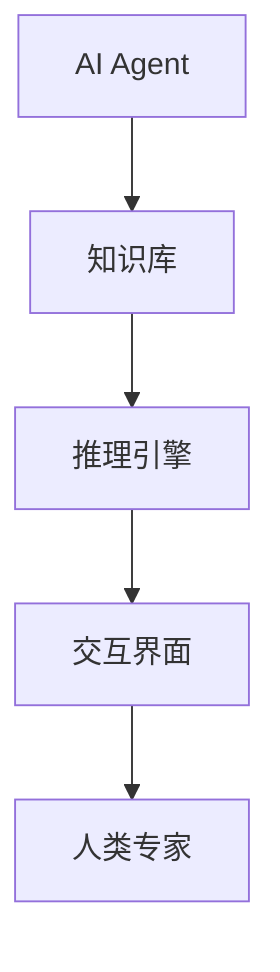
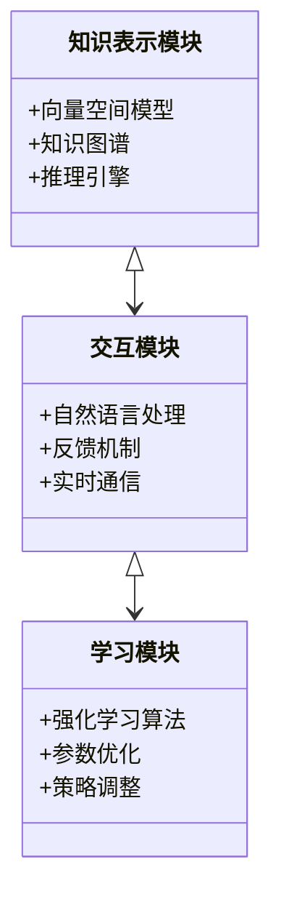
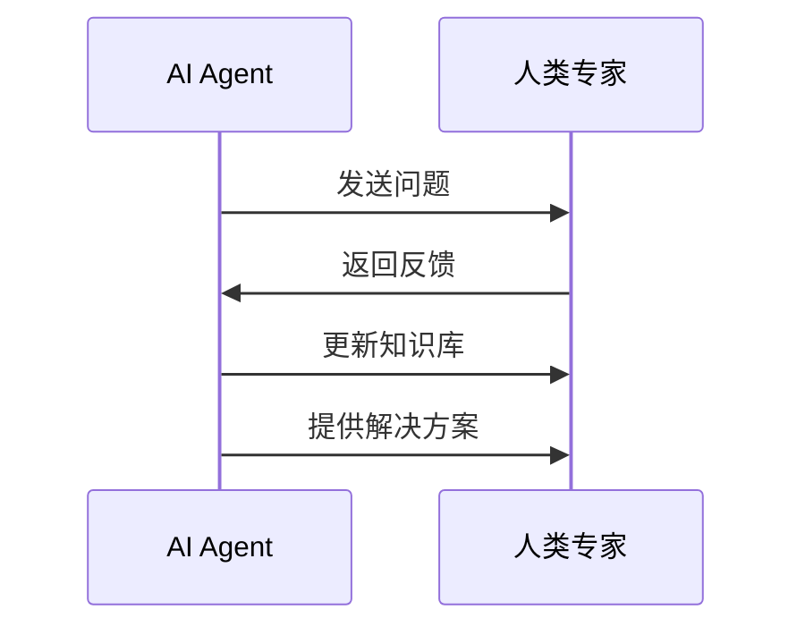

                 

<think>
好的，我将按照您的要求，逐步构建《构建具有人机协作学习能力的AI Agent》这篇文章。首先，我会列出文章的核心关键词和摘要，然后根据目录大纲逐步展开每个章节的内容。

---

### **关键词：**  
人机协作学习、AI Agent、知识表示、强化学习、系统架构设计、交互反馈机制

---

### **摘要：**  
人机协作学习是一种结合人工智能和人机交互的新兴技术，旨在通过AI Agent与人类专家的协作，实现更高效的知识共享和任务完成。本文将详细探讨人机协作学习的核心概念、算法原理、系统架构设计以及实际应用案例，帮助读者全面理解并构建具备人机协作学习能力的AI Agent。通过理论与实践的结合，本文将为读者提供一套完整的解决方案，助力AI技术的进一步发展。

---

接下来，我将按照目录大纲逐步展开内容。

---

## **第1章: 问题背景与概念介绍**

### **1.1 人机协作学习的背景**

#### **1.1.1 当前AI技术的发展现状**
近年来，人工智能技术飞速发展，尤其是在自然语言处理、计算机视觉等领域取得了显著成果。然而，现有AI系统往往缺乏与人类的有效协作能力，难以在复杂的实际场景中灵活应对。

#### **1.1.2 人机协作学习的需求与趋势**
随着AI技术的广泛应用，人机协作学习的需求日益增长。通过AI Agent与人类专家的协作，可以充分发挥AI的效率优势和人类的创造力，实现1+1>2的效果。

#### **1.1.3 人机协作学习的核心价值**
人机协作学习的核心价值在于通过AI Agent辅助人类完成复杂任务，同时通过人类反馈不断优化AI系统的性能，形成一个良性的反馈循环。

### **1.2 AI Agent的基本概念**

#### **1.2.1 AI Agent的定义与分类**
AI Agent是指具有感知环境、做出决策并执行任务的智能实体。根据功能和应用场景的不同，AI Agent可以分为知识型Agent、决策型Agent和执行型Agent。

#### **1.2.2 人机协作学习的定义与特点**
人机协作学习是指AI Agent与人类专家共同完成学习任务的过程。其特点是实时交互、知识共享和动态优化。

#### **1.2.3 人机协作学习与传统AI的区别**
与传统AI相比，人机协作学习更加注重人机之间的实时交互和协作，能够根据人类反馈动态调整学习策略。

### **1.3 问题描述与目标设定**

#### **1.3.1 当前AI Agent在协作学习中的问题**
现有的AI Agent往往缺乏对人类反馈的深度理解，导致协作效率低下。

#### **1.3.2 人机协作学习的目标与边界**
人机协作学习的目标是通过AI Agent与人类专家的协作，实现知识共享和任务优化。其边界在于如何有效结合AI的计算能力和人类的创造力。

#### **1.3.3 问题解决的关键路径**
关键路径包括：知识表示与推理、人机交互与反馈机制、学习策略与优化算法。

---

## **第2章: 核心概念与理论基础**

### **2.1 人机协作学习的核心原理**

#### **2.1.1 知识表示与推理**
知识表示是人机协作学习的基础。通过向量空间模型或知识图谱，AI Agent可以理解人类提供的知识，并进行推理和关联。

#### **2.1.2 人机交互与反馈机制**
人机交互是协作学习的关键。通过自然语言处理技术和实时反馈机制，AI Agent可以与人类专家进行高效互动。

#### **2.1.3 学习策略与优化算法**
学习策略是AI Agent的核心。通过强化学习或生成对抗网络，AI Agent可以不断优化其学习策略。

### **2.2 AI Agent的体系结构**

#### **2.2.1 基于知识图谱的AI Agent**
基于知识图谱的AI Agent通过构建知识图谱实现知识共享和推理。

#### **2.2.2 基于强化学习的AI Agent**
基于强化学习的AI Agent通过与环境的交互，不断优化其决策策略。

#### **2.2.3 基于生成模型的AI Agent**
基于生成模型的AI Agent能够生成多样化的解决方案，并通过人类反馈进行优化。

### **2.3 人机协作学习的数学模型**

#### **2.3.1 知识表示的向量空间模型**
知识表示可以采用向量空间模型，例如Word2Vec或GloVe。

#### **2.3.2 人机交互的马尔可夫决策过程**
人机交互可以建模为马尔可夫决策过程（MDP），包括状态、动作和奖励。

#### **2.3.3 学习策略的优化函数**
学习策略的优化函数可以采用强化学习中的损失函数，例如Actor-Critic算法。

---

## **第3章: 算法原理与实现**

### **3.1 人机协作学习的算法框架**

#### **3.1.1 基于监督学习的协作框架**
在监督学习框架下，AI Agent通过标注数据进行学习，并根据人类反馈进行优化。

#### **3.1.2 基于强化学习的协作框架**
在强化学习框架下，AI Agent通过与环境的交互获得奖励，并不断优化其策略。

#### **3.1.3 基于生成对抗网络的协作框架**
在生成对抗网络框架下，AI Agent通过生成多样化的解决方案，并通过人类反馈进行对抗训练。

### **3.2 算法实现的详细步骤**

#### **3.2.1 知识表示的向量编码**
通过预训练的词向量模型（如Word2Vec）将知识表示为向量。

#### **3.2.2 人机交互的反馈处理**
通过自然语言处理技术解析人类反馈，并将其转换为AI Agent可理解的信号。

#### **3.2.3 学习策略的参数优化**
通过优化算法（如梯度下降）不断更新AI Agent的学习策略参数。

### **3.3 算法实现的数学推导**

#### **3.3.1 知识表示的向量空间模型公式**
$$
\text{向量表示} = \text{输入数据} \times \text{权重矩阵}
$$

#### **3.3.2 人机交互的马尔可夫决策过程公式**
$$
R(s, a) = \text{奖励函数}(状态, 动作)
$$

#### **3.3.3 学习策略的优化函数公式**
$$
\text{损失函数} = -\sum_{t} \log(\pi(a|s)) \cdot R(s, a)
$$

---

## **第4章: 系统分析与架构设计**

### **4.1 系统功能需求分析**

#### **4.1.1 知识表示与推理功能**
AI Agent需要能够理解并推理人类提供的知识。

#### **4.1.2 人机交互与反馈功能**
AI Agent需要与人类专家进行实时交互，并根据反馈调整其行为。

#### **4.1.3 学习策略与优化功能**
AI Agent需要不断优化其学习策略，以提高协作效率。

### **4.2 系统架构设计**

#### **4.2.1 系统整体架构图**


#### **4.2.2 知识表示模块设计**


#### **4.2.3 交互模块设计**


---

## **第5章: 项目实战**

### **5.1 环境安装与配置**
```bash
pip install numpy
pip install tensorflow
pip install pytorch
pip install transformers
```

### **5.2 核心实现代码**
```python
import numpy as np
import torch

class AIAgent:
    def __init__(self, knowledge_base):
        self.knowledge_base = knowledge_base
        self.vectorizer = Vectorizer()
    
    def represent Knowledge(self, input_text):
        return self.vectorizer.encode(input_text)
    
    def interact(self, input_text):
        vector = self.represent_Knowledge(input_text)
        response = self.knowledge_base.infer(vector)
        return response
```

### **5.3 代码解读与分析**
通过上述代码，AI Agent可以将输入文本向量化，并通过知识库生成响应。向量化过程使用预训练的词向量模型，响应生成基于知识库的推理结果。

### **5.4 实际案例分析**
以医疗领域为例，AI Agent可以与医生协作，共同诊断疾病。医生提供病历信息，AI Agent通过知识库和推理引擎生成诊断建议，并根据医生的反馈不断优化其诊断模型。

---

## **第6章: 最佳实践与总结**

### **6.1 小结**
通过本文的介绍，读者可以全面理解人机协作学习的核心概念、算法原理和系统架构设计。同时，通过实际案例分析，读者可以掌握如何将理论应用于实践。

### **6.2 注意事项**
在实际应用中，需要注意以下几点：  
1. 知识表示的质量直接影响协作效率。  
2. 人机交互的流畅性是协作学习的关键。  
3. 学习策略的优化需要结合具体场景。

### **6.3 拓展阅读**
推荐阅读以下书籍和论文：  
- 《Deep Learning》  
- 《Reinforcement Learning: Theory and Algorithms》  
- 《Human-AI Collaboration: Opportunities and Challenges》

---

以上是文章的详细大纲和部分内容。如果需要进一步补充或调整，请随时告知！

