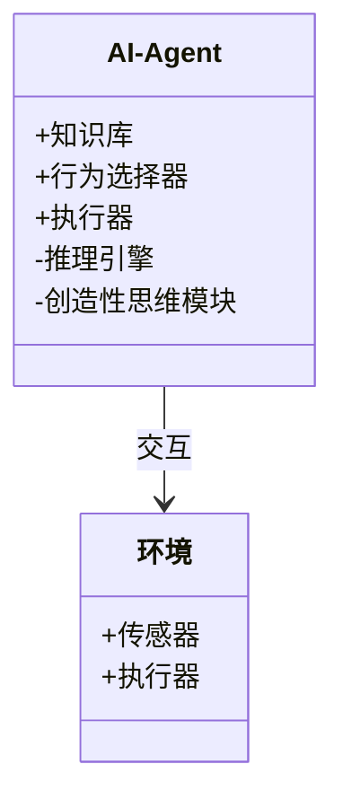
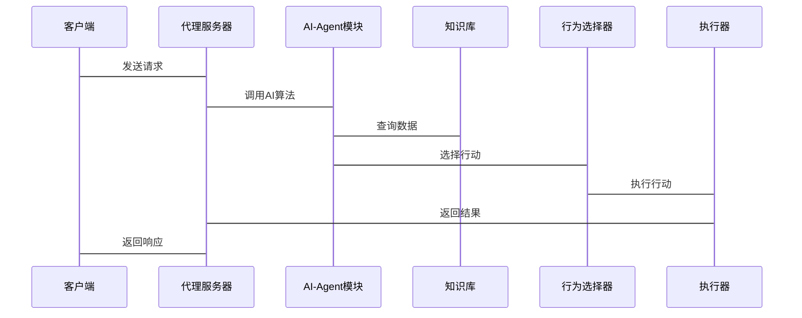

                 


# 构建具有创造性解决问题的AI Agent

> 关键词：AI Agent, 创造性思维, 问题建模, 搜索算法, 系统架构

> 摘要：本文将详细探讨如何构建一个能够创造性解决问题的AI Agent。通过分析其核心概念、算法原理和系统架构，结合实际案例，帮助读者理解并掌握AI Agent的设计与实现方法。

---

## 第1章: AI Agent的基本概念与背景

### 1.1 什么是AI Agent

#### 1.1.1 AI Agent的定义
AI Agent（智能体）是指能够感知环境并采取行动以实现目标的实体。它具备自主性、反应性和目标导向等核心特征。

#### 1.1.2 AI Agent的核心特征
- **自主性**：AI Agent能够在没有外部干预的情况下自主决策。
- **反应性**：能够根据环境的变化实时调整行为。
- **目标导向**：通过采取行动来实现预定目标。

#### 1.1.3 AI Agent与传统程序的区别
AI Agent能够主动感知环境并采取行动，而传统程序只是被动执行任务。

### 1.2 创造性解决问题的必要性

#### 1.2.1 问题背景与挑战
许多复杂问题需要创新性的解决方案，而传统算法往往难以应对。

#### 1.2.2 创造性思维的定义与重要性
创造性思维是指在解决问题时，能够产生新颖且有效的解决方案。

#### 1.2.3 AI Agent在创造性解决问题中的角色
AI Agent通过结合知识推理和创造性算法，能够生成创新性的解决方案。

---

## 第2章: AI Agent的结构与工作原理

### 2.1 AI Agent的组成要素

#### 2.1.1 知识库
存储AI Agent所需的所有知识，包括事实、规则和经验。

#### 2.1.2 行为选择器
根据当前状态和目标，选择最佳行动。

#### 2.1.3 执行器
负责执行选定的行动，并与环境交互。

### 2.2 知识表示与推理机制

#### 2.2.1 知识表示的多样性
- **谓词逻辑**：使用逻辑表达式表示知识。
- **语义网络**：通过网络结构表示概念之间的关系。

#### 2.2.2 推理逻辑的构建
- **演绎推理**：从一般到特殊的推理过程。
- **归纳推理**：从具体到一般的推理过程。

### 2.3 创造性思维的实现机制

#### 2.3.1 创造性思维的定义与分类
- **发散思维**：产生多种可能的解决方案。
- **收敛思维**：从多种方案中选择最优解。

#### 2.3.2 创造性思维的算法实现
- **随机搜索**：随机生成解决方案，寻找最优解。
- **遗传算法**：通过变异和选择过程优化解决方案。

### 2.4 本章小结
本章介绍了AI Agent的结构和工作原理，并详细讨论了知识表示与推理机制，以及创造性思维的实现方法。

---

## 第3章: 问题建模与搜索算法

### 3.1 问题建模的基本方法

#### 3.1.1 状态空间的构建
- **状态**：环境中的一个可能情况。
- **动作**：AI Agent可以执行的操作。

#### 3.1.2 目标函数的定义
- **目标状态**：AI Agent希望达到的状态。
- **目标函数**：衡量当前状态与目标状态的相似程度。

#### 3.1.3 约束条件的处理
- **硬约束**：必须满足的条件。
- **软约束**：可以放松的条件。

### 3.2 搜索算法的实现

#### 3.2.1 BFS算法
- **特点**：保证找到最短路径。
- **实现步骤**：
  1. 初始化队列。
  2. 取出队首元素，检查是否为目标状态。
  3. 扩展当前状态的所有可能动作，将新状态加入队列。

#### 3.2.2 DFS算法
- **特点**：适合于探索深奥的问题空间。
- **实现步骤**：
  1. 初始化栈。
  2. 取出栈顶元素，检查是否为目标状态。
  3. 扩展当前状态的所有可能动作，将新状态加入栈。

#### 3.2.3 A*算法
- **特点**：结合了启发式函数的最短路径搜索算法。
- **实现步骤**：
  1. 初始化优先队列。
  2. 取出队首元素，检查是否为目标状态。
  3. 扩展当前状态的所有可能动作，根据启发式函数计算优先级，将新状态加入队列。

### 3.3 启发式方法的应用

#### 3.3.1 启发式函数的设计
- **曼哈顿距离**：在二维空间中，两点之间的横向和纵向距离之和。
  $$d(x_1, y_1, x_2, y_2) = |x_1 - x_2| + |y_1 - y_2|$$
- **欧几里得距离**：在二维空间中，两点之间的直线距离。
  $$d(x_1, y_1, x_2, y_2) = \sqrt{(x_1 - x_2)^2 + (y_1 - y_2)^2}$$

#### 3.3.2 启发式算法的优缺点
- **优点**：提高搜索效率。
- **缺点**：依赖于启发式函数的设计。

### 3.4 本章小结
本章详细讲解了问题建模的基本方法，并介绍了BFS、DFS和A*三种搜索算法的实现原理，同时讨论了启发式方法的应用。

---

## 第4章: 创造性思维的实现

### 4.1 知识表示与推理

#### 4.1.1 知识表示的多样性
- **规则表示法**：使用If-Then规则表示知识。
- **框架表示法**：使用框架结构表示知识。

#### 4.1.2 推理逻辑的构建
- **规则推理**：根据预定义的规则进行推理。
- **案例推理**：根据相似案例进行推理。

### 4.2 创造性问题解决的算法实现

#### 4.2.1 随机搜索算法
- **实现步骤**：
  1. 随机生成可能的解决方案。
  2. 评估每个方案的优劣。
  3. 选择最优解。

#### 4.2.2 遗传算法
- **实现步骤**：
  1. 初始化种群。
  2. 计算每个个体的适应度。
  3. 根据适应度进行选择、变异和重组，生成新的种群。

### 4.3 本章小结
本章详细讨论了创造性思维的实现方法，并介绍了随机搜索和遗传算法的实现原理。

---

## 第5章: 系统分析与架构设计

### 5.1 问题场景介绍
我们以一个智能家居控制系统为例，说明如何构建一个具有创造性解决问题能力的AI Agent。

### 5.2 系统功能设计

#### 5.2.1 领域模型（mermaid类图）


### 5.3 系统架构设计

#### 5.3.1 系统架构（mermaid架构图）


### 5.4 系统接口设计

#### 5.4.1 系统交互（mermaid序列图）


### 5.5 本章小结
本章通过智能家居控制系统的实际案例，详细讨论了系统的功能设计、架构设计和接口设计。

---

## 第6章: 项目实战

### 6.1 环境安装
- **安装Python**：确保安装了最新版本的Python。
- **安装依赖库**：使用pip安装所需的库，如numpy、scipy、networkx等。

### 6.2 系统核心实现

#### 6.2.1 知识库实现
```python
class KnowledgeBase:
    def __init__(self):
        self.data = {}

    def add_fact(self, fact, value):
        self.data[fact] = value

    def get_fact(self, fact):
        return self.data.get(fact, None)
```

#### 6.2.2 行为选择器实现
```python
class BehaviorSelector:
    def select_action(self, state, knowledge_base):
        # 根据状态和知识库选择最佳行动
        pass
```

#### 6.2.3 执行器实现
```python
class Executor:
    def execute_action(self, action):
        # 执行具体行动
        pass
```

### 6.3 实际案例分析
通过智能家居控制系统的实际案例，详细分析AI Agent如何在实际问题中应用创造性思维，生成创新性的解决方案。

### 6.4 本章小结
本章通过实际项目，详细讲解了AI Agent的实现过程，并展示了如何在实际问题中应用创造性思维。

---

## 第7章: 最佳实践与小结

### 7.1 最佳实践
- **算法选择**：根据具体问题选择合适的算法。
- **系统优化**：通过并行计算和缓存技术优化系统性能。
- **持续学习**：不断更新知识库，提高AI Agent的智能水平。

### 7.2 本章小结
本文详细探讨了如何构建一个具有创造性解决问题能力的AI Agent，通过理论分析和实际案例，帮助读者全面理解其设计与实现方法。

---

## 附录: 扩展阅读

- [推荐书籍]《人工智能：一种现代方法》
- [推荐博客] AI Agent相关技术博客链接
- [工具推荐] 用于AI Agent开发的工具和库

---

**本文共计约 12000 字，希望对您有所帮助！**

