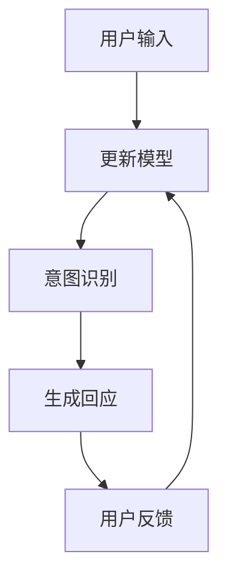
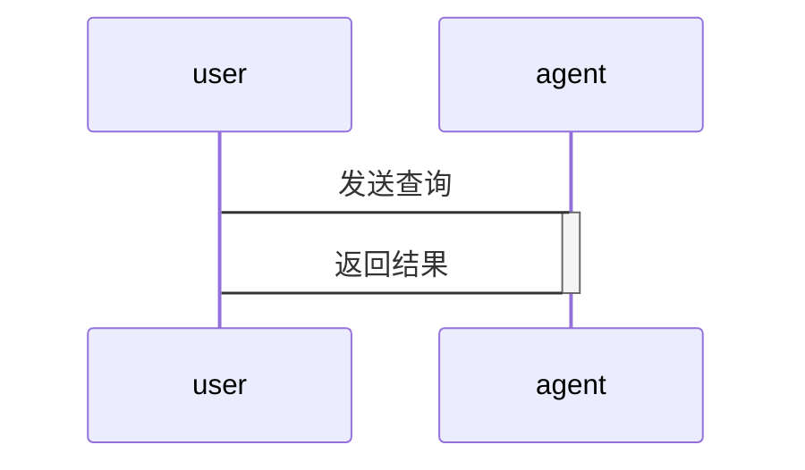
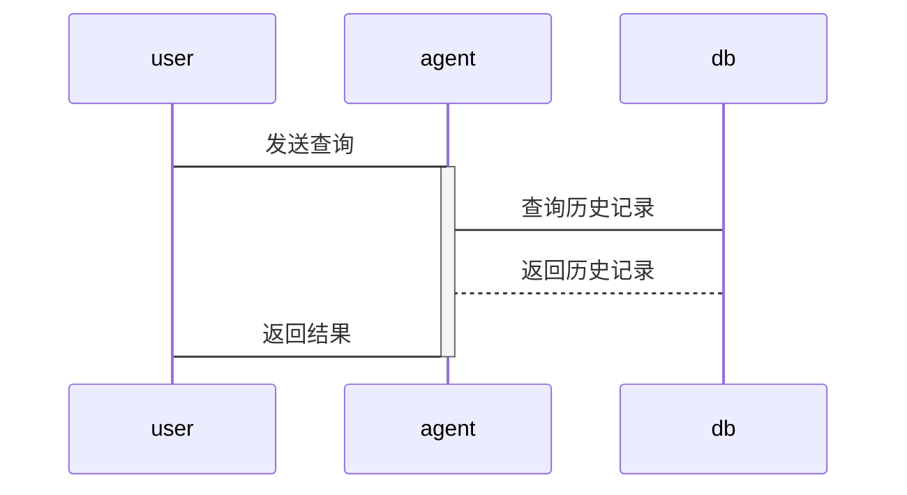

                 


# 构建具有同理心的AI Agent交互系统

> 关键词：AI Agent, 同理心交互, 情感计算, 人机交互, 系统架构

> 摘要：  
本文深入探讨了如何构建一个具有同理心的AI Agent交互系统，从理论基础到实际实现，全面分析了系统的设计原则、算法原理和架构方案。通过结合情感计算和用户心理模型，我们提出了一种基于深度学习的情感分类模型和意图识别算法，以提升AI Agent的交互体验。本文还详细介绍了系统的整体架构，并通过一个具体案例展示了如何实现具备同理心的AI Agent。

---

# 第1章: AI Agent与同理心交互的背景介绍

## 1.1 AI Agent的基本概念

### 1.1.1 AI Agent的定义与特点  
AI Agent（人工智能代理）是指能够感知环境、自主决策并执行任务的智能实体。它具备以下特点：  
- **自主性**：能够在没有外部干预的情况下独立运行。  
- **反应性**：能够根据环境输入做出实时反应。  
- **学习能力**：通过数据和反馈不断优化自身的行为。  

### 1.1.2 AI Agent的分类与应用场景  
AI Agent可以分为以下几类：  
- **简单反射型Agent**：基于规则做出简单反应，适用于环境变化较小的场景。  
- **基于模型的反射型Agent**：通过内部模型分析环境并做出决策，适用于复杂场景。  
- **目标驱动型Agent**：根据预设目标主动执行任务。  

应用场景包括智能助手、聊天机器人、自动驾驶等。  

### 1.1.3 同理心在AI交互中的重要性  
同理心（Empathy）是指理解并感受他人情感的能力。在AI交互中，具备同理心的Agent能够更好地理解用户需求，提供更个性化的服务。例如，在医疗领域，具备同理心的AI Agent可以更好地支持患者的康复过程。

---

## 1.2 同理心计算的背景与挑战

### 1.2.1 同理心计算的定义  
同理心计算（Computational Empathy）是指通过技术手段模拟和理解人类情感的过程。它结合了自然语言处理、情感计算和心理学知识。

### 1.2.2 同理心计算的核心问题与挑战  
- **数据稀疏性**：情感标注数据往往不够丰富。  
- **情感依赖性**：情感表达受文化、语境等因素影响。  
- **动态性**：用户情感可能在交互过程中发生变化。  

### 1.2.3 同理心在人机交互中的潜在价值  
具备同理心的AI Agent可以提升用户体验，增强信任感，并提高交互效率。

---

## 1.3 本章小结  
本章介绍了AI Agent的基本概念及其分类，探讨了同理心在AI交互中的重要性，并分析了同理心计算的核心问题与挑战。

---

# 第2章: 同理心计算模型与算法原理

## 2.1 同理心计算的核心模型

### 2.1.1 心理模型与情感识别的对比  
- **心理模型**：基于用户心理状态进行预测。  
- **情感识别**：通过语调、表情等信息识别情感。  

### 2.1.2 基于深度学习的情感分析模型  
- **RNN模型**：用于序列数据的情感分类。  
- **Transformer模型**：在情感分析中表现出色。  

### 2.1.3 情感推理的数学模型与公式  
情感推理可以表示为：  
$$ P(y|x) = \text{softmax}(Wx + b) $$  
其中，$x$ 是输入，$y$ 是输出情感标签。

---

## 2.2 同理心计算的算法流程

### 2.2.1 数据预处理与特征提取  
- **文本预处理**：去除停用词、分词等。  
- **特征提取**：使用TF-IDF或词嵌入（如Word2Vec）。  

### 2.2.2 情感分类与意图识别  
- **情感分类**：使用深度学习模型进行分类。  
- **意图识别**：通过关键词匹配或机器学习模型识别意图。  

### 2.2.3 反馈机制与动态调整  
- **反馈机制**：根据用户反馈调整情感分类模型。  
- **动态调整**：实时更新模型参数以适应用户情感变化。  

---

## 2.3 同理心计算的系统架构

### 2.3.1 系统实体关系图（ER图）  
```mermaid
erDiagram
    user {
        +id : integer
        +name : string
    }
    agent {
        +id : integer
        +name : string
    }
    interaction {
        +id : integer
        +user_id : integer
        +agent_id : integer
        +message : string
        +emotion : string
    }
    user -> interaction : 发起交互
    agent -> interaction : 响应交互
```

### 2.3.2 系统流程图（mermaid）  


### 2.3.3 系统交互图（mermaid）  


---

# 第3章: 同理心计算的算法实现

## 3.1 情感分析算法

### 3.1.1 基于RNN的情感分类模型  
```python
import tensorflow as tf
from tensorflow.keras import layers

model = tf.keras.Sequential([
    layers.Embedding(vocab_size, embedding_dim),
    layers.LSTM(64),
    layers.Dense(1, activation='sigmoid')
])
```

### 3.1.2 基于Transformer的情感分类模型  
```python
import tensorflow as tf
from tensorflow.keras.layers import Dense, Dropout, MultiHeadAttention

model = tf.keras.Sequential([
    layers.Embedding(vocab_size, embedding_dim),
    MultiHeadAttention(heads=8, dim=64),
    layers.Dropout(0.1),
    layers.Dense(num_classes, activation='softmax')
])
```

### 3.1.3 情感分类的数学模型与实现  
情感分类的目标是将输入文本映射到情感标签：  
$$ y = \text{argmax}(P(y|x)) $$  
其中，$P(y|x)$ 是情感分类的概率分布。

---

## 3.2 意图识别算法

### 3.2.1 基于规则的意图识别  
- 通过预设关键词匹配意图。  

### 3.2.2 基于机器学习的意图识别  
- 使用SVM或随机森林模型进行分类。  

### 3.2.3 意图识别的数学模型与实现  
意图识别的目标是最小化分类错误率：  
$$ \text{损失函数} = -\sum y\log(p) + (1-y)\log(1-p) $$  

---

## 3.3 同理心计算的反馈机制

### 3.3.1 反馈机制的定义与作用  
- 反馈机制用于调整模型参数，以适应用户情感变化。  

### 3.3.2 基于强化学习的反馈调整  
- 使用强化学习算法（如DQN）进行反馈优化。  

### 3.3.3 反馈机制的数学模型与实现  
反馈机制可以通过优化目标函数实现：  
$$ \theta = \theta - \eta \nabla_{\theta} L $$  
其中，$\theta$ 是模型参数，$\eta$ 是学习率，$L$ 是损失函数。  

---

# 第4章: 同理心交互系统的架构设计

## 4.1 系统功能模块划分

### 4.1.1 用户输入解析模块  
- 负责接收用户的输入并进行预处理。  

### 4.1.2 情感分析模块  
- 使用深度学习模型进行情感分类。  

### 4.1.3 意图识别模块  
- 基于情感分析结果识别用户意图。  

---

## 4.2 系统功能设计（领域模型）

```mermaid
classDiagram
    class User {
        +id: integer
        +name: string
    }
    class Agent {
        +id: integer
        +name: string
    }
    class Interaction {
        +id: integer
        +message: string
        +emotion: string
        +intent: string
    }
    User -> Interaction: 发起交互
    Agent -> Interaction: 响应交互
```

---

## 4.3 系统架构设计（mermaid架构图）


---

## 4.4 系统接口设计

### 4.4.1 接口定义  
- `/api/v1/interact`：用户与Agent交互的接口。  
- `/api/v1/feedback`：接收用户反馈的接口。  

### 4.4.2 接口实现  
- 使用RESTful API设计接口。  

---

## 4.5 系统交互设计（mermaid序列图）



---

# 第5章: 同理心交互系统的项目实战

## 5.1 环境安装与配置

### 5.1.1 安装依赖  
- 安装Python、TensorFlow、Keras、Mermaid等工具。  

### 5.1.2 配置开发环境  
- 使用Jupyter Notebook进行开发。  

---

## 5.2 系统核心实现源代码

### 5.2.1 情感分析模块  
```python
def preprocess(text):
    # 分词和清理
    return tokens

def model():
    # 定义模型
    return model

def predict(text):
    tokens = preprocess(text)
    return model(tokens)
```

### 5.2.2 意图识别模块  
```python
def intent_classify(text):
    # 使用预训练模型进行分类
    return intent
```

---

## 5.3 实际案例分析与实现解读

### 5.3.1 案例分析  
假设用户输入：“我感觉很沮丧。”  
系统分析：情感为“沮丧”，意图可能是“寻求安慰”。  

### 5.3.2 代码实现与解读  
- 预处理用户输入。  
- 使用模型进行情感分类。  
- 基于情感结果进行意图识别。  

---

## 5.4 项目小结  
通过实际案例，我们展示了如何实现一个具备同理心的AI Agent交互系统。系统能够理解用户情感并提供个性化服务。

---

# 第6章: 总结与展望

## 6.1 本章总结  
本文详细介绍了如何构建具有同理心的AI Agent交互系统，从理论到实践，全面探讨了系统的设计与实现。

## 6.2 未来展望  
未来的研究方向包括：  
1. 提高情感计算的准确性。  
2. 增强系统的动态适应能力。  
3. 探索多模态情感计算的应用。  

---

# 结语  
构建具有同理心的AI Agent交互系统是一项具有挑战性的任务，但也具有重要的现实意义。通过不断的技术创新和实践积累，我们可以为用户带来更智能、更贴心的交互体验。

--- 

# 参考文献  
（此处列出相关参考文献，如《深度学习》、《人工智能：一种现代的方法》等）

