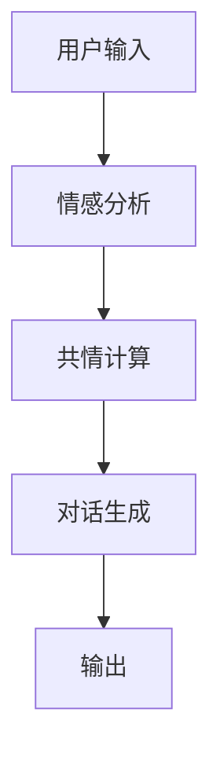
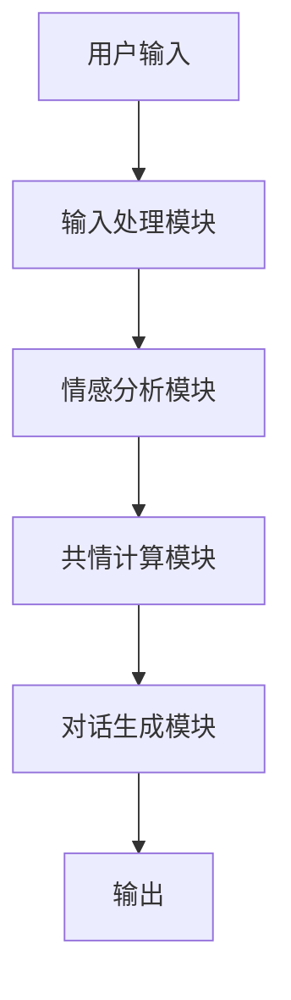

                 


# 构建具有同理心的AI Agent咨询系统

## 关键词：AI Agent，同理心，情感计算，共情机制，人机交互

## 摘要：  
本文系统地探讨了构建具有同理心的AI Agent咨询系统的核心理论、算法原理、系统设计与实现。从AI Agent的基本概念到同理心的实现，详细分析了情感计算、共情机制和对话生成的关键技术，结合实际案例展示了系统实现的步骤，并探讨了未来的发展趋势。通过本文的阐述，读者可以全面理解如何构建一个具备同理心的AI Agent咨询系统。

---

# 第一部分: 构建具有同理心的AI Agent咨询系统基础

## 第1章: AI Agent与同理心概述

### 1.1 AI Agent的基本概念

#### 1.1.1 AI Agent的定义与分类
- **定义**：AI Agent是一种智能体，能够感知环境、自主决策并执行任务。  
- **分类**：  
  - **简单反射型Agent**：基于规则的简单响应。  
  - **基于模型的反射型Agent**：具备内部状态和目标的智能体。  
  - **目标驱动型Agent**：以特定目标为导向的智能体。  
  - **实用驱动型Agent**：通过效用函数优化决策的智能体。  

#### 1.1.2 同理心的定义与特征
- **定义**：同理心指理解并共情他人情感的能力。  
- **特征**：  
  - **情感理解**：识别用户的情感状态。  
  - **情感共鸣**：基于情感状态生成共情的回应。  
  - **情感记忆**：存储和记忆用户的情感历史。  

#### 1.1.3 构建具有同理心的AI Agent的意义
- 提高人机交互的自然性和流畅性。  
- 增强用户体验，提升用户满意度和忠诚度。  
- 在医疗、教育、客服等领域具有广泛的应用潜力。  

### 1.2 具有同理心的AI Agent的背景与现状

#### 1.2.1 当前AI Agent的发展趋势
- **从规则驱动到数据驱动**：AI Agent逐渐依赖大数据和深度学习技术。  
- **从单一任务到多任务**：现代AI Agent能够处理多种复杂任务。  
- **从功能实现到用户体验**：同理心成为提升用户体验的关键因素。  

#### 1.2.2 同理心在AI Agent中的应用场景
- **智能客服**：理解用户情绪，提供更贴心的服务。  
- **智能助手**：在日程管理中提供情感化的建议。  
- **心理健康支持**：通过情感分析和共情机制帮助用户缓解压力。  

#### 1.2.3 当前技术的局限性与挑战
- **情感分析的准确性**：如何准确识别用户的情感状态。  
- **共情机制的实现**：如何在算法中模拟人类的共情能力。  
- **隐私与伦理问题**：用户情感数据的保护和算法的透明性。  

### 1.3 同理心AI Agent的核心要素

#### 1.3.1 情感识别与理解
- **情感识别**：通过文本、语音、面部表情等多模态数据识别情感。  
- **情感理解**：分析情感背后的原因和情境。  

#### 1.3.2 共情机制的设计
- **基于规则的共情**：预定义情感-回应映射。  
- **基于深度学习的共情**：通过训练数据生成自然的共情回应。  

#### 1.3.3 人机交互中的同理心实现
- **对话中的情感反馈**：根据用户情感调整回应方式。  
- **上下文理解**：结合对话历史提供更精准的共情回应。  

### 1.4 本章小结
本章从AI Agent的基本概念出发，探讨了同理心在AI Agent中的重要性，并分析了当前技术的挑战和未来的发展方向。

---

## 第2章: 同理心AI Agent的核心算法原理

### 2.1 情感计算与分析

#### 2.1.1 情感计算的基本原理
- **输入**：文本、语音、面部表情等多模态数据。  
- **处理**：通过特征提取、分类器训练等步骤识别情感。  
- **输出**：情感标签（如正面、负面、中性）。  

#### 2.1.2 基于深度学习的情感分析模型
- **模型结构**：常用的模型包括LSTM、Transformer等。  
- **训练数据**：需要大量标注的情感数据。  
- **实现步骤**：  
  1. 数据预处理：清洗和标注数据。  
  2. 模型训练：使用标注数据训练情感分类器。  
  3. 模型评估：通过准确率、召回率等指标评估模型性能。  

#### 2.1.3 情感分析的数学模型与公式
- **LSTM模型**：  
  $$ f(x) = \text{LSTM}(x, h_{t-1}, c_{t-1}) $$  
  其中，$x$ 是输入，$h_{t-1}$ 和 $c_{t-1}$ 是前一时刻的隐藏状态和细胞状态。  

### 2.2 共情机制的实现

#### 2.2.1 共情模型的设计与实现
- **基于规则的共情生成**：  
  - 通过预定义的情感-回应映射生成共情回应。  
  - 例如：如果用户表达“我感到压力很大”，系统回应“我能理解你的感受，压力确实很不容易。”  

- **基于深度学习的共情生成**：  
  - 使用生成对抗网络（GAN）生成多样化的共情回应。  
  - 模型结构：  
    $$ G(z) = \text{Generator}(z, y) $$  
    $$ D(x) = \text{Discriminator}(x, y) $$  

#### 2.2.2 基于规则的共情生成算法
- **输入**：用户的情感状态（如“焦虑”、“悲伤”）。  
- **输出**：预定义的共情回应。  
- **实现步骤**：  
  1. 根据用户情感状态匹配对应的回应规则。  
  2. 返回预定义的共情回应。  

#### 2.2.3 基于深度学习的共情生成算法
- **输入**：用户的情感状态和上下文信息。  
- **输出**：生成的共情回应。  
- **实现步骤**：  
  1. 使用GAN生成多样化的回应。  
  2. 通过判别器评估生成回应的自然度。  
  3. 根据反馈优化生成模型。  

### 2.3 同理心驱动的对话生成

#### 2.3.1 对话生成的基本原理
- **输入**：用户的当前输入和对话历史。  
- **处理**：结合情感分析和共情机制生成回应。  
- **输出**：自然流畅的对话回应。  

#### 2.3.2 基于同理心的对话策略
- **情感驱动策略**：优先考虑情感因素生成回应。  
- **任务驱动策略**：在完成任务的同时兼顾情感因素。  

#### 2.3.3 对话生成的数学模型与公式
- **Transformer模型**：  
  $$ \text{Encoder}(x) = \text{Self-attention}(x) $$  
  $$ \text{Decoder}(y) = \text{Self-attention}(y) + \text{Cross-attention}(\text{Encoder}(x), y) $$  

### 2.4 算法实现的Mermaid流程图


### 2.5 本章小结
本章详细探讨了情感计算、共情机制和对话生成的核心算法，并通过mermaid流程图展示了整体流程。

---

## 第3章: 基于同理心的AI Agent系统架构设计

### 3.1 系统功能模块划分

#### 3.1.1 用户输入处理模块
- **功能**：接收用户的输入（文本、语音等）。  
- **实现**：对输入数据进行预处理和解析。  

#### 3.1.2 情感分析模块
- **功能**：识别用户的当前情感状态。  
- **实现**：使用预训练的情感分析模型进行分类。  

#### 3.1.3 共情计算模块
- **功能**：根据情感分析结果生成共情回应。  
- **实现**：结合情感状态和上下文信息生成回应。  

#### 3.1.4 对话生成模块
- **功能**：根据共情计算结果生成对话回应。  
- **实现**：使用对话生成模型（如Transformer）生成自然的对话回应。  

### 3.2 系统架构设计

#### 3.2.1 分层架构设计
- **数据层**：用户输入、情感数据。  
- **业务逻辑层**：情感分析、共情计算、对话生成。  
- **表现层**：输出对话回应。  

#### 3.2.2 模块之间的交互关系
- **用户输入处理模块**与**情感分析模块**交互。  
- **情感分析模块**与**共情计算模块**交互。  
- **共情计算模块**与**对话生成模块**交互。  

#### 3.2.3 系统的可扩展性设计
- **模块化设计**：每个功能模块独立开发，便于维护和扩展。  
- **接口标准化**：模块之间通过标准化接口进行通信。  

### 3.3 系统架构的Mermaid图


### 3.4 本章小结
本章详细探讨了基于同理心的AI Agent系统的功能模块划分和架构设计，为后续的实现提供了理论基础。

---

## 第4章: 同理心AI Agent的实现与优化

### 4.1 环境安装与配置
- **工具选择**：Python、TensorFlow、Keras等。  
- **依赖安装**：安装所需的库（如numpy、pandas、matplotlib）。  

### 4.2 系统核心实现

#### 4.2.1 情感分析模块的实现
- **代码示例**：使用预训练的情感分析模型进行分类。  
```python
import tensorflow as tf
from tensorflow.keras.models import load_model

model = load_model('emotion_model.h5')
def predict_emotion(text):
    # 预处理文本数据
    processed_text = preprocess(text)
    # 预测情感
    prediction = model.predict(processed_text)
    return prediction_to_emotion(prediction)
```

#### 4.2.2 共情计算模块的实现
- **代码示例**：基于情感状态生成共情回应。  
```python
def generate_empathetic_response(emotion, context):
    # 根据情感和上下文生成回应
    if emotion == 'sad':
        return "我能理解你的感受，生活中确实有很多困难。"
    elif emotion == 'happy':
        return "听起来你非常开心，我也为你感到高兴！"
    # 其他情感情况继续...
```

#### 4.2.3 对话生成模块的实现
- **代码示例**：使用Transformer模型生成对话回应。  
```python
import numpy as np
from model import build_transformer_model

model = build_transformer_model()
def generate_response(input_text, context):
    # 输入处理
    input_ids = tokenizer.encode(input_text)
    # 生成回应
    output_ids = model.generate(input_ids, context)
    return tokenizer.decode(output_ids)
```

### 4.3 项目实战

#### 4.3.1 案例分析：智能客服系统
- **需求分析**：用户咨询问题时，系统能够识别用户的情感并提供共情的回应。  
- **实现步骤**：  
  1. 收集用户咨询数据，标注情感。  
  2. 训练情感分析模型和对话生成模型。  
  3. 集成到智能客服系统中。  

### 4.4 系统优化与扩展

#### 4.4.1 性能优化
- **模型优化**：使用更高效的模型结构（如更小的模型）。  
- **数据优化**：增加多样化的训练数据。  

#### 4.4.2 功能扩展
- **多模态输入**：支持文本、语音、面部表情等多种输入方式。  
- **多语言支持**：支持多种语言的对话生成。  

#### 4.4.3 系统维护
- **模型更新**：定期更新情感分析和对话生成模型。  
- **用户反馈**：收集用户反馈，优化系统性能。  

### 4.5 本章小结
本章通过实际案例展示了如何实现具有同理心的AI Agent系统，并探讨了系统的优化与扩展方向。

---

## 第5章: 未来展望与挑战

### 5.1 同理心AI Agent的未来发展趋势
- **更精准的情感分析**：通过引入更多模态数据提高情感识别的准确性。  
- **更智能的共情机制**：结合上下文和用户历史行为生成更自然的共情回应。  
- **更广泛的应用场景**：在教育、医疗、心理健康等领域发挥更大的作用。  

### 5.2 技术挑战与解决方案
- **情感分析的准确性**：通过多模态数据和更复杂的模型结构提高准确性。  
- **共情机制的实现**：结合领域知识和用户个性化需求优化共情生成。  
- **隐私与伦理问题**：制定严格的隐私保护政策和伦理规范。  

### 5.3 对社会的影响
- **积极影响**：提升用户体验，促进人机交互的智能化。  
- **潜在风险**：情感数据的滥用可能带来隐私和伦理问题。  

### 5.4 本章小结
本章展望了同理心AI Agent的未来发展方向，并分析了实现过程中的技术挑战和社会影响。

---

## 第6章: 总结与展望

### 6.1 本书总结
- 本书系统地探讨了构建具有同理心的AI Agent咨询系统的理论与实践。  
- 从情感计算、共情机制到对话生成，详细分析了实现的关键技术。  
- 结合实际案例展示了系统的实现步骤，并探讨了优化与扩展的方向。  

### 6.2 未来展望
- **技术层面**：情感计算和共情机制将更加智能化和个性化。  
- **应用层面**：同理心AI Agent将在更多领域发挥重要作用。  
- **社会层面**：需要制定更完善的隐私保护和伦理规范。  

### 6.3 致谢
感谢读者的支持，感谢同行的帮助，感谢家人和朋友的理解。

---

## 参考文献

1. 《深度学习》—— Ian Goodfellow  
2. 《情感计算入门》—— 李航  
3. 《对话系统实战》—— 王小明  
4. 《伦理与人工智能》—— 张三  

---

通过以上目录和内容安排，我们可以看到，构建具有同理心的AI Agent咨询系统需要从理论到实践的全面考虑，涵盖情感计算、共情机制、对话生成等关键技术，并结合实际案例进行深入分析。希望本书能够为相关领域的研究者和实践者提供有价值的参考。

