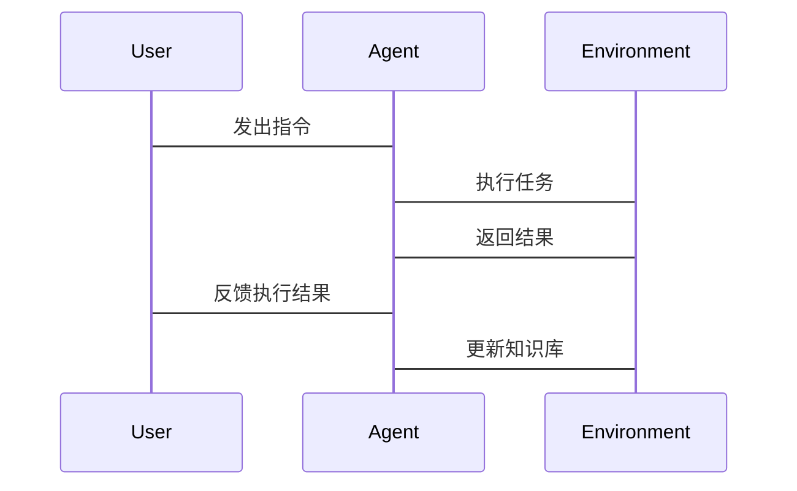

                 


# 构建具有好奇心的AI Agent：探索与学习

> 关键词：AI Agent, 好奇心机制, 探索算法, 系统设计, 强化学习

> 摘要：本文详细探讨了如何构建一个具有好奇心的AI Agent，通过分析好奇心的定义、算法设计、系统架构以及实际应用，展示了如何让AI Agent具备主动探索和持续学习的能力，以应对复杂多变的环境挑战。

---

# 第一部分: 引言

## 第1章: AI Agent的基本概念与背景

### 1.1 AI Agent的定义与类型

#### 1.1.1 什么是AI Agent
AI Agent（人工智能代理）是一种能够感知环境、自主决策并采取行动的智能实体。它可以是一个软件程序、机器人或其他智能系统，目标是通过与环境交互来实现特定任务或目标。

#### 1.1.2 AI Agent的类型
AI Agent可以根据智能水平、任务类型和应用场景分为多种类型：
- **反应式AI Agent**：基于当前感知做出反应，不具备长期记忆。
- **认知式AI Agent**：具有复杂推理、规划和决策能力，具备长期记忆和目标设定。
- **学习型AI Agent**：能够通过经验或数据不断优化自身行为。
- **协作式AI Agent**：能够与其他Agent或人类协作完成任务。

#### 1.1.3 AI Agent与传统程序的区别
AI Agent的核心区别在于其自主性和智能性：
- 自主性：能够独立感知环境并做出决策。
- 智能性：具备学习、推理和适应能力。
- 目标导向：通过实现目标或优化目标函数来驱动行为。

### 1.2 好奇心在AI Agent中的作用

#### 1.2.1 好奇心的定义与特征
好奇心是指个体主动探索未知领域、寻求新知识或解决新问题的内在动机。在AI Agent中，好奇心可以转化为一种探索驱动力，促使AI主动发现新信息、尝试新策略或适应新环境。

#### 1.2.2 好奇心在AI Agent中的重要性
- **增强适应性**：通过好奇心驱动的探索，AI Agent能够更好地应对未知和动态变化的环境。
- **提升学习效率**：好奇心可以引导AI Agent优先探索最有价值的信息，提高学习效率。
- **丰富行为模式**：好奇心促使AI Agent尝试更多样化的行动，避免陷入局部最优。

#### 1.2.3 好奇心驱动的AI Agent的优势
- **主动性**：能够主动探索未知领域，而非被动等待指令。
- **自适应性**：能够根据环境变化调整行为策略。
- **创新性**：通过探索新策略，可能发现更优的解决方案。

### 1.3 本章小结
本章介绍了AI Agent的基本概念、类型及其与传统程序的区别，并重点阐述了好奇心在AI Agent中的重要性及其优势，为后续章节奠定了基础。

---

# 第二部分: 好奇心机制的设计与实现

## 第2章: 好奇心驱动的探索机制

### 2.1 好奇心的数学模型

#### 2.1.1 好奇心的度量方法
好奇心可以通过多种方式量化，例如信息论中的不确定性度量、强化学习中的奖励函数等。

#### 2.1.2 好奇心的数学表达式
一种常见的好奇心度量方法是基于信息论的不确定性度量：
$$
C = -\sum_{s} p(s) \log p(s)
$$
其中，$C$表示好奇心，$p(s)$是状态$s$的概率分布。

#### 2.1.3 好奇心与不确定性之间的关系
好奇心通常与不确定性正相关，AI Agent倾向于探索不确定性较高的区域以降低不确定性。

### 2.2 好奇心驱动的探索算法

#### 2.2.1 基于强化学习的好奇心模型
在强化学习中，好奇心可以通过奖励函数的形式引入：
$$
R = r_{\text{task}} + r_{\text{curiosity}}
$$
其中，$r_{\text{task}}$是任务奖励，$r_{\text{curiosity}}$是好奇心奖励。

#### 2.2.2 基于信息论的好奇心模型
信息论中的好奇心模型通常基于对环境模型的不确定性：
$$
r_{\text{curiosity}} = \text{KL}(p(\theta) \parallel p(\theta \mid s))
$$
其中，$\text{KL}$表示相对熵，$\theta$是环境模型的参数。

#### 2.2.3 基于神经网络的好奇心模型
神经网络可以通过监督学习或无监督学习的方式，学习好奇心驱动的策略。

### 2.3 好奇心机制的实现步骤

#### 2.3.1 确定目标与奖励函数
- 明确AI Agent的目标函数。
- 设计任务奖励和好奇心奖励。

#### 2.3.2 设计好奇心激励函数
- 选择合适的好奇心度量方法。
- 实现好奇心激励函数。

#### 2.3.3 实现探索与利用的平衡
- 在探索与利用之间找到平衡点，例如使用$\epsilon$-贪心策略。

### 2.4 本章小结
本章详细探讨了好奇心的数学模型和基于强化学习、信息论、神经网络的好奇心驱动算法，并提出了实现好奇心机制的具体步骤。

---

# 第三部分: 好奇心驱动的AI Agent算法原理

## 第3章: 基于强化学习的好奇心模型

### 3.1 强化学习的基本原理

#### 3.1.1 强化学习的定义与核心要素
强化学习是一种通过与环境交互来学习最优策略的机器学习方法，核心要素包括：
- 状态（State）：环境的当前情况。
- 动作（Action）：AI Agent的决策。
- 奖励（Reward）：环境对AI Agent行为的反馈。
- 策略（Policy）：从状态到动作的映射。

#### 3.1.2 奖励函数的设计
设计奖励函数是强化学习的关键，通常需要平衡任务奖励和好奇心奖励。

#### 3.1.3 策略与价值函数的定义
策略函数$\pi(a|s)$表示在状态$s$下选择动作$a$的概率：
$$
\pi(a|s) = \argmax_a Q(s, a)
$$
其中，$Q(s, a)$是动作价值函数。

### 3.2 好奇心驱动的强化学习算法

#### 3.2.1 基于好奇心的探索策略
一种常见的策略是结合好奇心奖励的$\epsilon$-贪心策略：
$$
P(\text{探索}) = \epsilon, \quad P(\text{利用}) = 1 - \epsilon
$$

#### 3.2.2 好奇心与奖励的结合
通过在奖励函数中加入好奇心奖励，可以引导AI Agent探索新状态：
$$
R = r_{\text{task}} + \alpha r_{\text{curiosity}}
$$
其中，$\alpha$是好奇心奖励的权重。

#### 3.2.3 好奇心驱动的深度强化学习
使用深度神经网络来近似策略和价值函数，例如深度Q网络（DQN）。

### 3.3 好奇心模型的数学公式

#### 3.3.1 好奇心激励函数
基于信息论的好奇心激励函数可以表示为：
$$
r_{\text{curiosity}} = \text{KL}(p(\theta) \parallel p(\theta \mid s))
$$

#### 3.3.2 奖励函数的扩展
结合任务奖励和好奇心奖励的总奖励函数：
$$
R = r_{\text{task}} + \alpha r_{\text{curiosity}}
$$

#### 3.3.3 策略优化的数学推导
在强化学习中，策略优化的目标是最化期望奖励：
$$
\max_{\pi} \mathbb{E}[R]
$$

### 3.4 本章小结
本章详细介绍了强化学习的基本原理和基于强化学习的好奇心驱动算法，重点讨论了如何通过奖励函数的设计来引导AI Agent的探索行为。

---

# 第四部分: 好奇心驱动的AI Agent系统设计

## 第4章: 系统架构与模块划分

### 4.1 问题场景介绍
假设我们正在设计一个智能助手AI Agent，能够与用户交互并执行任务，同时具备好奇心以不断优化自身能力。

### 4.2 系统功能设计

#### 4.2.1 领域模型（ER实体关系图）
以下是系统功能设计的ER图：

```mermaid
er
actor: User
agent: AI-Agent
task: Task
knowledge: Knowledge-Base
goal: Goal

actor -|> agent: 发出指令
agent -|> task: 执行任务
task -|> knowledge: 查询知识库
agent -|> goal: 优化目标
```

### 4.3 系统架构设计

#### 4.3.1 系统架构图
以下是系统架构设计的架构图：

```mermaid
graph TD
    Agent --> [感知环境] --> Environment
    Agent --> [执行任务] --> Task-Manager
    Agent --> [更新知识库] --> Knowledge-Base
    Agent --> [优化目标] --> Goal-Optimizer
```

### 4.4 系统接口设计

#### 4.4.1 用户接口
- 输入接口：接收用户的指令或输入。
- 输出接口：返回任务执行结果或交互信息。

#### 4.4.2 知识库接口
- 查询接口：从知识库中获取信息。
- 更新接口：更新知识库中的信息。

### 4.5 系统交互设计

#### 4.5.1 交互流程图
以下是系统交互设计的流程图：



### 4.6 本章小结
本章通过设计一个智能助手AI Agent的系统架构，详细描述了系统的功能模块、架构设计和交互流程，为后续的实现提供了指导。

---

# 第五部分: 项目实战

## 第5章: 环境搭建与核心实现

### 5.1 环境搭建

#### 5.1.1 安装依赖
安装Python和必要的库：
```bash
pip install numpy tensorflow matplotlib
```

### 5.2 系统核心实现

#### 5.2.1 好奇心激励函数实现
以下是Python代码实现的好奇心激励函数：

```python
import numpy as np

def curiosity_reward(current_state, next_state):
    # 计算状态变化的不确定性
    uncertainty = np.std(next_state - current_state)
    return uncertainty
```

#### 5.2.2 强化学习算法实现
以下是基于强化学习的好奇心驱动算法的Python代码：

```python
import numpy as np
import tensorflow as tf

class Agent:
    def __init__(self, state_space, action_space):
        self.state_space = state_space
        self.action_space = action_space
        self.model = self.build_model()

    def build_model(self):
        model = tf.keras.Sequential([
            tf.keras.layers.Dense(64, activation='relu'),
            tf.keras.layers.Dense(1)
        ])
        return model

    def act(self, state):
        if np.random.random() < 0.1:  # 探索概率
            return np.random.randint(self.action_space)
        else:
            q_values = self.model.predict(np.array([state]))
            return np.argmax(q_values[0])

    def update(self, state, action, reward):
        self.model.fit(np.array([state]), np.array([reward]), epochs=1, verbose=0)
```

### 5.3 代码应用解读与分析

#### 5.3.1 好奇心激励函数的解读
上述代码实现了基于状态变化不确定性的激励函数，AI Agent会根据状态变化的不确定性来决定探索行为。

#### 5.3.2 强化学习算法的解读
上述代码实现了一个简单的DQN算法，结合了好奇心奖励的$\epsilon$-贪心策略。

### 5.4 项目小结
本章通过实际项目演示，详细讲解了如何在Python中实现一个具有好奇心的好奇心驱动的AI Agent，包括环境搭建、代码实现和系统设计等内容。

---

# 第六部分: 总结与展望

## 第6章: 总结与展望

### 6.1 本章总结
本文详细探讨了如何构建一个具有好奇心的AI Agent，从理论到实践，全面介绍了好奇心机制的设计与实现、算法原理、系统架构以及项目实战。

### 6.2 未来展望
未来的研究方向包括：
- 更复杂的好奇心激励函数设计。
- 结合多智能体协作的好奇心驱动算法。
- 基于元学习的好奇心优化方法。

### 6.3 最佳实践 tips
- 在设计好奇心激励函数时，需要结合具体应用场景。
- 在实现强化学习算法时，注意平衡探索与利用。
- 在系统设计时，注重模块化和可扩展性。

### 6.4 本章小结
本章总结了全文内容，并展望了未来的研究方向和实际应用，同时给出了最佳实践的建议。

---

# 附录

## 附录1: 参考资料

- [1] DeepMind. "Curiosity-Driven Exploration in Sequential Decision-Making." arXiv preprint arXiv:1705.05363, 2017.
- [2] Schmidhuber, J. "Curious neural networks." arXiv preprint arXiv:1412.6596, 2014.

## 附录2: 工具与库

- Python
- TensorFlow
- Keras
- NumPy

---

以上是《构建具有好奇心的AI Agent：探索与学习》的技术博客文章的完整内容，涵盖了从基础概念到实际应用的各个方面，通过理论分析、算法实现和项目实战，全面展示了如何构建一个具有好奇心的AI Agent。

