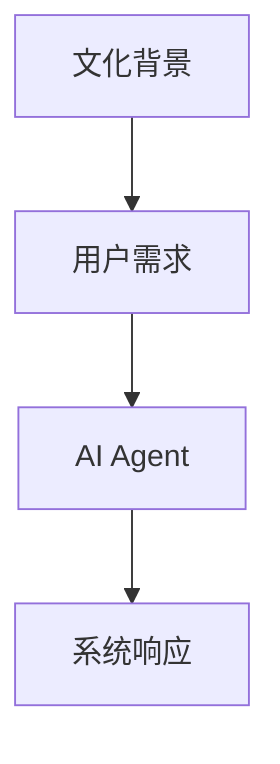
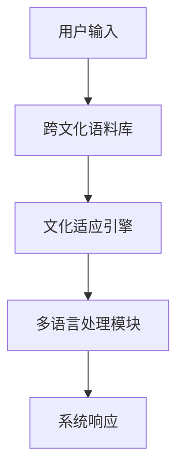
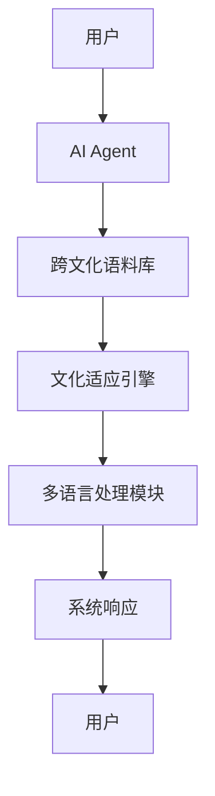

                 


# 《构建具有文化适应性的AI Agent系统》

## 关键词：文化适应性、AI Agent、自然语言处理、跨文化、系统架构

## 摘要：
在当今全球化和多文化背景下，构建能够适应不同文化环境的AI Agent系统变得至关重要。本文系统地探讨了文化适应性AI Agent的核心概念、技术原理、系统架构和实现方法。从背景分析到核心概念，再到算法实现和实际案例，文章详细阐述了如何设计和构建一个能够理解并适应不同文化语境的AI Agent系统，为相关领域的研究和实践提供了全面的指导。

---

# 第1章: 文化适应性AI Agent的背景与问题描述

## 1.1 人工智能与文化适应性的概念

### 1.1.1 人工智能的基本概念
人工智能（Artificial Intelligence, AI）是指模拟人类智能的系统或机器，能够执行学习、推理、问题解决等任务。AI Agent是一种能够感知环境并采取行动以实现目标的智能体。

### 1.1.2 文化适应性的定义与内涵
文化适应性是指AI系统能够理解和适应不同文化背景下的用户需求和行为。它要求AI Agent不仅能够处理语言，还需要理解文化语境、习俗和价值观。

### 1.1.3 人工智能在跨文化场景中的重要性
在全球化背景下，AI系统需要服务于不同文化背景的用户，文化适应性是提升用户体验和系统性能的关键。

## 1.2 问题背景与问题描述

### 1.2.1 当前AI Agent在跨文化应用中的挑战
传统AI Agent通常基于单一语言或文化设计，难以应对跨文化场景中的复杂需求。

### 1.2.2 文化差异对AI Agent性能的影响
文化差异可能导致用户需求和表达方式的不同，影响AI Agent的理解和响应能力。

### 1.2.3 问题解决的目标与边界
目标是设计一个能够理解并适应不同文化背景的AI Agent系统。边界包括语言、习俗和价值观，但不涉及个人隐私和敏感数据。

## 1.3 问题解决思路与技术路线

### 1.3.1 多语言与跨文化处理的基本思路
采用多语言模型和文化语境分析技术，提升AI Agent的跨文化适应能力。

### 1.3.2 文化适应性AI Agent的设计原则
设计原则包括文化敏感性、个性化推荐和多模态交互。

### 1.3.3 技术路线与实现框架
技术路线包括数据收集、模型训练、系统设计和测试优化。

---

# 第2章: 文化适应性AI Agent的核心概念与联系

## 2.1 核心概念原理

### 2.1.1 文化适应性的核心要素
文化适应性包括语言、习俗、价值观和非语言表达等方面。

### 2.1.2 AI Agent的基本工作原理
AI Agent通过感知环境、分析需求、制定策略并执行行动来实现目标。

### 2.1.3 跨文化适应性的实现机制
通过多语言处理、文化语境理解和个性化推荐实现文化适应性。

## 2.2 核心概念对比表

| 比较维度 | 文化适应性 | 语言适应性 |
|----------|------------|------------|
| 定义     | 理解并适应不同文化背景 | 理解并适应不同语言 |
| 范围     | 包括语言、习俗和价值观 | 仅限语言 |
| 难度     | 更高 | 较低 |

### 2.2.3 文化背景对用户行为的影响
不同文化背景下，用户的行为模式和需求表达方式存在显著差异。

## 2.3 ER实体关系图



---

# 第3章: 跨文化自然语言处理技术

## 3.1 多语言模型的基本原理

### 3.1.1 多语言模型的定义与特点
多语言模型能够在多种语言之间共享知识，提升跨语言处理能力。

### 3.1.2 多语言模型的训练方法
使用多语言数据集进行训练，采用跨语言迁移学习技术。

### 3.1.3 多语言模型的应用场景
多语言模型适用于跨文化客服、多语言内容生成等场景。

## 3.2 文化语境理解

### 3.2.1 文化语境的定义与分类
文化语境包括语言语境、社会语境和物理语境。

### 3.2.2 文化语境对NLP的影响
文化语境影响用户的表达方式和意图理解。

### 3.2.3 文化适应性NLP的实现方法
结合多语言模型和文化语境分析技术。

## 3.3 跨语言迁移学习

### 3.3.1 跨语言迁移学习的基本概念
跨语言迁移学习是指利用一种语言的数据来提升另一种语言模型的性能。

### 3.3.2 跨语言迁移学习的应用
跨语言迁移学习适用于数据稀疏的语言，提升小语种模型的性能。

---

# 第4章: 文化适应性AI Agent的设计原则和方法

## 4.1 文化敏感性设计

### 4.1.1 文化敏感性设计的核心思想
AI Agent需要理解和尊重不同文化背景下的用户需求。

### 4.1.2 文化敏感性设计的具体方法
包括文化语境分析、文化适配策略和文化反馈机制。

## 4.2 个性化推荐策略

### 4.2.1 个性化推荐的核心思想
根据用户的文化背景和偏好，提供个性化的内容和建议。

### 4.2.2 个性化推荐的具体方法
包括基于协同过滤的推荐和基于内容的推荐。

## 4.3 多模态交互设计

### 4.3.1 多模态交互的核心思想
结合文本、语音、图像等多种模态信息，提升用户体验。

### 4.3.2 多模态交互的具体方法
包括多模态数据融合和多模态模型设计。

---

# 第5章: 文化适应性AI Agent系统架构设计

## 5.1 系统功能模块

### 5.1.1 跨文化语料库模块
存储和管理多语言语料库，支持文化适应性分析。

### 5.1.2 文化适应引擎模块
负责文化语境分析和适配策略生成。

### 5.1.3 多语言处理模块
实现跨语言理解和生成。

## 5.2 系统架构设计

### 5.2.1 系统架构图


### 5.2.2 交互流程图


## 5.3 系统接口设计

### 5.3.1 输入接口
支持多语言输入和文化背景标识。

### 5.3.2 输出接口
支持多语言输出和文化适配结果反馈。

## 5.4 系统实现

### 5.4.1 系统实现的代码示例
```python
class CultureAdaptiveAgent:
    def __init__(self, language_model, cultural_context):
        self.language_model = language_model
        self.cultural_context = cultural_context

    def process_request(self, user_input):
        # 分析用户输入的文化背景
        cultural_analysis = self.cultural_context.analyze(user_input)
        # 生成文化适配的响应
        response = self.language_model.generate_response(user_input, cultural_analysis)
        return response
```

---

# 第6章: 项目实战——构建文化适应性AI Agent系统

## 6.1 项目环境搭建

### 6.1.1 环境搭建步骤
安装Python、TensorFlow、Transformers库。

## 6.2 核心算法实现

### 6.2.1 跨语言迁移学习代码
```python
from transformers import AutoModelForMaskedLM, AutoTokenizer

class CrossLanguageAdapter:
    def __init__(self, source_lang, target_lang):
        self.source_lang = source_lang
        self.target_lang = target_lang
        self.model = AutoModelForMaskedLM.from_pretrained('bert-base-multilingual')
        self.tokenizer = AutoTokenizer.from_pretrained('bert-base-multilingual')

    def adapt_language(self, text):
        # 使用跨语言迁移学习进行适配
        inputs = self.tokenizer.encode(text, return_tensors='np')
        outputs = self.model.generate(inputs, max_length=50)
        return self.tokenizer.decode(outputs[0])
```

## 6.3 系统实现

### 6.3.1 系统实现代码
```python
class CultureAdaptiveSystem:
    def __init__(self):
        self.agent = CultureAdaptiveAgent('multi-language', 'cultural-context')

    def run(self):
        while True:
            user_input = input("请输入你的需求：")
            response = self.agent.process_request(user_input)
            print(response)
```

## 6.4 案例分析

### 6.4.1 实际应用案例
分析一个跨文化客服系统的实现，展示文化适应性AI Agent在实际中的应用。

---

# 第7章: 未来展望

## 7.1 技术挑战与突破方向

### 7.1.1 技术挑战
数据稀疏性、文化语境的理解难度。

### 7.1.2 突破方向
开发更强大的跨语言模型、提升文化语境理解能力。

## 7.2 伦理与法律问题

### 7.2.1 伦理问题
文化适配中的公平性、透明性。

### 7.2.2 法律问题
数据隐私和文化敏感性相关的法律问题。

## 7.3 未来发展趋势

### 7.3.1 多模态AI Agent
结合文本、语音、图像等多种模态信息，提升用户体验。

### 7.3.2 自适应学习
AI Agent能够自适应地学习和优化，提升文化适应能力。

---

# 附录

## 附录A: 参考文献

## 附录B: 开发工具列表

## 附录C: 术语表

---

# 结语

通过本文的系统阐述，读者可以全面了解如何构建一个具有文化适应性的AI Agent系统，从理论到实践，逐步掌握相关技术的核心要点。未来，随着技术的不断发展，文化适应性AI Agent将在更多领域发挥重要作用。

