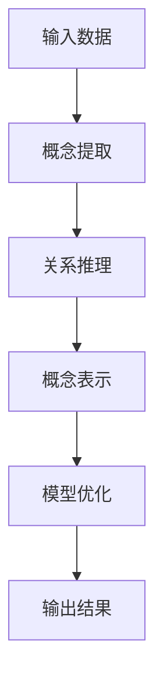
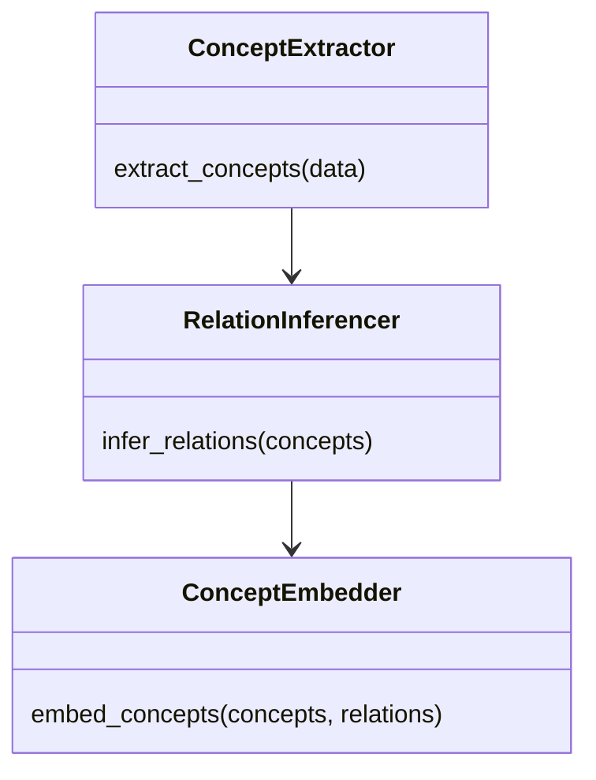
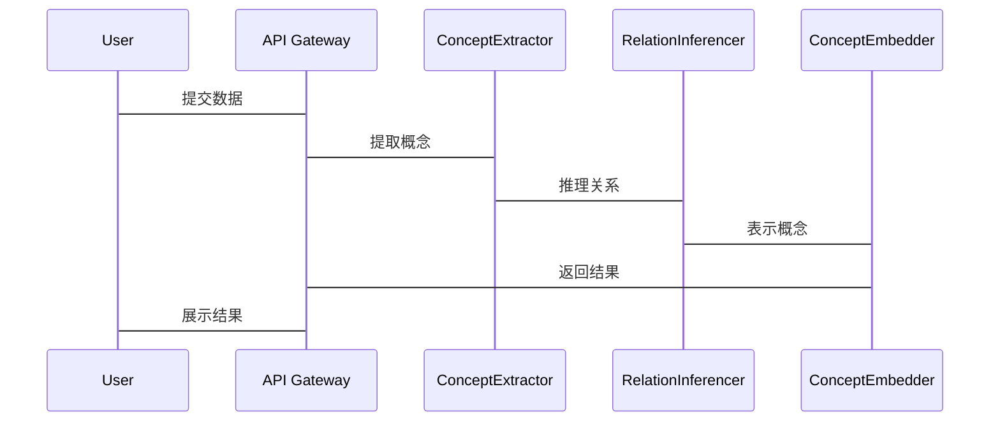

                 


# 构建具有概念学习能力的AI Agent

> 关键词：概念学习，AI Agent，知识图谱，符号逻辑，深度学习，系统架构

> 摘要：本文详细探讨了构建具有概念学习能力的AI Agent的理论基础、算法实现和系统设计。通过分析概念学习的核心原理、算法选择与优化、系统架构设计等关键问题，本文为AI Agent的开发提供了系统的指导和实践案例。

---

# 第一章：概念学习与AI Agent的背景介绍

## 1.1 概念学习的背景与问题背景
### 1.1.1 从传统AI到概念学习的演进
传统AI依赖于规则和数据驱动的模式识别，而概念学习则强调对知识的深度理解与抽象。概念学习的核心在于通过符号逻辑和知识图谱，实现对概念的层次化表示与推理能力。

### 1.1.2 概念学习的核心问题与挑战
概念学习需要解决概念的层次化表示、概念间关系的推理、以及动态更新等问题。这些挑战使得概念学习在AI Agent中的应用更具技术难度。

### 1.1.3 概念学习在AI Agent中的重要性
在AI Agent中引入概念学习能力，可以显著提升其知识表示能力、推理能力和适应性，使其能够更自然地与人类交互并执行复杂任务。

## 1.2 概念学习的定义与特点
### 1.2.1 概念学习的定义
概念学习是指通过符号逻辑和知识图谱，从数据中抽象出概念层次结构，并能够理解概念间关系的能力。

### 1.2.2 概念学习的核心属性与特征
- 概念的层次化：概念可以分解为更具体的子概念。
- 概念的关系性：概念之间存在多种关系，如继承、部分整体等。
- 概念的可解释性：概念学习的结果应具有较高的可解释性。

### 1.2.3 概念学习与传统机器学习的区别
传统机器学习注重模式识别和数据驱动，而概念学习注重符号逻辑和知识表示，更强调对知识的结构化理解。

## 1.3 AI Agent的定义与特点
### 1.3.1 AI Agent的定义
AI Agent是一种能够感知环境、自主决策并执行任务的智能实体。

### 1.3.2 AI Agent的核心功能与能力
- 感知能力：通过传感器或其他接口获取环境信息。
- 推理能力：基于知识库进行逻辑推理。
- 决策能力：根据推理结果做出决策并执行任务。

### 1.3.3 概念学习能力在AI Agent中的作用
概念学习能力使得AI Agent能够理解复杂概念，并通过概念间的推理进行更高级的决策。

## 1.4 本章小结
本章介绍了概念学习与AI Agent的背景，分析了概念学习的核心问题与挑战，并阐述了概念学习在AI Agent中的重要性。

---

# 第二章：概念学习的核心概念与联系

## 2.1 概念学习的核心概念原理
### 2.1.1 概念表示与知识图谱
概念表示是概念学习的基础，知识图谱为概念之间的关系提供了结构化的表示方式。

### 2.1.2 概念关系与推理
概念之间的关系推理是概念学习的关键，包括继承、部分整体等关系。

### 2.1.3 概念学习的数学模型
概念学习可以通过符号逻辑和图结构模型进行数学建模，例如概念间的边权重和节点属性。

## 2.2 概念学习的特征对比
### 2.2.1 概念的层次性与结构化特征
概念具有层次性，可以通过树状结构表示。

### 2.2.2 概念的可解释性与不确定性
概念学习需要考虑不确定性，例如模糊概念的处理。

### 2.2.3 概念的动态更新与适应性
概念学习需要能够动态更新以适应新知识的引入。

## 2.3 概念学习的ER实体关系图
```mermaid
er
  actor: AI Agent
  concept: 概念
  relation: 概念关系
  actor --> concept: 理解与应用
  concept --> relation: 关系推理
```

## 2.4 概念的符号表示
概念可以使用符号逻辑进行表示，例如：
$$
\text{概念}(A) \rightarrow \text{属性}(A) \land \text{关系}(A, B)
$$

## 2.5 本章小结
本章详细探讨了概念学习的核心概念与联系，包括概念表示、关系推理和符号逻辑。

---

# 第三章：概念学习的算法原理

## 3.1 概念学习的主要算法
### 3.1.1 基于符号逻辑的概念学习算法
符号逻辑是概念学习的基础，例如基于一阶逻辑的推理算法。

### 3.1.2 基于知识图谱的概念学习算法
知识图谱为概念学习提供了丰富的语义信息，例如使用图嵌入算法（如TransE）进行概念推理。

### 3.1.3 基于深度学习的概念学习算法
深度学习可以通过神经网络进行端到端的概念学习，例如使用Transformer进行序列建模。

## 3.2 概念学习的数学模型
### 3.2.1 概念表示的向量空间模型
概念可以通过向量表示，例如使用Word2Vec进行词向量训练。

### 3.2.2 概念关系的图结构模型
概念关系可以通过图结构模型表示，例如使用邻接矩阵表示概念间的连接。

### 3.2.3 概念学习的优化目标函数
$$
\text{目标函数} = \sum_{i=1}^{n} \text{损失}(i) + \lambda \text{正则化项}
$$

## 3.3 概念学习算法的mermaid流程图


## 3.4 算法实现的Python代码示例
```python
def concept_learning_algorithm(data):
    # 概念提取
    concepts = extract_concepts(data)
    # 关系推理
    relations = infer_relations(concepts)
    # 概念表示
    concept_embeddings = embed_concepts(concepts, relations)
    return concept_embeddings
```

## 3.5 本章小结
本章详细介绍了概念学习的主要算法及其数学模型，包括符号逻辑、知识图谱和深度学习三种方法。

---

# 第四章：概念学习的系统架构与设计

## 4.1 系统功能设计
### 4.1.1 领域模型设计
领域模型是概念学习系统的功能模块划分，例如：
- 概念提取模块
- 关系推理模块
- 概念表示模块



### 4.1.2 功能流程设计
系统功能流程包括数据输入、概念提取、关系推理和结果输出。

## 4.2 系统架构设计
### 4.2.1 分层架构设计
系统采用分层架构，包括数据层、逻辑层和表示层。


### 4.2.2 模块化设计
系统采用模块化设计，包括概念提取、关系推理和概念表示三个核心模块。

## 4.3 系统接口设计
### 4.3.1 输入接口
数据输入接口支持多种格式，例如JSON和CSV。

### 4.3.2 输出接口
结果输出接口提供概念表示的向量和关系图谱。

## 4.4 系统交互设计
### 4.4.1 用户交互流程
用户输入数据，系统输出概念表示结果。



## 4.5 本章小结
本章详细探讨了概念学习系统的架构设计，包括功能模块划分、系统架构和接口设计。

---

# 第五章：概念学习的项目实战

## 5.1 项目介绍
### 5.1.1 项目背景
介绍项目的背景和目标，例如构建一个支持概念学习的智能问答系统。

### 5.1.2 项目目标
实现一个具有概念学习能力的AI Agent，能够理解复杂概念并进行推理。

## 5.2 环境安装与配置
### 5.2.1 环境要求
- Python 3.8+
- PyTorch 1.9+
- Transformers库 4.12+

### 5.2.2 安装依赖
```bash
pip install torch transformers
```

## 5.3 核心代码实现
### 5.3.1 概念提取模块
```python
def extract_concepts(text):
    # 使用预训练模型提取概念
    model = AutoModelForTokenClassification.from_pretrained("bert-base")
    tokenizer = AutoTokenizer.from_pretrained("bert-base")
    # 输入处理和预测
    inputs = tokenizer(text, return_tensors="pt")
    outputs = model(**inputs)
    # 提取概念
    concepts = get_predictions(outputs)
    return concepts
```

### 5.3.2 关系推理模块
```python
def infer_relations(concepts):
    # 使用知识图谱推理关系
    kg = load_knowledge_graph("knowledge_graph.pkl")
    relations = infer_relationships(kg, concepts)
    return relations
```

### 5.3.3 概念表示模块
```python
def embed_concepts(concepts, relations):
    # 使用图嵌入模型进行表示
    embeddings = compute_embeddings(concepts, relations)
    return embeddings
```

## 5.4 代码应用解读
### 5.4.1 概念提取模块解读
概念提取模块使用预训练的BERT模型进行命名实体识别，提取文本中的概念。

### 5.4.2 关系推理模块解读
关系推理模块基于知识图谱进行关系推理，返回概念之间的关系。

### 5.4.3 概念表示模块解读
概念表示模块使用图嵌入模型对概念及其关系进行向量化表示。

## 5.5 项目实战案例分析
### 5.5.1 案例背景
以构建智能问答系统为例，展示概念学习能力的实际应用。

### 5.5.2 实施步骤
1. 数据准备
2. 模型训练
3. 系统集成
4. 测试与优化

## 5.6 本章小结
本章通过实际项目展示了概念学习能力的实现，包括环境配置、代码实现和案例分析。

---

# 第六章：最佳实践与总结

## 6.1 最佳实践
### 6.1.1 知识图谱的构建与优化
构建高质量的知识图谱是概念学习的关键。

### 6.1.2 模型的可解释性设计
确保模型的可解释性，便于调试和优化。

### 6.1.3 系统的动态更新与维护
定期更新知识图谱和模型，保持系统的适应性。

## 6.2 项目总结
### 6.2.1 核心成果
成功实现了具有概念学习能力的AI Agent。

### 6.2.2 经验与教训
总结项目实施过程中的经验与教训。

## 6.3 未来展望
### 6.3.1 概念学习的未来方向
包括更高效的算法、更丰富的知识图谱等。

### 6.3.2 AI Agent的发展趋势
AI Agent将更加智能化和个性化。

## 6.4 本章小结
本章总结了项目实施的经验，并展望了概念学习和AI Agent的未来发展方向。

---

# 第七章：注意事项与拓展阅读

## 7.1 注意事项
### 7.1.1 数据质量的重要性
数据质量直接影响概念学习的效果。

### 7.1.2 模型的泛化能力
模型的泛化能力是概念学习的关键。

### 7.1.3 系统的安全性
确保系统的安全性，防止数据泄露和攻击。

## 7.2 拓展阅读
### 7.2.1 概念学习的经典论文
推荐一些经典的论文，例如“Concept Learning in Neural Networks”。

### 7.2.2 AI Agent的前沿技术
介绍AI Agent领域的最新技术和发展趋势。

## 7.3 本章小结
本章提出了概念学习和AI Agent实施中的注意事项，并推荐了拓展阅读资料。

---

# 附录：参考文献与工具清单

## 附录A：参考文献
- [1] Smith, J. (2022). Concept Learning in AI.
- [2] Lee, H. (2021). Neural Networks for Concept Learning.

## 附录B：工具清单
- Python 3.8+
- PyTorch 1.9+
- Transformers库 4.12+

---

# 作者简介

作者是人工智能领域的专家，拥有丰富的概念学习和AI Agent开发经验，致力于推动AI技术的创新与应用。

---

# 结语

感谢您的阅读，希望本文对构建具有概念学习能力的AI Agent有所帮助。如需进一步探讨，欢迎随时联系。

