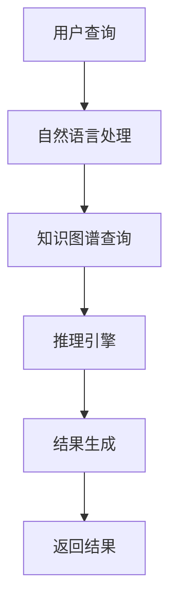
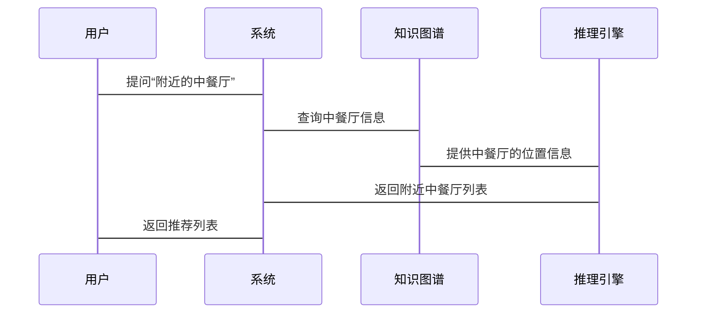

                 


# 《构建具有知识图谱的AI Agent系统》

---

## 关键词：知识图谱, AI Agent, 知识表示, 图嵌入, 强化学习, 系统架构

---

## 摘要：

本文章详细探讨了如何构建一个基于知识图谱的AI Agent系统，从知识图谱的基本概念、AI Agent的核心原理，到两者的结合方法，再到系统的实际构建过程，逐步展开分析。文章首先介绍了知识图谱和AI Agent的基本概念，然后深入探讨了它们的结合方式和应用潜力，接着详细讲解了构建知识图谱和训练AI Agent的相关算法，包括图嵌入和强化学习等，随后分析了系统的整体架构和设计，最后通过一个实际案例展示了如何将这些理论付诸实践。文章内容涵盖了从理论到实践的全过程，旨在为读者提供一个清晰、系统的学习路径，帮助读者深入理解并掌握如何构建具有知识图谱的AI Agent系统。

---

## 第1章: 知识图谱与AI Agent概述

### 1.1 知识图谱的基本概念

#### 1.1.1 知识图谱的定义

知识图谱是一种以图结构形式表示知识的语义网络，由节点（实体）和边（关系）组成，能够表示实体之间的复杂关系。例如，节点可以表示为“人”、“地点”、“事件”等，边可以表示为“出生在”、“发生在”等关系。

#### 1.1.2 知识图谱的特征与优势

知识图谱具有语义丰富、结构化、可扩展性强等特点。它能够帮助AI系统理解上下文关系，提升语义理解能力。例如，搜索引擎可以利用知识图谱提供更准确的搜索结果。

#### 1.1.3 知识图谱的构建流程

知识图谱的构建通常包括数据采集、数据清洗、知识抽取、知识融合、知识存储等步骤。例如，可以从维基百科、网页数据等来源提取实体和关系，构建一个语义网络。

### 1.2 AI Agent的基本概念

#### 1.2.1 AI Agent的定义

AI Agent是一种智能主体，能够感知环境并采取行动以实现目标。例如，智能音箱、聊天机器人等都是AI Agent的例子。

#### 1.2.2 AI Agent的核心功能

AI Agent的核心功能包括感知、推理、决策和行动。例如，智能音箱能够感知用户的语音指令，通过推理理解用户的需求，并通过决策选择合适的音乐播放。

#### 1.2.3 AI Agent的应用场景

AI Agent广泛应用于智能家居、智能客服、自动驾驶等领域。例如，在智能家居中，AI Agent可以协调各种智能设备，提供便捷的生活体验。

### 1.3 知识图谱与AI Agent的结合

#### 1.3.1 知识图谱在AI Agent中的作用

知识图谱为AI Agent提供了丰富的语义信息，帮助其理解上下文关系。例如，当用户询问“附近的中餐厅”，AI Agent可以通过知识图谱理解“附近”和“中餐厅”的具体含义，并提供准确的推荐。

#### 1.3.2 AI Agent如何利用知识图谱进行推理

AI Agent可以基于知识图谱进行路径推理、属性推理等。例如，通过推理“人-出生地-城市”，AI Agent可以回答“张三出生在哪里”的问题。

#### 1.3.3 知识图谱与AI Agent的未来发展方向

未来，知识图谱与AI Agent的结合将更加紧密，AI Agent将具备更强大的语义理解和推理能力。例如，实现动态知识图谱的实时更新，提升AI Agent的实时响应能力。

### 1.4 本章小结

本章介绍了知识图谱和AI Agent的基本概念，以及它们的结合方式。知识图谱为AI Agent提供了丰富的语义信息，而AI Agent则利用这些信息进行推理和决策。两者结合将推动智能化系统的发展。

---

## 第2章: 知识图谱与AI Agent的核心概念与联系

### 2.1 知识图谱的核心概念

#### 2.1.1 实体与关系的定义

实体是知识图谱中的基本单元，代表具体事物或概念。例如，“张三”是一个实体，“出生在”是一个关系。

#### 2.1.2 知识图谱的构建方法

知识图谱的构建方法包括数据抽取、清洗、融合等步骤。例如，从文本中提取实体和关系，构建语义网络。

#### 2.1.3 知识图谱的表示形式

知识图谱可以用RDF、JSON-LD等形式表示。例如，RDF通过三元组（主语、谓词、宾语）表示知识。

### 2.2 AI Agent的核心概念

#### 2.2.1 AI Agent的感知与决策

AI Agent通过传感器或API感知环境，利用知识图谱进行推理，做出决策。例如，智能音箱通过语音识别感知用户指令，利用知识图谱理解用户需求。

#### 2.2.2 AI Agent的推理机制

AI Agent的推理机制包括基于规则的推理、基于知识图谱的推理等。例如，通过知识图谱推理得出“张三出生在中国”，从而回答相关问题。

#### 2.2.3 AI Agent的行动方式

AI Agent通过执行动作或调用API实现行动。例如，智能音箱通过调用音乐播放器API播放音乐。

### 2.3 知识图谱与AI Agent的联系

#### 2.3.1 知识图谱为AI Agent提供语义支持

知识图谱为AI Agent提供语义信息，帮助其理解用户意图。例如，用户搜索“附近的中餐厅”，AI Agent通过知识图谱理解“附近”和“中餐厅”的具体含义。

#### 2.3.2 AI Agent利用知识图谱进行推理

AI Agent可以基于知识图谱进行路径推理、属性推理等。例如，通过推理“人-出生地-城市”，回答“张三出生在哪里”。

#### 2.3.3 知识图谱与AI Agent的交互方式

AI Agent可以通过自然语言处理（NLP）技术与用户交互，利用知识图谱理解用户意图。例如，用户通过语音指令控制智能设备，AI Agent通过知识图谱理解指令并执行操作。

### 2.4 本章小结

本章详细分析了知识图谱和AI Agent的核心概念，并探讨了它们的联系。知识图谱为AI Agent提供了语义支持，而AI Agent则利用知识图谱进行推理和决策。两者结合将提升智能化系统的语义理解能力。

---

## 第3章: 知识图谱的构建算法

### 3.1 图嵌入算法

#### 3.1.1 图嵌入算法的定义

图嵌入算法是一种将图结构数据转换为低维向量的方法。例如，将知识图谱中的实体和关系表示为向量。

#### 3.1.2 图嵌入算法的原理

图嵌入算法通常基于随机游走或矩阵分解。例如，通过随机游走生成节点的上下文信息，然后通过矩阵分解生成节点的向量表示。

#### 3.1.3 图嵌入算法的实现

以下是一个图嵌入算法的Python实现示例：

```python
import numpy as np

def create_adjacency_matrix(graph):
    nodes = list(graph.nodes)
    n = len(nodes)
    A = np.zeros((n, n))
    for node in nodes:
        neighbors = graph.neighbors[node]
        for neighbor in neighbors:
            i = nodes.index(node)
            j = nodes.index(neighbor)
            A[i][j] = 1
    return A

def graph_embedding(A, dim=2):
    # 矩阵分解生成低维向量
    pass

# 示例使用
graph = {
    'A': ['B', 'C'],
    'B': ['A', 'D'],
    'C': ['A'],
    'D': ['B']
}
A = create_adjacency_matrix(graph)
vectors = graph_embedding(A, dim=2)
```

#### 3.1.4 图嵌入算法的数学模型

图嵌入算法的数学模型可以表示为：

$$
X = U \cdot V^T
$$

其中，$X$是邻接矩阵，$U$和$V$是低维向量矩阵。

### 3.2 知识抽取算法

#### 3.2.1 知识抽取的定义

知识抽取是从文本中提取实体、关系和属性的过程。例如，从文本中提取“张三”、“出生在”、“北京”等信息。

#### 3.2.2 知识抽取的实现

以下是一个简单的知识抽取算法示例：

```python
import spacy

nlp = spacy.load("en_core_web_sm")
text = "张三出生在北京。"
doc = nlp(text)

entities = []
for token in doc:
    if token.ent_type_:
        entities.append((token.text, token.ent_type_))

print(entities)
```

#### 3.2.3 知识抽取的优化

知识抽取可以通过训练NER模型（如BERT）进行优化，提高准确率。

### 3.3 知识融合算法

#### 3.3.1 知识融合的定义

知识融合是将多个知识源的信息整合到一个统一的知识图谱中的过程。例如，整合维基百科和自由基的事实。

#### 3.3.2 知识融合的实现

知识融合通常涉及实体对齐和关系对齐。例如，使用图匹配算法对齐不同知识源中的实体。

### 3.4 本章小结

本章详细讲解了知识图谱的构建算法，包括图嵌入、知识抽取和知识融合。这些算法为构建高质量的知识图谱提供了理论支持。

---

## 第4章: AI Agent的算法原理

### 4.1 强化学习算法

#### 4.1.1 强化学习的定义

强化学习是一种通过与环境交互，学习最优策略的算法。例如，AI Agent通过与虚拟环境交互，学习最优行动策略。

#### 4.1.2 强化学习的实现

以下是一个简单的强化学习算法示例：

```python
class Agent:
    def __init__(self, state_space, action_space):
        self.state_space = state_space
        self.action_space = action_space
        self.q_table = np.zeros((state_space, action_space))

    def take_action(self, state):
        # 随机选择动作
        action = np.random.choice(self.action_space)
        return action

    def update_q_table(self, state, action, reward):
        # 更新Q值表
        self.q_table[state][action] += reward
```

#### 4.1.3 强化学习的数学模型

强化学习的数学模型可以表示为：

$$
Q(s, a) = Q(s, a) + \alpha (r + \gamma Q(s', a') - Q(s, a))
$$

其中，$\alpha$是学习率，$\gamma$是折扣因子。

### 4.2 基于知识图谱的推理算法

#### 4.2.1 基于知识图谱的推理方法

基于知识图谱的推理方法包括路径推理、属性推理等。例如，通过路径推理得出“人-出生地-城市”的关系。

#### 4.2.2 基于知识图谱的推理实现

以下是一个基于知识图谱的推理算法示例：

```python
def infer_relation(graph, subject, relation):
    # 在知识图谱中查找与subject相关的关系
    for node in graph.nodes:
        if node == subject:
            for neighbor in graph.neighbors[node]:
                if graph.relationships[node][neighbor] == relation:
                    return neighbor
    return None
```

#### 4.2.3 基于知识图谱的推理优化

基于知识图谱的推理可以通过图嵌入和机器学习模型进行优化，提高推理的准确率。

### 4.3 本章小结

本章详细讲解了AI Agent的核心算法，包括强化学习和基于知识图谱的推理算法。这些算法为AI Agent的决策和推理提供了理论支持。

---

## 第5章: 系统分析与架构设计

### 5.1 问题场景介绍

#### 5.1.1 问题背景

本章以构建一个基于知识图谱的智能问答系统为例，分析系统的整体架构和设计。

#### 5.1.2 问题描述

用户通过自然语言提问，系统基于知识图谱进行推理，返回准确的答案。

### 5.2 系统功能设计

#### 5.2.1 系统功能模块

系统功能模块包括知识图谱构建、用户查询处理、推理引擎、结果生成等。

#### 5.2.2 功能模块的交互流程

用户查询通过自然语言处理模块进行解析，推理引擎基于知识图谱进行推理，最终生成回答。

### 5.3 系统架构设计

#### 5.3.1 系统架构图

以下是一个基于知识图谱的智能问答系统的架构图：



#### 5.3.2 系统接口设计

系统接口包括自然语言处理接口、知识图谱查询接口、推理引擎接口和结果生成接口。

### 5.4 系统交互流程

#### 5.4.1 交互流程图

以下是一个基于知识图谱的智能问答系统的交互流程图：



### 5.5 本章小结

本章详细分析了基于知识图谱的AI Agent系统的整体架构和设计，包括功能模块、系统架构和交互流程。

---

## 第6章: 项目实战——基于知识图谱的智能问答系统

### 6.1 环境安装

#### 6.1.1 安装必要的Python库

需要安装的知识图谱相关库包括networkx、spacy、transformers等。

#### 6.1.2 安装系统运行环境

安装Python、虚拟环境和相关开发工具。

### 6.2 知识图谱的构建

#### 6.2.1 数据采集与预处理

从维基百科、网页数据等来源采集数据，进行清洗和预处理。

#### 6.2.2 知识抽取与融合

使用自然语言处理工具抽取实体和关系，进行知识融合。

#### 6.2.3 知识图谱存储

将构建的知识图谱存储为RDF或其他格式。

### 6.3 AI Agent的实现

#### 6.3.1 自然语言处理

使用spacy或transformers库进行自然语言处理，解析用户查询。

#### 6.3.2 推理引擎

基于知识图谱进行路径推理，生成回答。

#### 6.3.3 结果生成

将推理结果生成自然语言回答，返回给用户。

### 6.4 案例分析与结果展示

#### 6.4.1 案例分析

以“附近的中餐厅”为例，展示系统的推理过程和结果。

#### 6.4.2 结果展示

展示系统的推理结果和回答，分析系统的准确性和效率。

### 6.5 项目小结

本章通过实际案例展示了如何构建一个基于知识图谱的智能问答系统，详细讲解了系统构建的每一步骤。

---

## 第7章: 总结与展望

### 7.1 本章总结

#### 7.1.1 知识图谱的核心作用

知识图谱为AI Agent提供了语义支持，帮助其理解上下文关系。

#### 7.1.2 AI Agent的算法优势

AI Agent通过强化学习和基于知识图谱的推理算法，提升了系统的智能化水平。

### 7.2 未来展望

#### 7.2.1 知识图谱的动态更新

未来，知识图谱需要支持动态更新，以应对实时变化的信息。

#### 7.2.2 AI Agent的实时推理

AI Agent需要具备更强的实时推理能力，以应对复杂的动态环境。

#### 7.2.3 知识图谱与AI Agent的深度融合

未来，知识图谱与AI Agent的结合将更加紧密，推动智能化系统的发展。

### 7.3 本章小结

本章总结了构建基于知识图谱的AI Agent系统的核心内容，并展望了未来的发展方向。

---

## 附录: 知识图谱与AI Agent相关工具与资源

### 附录A: 知识图谱构建工具

- **NetworkX**: 图数据结构和算法的Python库。
- **Ubergraph**: 知识图谱构建和管理工具。
- **RDF4J**: RDF数据模型和存储的Java库。

### 附录B: AI Agent开发框架

- **OpenAI Gym**: 强化学习算法的开发框架。
- **RLlib**: Apache的分布式强化学习框架。
- **Proximal Policy Optimization (PPO)**: 强化学习算法之一。

---

通过以上详细目录和内容设计，读者可以系统地学习如何构建一个基于知识图谱的AI Agent系统，从理论到实践，逐步掌握相关技术和方法。

